## Wednesday 5/21 (5/21 - 5/27)

### Timesheet

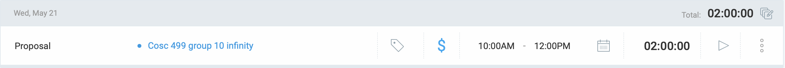

### Current Tasks (Provide sufficient detail)
  * #1: Project Planning

### Progress Update (since 21/5/2025) 
<table>
    <tr>
        <td><strong>TASK/ISSUE #</strong>
        </td>
        <td><strong>STATUS</strong>
        </td>
    </tr>
    <tr>
        <!-- Task/Issue # -->
        <td>Task 1
        </td>
        <!-- Status -->
        <td>In progress
        </td>
    </tr>
        
</table>

### Cycle Goal Review (Reflection: what went well, what was done, what didn't; Retrospective: how is the process going and why?)
Met with teammates on discord to work on the initial part of project plan. Completed functional and non functional requirements. Full document not complete yet. 
### Next Cycle Goals (What are you going to accomplish during the next cycle)
  * Complete  technical requirements, tech stack, high-level risks, assumptions and constraints,summary milestone schedule, teamwork planning.

## Thursday 5/22 (5/21 - 5/27)

### Timesheet

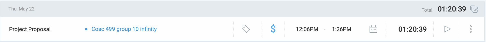

### Current Tasks (Provide sufficient detail)
  * #1: Project Planning

### Progress Update (since 21/5/2025) 
<table>
    <tr>
        <td><strong>TASK/ISSUE #</strong>
        </td>
        <td><strong>STATUS</strong>
        </td>
    </tr>
    <tr>
        <!-- Task/Issue # -->
        <td>Task 1
        </td>
        <!-- Status -->
        <td>In progress
        </td>
    </tr>
        
</table>

### Cycle Goal Review (Reflection: what went well, what was done, what didn't; Retrospective: how is the process going and why?)
Met with teammates on discord to further work on the project plan. Worked on the technical requirements, tech stack, high-level risks, milestones, team planning, project objectives, and proto-personas. Process is going well, communication and coordination between teammates is excellent.
### Next Cycle Goals (What are you going to accomplish during the next cycle)
  * Review project plan before submission. Then, work on the the DFD, use case diagrams, database design, architecture design, and UI design.

## Monday 5/26 (5/21 - 5/27)

### Timesheet

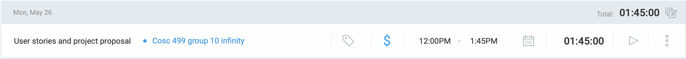

### Current Tasks (Provide sufficient detail)
  * #1: Project Planning

### Progress Update (since 22/5/2025) 
<table>
    <tr>
        <td><strong>TASK/ISSUE #</strong>
        </td>
        <td><strong>STATUS</strong>
        </td>
    </tr>
    <tr>
        <!-- Task/Issue # -->
        <td>Task 1
        </td>
        <!-- Status -->
        <td>In progress
        </td>
    </tr>
        
</table>

### Cycle Goal Review (Reflection: what went well, what was done, what didn't; Retrospective: how is the process going and why?)
What went well: Met with teammates on discord and finished the Team planning, milestone and distribution section. 
Retrospective: process is going well, we are finishing tasks well ahead of time.

### Next Cycle Goals (What are you going to accomplish during the next cycle)
  * Work on the the DFD, use case diagrams, database design, architecture design, and UI design.

## Tuesday 5/27 (5/21 - 5/27)

### Timesheet

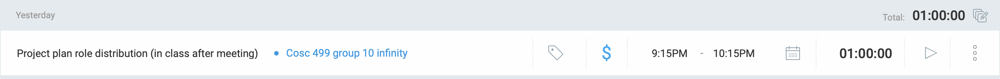

### Current Tasks (Provide sufficient detail)
  * #1: Project Planning

### Progress Update (since 26/5/2025) 
<table>
    <tr>
        <td><strong>TASK/ISSUE #</strong>
        </td>
        <td><strong>STATUS</strong>
        </td>
    </tr>
    <tr>
        <!-- Task/Issue # -->
        <td>Task 1
        </td>
        <!-- Status -->
        <td>In progress
        </td>
    </tr>
        
</table>

### Cycle Goal Review (Reflection: what went well, what was done, what didn't; Retrospective: how is the process going and why?)
What went well: Met with teammates after our in class meeting with the professor regarding the project plan. We divided roles into different groups. I am in charge of Use Case diagram. 

### Next Cycle Goals (What are you going to accomplish during the next cycle)
  * Work on the use case diagram with Dup. We have decided to meet at 2pm tomorrow.

## Wednesday 5/28 (5/28 - 6/6)

### Timesheet

### Current Tasks (Provide sufficient detail)
  * #1: Project Design

### Progress Update (since 27/5/2025) 
<table>
    <tr>
        <td><strong>TASK/ISSUE #</strong>
        </td>
        <td><strong>STATUS</strong>
        </td>
    </tr>
    <tr>
        <!-- Task/Issue # -->
        <td>Task 1
        </td>
        <!-- Status -->
        <td>In progress
        </td>
    </tr>
        
</table>

### Cycle Goal Review (Reflection: what went well, what was done, what didn't; Retrospective: how is the process going and why?)
What went well: Met with Dup on discord to work on use case diagram. There was a lot to do so we are meeting again tomorrow at 2pm to work on it. 
What didn't go well: Everything was good!
Retrospective: Process is going smoothly, we have to clean up the diagram as its a bit clustered. We just started the descriptions. 

### Next Cycle Goals (What are you going to accomplish during the next cycle)
  * Begin actual coding. We have not distributed the coding tasks yet but we will start with the workload distribution by weeks end.

## Thursday 5/29 (5/28 - 6/6)

### Timesheet

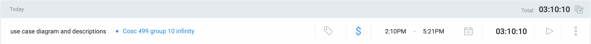

### Current Tasks (Provide sufficient detail)
  * #1: Project Design

### Progress Update (since 28/5/2025) 
<table>
    <tr>
        <td><strong>TASK/ISSUE #</strong>
        </td>
        <td><strong>STATUS</strong>
        </td>
    </tr>
    <tr>
        <!-- Task/Issue # -->
        <td>Task 1
        </td>
        <!-- Status -->
        <td>Almost complete, few modifications left
        </td>
    </tr>
        
</table>

### Cycle Goal Review (Reflection: what went well, what was done, what didn't; Retrospective: how is the process going and why?)
What went well: Met with Dup on discord to work on use case diagram and descriptions. We have almost completed all of it. We just have to reorder and renumber a couple of things. 
What didn't go well: Everything was good!
Retrospective: Process is going smoothly, we are understanding more of how the system will function as we are discussing a lot of things whilst drawing the diagram and writing use case descriptions.

### Next Cycle Goals (What are you going to accomplish during the next cycle)
  * Begin actual coding. We have not distributed the coding tasks yet but we will start with the workload distribution by weeks end.

## Saturday 5/31 (5/28 - 6/6)

### Timesheet

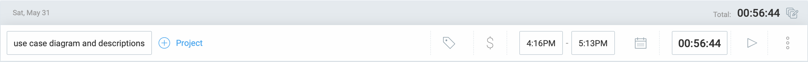

### Current Tasks (Provide sufficient detail)
  * #1: Project Design

### Progress Update (since 29/5/2025) 
<table>
    <tr>
        <td><strong>TASK/ISSUE #</strong>
        </td>
        <td><strong>STATUS</strong>
        </td>
    </tr>
    <tr>
        <!-- Task/Issue # -->
        <td>Task 1
        </td>
        <!-- Status -->
        <td>Complete
        </td>
    </tr>
        
</table>

### Cycle Goal Review (Reflection: what went well, what was done, what didn't; Retrospective: how is the process going and why?)
What went well: Final modifications for my assigned part of use case completed. Proof read the entire document and made modifications in the user requirements upon discussing with the entire group. 
What didn't go well: Everything was good!
Retrospective: Process is going smoothly, we are understanding more of how the application will work at the end. 

### Next Cycle Goals (What are you going to accomplish during the next cycle)
  * Database creation and then begin actual coding for the issues.

## Monday 6/02 (5/28 - 6/6)

### Timesheet

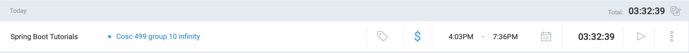

### Current Tasks (Provide sufficient detail)
  * #1: Project Design
  * #2: SpringBoot Tutorials

### Progress Update (since 31/5/2025) 
<table>
    <tr>
        <td><strong>TASK/ISSUE #</strong>
        </td>
        <td><strong>STATUS</strong>
        </td>
    </tr>
    <tr>
        <!-- Task/Issue # -->
        <td>Task 1
        </td>
        <!-- Status -->
        <td> Complete.
        </td>
    </tr>
    <tr>
        <!-- Task/Issue # -->
        <td>Task 2
        </td>
        <!-- Status -->
        <td> In progress, still learning
        </td>
    </tr>
        
</table>

### Cycle Goal Review (Reflection: what went well, what was done, what didn't; Retrospective: how is the process going and why?)
What went well: User requirements slightly modified and design document completed. Currently learning springboot from youtube tutorials, hard at first but I'm starting to learn more as i progress.
What didn't go well: Everything was good!
Retrospective: Process is going smoothly, all team members are on track with their assigned tasks. We should begin assigning issues to individual members from kanban soon to start coding the application.

### Next Cycle Goals (What are you going to accomplish during the next cycle)
  * DataBase design. Assign issues from kanban to indiviudal members to begin coding of the application. 

## Tuesday 6/03 (5/28 - 6/6)

### Timesheet

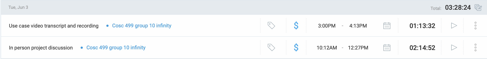

### Current Tasks (Provide sufficient detail)
  * #1: Design Video Transcript and Recording
  * #2: Kanban User Story Breakdown Into Sub-issues

### Progress Update (since 02/6/2025) 
<table>
    <tr>
        <td><strong>TASK/ISSUE #</strong>
        </td>
        <td><strong>STATUS</strong>
        </td>
    </tr>
    <tr>
        <!-- Task/Issue # -->
        <td>Task 1
        </td>
        <!-- Status -->
        <td> Complete.
        </td>
    </tr>
    <tr>
        <!-- Task/Issue # -->
        <td>Task 2
        </td>
        <!-- Status -->
        <td> Complete.
        </td>
    </tr>
        
</table>

### Cycle Goal Review (Reflection: what went well, what was done, what didn't; Retrospective: how is the process going and why?)
What went well: Completed the trascript for my part of use cases. I also recorded the video for the presentation and made the slide decks. The team also met up after the meeting to break down user stories on kanban into individual sub-issues.
What didn't go well: Everything was good!
Retrospective: Process is going smoothly, all team members are on track with their assigned tasks. We should begin assigning issues to individual members from kanban soon to start coding the application.

### Next Cycle Goals (What are you going to accomplish during the next cycle)
  * Assign issues from kanban to indiviudal members and begin coding of the application.

## Wednesday 6/04 (5/28 - 6/6)

### Timesheet

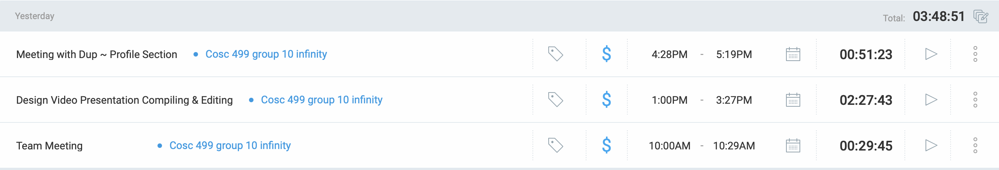

### Current Tasks (Provide sufficient detail)
  * #1: Design video presentation compilation and editing
  * #2: Profile section of application: I am responsible for handling the backend of this section and Dup is handling the frontend.

### Progress Update (since 03/6/2025) 
<table>
    <tr>
        <td><strong>TASK/ISSUE #</strong>
        </td>
        <td><strong>STATUS</strong>
        </td>
    </tr>
    <tr>
        <!-- Task/Issue # -->
        <td>Task 1
        </td>
        <!-- Status -->
        <td> Complete.
        </td>
    </tr>
    <tr>
        <!-- Task/Issue # -->
        <td>Task 2
        </td>
        <!-- Status -->
        <td> In progress.
        </td>
    </tr>
        
</table>

### Cycle Goal Review (Reflection: what went well, what was done, what didn't; Retrospective: how is the process going and why?)
What went well: I received all videos from my team for the design video presentation. I volunteered to do the compilation and editing. At the end the video was perfect with all criteria met. I also met up with Dup on discord to discuss how we were going to code the profile section of the application. I am handling the backend while Dup is working on the frontend.
What didn't go well: Some videos sent by the team members required a lot of time to edit. But i was able to handle it. 
Retrospective: Process is going well. The entire team is working hard on the project. We have assigned individual coding tasks to everyone. 

### Next Cycle Goals (What are you going to accomplish during the next cycle)
  * Get environment set up locally, complete the profile section of the application, and begin next assigned coding task after meeting with the team.

## Thursday 6/05 (5/28 - 6/6)

### Timesheet

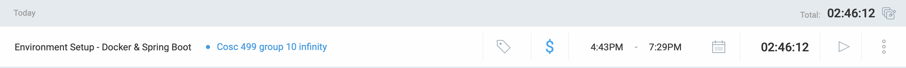

### Current Tasks (Provide sufficient detail)
  * #1: Environment setup - Docker & Spring Boot
  * #2: Profile section of application: I am responsible for handling the backend of this section and Dup is handling the frontend.

### Progress Update (since 04/6/2025) 
<table>
    <tr>
        <td><strong>TASK/ISSUE #</strong>
        </td>
        <td><strong>STATUS</strong>
        </td>
    </tr>
    <tr>
        <!-- Task/Issue # -->
        <td>Task 1
        </td>
        <!-- Status -->
        <td> In progress, 50% complete
        </td>
    </tr>
    <tr>
        <!-- Task/Issue # -->
        <td>Task 2
        </td>
        <!-- Status -->
        <td> In progress.
        </td>
    </tr>
        
</table>

### Cycle Goal Review (Reflection: what went well, what was done, what didn't; Retrospective: how is the process going and why?)
What went well: I was able to get the docker containers up and running. Front end on local host port was displaying as expected.
What didn't go well: I wasn't able to figure out the setup for spring boot. I will be meeting with Alex tomorrow after the meeting to discuss how to get my environment up and running locally. 
Retrospective: Process is going well. All team members are working hard to get their parts completed.

### Next Cycle Goals (What are you going to accomplish during the next cycle)
  * Complete profile section of the application, and begin next assigned coding task after meeting with the team. 

## Friday 6/06 (5/28 - 6/6)

### Timesheet

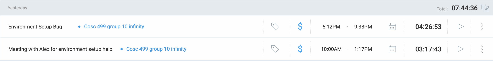

### Current Tasks (Provide sufficient detail)
  * #1: Environment setup - Docker & Spring Boot
  * #2: Profile section of application: I am responsible for handling the backend of this section and Dup is handling the frontend.

### Progress Update (since 05/6/2025) 
<table>
    <tr>
        <td><strong>TASK/ISSUE #</strong>
        </td>
        <td><strong>STATUS</strong>
        </td>
    </tr>
    <tr>
        <!-- Task/Issue # -->
        <td>Task 1
        </td>
        <!-- Status -->
        <td> In progress, 80% complete
        </td>
    </tr>
    <tr>
        <!-- Task/Issue # -->
        <td>Task 2
        </td>
        <!-- Status -->
        <td> In progress.
        </td>
    </tr>
        
</table>

### Cycle Goal Review (Reflection: what went well, what was done, what didn't; Retrospective: how is the process going and why?)
What went well: I met up with alex after our in-class meeting to get help in setting up the environment on my laptop. 
What didn't go well: The environment was not setting up on my laptop after hours of work. There is a weird bug which we can't seem to fix. The microservices were running but my IDE is not able to recognize JavaSe24 which is required for our spring boot app. This was weird because everything was working but I had errors all over in my IDE which would cause issues in compiling code later on. I will try to fix this over the weekend.
Retrospective: Process is going well. All team members are working hard to get their parts completed.

### Next Cycle Goals (What are you going to accomplish during the next cycle)
  * Complete profile section of the application, and begin next assigned coding task after meeting with the team. 

## Saturday 6/07 (6/07 - 6/16)

### Timesheet

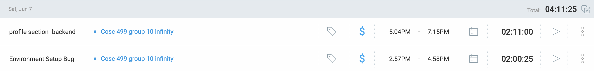

### Current Tasks (Provide sufficient detail)
  * #1: Environment setup - Docker & Spring Boot
  * #2: Profile section of application: I am responsible for handling the backend of this section and Dup is handling the frontend.

### Progress Update (since 06/6/2025) 
<table>
    <tr>
        <td><strong>TASK/ISSUE #</strong>
        </td>
        <td><strong>STATUS</strong>
        </td>
    </tr>
    <tr>
        <!-- Task/Issue # -->
        <td>Task 1
        </td>
        <!-- Status -->
        <td> Complete
        </td>
    </tr>
    <tr>
        <!-- Task/Issue # -->
        <td>Task 2
        </td>
        <!-- Status -->
        <td> In progress. 20% Complete
        </td>
    </tr>
        
</table>

### Cycle Goal Review (Reflection: what went well, what was done, what didn't; Retrospective: how is the process going and why?)
What went well: I was finally able to fix the bug and got my environment set up. This process took me a long time close to 8 hours to get fixed. I was able to get started on my assigned part of the backend of the profile section service.
What didn't go well: Everything went well!
Retrospective: Process is going well. All team members are working hard to get their parts completed. I will continue working on the profile service to get it done ASAP.

### Next Cycle Goals (What are you going to accomplish during the next cycle)
  * Complete profile section of the application, and begin next assigned coding task after meeting with the team.

## Sunday 6/08 (6/07 - 6/16)

### Timesheet

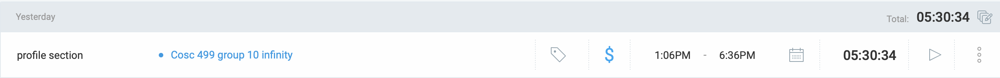

### Current Tasks (Provide sufficient detail)
  * #1: Profile section of application: I am responsible for handling the backend of this section and Dup is handling the frontend.

### Progress Update (since 07/6/2025) 
<table>
    <tr>
        <td><strong>TASK/ISSUE #</strong>
        </td>
        <td><strong>STATUS</strong>
        </td>
    </tr>
    <tr>
        <!-- Task/Issue # -->
        <td>Task 1
        </td>
        <!-- Status -->
        <td> In progress. 70% Complete.
        </td>
    </tr>
    
</table>

### Cycle Goal Review (Reflection: what went well, what was done, what didn't; Retrospective: how is the process going and why?)
What went well: I finished setting up the basic pom.xml files, linked the profile service to API gateway, and finished 70% of the requirements.
What didn't go well: Everything went well!
Retrospective: Process is going well. All team members are working hard to get their parts completed. I will continue working on the profile service to get it done ASAP.

### Next Cycle Goals (What are you going to accomplish during the next cycle)
  * Complete profile section of the application, and begin next assigned coding task after meeting with the team.

## Monday 6/09 (6/07 - 6/16)

### Timesheet

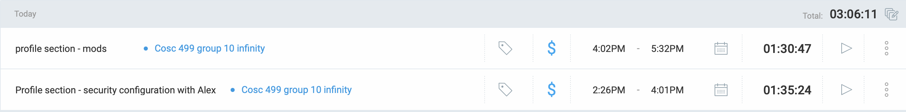

### Current Tasks (Provide sufficient detail)
  * #1: Profile section of application: I am responsible for handling the backend of this section and Dup is handling the frontend.

### Progress Update (since 08/6/2025) 
<table>
    <tr>
        <td><strong>TASK/ISSUE #</strong>
        </td>
        <td><strong>STATUS</strong>
        </td>
    </tr>
    <tr>
        <!-- Task/Issue # -->
        <td>Task 1
        </td>
        <!-- Status -->
        <td> 90% Complete. Mods required.
        </td>
    </tr>
    
</table>

### Cycle Goal Review (Reflection: what went well, what was done, what didn't; Retrospective: how is the process going and why?)
What went well: Almost done with the profile service. Few modifications remaining after discussing with team members.
What didn't go well: Everything went well!
Retrospective: Process is going well. All team members are working hard to get their parts completed. I will continue working on the profile service to get it done ASAP.

### Next Cycle Goals (What are you going to accomplish during the next cycle)
  * Complete profile section of the application, and begin next assigned coding task after meeting with the team.

## Tuesday 6/10 (6/07 - 6/16)

### Timesheet

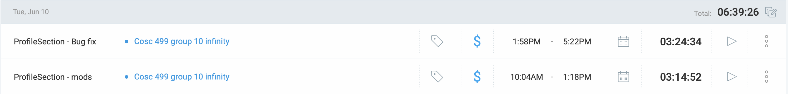

### Current Tasks (Provide sufficient detail)
  * #1: Profile section of application: I am responsible for handling the backend of this section and Dup is handling the frontend.

### Progress Update (since 08/6/2025) 
<table>
    <tr>
        <td><strong>TASK/ISSUE #</strong>
        </td>
        <td><strong>STATUS</strong>
        </td>
    </tr>
    <tr>
        <!-- Task/Issue # -->
        <td>Task 1
        </td>
        <!-- Status -->
        <td> 70% Complete. Bug fix and mods required.
        </td>
    </tr>
    
</table>

### Cycle Goal Review (Reflection: what went well, what was done, what didn't; Retrospective: how is the process going and why?)
What went well: Almost done with the profile service. I ran into a bug while doing modifications which i will fix today and tomorrow.
What didn't go well: Everything went well!
Retrospective: Process is going well. All team members are working hard to get their parts completed. I will continue working on the profile service to get it done ASAP.

### Next Cycle Goals (What are you going to accomplish during the next cycle)
  * Complete profile section of the application, and begin next assigned coding task after meeting with the team.

## Wednesday 6/11 (6/07 - 6/16)

### Timesheet

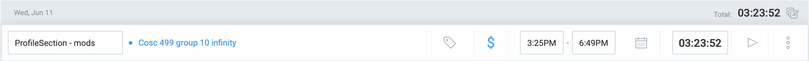

### Current Tasks (Provide sufficient detail)
  * #1: Profile section of application: I am responsible for handling the backend of this section and Dup is handling the frontend.

### Progress Update (since 08/6/2025) 
<table>
    <tr>
        <td><strong>TASK/ISSUE #</strong>
        </td>
        <td><strong>STATUS</strong>
        </td>
    </tr>
    <tr>
        <!-- Task/Issue # -->
        <td>Task 1
        </td>
        <!-- Status -->
        <td> 80% Complete. Mods left
        </td>
    </tr>
    
</table>

### Cycle Goal Review (Reflection: what went well, what was done, what didn't; Retrospective: how is the process going and why?)
What went well: Almost done with the profile service. I fixed the bug i encountered yesterday. Now i am working on modifications so Dup gets the required things from the backend for his assigned front-end.
What didn't go well: Everything went well!
Retrospective: Process is going well. All team members are working hard to get their parts completed. I will continue working on the profile service to get it done ASAP.

### Next Cycle Goals (What are you going to accomplish during the next cycle)
  * Complete profile section of the application, and begin next assigned coding task after meeting with the team.

## Thursday 6/12 (6/07 - 6/16)

### Timesheet

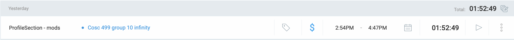

### Current Tasks (Provide sufficient detail)
  * #1: Profile section of application: I am responsible for handling the backend of this section and Dup is handling the frontend.

### Progress Update (since 08/6/2025) 
<table>
    <tr>
        <td><strong>TASK/ISSUE #</strong>
        </td>
        <td><strong>STATUS</strong>
        </td>
    </tr>
    <tr>
        <!-- Task/Issue # -->
        <td>Task 1
        </td>
        <!-- Status -->
        <td> Complete.
        </td>
    </tr>
    
</table>

### Cycle Goal Review (Reflection: what went well, what was done, what didn't; Retrospective: how is the process going and why?)
What went well: Done with the profile service. I completed all modifications that Dup required. He now gets everything required in the front end.
What didn't go well: Everything went well!
Retrospective: Process is going well. All team members are working hard to get their parts completed. All teammates are cooperative and hardworking.

### Next Cycle Goals (What are you going to accomplish during the next cycle)
  * Begin next assigned coding task after meeting with group tomorrow. 

## Sunday 6/15 (6/07 - 6/16)

### Timesheet

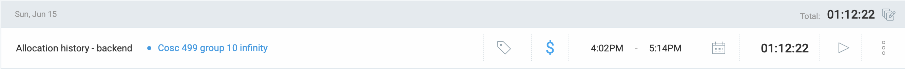

### Current Tasks (Provide sufficient detail)
  * #1: Allocation History - Backend: I have to create the backend to view the allocation history of a TA.

### Progress Update (since 08/6/2025) 
<table>
    <tr>
        <td><strong>TASK/ISSUE #</strong>
        </td>
        <td><strong>STATUS</strong>
        </td>
    </tr>
    <tr>
        <!-- Task/Issue # -->
        <td>Task 1
        </td>
        <!-- Status -->
        <td> In progress. 10% complete.
        </td>
    </tr>
    
</table>

### Cycle Goal Review (Reflection: what went well, what was done, what didn't; Retrospective: how is the process going and why?)
What went well: I started the planning of allocation history backend. I designed the tables required and how i plan on implementing the functionality. I will begin coding it soon once i have finalized the design. I am currently a bit busy with other commitments so i will not be able to put much time into this until tuesday. 
What didn't go well: Everything went well!
Retrospective: Process is going well. All team members are working hard to get their parts completed. All teammates are cooperative and hardworking.

### Next Cycle Goals (What are you going to accomplish during the next cycle)
  * Complete Allocation History and begin next assigned coding task after meeting with group.

## Tuesday 6/17 (6/17 - 6/26)

### Timesheet

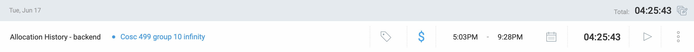

### Current Tasks (Provide sufficient detail)
  * #1: Allocation History - Backend: I have to create the backend to view the allocation history of a TA.

### Progress Update (since 08/6/2025) 
<table>
    <tr>
        <td><strong>TASK/ISSUE #</strong>
        </td>
        <td><strong>STATUS</strong>
        </td>
    </tr>
    <tr>
        <!-- Task/Issue # -->
        <td>Task 1
        </td>
        <!-- Status -->
        <td> In progress. 30% complete.
        </td>
    </tr>
    
</table>

### Cycle Goal Review (Reflection: what went well, what was done, what didn't; Retrospective: how is the process going and why?)
What went well: I started coding the backend for allocationhistory. Made the initial DTOs, controllers, etc. Have to figure out how to implement the feign clients in spring boot microservices. 
What didn't go well: Everything went well!
Retrospective: Process is going well. All team members are working hard to get their parts completed. All teammates are cooperative and hardworking.

### Next Cycle Goals (What are you going to accomplish during the next cycle)
  * Complete Allocation History and begin next assigned coding task after meeting with group.

## Wednesday 6/18 (6/17 - 6/26)

### Timesheet

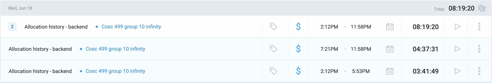

### Current Tasks (Provide sufficient detail)
  * #1: Allocation History - Backend: I have to create the backend to view the allocation history of a TA.

### Progress Update (since 08/6/2025) 
<table>
    <tr>
        <td><strong>TASK/ISSUE #</strong>
        </td>
        <td><strong>STATUS</strong>
        </td>
    </tr>
    <tr>
        <!-- Task/Issue # -->
        <td>Task 1
        </td>
        <!-- Status -->
        <td> In progress. 80% complete.
        </td>
    </tr>
    
</table>

### Cycle Goal Review (Reflection: what went well, what was done, what didn't; Retrospective: how is the process going and why?)
What went well: I finished most of the backend for allocation history. However, I ran into a bug which i am currently trying to fix. The tests are working as expected but when trying to test the endpoints on postman, I get a 403/503 error when the feign client is called.
What didn't go well: Everything went well!
Retrospective: Process is going well. All team members are working hard to get their parts completed. All teammates are cooperative and hardworking.

### Next Cycle Goals (What are you going to accomplish during the next cycle)
  * Complete Allocation History and begin next assigned coding task after meeting with group.

## Thursday 6/19 (6/17 - 6/26)

### Timesheet

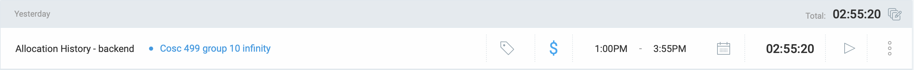

### Current Tasks (Provide sufficient detail)
  * #1: Allocation History - Backend: I have to create the backend to view the allocation history of a TA.

### Progress Update (since 08/6/2025) 
<table>
    <tr>
        <td><strong>TASK/ISSUE #</strong>
        </td>
        <td><strong>STATUS</strong>
        </td>
    </tr>
    <tr>
        <!-- Task/Issue # -->
        <td>Task 1
        </td>
        <!-- Status -->
        <td> Complete.
        </td>
    </tr>
    
</table>

### Cycle Goal Review (Reflection: what went well, what was done, what didn't; Retrospective: how is the process going and why?)
What went well: I finished coding the backend for allocation history. The bug was fixed. Turns out I needed to add a request interceptor so that the json token is forwarded to the feign client. This took me a while to figure out but i got it done!
What didn't go well: Everything went well!
Retrospective: Process is going well. All team members are working hard to get their parts completed. All teammates are cooperative and hardworking.

### Next Cycle Goals (What are you going to accomplish during the next cycle)
  * Begin coding of next assigned task after meeting with group.

## Friday 6/20 (6/17 - 6/26)

### Timesheet

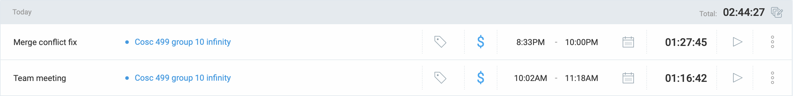

### Current Tasks (Provide sufficient detail)
  * #1: Allocation History - Merge Conflict Fix

### Progress Update (since 08/6/2025) 
<table>
    <tr>
        <td><strong>TASK/ISSUE #</strong>
        </td>
        <td><strong>STATUS</strong>
        </td>
    </tr>
    <tr>
        <!-- Task/Issue # -->
        <td>Task 1
        </td>
        <!-- Status -->
        <td> Complete.
        </td>
    </tr>
    
</table>

### Cycle Goal Review (Reflection: what went well, what was done, what didn't; Retrospective: how is the process going and why?)
What went well: There were a lot of merge conflicts that came up as Allen and I had worked on sections due to miscommunication. I had to modify/delete a lot of files to prevent breakage of either of our codes. I successfully did it. I also met with the team in the morning to assign coding tasks for next cycle. 
What didn't go well: After the merge conflicts were resolved, i was unable to synch the changes with my branch due to a bug. So, i had to create a new branch and submit a new PR. I got the issue fixed. 
Retrospective: Process is going well. All team members are working hard to get their parts completed. All teammates are cooperative and hardworking.

### Next Cycle Goals (What are you going to accomplish during the next cycle)
  * Begin coding of assigning students to courses/labs manually.

## Saturday 6/21 (6/17 - 6/26)

### Timesheet

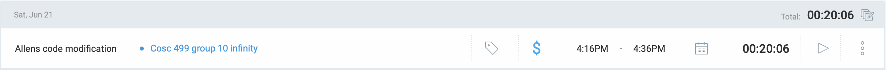

### Current Tasks (Provide sufficient detail)
  * #1: Allens code modification

### Progress Update (since 08/6/2025) 
<table>
    <tr>
        <td><strong>TASK/ISSUE #</strong>
        </td>
        <td><strong>STATUS</strong>
        </td>
    </tr>
    <tr>
        <!-- Task/Issue # -->
        <td>Task 1
        </td>
        <!-- Status -->
        <td> Complete.
        </td>
    </tr>
    
</table>

### Cycle Goal Review (Reflection: what went well, what was done, what didn't; Retrospective: how is the process going and why?)
What went well: I was able to correctly modify allens code to prevent code breakage. I modified his code to use sectionDto and courseDto accordingly.
What didn't go well: Everything went well!
Retrospective: Process is going well. All team members are working hard to get their parts completed. Some members are busy next week due to finals and have notified us in advance.

### Next Cycle Goals (What are you going to accomplish during the next cycle)
  * Begin coding of assigning students to courses/labs manually.

## Monday 6/23 (6/17 - 6/26)

### Timesheet

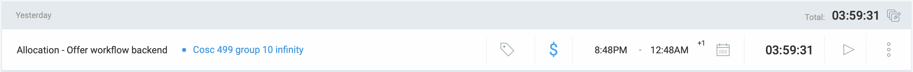

### Current Tasks (Provide sufficient detail)
  * #1: Allocation Offer Workflow - Backend

### Progress Update (since 08/6/2025) 
<table>
    <tr>
        <td><strong>TASK/ISSUE #</strong>
        </td>
        <td><strong>STATUS</strong>
        </td>
    </tr>
    <tr>
        <!-- Task/Issue # -->
        <td>Task 1
        </td>
        <!-- Status -->
        <td> In progress. 20% complete.
        </td>
    </tr>
    
</table>

### Cycle Goal Review (Reflection: what went well, what was done, what didn't; Retrospective: how is the process going and why?)
What went well: I began coding the backend for the offer workflow of allocating students to courses/labs. Initial dtos and mappings created.  
What didn't go well: I had to go through a lot of files since offer is connected to application which is in turn connected to student. But i was able to figure it out in the end. 
Retrospective: Process is going well. All team members are working hard to get their parts completed. All teammates are cooperative and hardworking.

### Next Cycle Goals (What are you going to accomplish during the next cycle)
  * Complete the backend offer workflow for allocation and begin next assigned coding task.

## Tuesday 6/24 (6/17 - 6/26)

### Timesheet

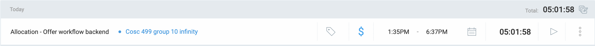

### Current Tasks (Provide sufficient detail)
  * #1: Allocation Offer Workflow - Backend

### Progress Update (since 08/6/2025) 
<table>
    <tr>
        <td><strong>TASK/ISSUE #</strong>
        </td>
        <td><strong>STATUS</strong>
        </td>
    </tr>
    <tr>
        <!-- Task/Issue # -->
        <td>Task 1
        </td>
        <!-- Status -->
        <td> In progress. 80% complete.
        </td>
    </tr>
    
</table>

### Cycle Goal Review (Reflection: what went well, what was done, what didn't; Retrospective: how is the process going and why?)
What went well: Most of the backend for offer workflow is complete. CRUD operations for coordinator are ready. Next, i need to create mappings for accept/deny offer along with the relevant services and integrate that with allocating a student.
What didn't go well: Everything went well.
Retrospective: Process is going well. All team members are working hard to get their parts completed. All teammates are cooperative and hardworking.

### Next Cycle Goals (What are you going to accomplish during the next cycle)
  * Complete the backend offer workflow for allocation and begin next assigned coding task.

