## Thursday (Aug 5-7)

### Timesheet
Clockify report
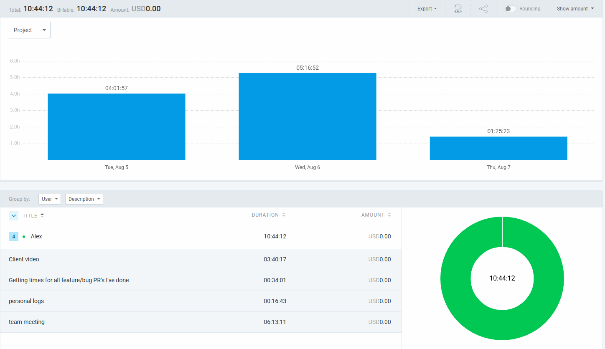

### Current Tasks (Provide sufficient detail)
  * #1: Final Documentation  [524]("https://github.com/UBCO-COSC499-S2025/team-10-capstone-infinity/issues/524")

### Progress Update (since August 4th 2025) 
<table>
    <tr>
        <td><strong>TASK/ISSUE #</strong>
        </td>
        <td><strong>STATUS</strong>
        </td>
    </tr>
    <tr>
        <!-- Task/Issue # -->
        <td>Fix minor bugs <a href="https://github.com/UBCO-COSC499-S2025/team-10-capstone-infinity/issues/540">540</a>
        </td>
        <!-- Status -->
        <td>Complete
        </td>
    </tr>
    <tr>
        <!-- Task/Issue # -->
        <td>Final slides <a href="https://github.com/UBCO-COSC499-S2025/team-10-capstone-infinity/issues/547">547</a>
        </td>
        <!-- Status -->
        <td>Complete
        </td>
    </tr>
    <tr>
        <!-- Task/Issue # -->
        <td>Final video <a href="https://github.com/UBCO-COSC499-S2025/team-10-capstone-infinity/issues/548">548</a>
        </td>
        <!-- Status -->
        <td>Complete
        </td>
    </tr>
    <tr>
        <!-- Task/Issue # -->
        <td>Final report - PRs + Lessons Learned <a href="https://github.com/UBCO-COSC499-S2025/team-10-capstone-infinity/issues/565">565</a>
        </td>
        <!-- Status -->
        <td>Complete
        </td>
    </tr>
    
</table>

### Cycle Goal Review (Reflection: what went well, what was done, what didn't; Retrospective: how is the process going and why?)
Finished the video for the client and practiced for the presentation on Friday with the group going over the slides. Updated the documentation including some of the handover guide, as well as the individual portions like project management times for the tasks I've done, and my personal lessons learned section. Everything went well leading up to the end of the course.

### Next Cycle Goals (What are you going to accomplish during the next cycle)
  * Tomorrow is the presentation, and after that we just need to merge our logs, and finalize the screenshots for the documentation like the coverage reports for testing and the clockify hours for the project management section. Once that's done, we'll merge everything and submit the document also on canvas and finish this course up.

## Monday (Aug 1-4)

### Timesheet
Clockify report
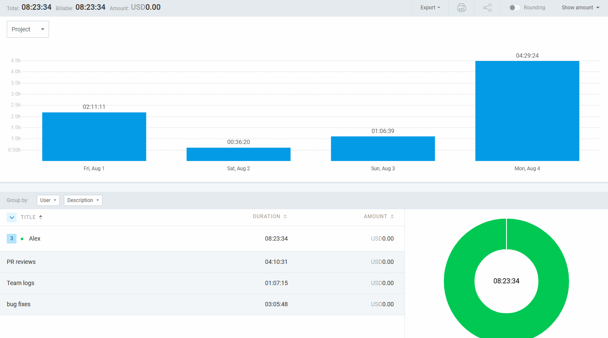

### Current Tasks (Provide sufficient detail)
  * #1: Minor bug fixes  [540]("https://github.com/UBCO-COSC499-S2025/team-10-capstone-infinity/issues/540")
  * #2: Final slides for presentation [547]("https://github.com/UBCO-COSC499-S2025/team-10-capstone-infinity/issues/547")
  * #3: Final video for client [548]("https://github.com/UBCO-COSC499-S2025/team-10-capstone-infinity/issues/548")
  * Tidying up various loose ends (missing endpoints, small features, bugs, documentation, will put in the issues when completed in future logs)

### Progress Update (since July 31st 2025) 
<table>
    <tr>
        <td><strong>TASK/ISSUE #</strong>
        </td>
        <td><strong>STATUS</strong>
        </td>
    </tr>
    <tr>
        <!-- Task/Issue # -->
        <td>Add seeded capstone course with a need and some sections  <a href="https://github.com/UBCO-COSC499-S2025/team-10-capstone-infinity/issues/521">521</a>
        </td>
        <!-- Status -->
        <td>Complete
        </td>
    </tr>
    <tr>
        <!-- Task/Issue # -->
        <td>Fix minor bugs <a href="https://github.com/UBCO-COSC499-S2025/team-10-capstone-infinity/issues/540">540</a>
        </td>
        <!-- Status -->
        <td>In Review
        </td>
    </tr>
    <tr>
        <!-- Task/Issue # -->
        <td>Final slides <a href="https://github.com/UBCO-COSC499-S2025/team-10-capstone-infinity/issues/547">547</a>
        </td>
        <!-- Status -->
        <td>In Progress
        </td>
    </tr>
    <tr>
        <!-- Task/Issue # -->
        <td>Final video <a href="https://github.com/UBCO-COSC499-S2025/team-10-capstone-infinity/issues/548">548</a>
        </td>
        <!-- Status -->
        <td>In Progress
        </td>
    </tr>
    
</table>

### Cycle Goal Review (Reflection: what went well, what was done, what didn't; Retrospective: how is the process going and why?)
Reviewed a bunch of PR's, and while doing that ended up fixing some bugs on the branches. Also did a PR to fix some bugs and aesthetics with the section page like making the buttons consistent for adding sections, and form validation for section schedules, removing times outside of 8am to 8pm for selection, and fixing the toastify. In doing that, also fixed a transcript issue that happened from merge conflicts.

### Next Cycle Goals (What are you going to accomplish during the next cycle)
  * We'll meet tomorrow and while waiting for the feature set 2 validation we'll probably as a group service up some waiting PR's and do the video and final slides together in that time. After that, maybe some more small bug fixes from merge conflicts and documentation updates that are needed like setup, and then preparing for the final presentation and handoff on Friday.

## Thursday (July 29-31)

### Timesheet
Clockify report
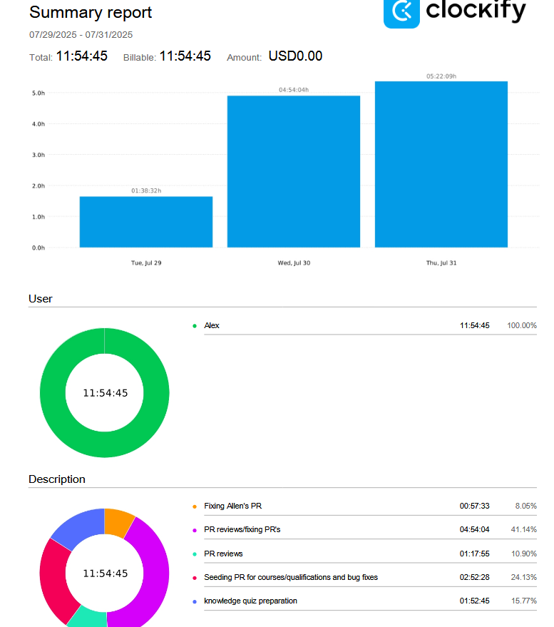

### Current Tasks (Provide sufficient detail)
  * #1: Add seeded capstone course with a need and some sections  [521]("https://github.com/UBCO-COSC499-S2025/team-10-capstone-infinity/issues/521")
  * Tidying up various loose ends (missing endpoints, small features, bugs, documentation, will put in the issues when completed in future logs)

### Progress Update (since July 28th 2025) 
<table>
    <tr>
        <td><strong>TASK/ISSUE #</strong>
        </td>
        <td><strong>STATUS</strong>
        </td>
    </tr>
    <tr>
        <!-- Task/Issue # -->
        <td>Add seeded capstone course with a need and some sections  <a href="https://github.com/UBCO-COSC499-S2025/team-10-capstone-infinity/issues/521">521</a>
        </td>
        <!-- Status -->
        <td>In Review
        </td>
    </tr>
    <tr>
        <!-- Task/Issue # -->
        <td>Add term fields to application form & change impacted flow <a href="https://github.com/UBCO-COSC499-S2025/team-10-capstone-infinity/issues/490">490</a>
        </td>
        <!-- Status -->
        <td>Completed
        </td>
    </tr>
    
</table>

### Cycle Goal Review (Reflection: what went well, what was done, what didn't; Retrospective: how is the process going and why?)
I helped Mandeep finish up the 490 PR which was my backend and his frontend for the new application workflow to allow applications to be semester specific. Since there were some other major changes like allocations being clickable on the frontend plus lab prep hours, grading hours etc. there were a number of merge conflicts and various bugs to fix which took a while. I also added a PR for seeding some courses into the db on startup so we don't always have to do that. In there I fixed some issues in the frontend like duplicated keys for qualifications and a course filter by year issue with null values.

### Next Cycle Goals (What are you going to accomplish during the next cycle)
  * I plan to continue to review PR's and help fix bugs that arise or any other missing features while also preparing the documentation and slides for the final handoff and presentation, and also preparation for feature set 2 and the video for Chad. Just basically finishing things up, I don't plan on doing any new features other than maybe more seeding or bug fixes.

## Monday (July 25-28)

### Timesheet
Clockify report
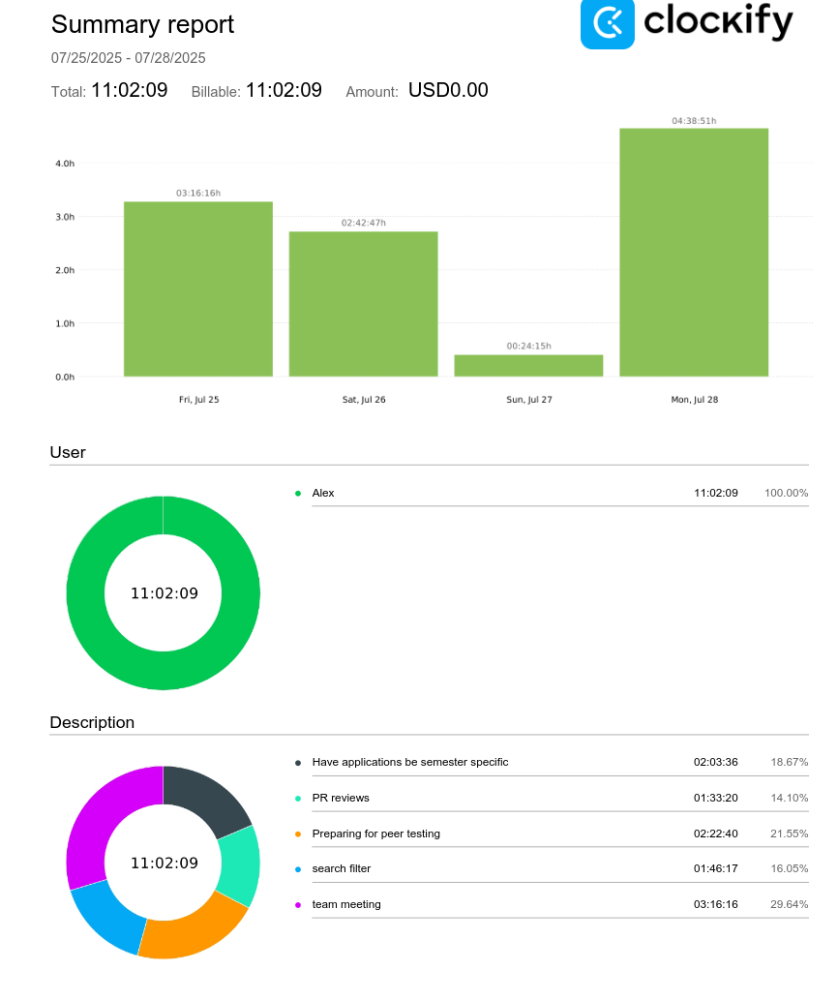

### Current Tasks (Provide sufficient detail)
  * #1: Allow applications to be semester specific - backend [477](https://github.com/UBCO-COSC499-S2025/team-10-capstone-infinity/issues/477)
  * Tidying up various loose ends (missing endpoints, small features, bugs, will put in the issues when completed in future logs)

### Progress Update (since July 24th 2025) 
<table>
    <tr>
        <td><strong>TASK/ISSUE #</strong>
        </td>
        <td><strong>STATUS</strong>
        </td>
    </tr>
    <tr>
        <!-- Task/Issue # -->
        <td>Backend for global config for term <a href="https://github.com/UBCO-COSC499-S2025/team-10-capstone-infinity/issues/428">428</a>
        </td>
        <!-- Status -->
        <td>Completed
        </td>
    </tr>
    <tr>
        <!-- Task/Issue # -->
        <td>Allow applications to be semester specific - backend <a href="https://github.com/UBCO-COSC499-S2025/team-10-capstone-infinity/issues/477">477</a>
        </td>
        <!-- Status -->
        <td>In Review
        </td>
    </tr>
    <tr>
        <!-- Task/Issue # -->
        <td>Have backend search that searches all parameters for course from text<a href="https://github.com/UBCO-COSC499-S2025/team-10-capstone-infinity/issues/500">500</a>
        </td>
        <!-- Status -->
        <td>Completed
        </td>
    </tr>
    
</table>

### Cycle Goal Review (Reflection: what went well, what was done, what didn't; Retrospective: how is the process going and why?)
I finished the backend portion of the application for specific semesters, and now Mandeep has finished up the frontend and just waiting for it to be merged. I also did a small fix to add back a search bar for courses that is based on the fields using text rather than all the drop downs in frontend and backend.

### Next Cycle Goals (What are you going to accomplish during the next cycle)
  * First needing to help merge a number of PR's that were waiting for the peer testing to finish, then I will go into Allen's PR's and clean them up since he's been unresponsive to the github comments. After that, I will address various bugs that are needed for the final project submission.

## Thursday (July 22-24)

### Timesheet
Clockify report
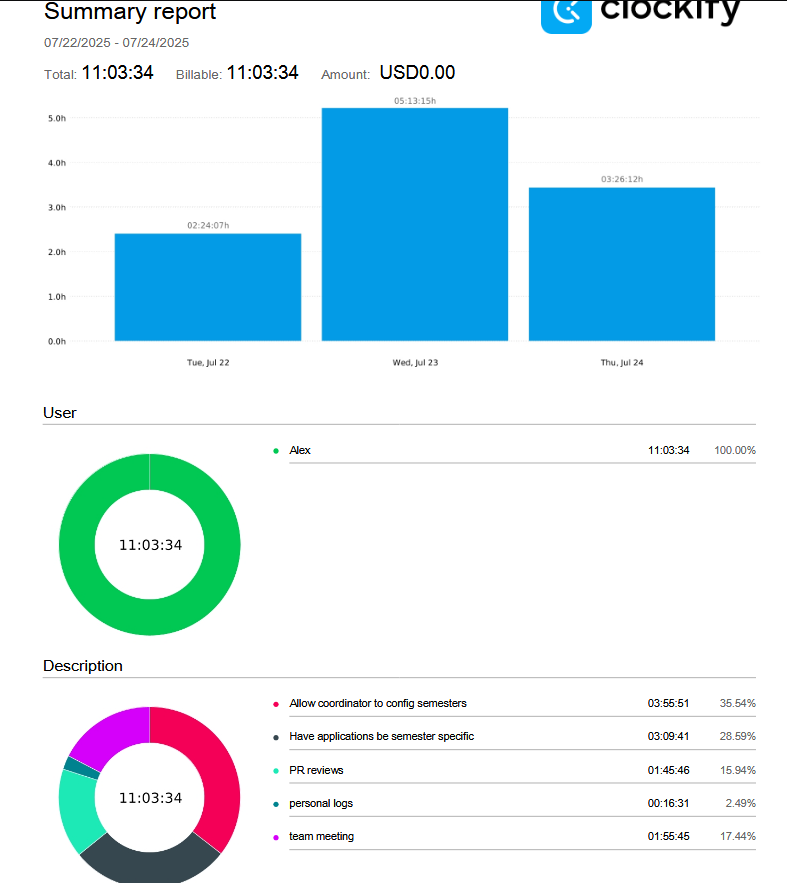

### Current Tasks (Provide sufficient detail)
  * #1: Allow applications to be semester specific - backend [477](https://github.com/UBCO-COSC499-S2025/team-10-capstone-infinity/issues/477)

### Progress Update (since July 21st 2025) 
<table>
    <tr>
        <td><strong>TASK/ISSUE #</strong>
        </td>
        <td><strong>STATUS</strong>
        </td>
    </tr>
    <tr>
        <!-- Task/Issue # -->
        <td>Backend for global config for term <a href="https://github.com/UBCO-COSC499-S2025/team-10-capstone-infinity/issues/428">428</a>
        </td>
        <!-- Status -->
        <td>In Review
        </td>
    </tr>
    <tr>
        <!-- Task/Issue # -->
        <td>Allow applications to be semester specific - backend <a href="https://github.com/UBCO-COSC499-S2025/team-10-capstone-infinity/issues/477">477</a>
        </td>
        <!-- Status -->
        <td>In Progress
        </td>
    </tr>
    
</table>

### Cycle Goal Review (Reflection: what went well, what was done, what didn't; Retrospective: how is the process going and why?)
I finished the backend for global config, which ended up being a lengthy issue for all the refactoring that took place and fixing tests. But I think it works well and is overall better and allows more flexibility down the line having these semesters bound in a table. I started doing the application refactor to be semester specific which now pretty much works except a number of tests have understandably broken and will need to be fixed before I make the PR.

### Next Cycle Goals (What are you going to accomplish during the next cycle)
  * Once the application changes are finalized in the backend, I'll decide whether I need to do another new task in the backend or if I should complete the frontend portion of this. I've been still doing a lot of pair programming for front and back end with Mandeep but if his hands are too full I may step in and complete some of this functionality for him there.

## Monday (July 18-21)

### Timesheet
Clockify report
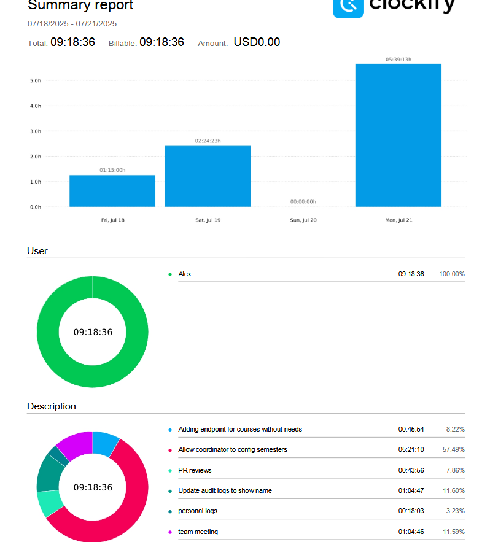

### Current Tasks (Provide sufficient detail)
  * #1: Backend for global config for term [428](https://github.com/UBCO-COSC499-S2025/team-10-capstone-infinity/issues/428)

### Progress Update (since July 17th 2025) 
<table>
    <tr>
        <td><strong>TASK/ISSUE #</strong>
        </td>
        <td><strong>STATUS</strong>
        </td>
    </tr>
    <tr>
        <!-- Task/Issue # -->
        <td>Add endpoint for courses without needs
        </td>
        <!-- Status -->
        <td>Completed
        </td>
    </tr>
    <tr>
        <!-- Task/Issue # -->
        <td>Have audit logs show name instead of id
        </td>
        <!-- Status -->
        <td>Completed
        </td>
    </tr>
   <tr>
        <!-- Task/Issue # -->
        <td>Backend for global config for term
        </td>
        <!-- Status -->
        <td>In Progress
        </td>
    </tr>
    
</table>

### Cycle Goal Review (Reflection: what went well, what was done, what didn't; Retrospective: how is the process going and why?)
I was able to finish the two first tasks that were relatively small (adding an endpoint for courses without needs and adding names to auditing), which put me in a good spot. I figured today would be enough time to get the refactor for how we are storing semesters together, but since so many modules use semester it changed a lot of the logic. While I was in there there was a bunch of code that I wanted to fix up like adding mappers or cleaning up weird logic or obsolete dto's. This went fine, but then of course this messed up the tests, so I'm still cleaning up tests. Once everything is working, then I can add the CRUD for adding semesters and their associated tests, but I'll need another day for that.

### Next Cycle Goals (What are you going to accomplish during the next cycle)
  * I want to finish the config for semesters this cycle. I should be able to do that in another 3-4 hours (maybe less, maybe more) and once that's done I'll grab a new task to do, most likely adding more endpoints for Mandeep or maybe adding the application functionality to allow different allocation offers (like grading, or just assigned to a lab, or prep work etc.) as Chad requested.

## Thursday (July 15-17)

### Timesheet
Clockify report
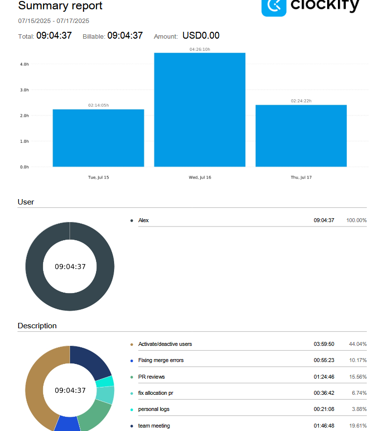

### Current Tasks (Provide sufficient detail)
  * #1: Add endpoint for courses without needs
  * #2: Have audit logs show name instead of id
  * #3: Backend for global config for term

### Progress Update (since July 14th 2025) 
<table>
    <tr>
        <td><strong>TASK/ISSUE #</strong>
        </td>
        <td><strong>STATUS</strong>
        </td>
    </tr>
    <tr>
        <!-- Task/Issue # -->
        <td>Updating allocated hours in the course need when offer is accepted
        </td>
        <!-- Status -->
        <td>Completed
        </td>
    </tr>
    <tr>
        <!-- Task/Issue # -->
        <td>Promoting/demoting users
        </td>
        <!-- Status -->
        <td>Completed
        </td>
    </tr>
   <tr>
        <!-- Task/Issue # -->
        <td>Activating/deactivating users
        </td>
        <!-- Status -->
        <td>Completed
        </td>
    </tr>
    
</table>

### Cycle Goal Review (Reflection: what went well, what was done, what didn't; Retrospective: how is the process going and why?)
The two tasks from the previous cycle were merged, and I also completed the activating and deactivating of users this week rather than deleting for user management. Overall it went well, we also met to go over the results of peer testing, and have a number of actionable issues that we can address to make our app better.

### Next Cycle Goals (What are you going to accomplish during the next cycle)
  * There's 3 tasks that fell to me for the next cycle, and I think I can get them all done. First is easy, just need to write an endpoint for getting courses in a year and semester that are without needs (since these are needed to allocate a student to the course). Then the new auditing feature that was made needs to be refactored to show names rather than id's to make it easier for the coordinator to understand what they're looking at. After that there's a user requirement for the coordinator to set global semesters, so I'll need to make a new table to store these and every table in the course service that uses a semester and year will now need a join relationship with this new table. Shouldn't be hard, but will need a lot of refactoring so it may not be finished for next cycle.

## Monday (July 11-14)

### Timesheet
Clockify report
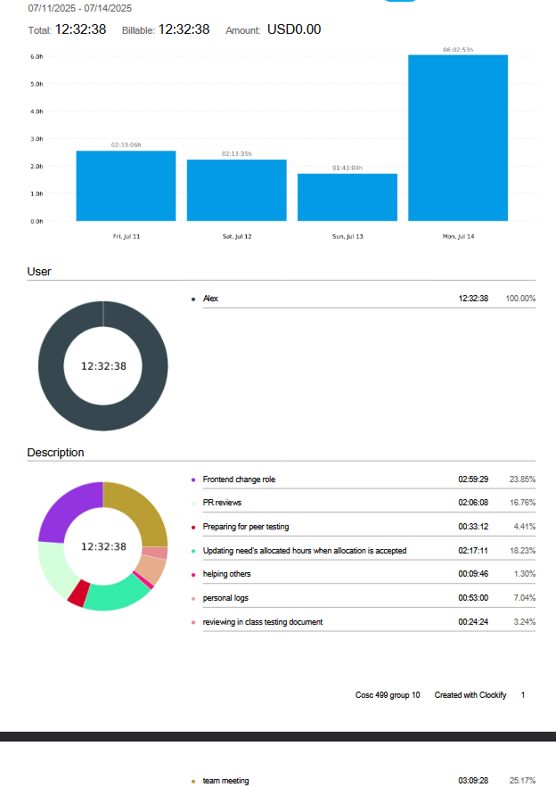

### Current Tasks (Provide sufficient detail)
  * #1: Promoting/demoting users frontend
  * #2: Updating need allocated time when accepting an offer

### Progress Update (since July 10th 2025) 
<table>
    <tr>
        <td><strong>TASK/ISSUE #</strong>
        </td>
        <td><strong>STATUS</strong>
        </td>
    </tr>
    <tr>
        <!-- Task/Issue # -->
        <td>Updating allocated hours in the course need when offer is accepted
        </td>
        <!-- Status -->
        <td>In Review
        </td>
    </tr>
    <tr>
        <!-- Task/Issue # -->
        <td>Promoting/demoting users
        </td>
        <!-- Status -->
        <td>Backend complete and merged, frontend waiting to create PR
        </td>
    </tr>
   
    
</table>

### Cycle Goal Review (Reflection: what went well, what was done, what didn't; Retrospective: how is the process going and why?)
The two tasks I wanted to do (updating the need allocated time and promote frontend) were both finished, but one PR is waiting to be reviewed and the other PR is waiting until another PR that I built my branch off is merged as well. Ultimately this cycle went well as I was able to complete both tasks, but of course they aren't merged yet. The other issues with updating roles messing up the frontend ended up not being a huge deal.

### Next Cycle Goals (What are you going to accomplish during the next cycle)
  * First thing will be to see if these features need changes, and if not then I will probably add endpoints for deactivating accounts rather than deleting them, and make that change in the front and back end.

## Thursday (July 8-10)

### Timesheet
Clockify report
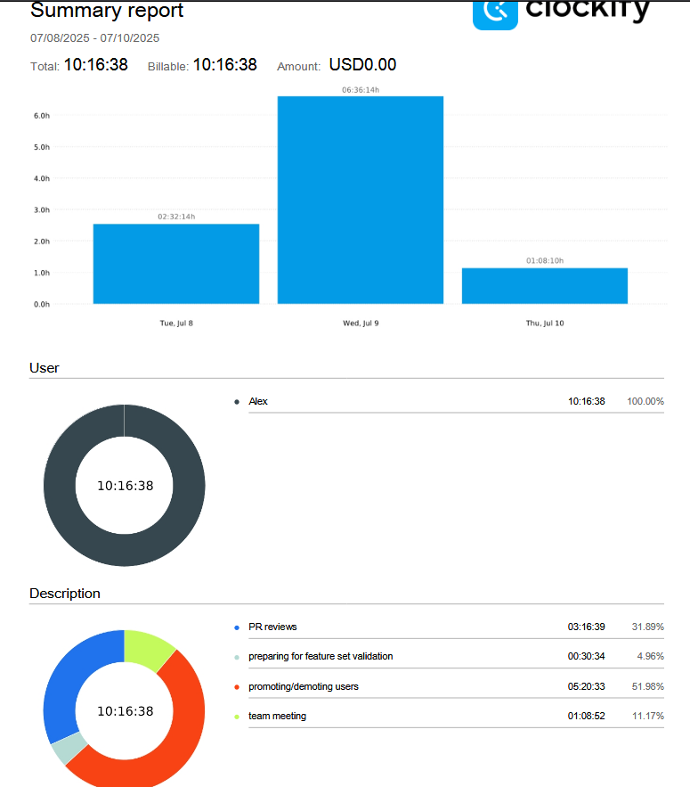

### Current Tasks (Provide sufficient detail)
  * #1: Promoting/demoting users
  * #2: Updating need allocated time when accepting an offer

### Progress Update (since July 7th 2025) 
<table>
    <tr>
        <td><strong>TASK/ISSUE #</strong>
        </td>
        <td><strong>STATUS</strong>
        </td>
    </tr>
    <tr>
        <!-- Task/Issue # -->
        <td>Sending notifications when application is sent, accepted, and rejected
        </td>
        <!-- Status -->
        <td>Completed
        </td>
    </tr>
    <tr>
        <!-- Task/Issue # -->
        <td>Promoting/demoting users
        </td>
        <!-- Status -->
        <td>In progress
        </td>
    </tr>
   
    
</table>

### Cycle Goal Review (Reflection: what went well, what was done, what didn't; Retrospective: how is the process going and why?)
We ended up deciding to overall the way we store users in the backend, so there's no subtypes anymore and so I refactored everything on the backend to just return UserDto's so this way a user can still have many roles but the fields stored aren't typed to their subtype. This will be a lot better, but it obviously broken a bunch of the frontend which I haven't fixed yet.

### Next Cycle Goals (What are you going to accomplish during the next cycle)
  * I will get the frontend fixed from this big refactor of users so that it's all smooth. I also am going to update the needs table so that when a student accepts an allocation offer that the requested time need of that course diminishes.

## Monday (July 4-7)

### Timesheet
Clockify report
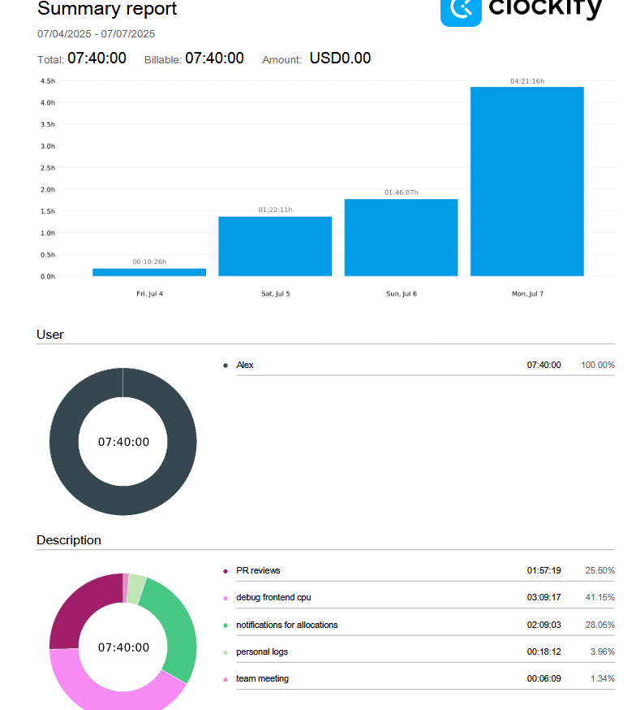

### Current Tasks (Provide sufficient detail)
  * #1: Sending notifications when application is sent, accepted, and rejected
  * #2: Debugging why the frontend takes so much CPU to run in Docker
  * #3: Promoting/demoting users

### Progress Update (since July 3rd 2025) 
<table>
    <tr>
        <td><strong>TASK/ISSUE #</strong>
        </td>
        <td><strong>STATUS</strong>
        </td>
    </tr>
    <tr>
        <!-- Task/Issue # -->
        <td>Sending notifications when application is sent, accepted, and rejected
        </td>
        <!-- Status -->
        <td>In Review
        </td>
    </tr>
    <tr>
        <!-- Task/Issue # -->
        <td>Debugging why the frontend takes so much CPU to run in Docker
        </td>
        <!-- Status -->
        <td>Complete
        </td>
    </tr>
    <tr>
        <!-- Task/Issue # -->
        <td>Promoting/demoting users
        </td>
        <!-- Status -->
        <td>In progress
        </td>
    </tr>
   
    
</table>

### Cycle Goal Review (Reflection: what went well, what was done, what didn't; Retrospective: how is the process going and why?)
I was able to debug the frontend CPU this weekend which was great. Basically, the Chokidar polling for HMR was eating a huge amount of CPU power to just track the folders, and since our frontend directory is really modular, it was taking a lot of CPU. I've turned it off, and added an option in the viteconfig.ts to add it back with a lower time interval for people working on frontend, but at least this way it won't idly take a bunch of power. Also, I made the pages in the router be lazily loaded since before the App.tsx was calling the router and the router had all the pages, so it was making over 200 get requests to itself for all the files. Now it just loads what it needs when it needs it, and has improved the load times significantly.

I also just completed notifications for when applications are sent and when an allocation offer is made to the student.

### Next Cycle Goals (What are you going to accomplish during the next cycle)
  * I will do the user management (promoting, demoting, etc), and this may come with a refactor of the way users are currently stored in the system. If so, then this could take a while to accomplish, and hopefully can be done this upcoming cycle.

## Thursday (July 1-3)

### Timesheet
Clockify report
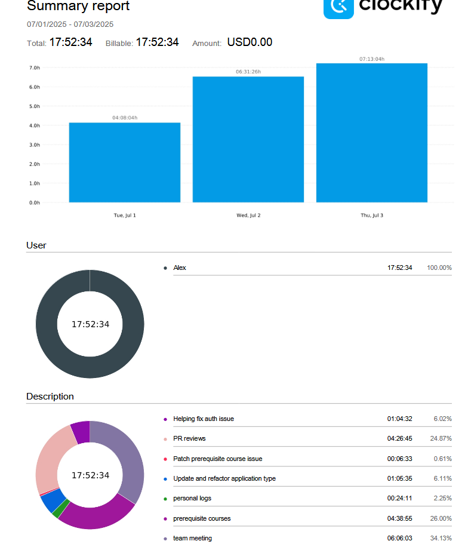

### Current Tasks (Provide sufficient detail)
  * #1: Sending notifications when application is sent, accepted, and rejected
  * #2: Debugging why the frontend takes so much CPU to run in Docker

### Progress Update (since June 30th 2025) 
<table>
    <tr>
        <td><strong>TASK/ISSUE #</strong>
        </td>
        <td><strong>STATUS</strong>
        </td>
    </tr>
    <tr>
        <!-- Task/Issue # -->
        <td>Added prerequisite course to the needs of instructors
        </td>
        <!-- Status -->
        <td>Complete
        </td>
    </tr>
    <tr>
        <!-- Task/Issue # -->
        <td>Refactored applications to store the status of application rather than boolean isConfirmed
        </td>
        <!-- Status -->
        <td>Complete
        </td>
    </tr>
    <tr>
        <!-- Task/Issue # -->
        <td>Handling student enrollment in the intermediate table for students and courses
        </td>
        <!-- Status -->
        <td>Complete
        </td>
    </tr>
    <tr>
        <!-- Task/Issue # -->
        <td>Creating a notification service for emailing and having it work with forgot password
        </td>
        <!-- Status -->
        <td>Complete
        </td>
    </tr>
    
</table>

### Cycle Goal Review (Reflection: what went well, what was done, what didn't; Retrospective: how is the process going and why?)
A number of PR's from last cycle got merged, and I spent most of this week helping prepare for MVP by creating endpoints that were missing or needed, sometimes in other people's branches. I also finished the prerequisite course handling and tied it to needs of an instructor so they can input what they prefer a student to have taken before being allocated.

### Next Cycle Goals (What are you going to accomplish during the next cycle)
  * At the moment I plan to use the notification service when receiving an offer for an application to a student, and vice versa the coordinator receiving one when they accept/reject the offer. Also the frontend takes a lot of CPU and it really probably shouldn't, so I want that to be fixed ASAP.

## Monday (June 27-30)

### Timesheet
Clockify report
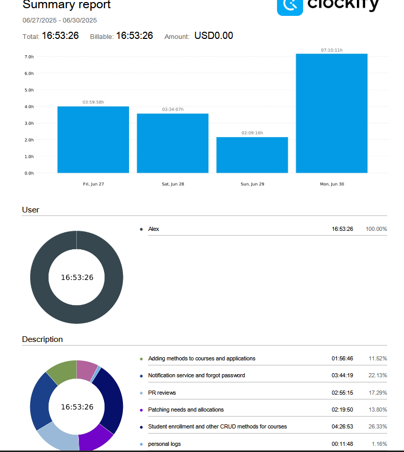

### Current Tasks (Provide sufficient detail)
  * #1: Creating a notification service for emailing and having it work with forgot password

### Progress Update (since June 26 2025) 
<table>
    <tr>
        <td><strong>TASK/ISSUE #</strong>
        </td>
        <td><strong>STATUS</strong>
        </td>
    </tr>
    <tr>
        <!-- Task/Issue # -->
        <td>Patching the needs and teacher controller to return sections rather than only courses
        </td>
        <!-- Status -->
        <td>Complete
        </td>
    </tr>
    <tr>
        <!-- Task/Issue # -->
        <td>Adding missing methods and endpoints for the applications and courses
        </td>
        <!-- Status -->
        <td>Complete
        </td>
    </tr>
    <tr>
        <!-- Task/Issue # -->
        <td>Handling student enrollment in the intermediate table for students and courses
        </td>
        <!-- Status -->
        <td>In Review
        </td>
    </tr>
    <tr>
        <!-- Task/Issue # -->
        <td>Creating a notification service for emailing and having it work with forgot password
        </td>
        <!-- Status -->
        <td>In Review
        </td>
    </tr>
    
</table>

### Cycle Goal Review (Reflection: what went well, what was done, what didn't; Retrospective: how is the process going and why?)
I accomplished a number of things this weekend, some small some large. I patched the way teacher allocations worked, and then added course filter functions for Dup's frontend that he requested. Then I also added missing CRUD operations for courses, sections, and section schedules. This was part of the same PR that I handled student enrollment through the intermediate StudentCourse to help determine what courses student's have taken before or whether they are currently enrolled or not. Then after that I built the new notification microservice and with the java mail sender library connected an SMTP gmail account I made for sending out emails. This was used in conjunction with the resetting password workflow which was accomplished in the same PR.

### Next Cycle Goals (What are you going to accomplish during the next cycle)
  * Since it wasn't clear if I would get these 4 things done this weekend, I don't have a next task lined up yet. We have a meeting on Tuesday where we'll go over the last things needed to finish for the MVP on Friday, and I will get whatever tasks are needed to be finished.

## Thursday (June 24-26)

### Timesheet
Clockify report
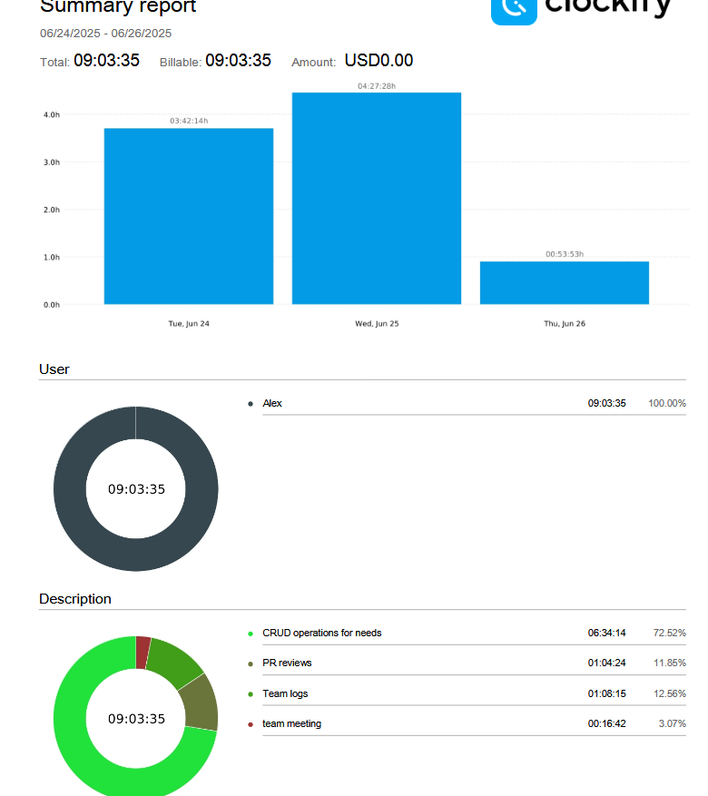

### Current Tasks (Provide sufficient detail)
  * #1: Patching the needs and teacher controller to return sections rather than only courses
  * #2: Adding missing methods and endpoints for the applications and courses
  * #3: Handling student enrollment in the intermediate table for students and courses
  * #4: Creating a notification service for emailing and having it work with forgot password

### Progress Update (since June 23 2025) 
<table>
    <tr>
        <td><strong>TASK/ISSUE #</strong>
        </td>
        <td><strong>STATUS</strong>
        </td>
    </tr>
    <tr>
        <!-- Task/Issue # -->
        <td>CRUD operations needs and submitting
        </td>
        <!-- Status -->
        <td>Complete
        </td>
    </tr>
    <tr>
        <!-- Task/Issue # -->
        <td>Assign instructors to sections
        </td>
        <!-- Status -->
        <td>Complete
        </td>
    </tr>
    <tr>
        <!-- Task/Issue # -->
        <td>Get sections, needs, and allocations for teachers
        </td>
        <!-- Status -->
        <td>Complete
        </td>
    </tr>
    
</table>

### Cycle Goal Review (Reflection: what went well, what was done, what didn't; Retrospective: how is the process going and why?)
I ended up starting with just the needs, and then it became clear there was a lot more that needed to work for it when retrieving it, so the PR also handled assigning instructors, and getting feign working to retrieve the allocation history. Ended up being a fair bit of work and I think it works relatively well.

### Next Cycle Goals (What are you going to accomplish during the next cycle)
  * There's a lot of things to do for the next cycle and some are quick (like the patches), the enrollment stuff is medium and shouldn't take too long, and the notification mailer is undetermined. I will have to create a new microservice with the java mailer from spring which is probably pretty easy to do, then connect an email to it. The forgot password workflow is simple, it's just unclear exactly how long/hard this will be.

## Monday (June 20-23)

### Timesheet
Clockify report
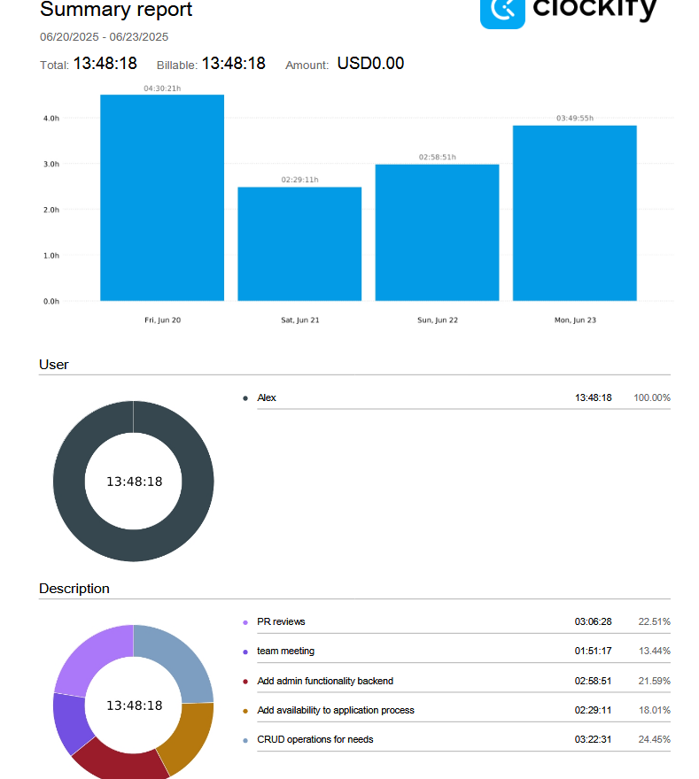

### Current Tasks (Provide sufficient detail)
  * #1: CRUD operations for the application objects

### Progress Update (since June 19 2025) 
<table>
    <tr>
        <td><strong>TASK/ISSUE #</strong>
        </td>
        <td><strong>STATUS</strong>
        </td>
    </tr>
    <tr>
        <!-- Task/Issue # -->
        <td>Add availability to application
        </td>
        <!-- Status -->
        <td>Complete
        </td>
    </tr>
    <tr>
        <!-- Task/Issue # -->
        <td>Admin role extension
        </td>
        <!-- Status -->
        <td>Complete
        </td>
    </tr>
    <tr>
        <!-- Task/Issue # -->
        <td>CRUD operations needs and submitting
        </td>
        <!-- Status -->
        <td>In Progress
        </td>
    </tr>
    
</table>

### Cycle Goal Review (Reflection: what went well, what was done, what didn't; Retrospective: how is the process going and why?)
I added the availability table and allowed it to stored the times there for applications, and that's now also linked with the frontend. I also completed the admin role with an extension to allow numerous roles through a many-to-many relationship with users. I'm now starting to work on the needs of an instructor and the crud operations for that.

### Next Cycle Goals (What are you going to accomplish during the next cycle)
  * Finishing up the needs for this cycle will be great, and if I get that done I'll also look towards another feature for MVP, maybe CSV exporting or qualifications, depending on what other team members are doing.

## Thursday (June 17-19)

### Timesheet
Clockify report
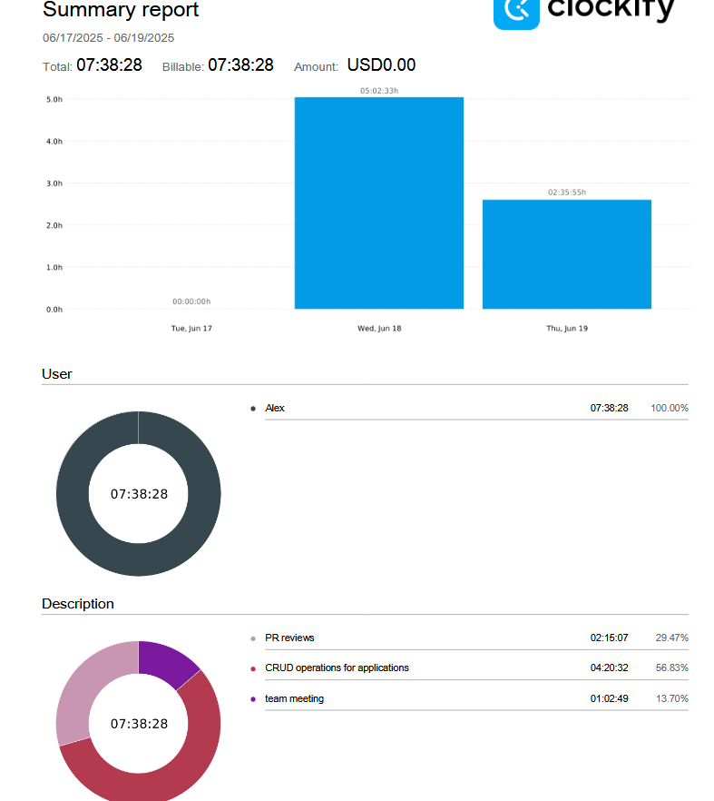

### Current Tasks (Provide sufficient detail)
  * #1: CRUD operations for the application objects

### Progress Update (since June 16 2025) 
<table>
    <tr>
        <td><strong>TASK/ISSUE #</strong>
        </td>
        <td><strong>STATUS</strong>
        </td>
    </tr>
    <tr>
        <!-- Task/Issue # -->
        <td>CRUD operations for application object
        </td>
        <!-- Status -->
        <td>In Review
        </td>
    </tr>
    
</table>

### Cycle Goal Review (Reflection: what went well, what was done, what didn't; Retrospective: how is the process going and why?)
I finished up the rest of the CRUD for applications so that's nice - there were a lot of distractions this week that made this slower, but I'm still happy it got finished.

### Next Cycle Goals (What are you going to accomplish during the next cycle)
  * Discussing with team members today about next steps - I believe that it will be working on CRUD for offers, or maybe adding the admin role as a possible option to coordinators.

## Monday (June 13-16)

### Timesheet
Clockify report
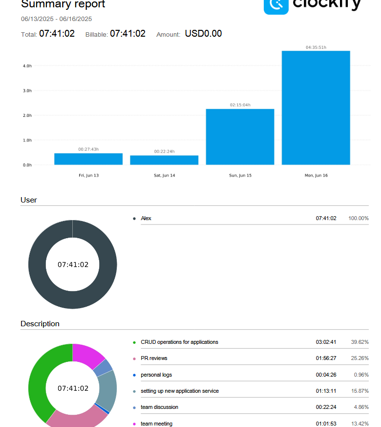

### Current Tasks (Provide sufficient detail)
  * #1: CRUD operations for the application objects

### Progress Update (since June 13 2025) 
<table>
    <tr>
        <td><strong>TASK/ISSUE #</strong>
        </td>
        <td><strong>STATUS</strong>
        </td>
    </tr>
    <tr>
        <!-- Task/Issue # -->
        <td>CRUD operations for application object
        </td>
        <!-- Status -->
        <td>In Progress
        </td>
    </tr>
    <tr>
        <!-- Task/Issue # -->
        <td>Implement new application microservice with basic JPA objects
        </td>
        <!-- Status -->
        <td>In Review
        </td>
    </tr>
    
</table>

### Cycle Goal Review (Reflection: what went well, what was done, what didn't; Retrospective: how is the process going and why?)
I was in Toronto for a few days, so I when I got back I caught up on the PR's that were merged and the new ones that have showed up to get familiarized, and discussed with Mandeep about our next goal of the getting the application objects working. I've started those endpoints, and have the create part working, but still have the other 3 to do. I will have more time now to do these things.

### Next Cycle Goals (What are you going to accomplish during the next cycle)
  * Finish the CRUD operations for applications.

## Thursday (June 10-12)

### Timesheet
Clockify report
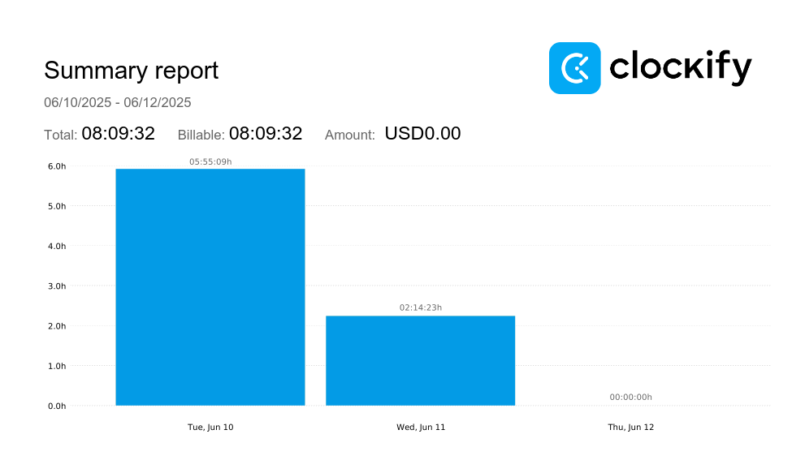
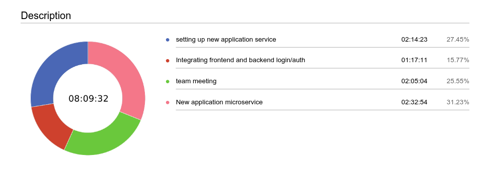

### Current Tasks (Provide sufficient detail)
  * #1: Getting the application service to start handling various endpoint calls.

### Progress Update (since June 9 2025) 
<table>
    <tr>
        <td><strong>TASK/ISSUE #</strong>
        </td>
        <td><strong>STATUS</strong>
        </td>
    </tr>
    <tr>
        <!-- Task/Issue # -->
        <td>Implement new application microservice with basic JPA objects
        </td>
        <!-- Status -->
        <td>In Review
        </td>
    </tr>
    <tr>
        <!-- Task/Issue # -->
        <td>Help integrate frontend with backend login and auth
        </td>
        <!-- Status -->
        <td>In Review
        </td>
    </tr>
</table>

### Cycle Goal Review (Reflection: what went well, what was done, what didn't; Retrospective: how is the process going and why?)
The frontend is successfully calling the backend, which I helped Mandeep with, and a new application microservice with the entities created as specified in the ER diagram is now in review.

### Next Cycle Goals (What are you going to accomplish during the next cycle)
  * Get the endpoints for CRUD operations for the application microservice working

## Monday (June 6-9)

### Timesheet
Clockify report
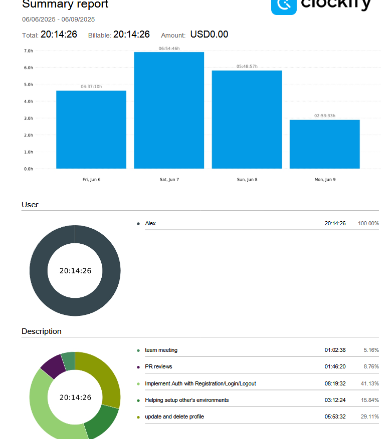

### Current Tasks (Provide sufficient detail)
  * #1: Implementing the application microservice with appropriate libraries that will handle applications, offers, and allocations.

### Progress Update (since June 5 2025) 
<table>
    <tr>
        <td><strong>TASK/ISSUE #</strong>
        </td>
        <td><strong>STATUS</strong>
        </td>
    </tr>
    <tr>
        <!-- Task/Issue # -->
        <td>Implement Auth with registration and login
        </td>
        <!-- Status -->
        <td>Complete
        </td>
    </tr>
    <tr>
        <!-- Task/Issue # -->
        <td>User update and delete operations with proper auth and error handling
        </td>
        <!-- Status -->
        <td>In Review
        </td>
    </tr>
</table>

### Cycle Goal Review (Reflection: what went well, what was done, what didn't; Retrospective: how is the process going and why?)
The auth works now with all the microservices having filters for the headers and the gateway can now parse the JWT created in login. Passwords are hashed with BCrypt, and overall it's a fine auth level to have at this point. I also finished up the the delete and update handling for users which took a bit longer to handle both auth and mapping between the different user types.

### Next Cycle Goals (What are you going to accomplish during the next cycle)
  * Get the next and last microservice created for applications with the right libraries
  * Maybe, if time allows, start handling some JPA objects in said microservice

## Thursday (June 2-5)

### Timesheet
Clockify report

### Current Tasks (Provide sufficient detail)
  * #1: Getting auth working with login/registration/logout with JWT's and BCrypt.

### Progress Update (since June 2 2025) 
<table>
    <tr>
        <td><strong>TASK/ISSUE #</strong>
        </td>
        <td><strong>STATUS</strong>
        </td>
    </tr>
    <tr>
        <!-- Task/Issue # -->
        <td>Implement basic microservices architecture
        </td>
        <!-- Status -->
        <td>Complete
        </td>
    </tr>
    <tr>
        <!-- Task/Issue # -->
        <td>Design Video
        </td>
        <!-- Status -->
        <td>Complete
        </td>
    </tr>
</table>

### Cycle Goal Review (Reflection: what went well, what was done, what didn't; Retrospective: how is the process going and why?)
The final implementation I wanted for the basic microservices were finished with inter service communication, API Gateway, service discovery, and basic models of testing with Mockito and MockMvc for unit testing service layers and endpoints along with overall organization, error handling, DTO's, and basic database handling. 

### Next Cycle Goals (What are you going to accomplish during the next cycle)
  * Get registration to work with BCrypt for password hashing
  * Have login return JWT for auth that can also be checked in the gateway
  * Have logout destroy JWT and configure the rest of spring security for this to all work together

## Monday (May 29-June 2)

### Timesheet
Clockify report
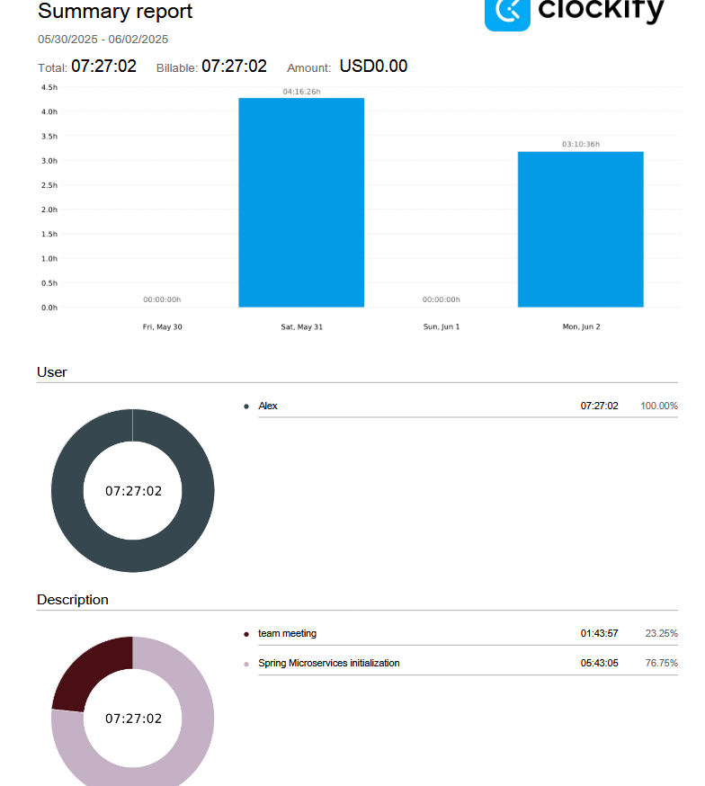

### Current Tasks (Provide sufficient detail)
  * #1: Finishing basic microservices implementation - user service and course service now work and register in the in the eureka server. The API gateway also now has routing for the two services - now just need to further connect them.
  * #2: System architecture diagram

### Progress Update (since May 29 2025) 
<table>
    <tr>
        <td><strong>TASK/ISSUE #</strong>
        </td>
        <td><strong>STATUS</strong>
        </td>
    </tr>
    <tr>
        <!-- Task/Issue # -->
        <td>Implement basic microservices architecture
        </td>
        <!-- Status -->
        <td>80% complete
        </td>
    </tr>
    <tr>
        <!-- Task/Issue # -->
        <td>Architecture diagram
        </td>
        <!-- Status -->
        <td>Complete
        </td>
    </tr>
</table>

### Cycle Goal Review (Reflection: what went well, what was done, what didn't; Retrospective: how is the process going and why?)
A lot of progress was made for the microservices. The User service and course service are functioning now on their own ports, and implementing the basic spring MVC pattern to them worked well for the API calls. They register properly with Eureka, and today(Monday) I managed to get the API gateway to route to them properly.

### Next Cycle Goals (What are you going to accomplish during the next cycle)
  * Get the Feign client working for inter service communication
  * Implement many to many relationship between microservices
  * Write basic unit tests with Junit and Mockito for the API calls

## Thursday (May 24-29)

### Timesheet
Clockify report

### Current Tasks (Provide sufficient detail)
  * #1: Implementing a microservice architecture in spring boot. Involved watching video tutorials and starting the implementation on a branch.
  * #2: Helped create the ER diagram for the database model

### Progress Update (since May 24 2025) 
<table>
    <tr>
        <td><strong>TASK/ISSUE #</strong>
        </td>
        <td><strong>STATUS</strong>
        </td>
    </tr>
    <tr>
        <!-- Task/Issue # -->
        <td>Implement basic microservice architecture
        </td>
        <!-- Status -->
        <td>50% complete
        </td>
    </tr>
    <tr>
        <!-- Task/Issue # -->
        <td>ER Diagram
        </td>
        <!-- Status -->
        <td>Complete
        </td>
    </tr>
</table>

### Cycle Goal Review (Reflection: what went well, what was done, what didn't; Retrospective: how is the process going and why?)
I watched a number of videos on microservices in the spring boot and how to implement them. I understand fundamentally now how they work, and it's just a matter now of following the documentation and tutorials to get them communicating.

### Next Cycle Goals (What are you going to accomplish during the next cycle)
  * Get the microservices basic implementation working, including the service registry, gateway, and some basic services
  * Complete any missing diagrams i.e. an architecture diagram

## Sunday (May 18-24)

### Timesheet
Clockify report

### Current Tasks (Provide sufficient detail)
  * #1: Reading various modules on canvas and exploring some frameworks for potential use including Laravel, Spring Boot, and React
  * #2: Watching Youtube Tutorials on Spring Boot framework, here are the links for reference. 
    - [Part 1 intro spring](https://www.youtube.com/watch?v=gJrjgg1KVL4m)
    - [Part 2 intro spring](https://www.youtube.com/watch?v=EWd3_I4X32g)
    - [Intro spring and spring data jpa](https://www.youtube.com/watch?v=5rNk7m_zlAg)
    - [Intro to microservices in spring](https://www.youtube.com/watch?v=lh1oQHXVSc0)
  * #3: This time also included reviewing Pull Requests and team meetings

### Progress Update (since May 18 2025) 
<table>
    <tr>
        <td><strong>TASK/ISSUE #</strong>
        </td>
        <td><strong>STATUS</strong>
        </td>
    </tr>
    <tr>
        <!-- Task/Issue # -->
        <td>Project Plan
        </td>
        <!-- Status -->
        <td>99% complete
        </td>
    </tr>
    <tr>
        <!-- Task/Issue # -->
        <td>Learning Spring Boot
        </td>
        <!-- Status -->
        <td>Complete, mostly
        </td>
    </tr>
    <tr>
        <!-- Task/Issue # -->
        <td>Team Charter
        </td>
        <!-- Status -->
        <td>Complete
        </td>
    </tr>
</table>

### Cycle Goal Review (Reflection: what went well, what was done, what didn't; Retrospective: how is the process going and why?)
 I pretty much understand the Spring Boot framework and it's major components and organizational structure. Microservices on the other hand...definitely more complicated, and for this use case, I'm not sure it's worth exploring too much further.

### Next Cycle Goals (What are you going to accomplish during the next cycle)
  * Complete Diagrams for next milestone
  * Get a working Spring Boot backend, either monolithic or microservices once the group reaches consensus
  * Add the user stories and issues to Github from our project plan for tracking
