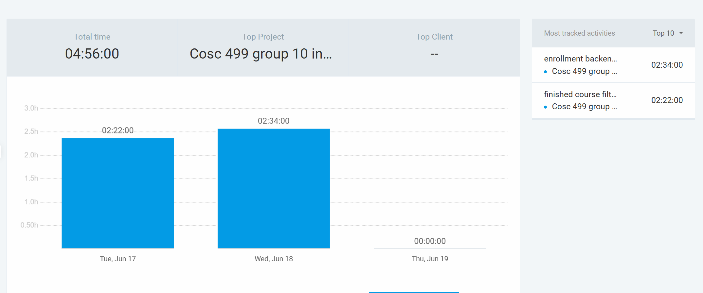
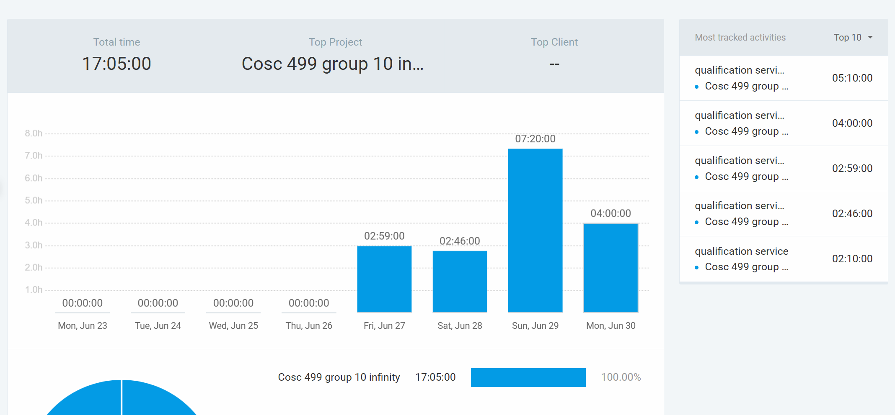
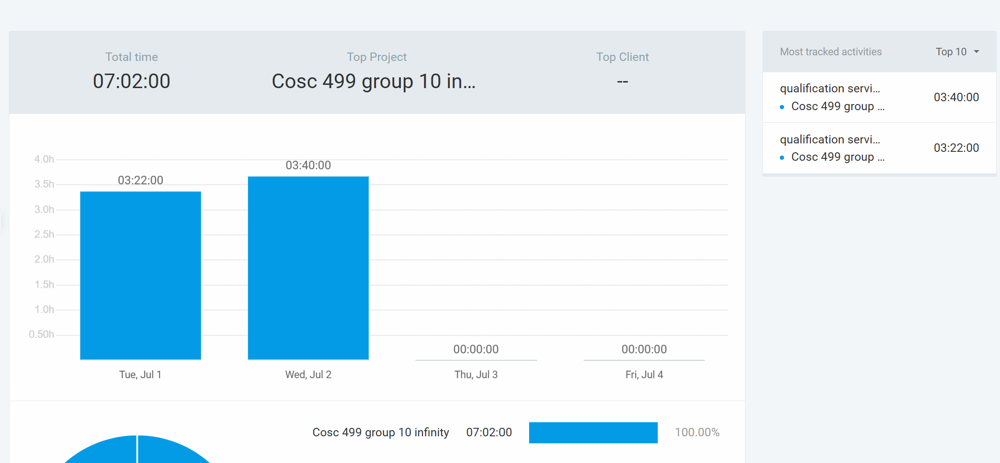
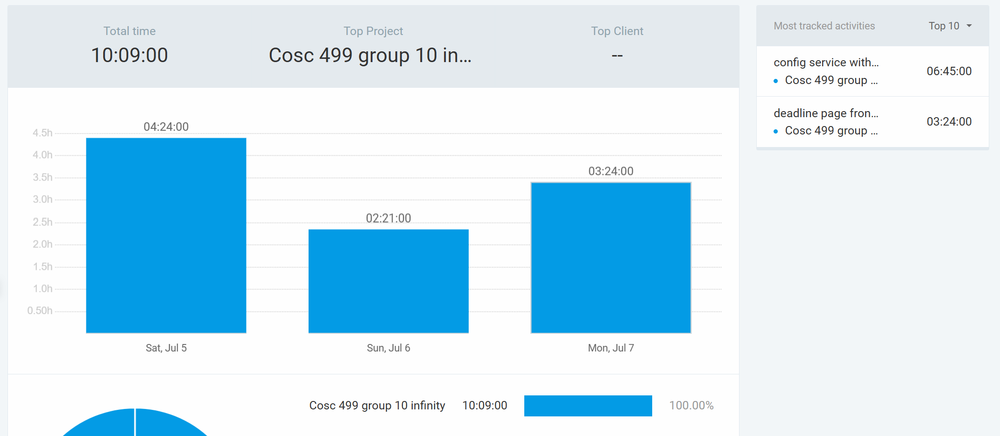
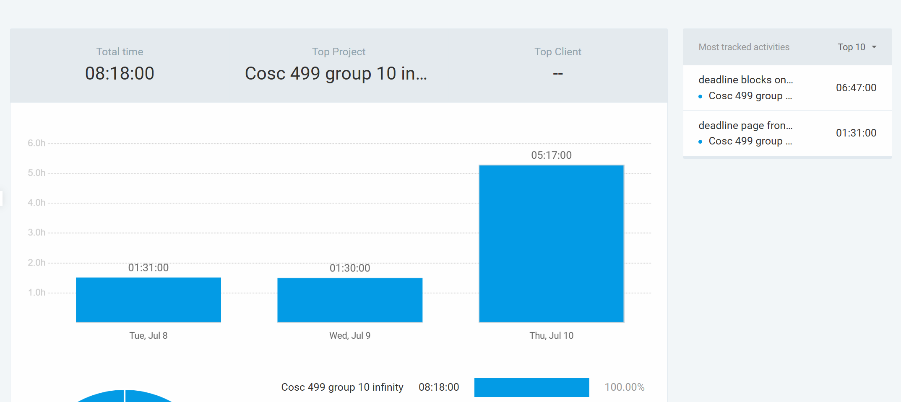
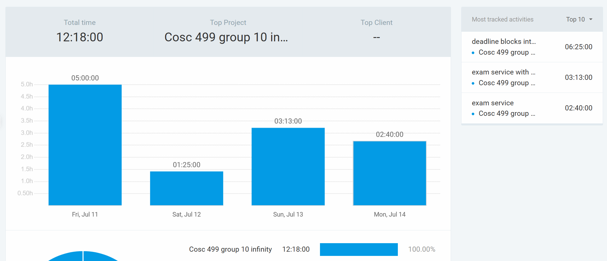
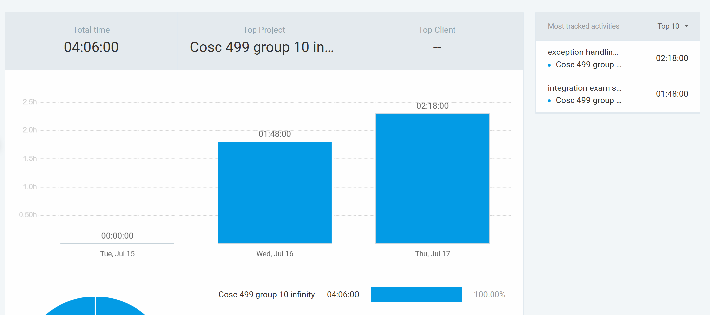
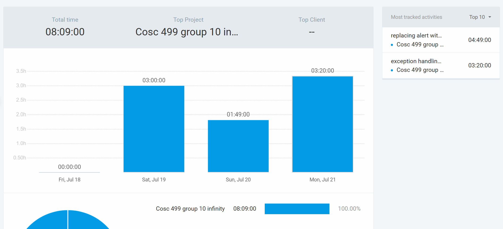
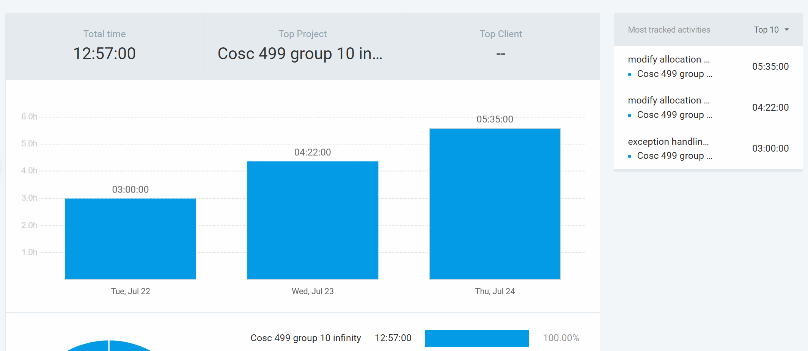

## Sunday (May 18-29)

### Timesheet
Clockify report

### Current Tasks (Provide sufficient detail)
  * #1: learning Spring Boot and React
  * #2: project planning

### Progress Update (since May 18 2025) 
<table>
    <tr>
        <td><strong>TASK/ISSUE #</strong>
        </td>
        <td><strong>STATUS</strong>
        </td>
    </tr>
    <tr>
        <!-- Task/Issue # -->
        <td>Project Plan
        </td>
        <!-- Status -->
        <td>99% complete
        </td>
    </tr>
    <tr>
        <!-- Task/Issue # -->
        <td>Learning Spring Boot
        </td>
        <!-- Status -->
        <td>in progress
        </td>
    </tr>
    <tr>
        <!-- Task/Issue # -->
        <td>Team Charter
        </td>
        <!-- Status -->
        <td>Complete
        </td>
    </tr>
</table>

### Cycle Goal Review (Reflection: what went well, what was done, what didn't; Retrospective: how is the process going and why?)
 we did the project planning this week, learning of fraameworks is still in progress, need more hand on experience

### Next Cycle Goals (What are you going to accomplish during the next cycle)
  * Complete Diagrams for next milestone
  * learn micro service
  * Add the user stories and issues to Github from our project plan for tracking

## May 30 - June 02

### Timesheet
Clockify report

### Current Tasks (Provide sufficient detail)
  * #1: learning microservice
  * #2: project planning

### Progress Update
<table>
    <tr>
        <td><strong>TASK/ISSUE #</strong>
        </td>
        <td><strong>STATUS</strong>
        </td>
    </tr>
    <tr>
        <!-- Task/Issue # -->
        <td>Project Plan
        </td>
        <!-- Status -->
        <td>complete
        </td>
    </tr>
    <tr>
        <!-- Task/Issue # -->
        <td>Learning microservice
        </td>
        <!-- Status -->
        <td>in progress
        </td>
    </tr>
</table>

### Cycle Goal Review (Reflection: what went well, what was done, what didn't; Retrospective: how is the process going and why?)
finished DFD and overall project planning, learning of frameworks is still in progress, need more hand on experience

### Next Cycle Goals (What are you going to accomplish during the next cycle)
  * learn micro service
  * start actual development

## June 02 - 05

### Timesheet
Clockify report

### Current Tasks (Provide sufficient detail)
  * #1: learning spring boot and microservice
  * #2: project deploy

### Progress Update
<table>
    <tr>
        <td><strong>TASK/ISSUE #</strong>
        </td>
        <td><strong>STATUS</strong>
        </td>
    </tr>
    <tr>
        <!-- Task/Issue # -->
        <td>learning spring boot and microservice
        </td>
        <!-- Status -->
        <td>in progress
        </td>
    </tr>
    <tr>
        <!-- Task/Issue # -->
        <td>project deploy
        </td>
        <!-- Status -->
        <td>in progress
        </td>
    </tr>
</table>

### Cycle Goal Review (Reflection: what went well, what was done, what didn't; Retrospective: how is the process going and why?)
finished the video presentation, trying to understand the project and test runs

### Next Cycle Goals (What are you going to accomplish during the next cycle)
  * learning framwork and understand the project
  * user story: browse available courses

## June 05 - 09

### Timesheet
Clockify report

### Current Tasks (Provide sufficient detail)
  * #1: learning spring boot and microservice
  * #2: course filter backend coding

### Progress Update
<table>
    <tr>
        <td><strong>TASK/ISSUE #</strong>
        </td>
        <td><strong>STATUS</strong>
        </td>
    </tr>
    <tr>
        <!-- Task/Issue # -->
        <td>learning spring boot and microservice
        </td>
        <!-- Status -->
        <td>complete
        </td>
    </tr>
    <tr>
        <!-- Task/Issue # -->
        <td>course filter backend coding
        </td>
        <!-- Status -->
        <td>in progress
        </td>
    </tr>
</table>

### Cycle Goal Review (Reflection: what went well, what was done, what didn't; Retrospective: how is the process going and why?)
finished the learning part, started coding on course filter, almost completed, haven't integrate with frontend

### Next Cycle Goals (What are you going to accomplish during the next cycle)
  * integrating and testing course filter
  * start on the nest feature

## June 10 - 12

### Timesheet
Clockify report

### Current Tasks (Provide sufficient detail)
  * #1: course filter backend coding
  * #2: course filter integration and learning frontend

### Progress Update
<table>
    <tr>
        <td><strong>TASK/ISSUE #</strong>
        </td>
        <td><strong>STATUS</strong>
        </td>
    </tr>
    <tr>
        <!-- Task/Issue # -->
        <td>integrating with frontend
        </td>
        <!-- Status -->
        <td>in progress
        </td>
    </tr>
    <tr>
        <!-- Task/Issue # -->
        <td>course filter backend coding(adding time filter)
        </td>
        <!-- Status -->
        <td>in progress
        </td>
    </tr>
</table>

### Cycle Goal Review (Reflection: what went well, what was done, what didn't; Retrospective: how is the process going and why?)
finished backend of course filter, having trouble with integrating, also learned frontend.

### Next Cycle Goals (What are you going to accomplish during the next cycle)
  * integrating and testing course filter
  * start on the nest feature

## June 13 - 16

### Timesheet
Clockify report

### Current Tasks (Provide sufficient detail)
  * #1: addSection&addSectionSchedule method, updated postman calls
  * #2: dealt with duplicate entries

### Progress Update
<table>
    <tr>
        <td><strong>TASK/ISSUE #</strong>
        </td>
        <td><strong>STATUS</strong>
        </td>
    </tr>
    <tr>
        <!-- Task/Issue # -->
        <td>addSection&addSectionSchedule method, updated postman calls
        </td>
        <!-- Status -->
        <td>complete
        </td>
    </tr>
    <tr>
        <!-- Task/Issue # -->
        <td>dealt with duplicate entries
        </td>
        <!-- Status -->
        <td>complete
        </td>
    </tr>
</table>

### Cycle Goal Review (Reflection: what went well, what was done, what didn't; Retrospective: how is the process going and why?)
adding features to the backend of course filter, brainstorming about the enrollment table design.

### Next Cycle Goals (What are you going to accomplish during the next cycle)
  * building enrollment table to enable frontend comparer
  * building backend for instructor pages

## June 17 - 19

### Timesheet
Clockify report

### Current Tasks (Provide sufficient detail)
  * #1: finished course filtering
  * #2: building erollment table with feign

### Progress Update
<table>
    <tr>
        <td><strong>TASK/ISSUE #</strong>
        </td>
        <td><strong>STATUS</strong>
        </td>
    </tr>
    <tr>
        <!-- Task/Issue # -->
        <td>finished course filtering
        </td>
        <!-- Status -->
        <td>complete
        </td>
    </tr>
    <tr>
        <!-- Task/Issue # -->
        <td>building erollment table with feign
        </td>
        <!-- Status -->
        <td>in progress
        </td>
    </tr>
</table>

### Cycle Goal Review (Reflection: what went well, what was done, what didn't; Retrospective: how is the process going and why?)
finished the backend of course filter, enrollment table building with feign to request another service.

### Next Cycle Goals (What are you going to accomplish during the next cycle)
  * building enrollment table to enable frontend comparer

## June 19 - 30

### Timesheet
Clockify report

### Current Tasks (Provide sufficient detail)
  * #1: the whole qualification service backend
  * #2: testing and integrating

### Progress Update
<table>
    <tr>
        <td><strong>TASK/ISSUE #</strong>
        </td>
        <td><strong>STATUS</strong>
        </td>
    </tr>
    <tr>
        <!-- Task/Issue # -->
        <td>the whole qualification service backend
        </td>
        <!-- Status -->
        <td>complete
        </td>
    </tr>
    <tr>
        <!-- Task/Issue # -->
        <td>testing and integrating
        </td>
        <!-- Status -->
        <td>in progress
        </td>
    </tr>
</table>

### Cycle Goal Review (Reflection: what went well, what was done, what didn't; Retrospective: how is the process going and why?)
finished the backend of qualification service, had a final at 25th, didn't really contributed at that week.

### Next Cycle Goals (What are you going to accomplish during the next cycle)
  * building enrollment table to enable frontend comparer

## July 01 - 04

### Timesheet
Clockify report

### Current Tasks (Provide sufficient detail)
  * #1: the whole qualification service backend
  * #2: testing and integrating

### Progress Update
<table>
    <tr>
        <td><strong>TASK/ISSUE #</strong>
        </td>
        <td><strong>STATUS</strong>
        </td>
    </tr>
    <tr>
        <!-- Task/Issue # -->
        <td>the whole qualification service backend
        </td>
        <!-- Status -->
        <td>complete
        </td>
    </tr>
    <tr>
        <!-- Task/Issue # -->
        <td>testing and integrating
        </td>
        <!-- Status -->
        <td>complete
        </td>
    </tr>
</table>

### Cycle Goal Review (Reflection: what went well, what was done, what didn't; Retrospective: how is the process going and why?)
mainly testing and modifying based on teammates's reflections

### Next Cycle Goals (What are you going to accomplish during the next cycle)
  * building the deadline page for admin and the corresponding backend service

## July 05 - 07

### Timesheet
Clockify report

### Current Tasks (Provide sufficient detail)
  * #1: the deadline service backend
  * #2: deadline page
### Progress Update
<table>
    <tr>
        <td><strong>TASK/ISSUE #</strong>
        </td>
        <td><strong>STATUS</strong>
        </td>
    </tr>
    <tr>
        <!-- Task/Issue # -->
        <td>the deadline service backend
        </td>
        <!-- Status -->
        <td>complete
        </td>
    </tr>
    <tr>
        <!-- Task/Issue # -->
        <td>deadline page
        </td>
        <!-- Status -->
        <td>in progress
        </td>
    </tr>
</table>

### Cycle Goal Review (Reflection: what went well, what was done, what didn't; Retrospective: how is the process going and why?)
built the deadline page for admin and the corresponding backend service, frontend test not writen yet.

### Next Cycle Goals (What are you going to accomplish during the next cycle)
  * testing the deadline page
  * add deadline limitations to other services

## July 08 - 10

### Timesheet
Clockify report

### Current Tasks (Provide sufficient detail)
  * #1: deadline page
  * #2: add deadline blocks to other services
### Progress Update
<table>
    <tr>
        <td><strong>TASK/ISSUE #</strong>
        </td>
        <td><strong>STATUS</strong>
        </td>
    </tr>
    <tr>
        <!-- Task/Issue # -->
        <td>deadline page
        </td>
        <!-- Status -->
        <td>complete
        </td>
    </tr>
    <tr>
        <!-- Task/Issue # -->
        <td>add deadline blocks to other services
        </td>
        <!-- Status -->
        <td>in progress
        </td>
    </tr>
</table>

### Cycle Goal Review (Reflection: what went well, what was done, what didn't; Retrospective: how is the process going and why?)
built the deadline page for admin, adding deadline restrictions to student application, student accept offer, and instructor update needs, blocks on both front end and back end.

### Next Cycle Goals (What are you going to accomplish during the next cycle)
  * finish deadline restrictions
  * notification service

## July 11 - 14

### Timesheet
Clockify report

### Current Tasks (Provide sufficient detail)
  * #1: add deadline blocks to other services
  * #2: exam service backend
### Progress Update
<table>
    <tr>
        <td><strong>TASK/ISSUE #</strong>
        </td>
        <td><strong>STATUS</strong>
        </td>
    </tr>
    <tr>
        <!-- Task/Issue # -->
        <td>add deadline blocks to other services
        </td>
        <!-- Status -->
        <td>complete
        </td>
    </tr>
    <tr>
        <!-- Task/Issue # -->
        <td>exam service backend
        </td>
        <!-- Status -->
        <td>in progress
        </td>
    </tr>
</table>

### Cycle Goal Review (Reflection: what went well, what was done, what didn't; Retrospective: how is the process going and why?)
added deadline restrictions to student application, student accept offer, and instructor update needs, blocks on both front end and back end. built exam service backend.

### Next Cycle Goals (What are you going to accomplish during the next cycle)
  * finish exam service(frontend and integration)
  * work on exception handling

## July 15 - 17

### Timesheet
Clockify report

### Current Tasks (Provide sufficient detail)
  * #1: integrating exam service
  * #2: exception handling
### Progress Update
<table>
    <tr>
        <td><strong>TASK/ISSUE #</strong>
        </td>
        <td><strong>STATUS</strong>
        </td>
    </tr>
    <tr>
        <!-- Task/Issue # -->
        <td>integrating exam service
        </td>
        <!-- Status -->
        <td>in progress
        </td>
    </tr>
    <tr>
        <!-- Task/Issue # -->
        <td>exception handling
        </td>
        <!-- Status -->
        <td>in progress
        </td>
    </tr>
</table>

### Cycle Goal Review (Reflection: what went well, what was done, what didn't; Retrospective: how is the process going and why?)
finish exam service intgration, add more exception and validations on backend services

### Next Cycle Goals (What are you going to accomplish during the next cycle)
  * finish exam service(frontend and integration)

  * work on exception handling

## July 18 - 21

### Timesheet
Clockify report

### Current Tasks (Provide sufficient detail)
  * #1: replacing alert with toastify
  * #2: add more exception handling
### Progress Update
<table>
    <tr>
        <td><strong>TASK/ISSUE #</strong>
        </td>
        <td><strong>STATUS</strong>
        </td>
    </tr>
    <tr>
        <!-- Task/Issue # -->
        <td>replacing alert with toastify
        </td>
        <!-- Status -->
        <td>complete
        </td>
    </tr>
    <tr>
        <!-- Task/Issue # -->
        <td>add exception handling
        </td>
        <!-- Status -->
        <td>in progress
        </td>
    </tr>
</table>

### Cycle Goal Review (Reflection: what went well, what was done, what didn't; Retrospective: how is the process going and why?)
added more exception and validations on backend services, replaced all alert to toast.error pop-ups

### Next Cycle Goals (What are you going to accomplish during the next cycle)
  * Mark all the backend functions that are not used as "Not Being used".

## July 22 - 24

### Timesheet
Clockify report

### Current Tasks (Provide sufficient detail)
  * #1: modify allocation and availability table
  * #2: add tests for added exception handling
### Progress Update
<table>
    <tr>
        <td><strong>TASK/ISSUE #</strong>
        </td>
        <td><strong>STATUS</strong>
        </td>
    </tr>
    <tr>
        <!-- Task/Issue # -->
        <td>modify allocation and availability table
        </td>
        <!-- Status -->
        <td>in progress
        </td>
    </tr>
    <tr>
        <!-- Task/Issue # -->
        <td>add tests for added exception handling
        </td>
        <!-- Status -->
        <td>complete
        </td>
    </tr>
</table>

### Cycle Goal Review (Reflection: what went well, what was done, what didn't; Retrospective: how is the process going and why?)
modify allocation and availability table to meet Chad's feedback, added a new table AllocatedSection

### Next Cycle Goals (What are you going to accomplish during the next cycle)
  * finish modify allocation service, integrate with frontend
