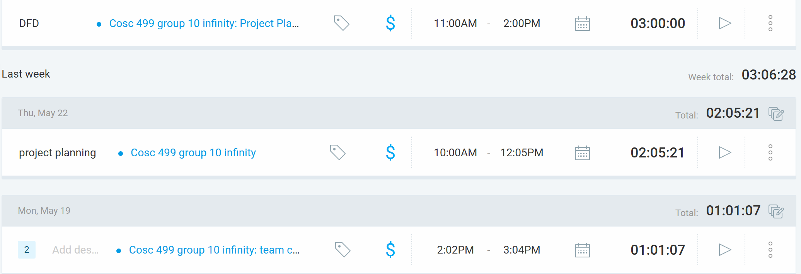
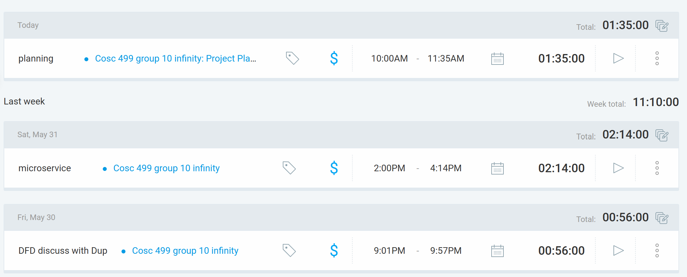
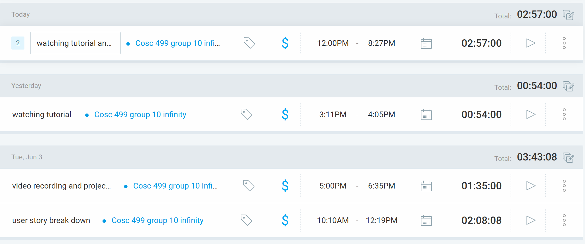
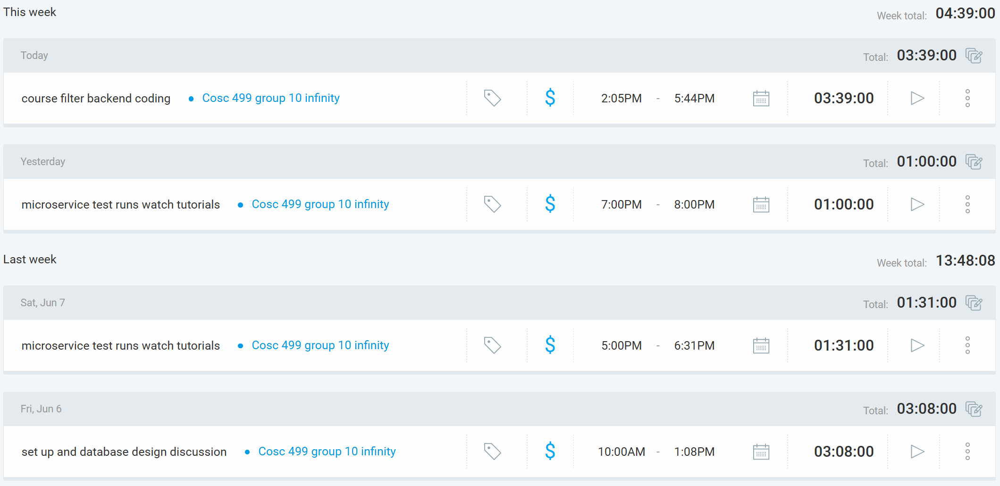
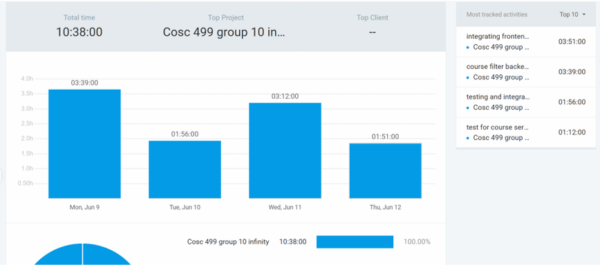
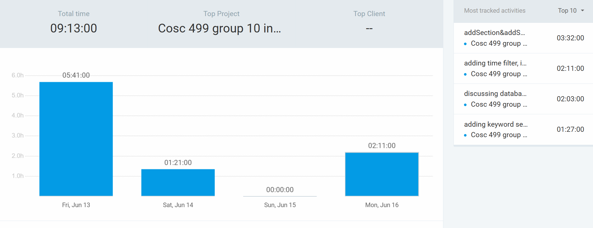

## Sunday (May 18-29)

### Timesheet
Clockify report

### Current Tasks (Provide sufficient detail)
  * #1: learning Spring Boot and React
  * #2: project planning

### Progress Update (since May 18 2025) 
<table>
    <tr>
        <td><strong>TASK/ISSUE #</strong>
        </td>
        <td><strong>STATUS</strong>
        </td>
    </tr>
    <tr>
        <!-- Task/Issue # -->
        <td>Project Plan
        </td>
        <!-- Status -->
        <td>99% complete
        </td>
    </tr>
    <tr>
        <!-- Task/Issue # -->
        <td>Learning Spring Boot
        </td>
        <!-- Status -->
        <td>in progress
        </td>
    </tr>
    <tr>
        <!-- Task/Issue # -->
        <td>Team Charter
        </td>
        <!-- Status -->
        <td>Complete
        </td>
    </tr>
</table>

### Cycle Goal Review (Reflection: what went well, what was done, what didn't; Retrospective: how is the process going and why?)
 we did the project planning this week, learning of fraameworks is still in progress, need more hand on experience

### Next Cycle Goals (What are you going to accomplish during the next cycle)
  * Complete Diagrams for next milestone
  * learn micro service
  * Add the user stories and issues to Github from our project plan for tracking

## May 30 - June 02

### Timesheet
Clockify report

### Current Tasks (Provide sufficient detail)
  * #1: learning microservice
  * #2: project planning

### Progress Update
<table>
    <tr>
        <td><strong>TASK/ISSUE #</strong>
        </td>
        <td><strong>STATUS</strong>
        </td>
    </tr>
    <tr>
        <!-- Task/Issue # -->
        <td>Project Plan
        </td>
        <!-- Status -->
        <td>complete
        </td>
    </tr>
    <tr>
        <!-- Task/Issue # -->
        <td>Learning microservice
        </td>
        <!-- Status -->
        <td>in progress
        </td>
    </tr>
</table>

### Cycle Goal Review (Reflection: what went well, what was done, what didn't; Retrospective: how is the process going and why?)
finished DFD and overall project planning, learning of frameworks is still in progress, need more hand on experience

### Next Cycle Goals (What are you going to accomplish during the next cycle)
  * learn micro service
  * start actual development

## June 02 - 05

### Timesheet
Clockify report

### Current Tasks (Provide sufficient detail)
  * #1: learning spring boot and microservice
  * #2: project deploy

### Progress Update
<table>
    <tr>
        <td><strong>TASK/ISSUE #</strong>
        </td>
        <td><strong>STATUS</strong>
        </td>
    </tr>
    <tr>
        <!-- Task/Issue # -->
        <td>learning spring boot and microservice
        </td>
        <!-- Status -->
        <td>in progress
        </td>
    </tr>
    <tr>
        <!-- Task/Issue # -->
        <td>project deploy
        </td>
        <!-- Status -->
        <td>in progress
        </td>
    </tr>
</table>

### Cycle Goal Review (Reflection: what went well, what was done, what didn't; Retrospective: how is the process going and why?)
finished the video presentation, trying to understand the project and test runs

### Next Cycle Goals (What are you going to accomplish during the next cycle)
  * learning framwork and understand the project
  * user story: browse available courses

## June 05 - 09

### Timesheet
Clockify report

### Current Tasks (Provide sufficient detail)
  * #1: learning spring boot and microservice
  * #2: course filter backend coding

### Progress Update
<table>
    <tr>
        <td><strong>TASK/ISSUE #</strong>
        </td>
        <td><strong>STATUS</strong>
        </td>
    </tr>
    <tr>
        <!-- Task/Issue # -->
        <td>learning spring boot and microservice
        </td>
        <!-- Status -->
        <td>complete
        </td>
    </tr>
    <tr>
        <!-- Task/Issue # -->
        <td>course filter backend coding
        </td>
        <!-- Status -->
        <td>in progress
        </td>
    </tr>
</table>

### Cycle Goal Review (Reflection: what went well, what was done, what didn't; Retrospective: how is the process going and why?)
finished the learning part, started coding on course filter, almost completed, haven't integrate with frontend

### Next Cycle Goals (What are you going to accomplish during the next cycle)
  * integrating and testing course filter
  * start on the nest feature

## June 10 - 12

### Timesheet
Clockify report

### Current Tasks (Provide sufficient detail)
  * #1: course filter backend coding
  * #2: course filter integration and learning frontend

### Progress Update
<table>
    <tr>
        <td><strong>TASK/ISSUE #</strong>
        </td>
        <td><strong>STATUS</strong>
        </td>
    </tr>
    <tr>
        <!-- Task/Issue # -->
        <td>integrating with frontend
        </td>
        <!-- Status -->
        <td>in progress
        </td>
    </tr>
    <tr>
        <!-- Task/Issue # -->
        <td>course filter backend coding(adding time filter)
        </td>
        <!-- Status -->
        <td>in progress
        </td>
    </tr>
</table>

### Cycle Goal Review (Reflection: what went well, what was done, what didn't; Retrospective: how is the process going and why?)
finished backend of course filter, having trouble with integrating, also learned frontend.

### Next Cycle Goals (What are you going to accomplish during the next cycle)
  * integrating and testing course filter
  * start on the nest feature

## June 13 - 16

### Timesheet
Clockify report

### Current Tasks (Provide sufficient detail)
  * #1: addSection&addSectionSchedule method, updated postman calls
  * #2: dealt with duplicate entries

### Progress Update
<table>
    <tr>
        <td><strong>TASK/ISSUE #</strong>
        </td>
        <td><strong>STATUS</strong>
        </td>
    </tr>
    <tr>
        <!-- Task/Issue # -->
        <td>addSection&addSectionSchedule method, updated postman calls
        </td>
        <!-- Status -->
        <td>complete
        </td>
    </tr>
    <tr>
        <!-- Task/Issue # -->
        <td>dealt with duplicate entries
        </td>
        <!-- Status -->
        <td>complete
        </td>
    </tr>
</table>

### Cycle Goal Review (Reflection: what went well, what was done, what didn't; Retrospective: how is the process going and why?)
adding features to the backend of course filter, brainstorming about the enrollment table design.

### Next Cycle Goals (What are you going to accomplish during the next cycle)
  * building enrollment table to enable frontend comparer
  * building backend for instructor pages