## Wednesday 5/21 (5/21~5/27)

### Timesheet
Clockify report

### Current Tasks (Provide sufficient detail)
  * #1: Project Planning

### Progress Update (since 5/21/2025) 
<table>
    <tr>
        <td><strong>TASK/ISSUE # 1</strong>
        </td>
        <td><strong>STATUS</strong>
        </td>
    </tr>
    <tr>
        <!-- Task/Issue # -->
        <td>Task 1
        </td>
        <!-- Status -->
        <td>In Progress
        </td>
    </tr>
</table>

### Cycle Goal Review (Reflection: what went well, what was done, what didn't; Retrospective: how is the process going and why?)
I met with my other teammates. We worked on the User requirements. We got done the functional requirements and the non-functional requirements. We roughly wrote some information for the rest of the document. But the rest of the document is not complete. 

### Next Cycle Goals (What are you going to accomplish during the next cycle)
  * Complete the rest of the document of Project Planning with my teammates. Complete  technical requirements, tech stack, high-level risks, assumptions and constraints,summary milestone schedule, teamwork planning

## Thursday 5/22 (5/21~5/27)

### Timesheet
Clockify report

### Current Tasks (Provide sufficient detail)
  * #1: Project Planning

### Progress Update (since 5/21/2025) 
<table>
    <tr>
        <td><strong>TASK/ISSUE # 1</strong>
        </td>
        <td><strong>STATUS</strong>
        </td>
    </tr>
    <tr>
        <!-- Task/Issue # -->
        <td>Task 1
        </td>
        <!-- Status -->
        <td>In Progress
        </td>
    </tr>
</table>

### Cycle Goal Review (Reflection: what went well, what was done, what didn't; Retrospective: how is the process going and why?)
Today we worked on the technical requirements, tech stack, high-level risks, milestones, team planning, project objectives, and proto-personas.
Unfortunately, I feel like the milestone planning and team planning was done rather roughly, as many of us were uncertain of what they were going to do and how to plan for the future.

### Next Cycle Goals (What are you going to accomplish during the next cycle)
  * Review the project plan or submit it before May 27. Then our next job is to work on the the DFD, use case diagrams, database design, architecture design, and UI design.

## Friday 5/23 (5/21~5/27)

### Timesheet
Clockify report

### Current Tasks (Provide sufficient detail)
  * #1: Project Planning
  * #2: Setting up the front end
  * #3: Setting up ISSUE_TEMPLATE

### Progress Update (since 5/21/2025) 
<table>
    <tr>
        <td><strong>TASK/ISSUE # 1</strong>
        </td>
        <td><strong>STATUS</strong>
        </td>
    </tr>
    <tr>
        <!-- Task/Issue # -->
        <td>Task 1
        </td>
        <!-- Status -->
        <td>In Progress
        </td>
        <!-- Task/Issue # -->
        <td>Task 2
        </td>
        <!-- Status -->
        <td>In review
        </td>
        <td>Task 3
        </td>
        <!-- Status -->
        <td>Completed
        </td>
    </tr>
</table>

### Cycle Goal Review (Reflection: what went well, what was done, what didn't; Retrospective: how is the process going and why?)
Today I worked on setting things up. I created the VITE react project. I dockerized it. Then, I installed a test library into the project. 
What went well: installing the VITE react project was very quick and easy.
What didn't go well: Dockerizing was a first experience for me. I had to make the crucial decision not to include /test because it made things confusing. What I mean by confusing is this: test is a folder that lies outside of the app/TA-portal-infinity. When I edit the volumes: of the docker-compose.yml, I set the type to be bind. I set the source and target. The problem is that I had to set the working directory to /app. When I did that, and build the docker, Docker would create a replicate test file inside app/TA-portal-infinity automatically. This is undesired.

I also set up ISSUE_TEMPLATE markdown folders for bug report, task, and user stories in the folder .github

### Next Cycle Goals (What are you going to accomplish during the next cycle)
  * If possible, fix what didn't go well today.
  * Review the project plan or submit it before May 27. Then our next job is to work on the the DFD, use case diagrams, database design, architecture design, and UI design.

## Saturday 5/24 (5/21~5/27)

### Timesheet
Clockify report

### Current Tasks (Provide sufficient detail)
  * #1: Project Planning

### Progress Update (since 5/21/2025) 
<table>
    <tr>
        <td><strong>TASK/ISSUE # 1</strong>
        </td>
        <td><strong>STATUS</strong>
        </td>
    </tr>
    <tr>
        <!-- Task/Issue # -->
        <td>Task 1
        </td>
        <!-- Status -->
        <td>In Progress
        </td>
    </tr>
</table>

### Cycle Goal Review (Reflection: what went well, what was done, what didn't; Retrospective: how is the process going and why?)
What went well: I further edited the project plan. I focused on Team planning, Milestones, and the distribution chart.
What didn't go well: I did this alone, just to prepare for our next team meeting. The reason I did this by myself is that in our previous meeting, the conversation was not proceeding smoothly concerning this topic. Nobody knew what to do for these parts, so I did it myself.

Moreover, I made some more modifications to yesterdays task. I realized I should have set up the frontend Dockerization to be scalable for future backend dockerization as well.

### Next Cycle Goals (What are you going to accomplish during the next cycle)
  * Review the project plan or submit it before May 27. Then our next job is to work on the the DFD, use case diagrams, database design, architecture design, and UI design.

## Monday 5/26 (5/21~5/27)

### Timesheet
Clockify report
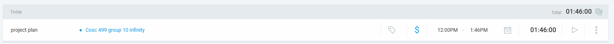

### Current Tasks (Provide sufficient detail)
  * #1: Project Planning

### Progress Update (since 5/21/2025) 
<table>
    <tr>
        <td><strong>TASK/ISSUE # 1</strong>
        </td>
        <td><strong>STATUS</strong>
        </td>
    </tr>
    <tr>
        <!-- Task/Issue # -->
        <td>Task 1
        </td>
        <!-- Status -->
        <td>In Progress
        </td>
    </tr>
</table>

### Cycle Goal Review (Reflection: what went well, what was done, what didn't; Retrospective: how is the process going and why?)
What went well: I met up with my teammates on discord and we finished the Team planning, milestone and distribution section.

### Next Cycle Goals (What are you going to accomplish during the next cycle)
  * Then our next job is to work on the the DFD, use case diagrams, database design, architecture design, and UI design.

## Tuesday 5/27 (5/21~5/27)

### Timesheet
Clockify report
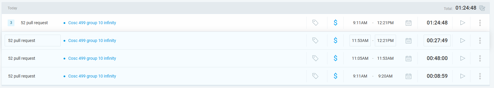

### Current Tasks (Provide sufficient detail)
  * #1: Project Planning
  * #2: Review PR

### Progress Update (since 5/21/2025) 
<table>
    <tr>
        <td><strong>TASK/ISSUE # 1</strong>
        </td>
        <td><strong>STATUS</strong>
        </td>
    </tr>
    <tr>
        <!-- Task/Issue # -->
        <td>Task 1
        </td>
        <!-- Status -->
        <td>In Progress
        </td>
    </tr>
    <tr>
        <!-- Task/Issue # -->
        <td>Task 2
        </td>
        <!-- Status -->
        <td>Completed
        </td>
    </tr>
</table>

### Cycle Goal Review (Reflection: what went well, what was done, what didn't; Retrospective: how is the process going and why?)
What went well: I met up with my teammates after the TA-meeting today. we discussed about the project well. we divided the roles for the project planning. I will be in charge of the Use Cases.

I also took a look at Alex's PR concerning the database setup. It looked nice. It was an important PR for setting things up.
I made sure the database is working on docker. I also got it working on a database manager, Datagrip.

### Next Cycle Goals (What are you going to accomplish during the next cycle)
  * My next job is to work on Use cases, which will start tommorrow. I meet with Aakash at 2 PM.

## Wednesday 5/28 (5/28~6/6)

### Timesheet
Clockify report

### Current Tasks (Provide sufficient detail)
  * #1: Project Design

### Progress Update (since 5/21/2025) 
<table>
    <tr>
        <td><strong>TASK/ISSUE # 1</strong>
        </td>
        <td><strong>STATUS</strong>
        </td>
    </tr>
    <tr>
        <!-- Task/Issue # -->
        <td>Task 1
        </td>
        <!-- Status -->
        <td>In Progress
        </td>
    </tr>
</table>

### Cycle Goal Review (Reflection: what went well, what was done, what didn't; Retrospective: how is the process going and why?)
What went well: I met up with Aakash. We worked well on the Use Case Diagrams. 
The workload was too much for one day, so we decided to work on Use Case Diagrams again tommorrow 2PM.

What didn't work well: Everything worked fine.

Retrospective: The work is going well. The Diagram is very messy and need proofreading. The User Case Description has just gotten started.

### Next Cycle Goals (What are you going to accomplish during the next cycle)
  * Next Cycle, I will be working on the actual code. Probably will be working on login, logout and TA-application.

## Thursday 5/29 (5/28~6/6)

### Timesheet
Clockify report
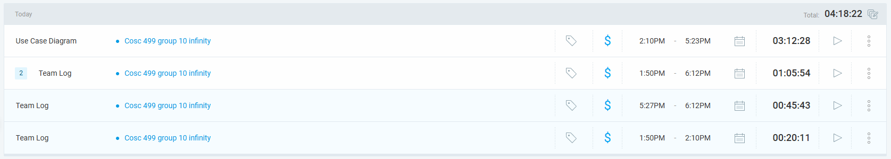

### Current Tasks (Provide sufficient detail)
  * #1: Project Design (Use Case Diagram)

### Progress Update (since 5/21/2025) 
<table>
    <tr>
        <td><strong>TASK/ISSUE # 1</strong>
        </td>
        <td><strong>STATUS</strong>
        </td>
    </tr>
    <tr>
        <!-- Task/Issue # -->
        <td>Task 1
        </td>
        <!-- Status -->
        <td>In Progress
        </td>
    </tr>
</table>

### Cycle Goal Review (Reflection: what went well, what was done, what didn't; Retrospective: how is the process going and why?)
What went well: I met up with Aakash at around 2:10 and we worked on the Use Case Diagrams even further. We filled out the descriptions for each use case. Next time we meet, we have to finish numbering them and reviewing their correctness. We made the diagram look a little more organized.

What didn't go so well: The numbering didn't go so well. It was difficult to the number the Use cases.

Retrospective: The process is going smoothly. We are almost done.

### Next Cycle Goals (What are you going to accomplish during the next cycle)
  * Next Cycle, I will be working on the actual code. Probably will be working on login, logout, register and TA-application. I will partner with one or two other people to do one of the required features for that week.

## Friday 5/30 (5/28~6/6)

### Timesheet
Clockify report
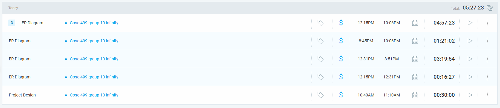

### Current Tasks (Provide sufficient detail)
  * #1: Project Design (Use Case Diagram)
  * #2: Project Design (ER Diagram)

### Progress Update (since 5/21/2025) 
<table>
    <tr>
        <td><strong>TASK/ISSUE # 1</strong>
        </td>
        <td><strong>STATUS</strong>
        </td>
    </tr>
    <tr>
        <!-- Task/Issue # -->
        <td>Task 1
        </td>
        <!-- Status -->
        <td>In Progress
        </td>
    </tr>
     <tr>
        <!-- Task/Issue # -->
        <td>Task 2
        </td>
        <!-- Status -->
        <td>In Review
        </td>
    </tr>
</table>

### Cycle Goal Review (Reflection: what went well, what was done, what didn't; Retrospective: how is the process going and why?)
What went well: I worked on the ER diagram based off of what Alex had done. I think I completed it, but of course it may have some mistakes and it requires review. Doing this really refreshed my memory of what I learned from COSC 304. I exerted a lot of mental energy doing this. I picked up the task of doing the ER diagram even though I was not assigned to do it. I did tell Alex beforehand, and Alex seems to like the my result, though he hasn't said anything explicit about it yet. I knew the workload was too much for Alex, and that is why I picked up this task.

Next time, I will finish up doing the Use Case Diagram. I merely have to fix the numbering and review the accuracy of the diagram and descriptions.

I also worked with Allen to review the DFD diagram. I thought there were some problems with it. I also learned a lot from talking to him. I think we might have completed the DFD diagram.

### Next Cycle Goals (What are you going to accomplish during the next cycle)
  * Next Cycle, I will be working on the actual code. Probably will be working on login, logout, register and TA-application. I will partner with one or two other people to do one of the required features for that week.

## Saturday 5/31 (5/28~6/6)

### Timesheet
Clockify report

### Current Tasks (Provide sufficient detail)
  * #1: Project Design (Use Case Diagram)
  * #2: Project Design (ER Diagram)

### Progress Update (since 5/21/2025) 
<table>
    <tr>
        <td><strong>TASK/ISSUE # 1</strong>
        </td>
        <td><strong>STATUS</strong>
        </td>
    </tr>
    <tr>
        <!-- Task/Issue # -->
        <td>Task 1
        </td>
        <!-- Status -->
        <td>In Review
        </td>
    </tr>
     <tr>
        <!-- Task/Issue # -->
        <td>Task 2
        </td>
        <!-- Status -->
        <td>In Review
        </td>
    </tr>
</table>

### Cycle Goal Review (Reflection: what went well, what was done, what didn't; Retrospective: how is the process going and why?)
I worked on the Use case diagram and descriptions. I had to proofread the descriptions and make sure everything was a little bit more realistic and accurate than before. I tried to make it as true to the project and efficient as possible.

I also spent a lot of time communicating with my teammates and helping them with their tasks. I reviewed Eddy's work and I talked to Mandeep about the interface. I also gave some advice on how to carry on their task, because I felt like the decisions I made while creating the use cases would greatly impact the wireframes.

### Next Cycle Goals (What are you going to accomplish during the next cycle)
  * Next Cycle, I will be working on the actual code. Probably will be working on login, logout, register and TA-application. I will partner with one or two other people to do one of the required features for that week.

## Monday 6/02 (5/28~6/6)

### Timesheet
Clockify report

### Current Tasks (Provide sufficient detail)
  * #1: Project Design (Use Case Diagram)
  * #2: Project Design (ER Diagram)

### Progress Update (since 5/21/2025) 
<table>
    <tr>
        <td><strong>TASK/ISSUE # 1</strong>
        </td>
        <td><strong>STATUS</strong>
        </td>
    </tr>
    <tr>
        <!-- Task/Issue # -->
        <td>Task 1
        </td>
        <!-- Status -->
        <td>In Review
        </td>
    </tr>
     <tr>
        <!-- Task/Issue # -->
        <td>Task 2
        </td>
        <!-- Status -->
        <td>In Review
        </td>
    </tr>
</table>

### Cycle Goal Review (Reflection: what went well, what was done, what didn't; Retrospective: how is the process going and why?)
Scott uploaded a questionnaire that the coordinator gives to a TA. I had to spend a lot of time editing the use case diagram and ER diagram and the project plan to make it work with the new questionnaire feature.

What didn't work: the new additions to the ER diagram was met with a little bit of confusion. But it turned out okay. The solution Alex with the intermediary tables was very intuitive.

The process is going well, but I do not see as much work from others as I would expect.

### Next Cycle Goals (What are you going to accomplish during the next cycle)
  * Next Cycle, I will be working on the actual code. Probably will be working on login, logout, register and TA-application. I will partner with one or two other people to do one of the required features for that week.

## Tuesday 6/03 (5/28~6/6)

### Timesheet
Clockify report

### Current Tasks (Provide sufficient detail)
  * #1: TA profile frontend

### Progress Update (since 5/21/2025) 
<table>
    <tr>
        <td><strong>TASK/ISSUE # 1</strong>
        </td>
        <td><strong>STATUS</strong>
        </td>
    </tr>
    <tr>
        <!-- Task/Issue # -->
        <td>Task 1
        </td>
        <!-- Status -->
        <td>In Progress
        </td>
    </tr>
</table>

### Cycle Goal Review (Reflection: what went well, what was done, what didn't; Retrospective: how is the process going and why?)
Today I completed the video recording that is due Friday. I wrote the script in google doc and I recorded it. Aakash will be compiling them into one video.
I also made some modifications to the Use Case Diagrams and ER diagrams. We decided to implement ProfileQuestions and ProfileAnswers instead of just Question and Answer.
The rest of the team was also done their part so we compiled it into one document and pushed it to develop.
Starting tommorrow, I will start on the coding for the TA profile frontend. Aakash will be doing the backend with me.

### Next Cycle Goals (What are you going to accomplish during the next cycle)
  * Next Cycle, our team will implement the instructor features and the TA applications. We have not divided our roles yet. 

## Wednesday 6/04 (5/28~6/6)

### Timesheet
Clockify report
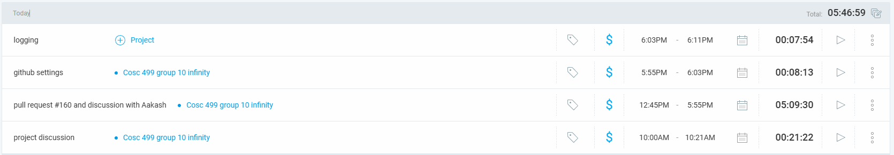

### Current Tasks (Provide sufficient detail)
  * #1: TA profile frontend
  * #2: Pull Request #160

### Progress Update (since 5/21/2025) 
<table>
    <tr>
        <td><strong>TASK/ISSUE # 1</strong>
        </td>
        <td><strong>STATUS</strong>
        </td>
    </tr>
    <tr>
        <!-- Task/Issue # -->
        <td>Task 1
        </td>
        <!-- Status -->
        <td>In Progress
        </td>
    </tr>
    <tr>
        <!-- Task/Issue # -->
        <td>Task 2
        </td>
        <!-- Status -->
        <td>Complete
        </td>
    </tr>
</table>

### Cycle Goal Review (Reflection: what went well, what was done, what didn't; Retrospective: how is the process going and why?)
Concerning Task 1, I discussed with Aakash what components to put in the profile page.

I spent most of my time concerning task 2. The pull request Alex put up was a very important one. It was a pull request from which you learn all the fundamnetals about Spring Boot. I took a long time being careful to understand how everything works - Models, services, controllers, Feign, Eureka, the pom.xml, the Dockerfile, Junit, Mockito, and others. Today was a good lesson on the Spring Boot. Thanks to Alex, who did all the work from listening to youtube video tutorials, I was able to ask chatGPT the many questions I had about his code to learn what he did.

Tommorrow, I will work on the frontend for the TA profile page.

This morning, we also discussed about the video, and Aakash submitted the video.

### Next Cycle Goals (What are you going to accomplish during the next cycle)
  * Next Cycle, our team will implement the instructor features and the TA applications. We have not divided our roles yet. 

## Thursday 6/05 (5/28~6/6)

### Timesheet
Clockify report
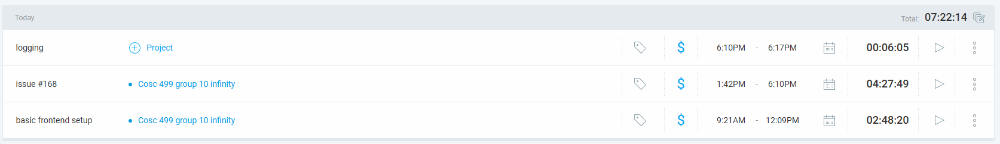

### Current Tasks (Provide sufficient detail)
  * #1: TA profile frontend 
  * #2: issue #168 and #171

### Progress Update (since 5/21/2025) 
<table>
    <tr>
        <td><strong>TASK/ISSUE # 1</strong>
        </td>
        <td><strong>STATUS</strong>
        </td>
    </tr>
    <tr>
        <!-- Task/Issue # -->
        <td>Task 1
        </td>
        <!-- Status -->
        <td>In progress
        </td>
    </tr>
    <tr>
        <!-- Task/Issue # -->
        <td>Task 2
        </td>
        <!-- Status -->
        <td>Complete
        </td>
    </tr>
</table>

### Cycle Goal Review (Reflection: what went well, what was done, what didn't; Retrospective: how is the process going and why?)
Task 2: issue #171 I got done the setup for tailwind, and react router dom. my teammates fortunately approve my PR quickly and is now in the develop branch. I encountered some tech problems when installing tailwind, so it took longer than I expected. It could have been my personal mistake for why it took so long to finish that. I also introduced the frontend scaffolding in our project.
issue #168: I got done some layout, css and the React for the TAprofile. It is not complete. I did the student details and course details. I need to work more on the course details. The stuff I have left to do is in the comments of TaProfile.tsx. I have a lot of work to do on that page.
The process is going well, but it is taking a lot more time than I expected to get what I got done today. Since we can use chatGPT, I expected to do be finished with more early, but it took much longer than I expected.
Tommorrow, I should continue working on the course details.

### Next Cycle Goals (What are you going to accomplish during the next cycle)
  * Next Cycle, our team will implement the instructor features and the TA applications. We have not divided our roles yet. 

## Friday 6/06 (5/28~6/6)

### Timesheet
Clockify report
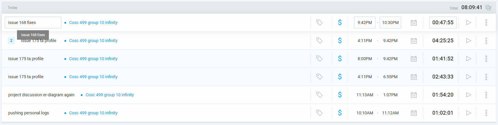

### Current Tasks (Provide sufficient detail)
  * #1: TA profile frontend 
  * #2: issue #168
  * #3: issue #175

### Progress Update (since 5/21/2025) 
<table>
    <tr>
        <td><strong>TASK/ISSUE # 1</strong>
        </td>
        <td><strong>STATUS</strong>
        </td>
    </tr>
    <tr>
        <!-- Task/Issue # -->
        <td>Task 1
        </td>
        <!-- Status -->
        <td>In progress
        </td>
    </tr>
    <tr>
        <!-- Task/Issue # -->
        <td>Task 2
        </td>
        <!-- Status -->
        <td>In review
        </td>
    </tr>
    <tr>
        <!-- Task/Issue # -->
        <td>Task 3
        </td>
        <!-- Status -->
        <td>In Progress
        </td>
    </tr>
</table>

### Cycle Goal Review (Reflection: what went well, what was done, what didn't; Retrospective: how is the process going and why?)
It was quite difficult to do test-first coding. 
The code that I wrote today was naturally not something that required testing first.
What I wrote was mock- API calls and a container of the TAprofilePage. Then I tried to write first the integration test of the TAprofilePage and the API calls. It's very simple, and while it did work and pass, I'm not sure if I did it correctly.
I basically structured everything today. Made lots of interfaces, mock objects, and api calls which still use mock objects as a return value.
That was issue number 175.
Issue number 168 was requested some changes. I made some components reusable.
Today, we also had a meeting with Scott and each other. Made some more edits to the ER diagram.

### Next Cycle Goals (What are you going to accomplish during the next cycle)
  * Next Cycle, our team will implement the instructor features and the TA applications. We have not divided our roles yet. 

## Saturday 6/07 (6/7~6/13)

### Timesheet
Clockify report
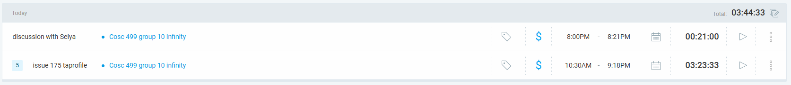

### Current Tasks (Provide sufficient detail)
  * #1: TA profile frontend 
  * #2: issue #175

### Progress Update (since 5/21/2025) 
<table>
    <tr>
        <td><strong>TASK/ISSUE # 1</strong>
        </td>
        <td><strong>STATUS</strong>
        </td>
    </tr>
    <tr>
        <!-- Task/Issue # -->
        <td>Task 1
        </td>
        <!-- Status -->
        <td>In progress
        </td>
    </tr>
    <tr>
        <!-- Task/Issue # -->
        <td>Task 2
        </td>
        <!-- Status -->
        <td>In review
        </td>
    </tr>
</table>

### Cycle Goal Review (Reflection: what went well, what was done, what didn't; Retrospective: how is the process going and why?)
Today, I worked on the issue 175. It was an issue about the API calls. I set up all the template API calls. they don't actually connect to the backend yet, but I restructured them and made everything organized. I made a lot of interfaces too.
I'm hoping the others will look at my work as an examplar to write the code for their side of the business.
One thing that didn't go well was that at one point the website would keep giving me a blank white page. The console log through DevTools was giving me the reason why. It took me a while to figure that out - GPT O3 engine helped me think about taking a look at that, and it got fixed. It was because in one of my files, I was importing something that didn't exist ( the name had changed)

The process is going well, But I'm waiting for the others to show some of their work.

I also talked with Seiya today to tell him how I think he should work on his branch after the changes I made today.

### Next Cycle Goals (What are you going to accomplish during the next cycle)
  * Next Cycle, our team will implement the instructor features and the TA applications. We have not divided our roles yet. 

## Monday 6/09 (6/7~6/13)

### Timesheet
Clockify report
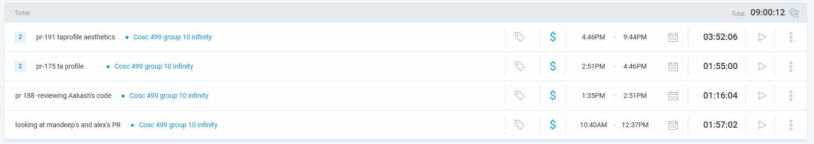

### Current Tasks (Provide sufficient detail)
  * #1: TA profile frontend 
  * #2: issue #191
  * #3: review other's PRs

### Progress Update (since 5/21/2025) 
<table>
    <tr>
        <td><strong>TASK/ISSUE # 1</strong>
        </td>
        <td><strong>STATUS</strong>
        </td>
    </tr>
    <tr>
        <!-- Task/Issue # -->
        <td>Task 1
        </td>
        <!-- Status -->
        <td>In progress
        </td>
    </tr>
    <tr>
        <!-- Task/Issue # -->
        <td>Task 2
        </td>
        <!-- Status -->
        <td>In review
        </td>
    </tr>
    <tr>
        <!-- Task/Issue # -->
        <td>Task 3
        </td>
        <!-- Status -->
        <td>In review
        </td>
    </tr>
</table>

### Cycle Goal Review (Reflection: what went well, what was done, what didn't; Retrospective: how is the process going and why?)
Today I spent about 3 hours reviewing other's PRs.
I spent the rest of the time working on my PR-191. It was mostly to improve the aesthetics of the TA profile page.
It wasnt necessary, but I made it work on smaller screens as well.
I spent a long time on the css and layout of the html and etc.

### Next Cycle Goals (What are you going to accomplish during the next cycle)
  * Next Cycle, our team will implement the instructor features and the TA applications. We have not divided our roles yet. 

## Tuesday 6/10 (6/7~6/13)

### Timesheet
Clockify report
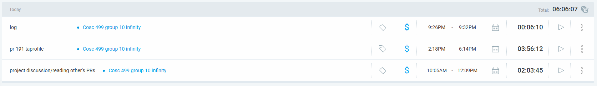

### Current Tasks (Provide sufficient detail)
  * #1: TA profile frontend 
  * #2: issue #191
  * #3: project discussion
  * #4: issue #204

### Progress Update (since 5/21/2025) 
<table>
    <tr>
        <td><strong>TASK/ISSUE # 1</strong>
        </td>
        <td><strong>STATUS</strong>
        </td>
    </tr>
    <tr>
        <!-- Task/Issue # -->
        <td>Task 1
        </td>
        <!-- Status -->
        <td>In progress
        </td>
    </tr>
    <tr>
        <!-- Task/Issue # -->
        <td>Task 2
        </td>
        <!-- Status -->
        <td>In review
        </td>
    </tr>
    <tr>
        <!-- Task/Issue # -->
        <td>Task 3
        </td>
        <!-- Status -->
        <td>Complete
        </td>
    </tr>
    <tr>
        <!-- Task/Issue # -->
        <td>Task 3
        </td>
        <!-- Status -->
        <td>In progress
        </td>
    </tr>
</table>

### Cycle Goal Review (Reflection: what went well, what was done, what didn't; Retrospective: how is the process going and why?)
Today I spent over 3 hours just discussing with team mates. 2 hours we met all together and we discussed about the section browsing page mainly. 1 hour I had to talk to Aakash about the response he was sending me back.
What didn't go well was that Aakash wasn't willing to believe that the backend should be sending the frontend the response I was asking him to send. Fortunately, Alex concurred with me and Aakash seems to be on it now.
So I could only spend like maximum 3 hours on actual development today, and I felt like I didn't make much progress in terms of coding.
Tommorrow I hope to finish the profilequestions frontend, make the section containers consider overflow. And perhaps consider calling endpoints now, if it's possible.

### Next Cycle Goals (What are you going to accomplish during the next cycle)
  * Next Cycle, our team will implement the instructor features and the TA applications. We have not divided our roles yet. 

## Wednesday 6/11 (6/7~6/13)

### Timesheet
Clockify report
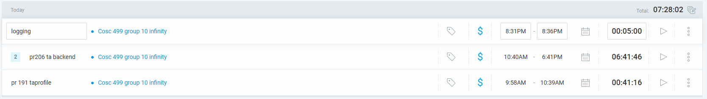

### Current Tasks (Provide sufficient detail)
  * #1: TA profile frontend 
  * #2: issue #191 frontend aesthetics
  * #3: issue #206 backend getStudentbyId
  * #4: issue #204 frontend comparer and profilequestions

### Progress Update (since 5/21/2025) 
<table>
    <tr>
        <td><strong>TASK/ISSUE # 1</strong>
        </td>
        <td><strong>STATUS</strong>
        </td>
    </tr>
    <tr>
        <!-- Task/Issue # -->
        <td>Task 1
        </td>
        <!-- Status -->
        <td>In progress
        </td>
    </tr>
    <tr>
        <!-- Task/Issue # -->
        <td>Task 2
        </td>
        <!-- Status -->
        <td>In review
        </td>
    </tr>
    <tr>
        <!-- Task/Issue # -->
        <td>Task 3
        </td>
        <!-- Status -->
        <td>In review
        </td>
    </tr>
    <tr>
        <!-- Task/Issue # -->
        <td>Task 4
        </td>
        <!-- Status -->
        <td>In progress
        </td>
    </tr>
</table>

### Cycle Goal Review (Reflection: what went well, what was done, what didn't; Retrospective: how is the process going and why?)
Today I fixed some minor problems in issue #191 that had to do with the text-ellipsis.
Then I worked on  the backend concerning findbyStudentId. I made sure to include tests.
Then I worked on the frontend. I decided to create a small app that compares the course needs with the courses the ta takes/has taken/allocation history.
Tommorrow, I will focus on refactoring in issue 204. and hopefully integrate backend to the frontend using api endpoints to some extent.

### Next Cycle Goals (What are you going to accomplish during the next cycle)
  * Next Cycle, our team will implement the instructor features and the TA applications. We have not divided our roles yet. 

## Thursday 6/12 (6/7~6/13)

### Timesheet
Clockify report
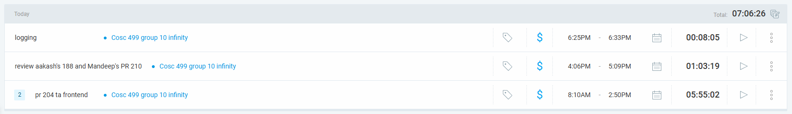

### Current Tasks (Provide sufficient detail)
  * #1: TA profile frontend 
  * #2: issue #204 frontend comparer and profilequestions
  * #3: review #210 and #188

### Progress Update (since 5/21/2025) 
<table>
    <tr>
        <td><strong>TASK/ISSUE # 1</strong>
        </td>
        <td><strong>STATUS</strong>
        </td>
    </tr>
    <tr>
        <!-- Task/Issue # -->
        <td>Task 1
        </td>
        <!-- Status -->
        <td>In progress
        </td>
    </tr>
    <tr>
        <!-- Task/Issue # -->
        <td>Task 2
        </td>
        <!-- Status -->
        <td>In review
        </td>
    </tr>
    <tr>
        <!-- Task/Issue # -->
        <td>Task 3
        </td>
        <!-- Status -->
        <td>Complete
        </td>
    </tr>
</table>

### Cycle Goal Review (Reflection: what went well, what was done, what didn't; Retrospective: how is the process going and why?)
#204 is complete. I completed the frontend side of the comparer. The comparer can now consider the course needs and then display what courses are missing for the ta. I fixed the max-height of sectionColumns. I spent over 3 hours just refactoring. I created GenericAPIcontainer which now takes in a fetch function and a JSX element and returns the JSX element with the fetch function's data inside of it. The profile questions section is now complete. You can now see the list of questions and answers. The tests for all the components are complete.
#188 was Aakash's PR. I checked the result of the endpoint I was looking forward to which was the endpoint that gives me the data of the student's questions. it worked and I approved it after checking other stuff.
#210 was Mandeep's PR. I noticed that he has now made it so that the JWTs are stored in the localStorage. I expect him to implement the authentication for the rest of the pages using that JWT now.
Tommorrow, I will work a new PR that creates the Course backend. I will try to make Aakash's endpoint work with the frontend. I will be discussing with teammates tommorrow. I need to add more filters to the searchbar in Comparer.

### Next Cycle Goals (What are you going to accomplish during the next cycle)
  * Next Cycle, our team will implement the instructor features and the TA applications. We have not divided our roles yet. 

## Friday 6/13 (6/13~6/17)

### Timesheet
Clockify report
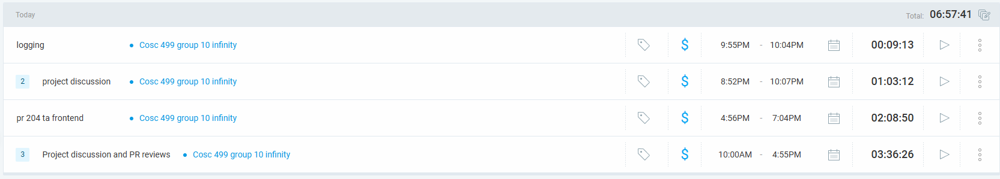

### Current Tasks (Provide sufficient detail)
  * #1: TA profile frontend 
  * #2: issue [#204](https://github.com/UBCO-COSC499-S2025/team-10-capstone-infinity/issues/204) frontend comparer and profilequestions
  * #3: Reviewed other's PRs
  * #4: instructor profile frontend

### Progress Update (since 5/21/2025) 
<table>
    <tr>
        <td><strong>TASK/ISSUE # 1</strong>
        </td>
        <td><strong>STATUS</strong>
        </td>
    </tr>
    <tr>
        <!-- Task/Issue # -->
        <td>Task 1
        </td>
        <!-- Status -->
        <td>In progress
        </td>
    </tr>
    <tr>
        <!-- Task/Issue # -->
        <td>Task 2
        </td>
        <!-- Status -->
        <td>In review
        </td>
    </tr>
    <tr>
        <!-- Task/Issue # -->
        <td>Task 3
        </td>
        <!-- Status -->
        <td>Complete
        </td>
    </tr>
    <tr>
        <!-- Task/Issue # -->
        <td>Task 4
        </td>
        <!-- Status -->
        <td>In progress
        </td>
    </tr>
</table>

### Cycle Goal Review (Reflection: what went well, what was done, what didn't; Retrospective: how is the process going and why?)
Today was mostly about project discussion. I worked a little bit more on [UBCO-COSC499-S2025/team-10-capstone-infinity#204](https://github.com/UBCO-COSC499-S2025/team-10-capstone-infinity/issues/204) because the previous PR issue #191 is still not merged to develop. I created the Allocations table and created a test for QuestionAnswers. I will work on the instructor profile tommorrow. 

### Next Cycle Goals (What are you going to accomplish during the next cycle)
  * Next Cycle, I wiil continue to work on the instructor profile. The instructor profile will not be done in this cycle. It will be done until the cycle after this one. I will probably be working on the Comparer. But because the Comparer is already done in the ta-profile, I believe I will have time to work on some other part of the project as well. I think I may consider looking at Seiya's code and refactoring it and integrating it more to our project if there's anything offlandish.

## Saturday 6/14 (6/13~6/17)

### Timesheet
Clockify report
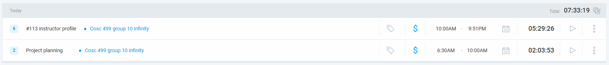

### Current Tasks (Provide sufficient detail)
  * #1: instructor profile frontend 
  * #2: issue [UBCO-COSC499-S2025/team-10-capstone-infinity#113](https://github.com/UBCO-COSC499-S2025/team-10-capstone-infinity/issues/113)

### Progress Update (since 5/21/2025) 
<table>
    <tr>
        <td><strong>TASK/ISSUE # 1</strong>
        </td>
        <td><strong>STATUS</strong>
        </td>
    </tr>
    <tr>
        <!-- Task/Issue # -->
        <td>Task 1
        </td>
        <!-- Status -->
        <td>In progress
        </td>
    </tr>
    <tr>
        <!-- Task/Issue # -->
        <td>Task 2
        </td>
        <!-- Status -->
        <td>In progress
        </td>
    </tr>
</table>

### Cycle Goal Review (Reflection: what went well, what was done, what didn't; Retrospective: how is the process going and why?)
Today I created the instructor profile. A lot of it was copy and paste from the Taprofile. Of course there were modifications. 
Therefore, I was able to get most of it done today, including the tests.
It's unforunate my teammates are not reviewing my [UBCO-COSC499-S2025/team-10-capstone-infinity#191](https://github.com/UBCO-COSC499-S2025/team-10-capstone-infinity/issues/191) PR. It has been over 4 days since I put it up. A huge refactor concerning the code in that issue happens in #204.
I've been a litle bit setback and less motivated due to a clash with a teammate, whom I won't name. It was my fault, as I wasn't careful with my words. I intended differently. He also isn't the kind of person to quickly say how he feels about things.
Next time I work on the project, I will try to integrate endpoints I can integrate, create integration test for intstructor Profile page, add a filter button to the searchbar in TAprofile, and review others work.

### Next Cycle Goals (What are you going to accomplish during the next cycle)
  * Next Cycle, I wiil continue to work on the instructor profile. The instructor profile will not be done in this cycle. It will be done until the cycle after this one. I will probably be working on the Comparer. But because the Comparer is already done in the ta-profile, I believe I will have time to work on some other part of the project as well. I think I may consider looking at Seiya's code and refactoring it and integrating it more to our project if there's anything offlandish.

## Monday 6/16 (6/13~6/17)

### Timesheet
Clockify report
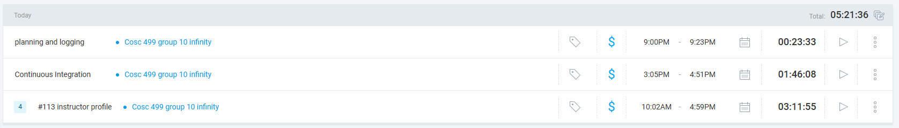

### Current Tasks (Provide sufficient detail)
  * #1: instructor profile frontend 
  * #2: issue [UBCO-COSC499-S2025/team-10-capstone-infinity#113](https://github.com/UBCO-COSC499-S2025/team-10-capstone-infinity/issues/113)
  * #3: [UBCO-COSC499-S2025/team-10-capstone-infinity#223](https://github.com/UBCO-COSC499-S2025/team-10-capstone-infinity/issues/223)

### Progress Update (since 5/21/2025) 
<table>
    <tr>
        <td><strong>TASK/ISSUE # 1</strong>
        </td>
        <td><strong>STATUS</strong>
        </td>
    </tr>
    <tr>
        <!-- Task/Issue # -->
        <td>Task 1
        </td>
        <!-- Status -->
        <td>In review
        </td>
    </tr>
    <tr>
        <!-- Task/Issue # -->
        <td>Task 2
        </td>
        <!-- Status -->
        <td>In review
        </td>
    </tr>
     <tr>
        <!-- Task/Issue # -->
        <td>Task 3
        </td>
        <!-- Status -->
        <td>In review
        </td>
    </tr>
</table>

### Cycle Goal Review (Reflection: what went well, what was done, what didn't; Retrospective: how is the process going and why?)
Today, I further cleaned up the aesthetics of the instructor page and comparer. I heeded the feedback of my teammate and made some user interfaces more approachable for the comparer in both the instructor page and the ta page.
I worked on the continuous integration of our project. I made sure that github runs the tests commands in the same way we do locally.
It was a smooth process, and I faced no difficulties.

### Next Cycle Goals (What are you going to accomplish during the next cycle)
  * Next Cycle, I wiil continue to work on the list I wrote below.
- show orange when allocated/numberofhours is greater than 1 (show overbooking)
- student can update profile with previous experience
- need student to show skills/qualitifcations. (small description)
- preferences have to be ranked. profile must show course preferences.
- Create ta-profile question creating page and page where student answers.
- sectionCard has to show grade and classAvg for students.

## Tuesday 6/17 (6/13~6/17)

### Timesheet
Clockify report
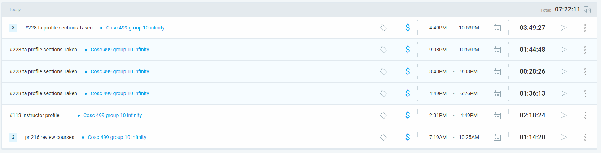

### Current Tasks (Provide sufficient detail)
  * #1: instructor profile frontend 
  * #2: issue [UBCO-COSC499-S2025/team-10-capstone-infinity#113](https://github.com/UBCO-COSC499-S2025/team-10-capstone-infinity/issues/113)
  * #3: [UBCO-COSC499-S2025/team-10-capstone-infinity#228](https://github.com/UBCO-COSC499-S2025/team-10-capstone-infinity/issues/228)

### Progress Update (since 5/21/2025) 
<table>
    <tr>
        <td><strong>TASK/ISSUE # 1</strong>
        </td>
        <td><strong>STATUS</strong>
        </td>
    </tr>
    <tr>
        <!-- Task/Issue # -->
        <td>Task 1
        </td>
        <!-- Status -->
        <td>In review
        </td>
    </tr>
    <tr>
        <!-- Task/Issue # -->
        <td>Task 2
        </td>
        <!-- Status -->
        <td>In review
        </td>
    </tr>
     <tr>
        <!-- Task/Issue # -->
        <td>Task 3
        </td>
        <!-- Status -->
        <td>In Progress
        </td>
    </tr>
</table>

### Cycle Goal Review (Reflection: what went well, what was done, what didn't; Retrospective: how is the process going and why?)
Today I focused on revamping the TaProfile and InstructorPage design. It was easy to do since I coded the code such that restructuring and refactoring is easy. I added tabs to each profile so that the components are better organized and navigation is still easy.
I reviewed PR #233, which is Mandeep's PR.
Today we had a mini-presentation, and this affected my teammates opinion of my work. But I hope I have fixed it to their satisfaction, and I now agree it looks better this way.
The integration with the backend is still waiting.

### Next Cycle Goals (What are you going to accomplish during the next cycle)
  * Next Cycle, I wiil continue to work on the list I wrote below.
- student can update profile with previous experience
- need student to show skills/qualitifcations. (small description)
- preferences have to be ranked. profile must show course preferences.
- Create ta-profile question creating page and page where student answers.
- sectionCard has to show grade and classAvg for students.

## Wednesday 6/18 (6/18~6/20)

### Timesheet
Clockify report
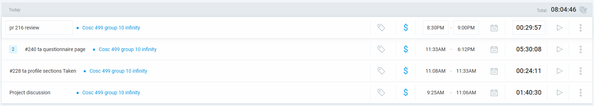

### Current Tasks (Provide sufficient detail)
  * #1: Profile Questions Answers
  * #2: [UBCO-COSC499-S2025/team-10-capstone-infinity#240](https://github.com/UBCO-COSC499-S2025/team-10-capstone-infinity/issues/240)

### Progress Update (since 5/21/2025) 
<table>
    <tr>
        <td><strong>TASK/ISSUE # 1</strong>
        </td>
        <td><strong>STATUS</strong>
        </td>
    </tr>
    <tr>
        <!-- Task/Issue # -->
        <td>Task 1
        </td>
        <!-- Status -->
        <td>In progress
        </td>
    </tr>
    <tr>
        <!-- Task/Issue # -->
        <td>Task 2
        </td>
        <!-- Status -->
        <td>In Progress
        </td>
    </tr>

</table>

### Cycle Goal Review (Reflection: what went well, what was done, what didn't; Retrospective: how is the process going and why?)
This morning, we discussed about the project. We decided to create a new table called Qualification to show the instructors needs for lab skill and the student's personal skills.
Therefore, it followed that I would carry out doing the ProfileQuestionAnswers as planned. It will be for a "general" purpose and not for any other purpose such as instructor needs.
I created the Student's and the coordinator's perspective of the questions and answers. 
Tommorrow I will integrate the backend to it, because this happens to be one of the few features that actually has a backend so far.

### Next Cycle Goals (What are you going to accomplish during the next cycle)
  * Next Cycle, I wiil continue to work on the list I wrote below.
- CSV- upload and export of project
- visual calendar in ta profile. Maybe in instructor profile too. This will have to be discussed first with teammates because we have not imported the library concerning this yet.
- any other feature sets we have not completed.

## Thursday 6/19 (6/18~6/20)

### Timesheet
Clockify report
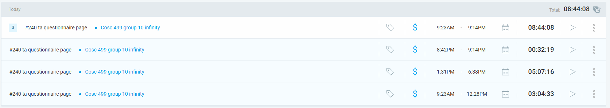

### Current Tasks (Provide sufficient detail)
  * #1: Profile Questions Answers
  * #2: [UBCO-COSC499-S2025/team-10-capstone-infinity#240](https://github.com/UBCO-COSC499-S2025/team-10-capstone-infinity/issues/240)

### Progress Update (since 5/21/2025) 
<table>
    <tr>
        <td><strong>TASK/ISSUE # 1</strong>
        </td>
        <td><strong>STATUS</strong>
        </td>
    </tr>
    <tr>
        <!-- Task/Issue # -->
        <td>Task 1
        </td>
        <!-- Status -->
        <td>In progress
        </td>
    </tr>
    <tr>
        <!-- Task/Issue # -->
        <td>Task 2
        </td>
        <!-- Status -->
        <td>In Progress
        </td>
    </tr>

</table>

### Cycle Goal Review (Reflection: what went well, what was done, what didn't; Retrospective: how is the process going and why?)
Today I integrated the backend with the frontend for the ProfileQuestionsAnswers. Anything related to the Profile Questions and Answers should work now in terms of both the backend and frontend.
I heavily modified the backend espescially concerning the FREE_TEXT situations and the update situations.
It is possibly the first feature in the system that is fully integrated with the backend. The tests also pass.
The backend integration for ProfileQuestions was particularly tricky because there were so many edge cases with Student updates and coordinator updates. the FREE_TEXT code in the backend wasn't quite as desired as well. It constantly made new rows in the backend for ProfileAnswers when it's better to have one placeholder row which the User would refer to when saving their answers in the intermediate table. Thus, there are some complicated situations.
Tommorrow, I will do some refactoring and possibly delete some redundant code. There are two PRs and I will review at least one of them.
If that all gets done within 4 hours or 5, I may perhaps start on a task for the next cycle.

### Next Cycle Goals (What are you going to accomplish during the next cycle)
  * Next Cycle, I wiil continue to work on the list I wrote below.
- CSV- upload and export of project
- visual calendar in ta profile. Maybe in instructor profile too. This will have to be discussed first with teammates because we have not imported the library concerning this yet.
- any other feature sets we have not completed.
- qualifications page

## Friday 6/20 (6/18~6/20)

### Timesheet
Clockify report
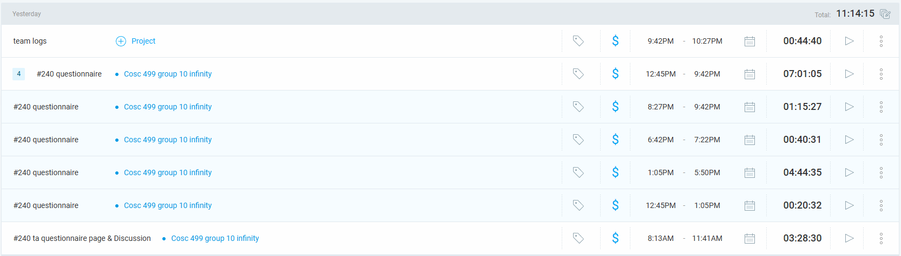

### Current Tasks (Provide sufficient detail)
  * #1: Profile Questions Answers
  * #2: [UBCO-COSC499-S2025/team-10-capstone-infinity#240](https://github.com/UBCO-COSC499-S2025/team-10-capstone-infinity/issues/240)

### Progress Update (since 5/21/2025) 
<table>
    <tr>
        <td><strong>TASK/ISSUE # 1</strong>
        </td>
        <td><strong>STATUS</strong>
        </td>
    </tr>
    <tr>
        <!-- Task/Issue # -->
        <td>Task 1
        </td>
        <!-- Status -->
        <td>Complete
        </td>
    </tr>
    <tr>
        <!-- Task/Issue # -->
        <td>Task 2
        </td>
        <!-- Status -->
        <td>In Review
        </td>
    </tr>

</table>

### Cycle Goal Review (Reflection: what went well, what was done, what didn't; Retrospective: how is the process going and why?)
Today I refactored the ProfileQuestions backend. I had to make sure that the students' answers get dropped when a question gets updated. It was difficult to do.
This made me learn the following when working with someone else in pairs:
- Prepare a request body and response body that is agreed by both the frontend and backend developer.
- consider all the edge cases. Especially in updates and deletes.
I also discussed with all my teammates today and what i will do the next week has been established.

### Next Cycle Goals (What are you going to accomplish during the next cycle)
  * Next Cycle, I wiil continue to work on the list I wrote below.
- User management : search, delete, update, etc.
- qualifications page (instructor's and student's skill labs)

## Saturday 6/21 (6/21~6/24)

### Timesheet
Clockify report
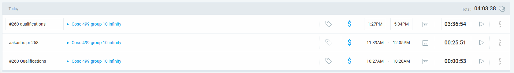

### Current Tasks (Provide sufficient detail)
  * #1: Qualifications page
  * #2: [UBCO-COSC499-S2025/team-10-capstone-infinity#260](https://github.com/UBCO-COSC499-S2025/team-10-capstone-infinity/issues/260)

### Progress Update (since 5/21/2025) 
<table>
    <tr>
        <td><strong>TASK/ISSUE # 1</strong>
        </td>
        <td><strong>STATUS</strong>
        </td>
    </tr>
    <tr>
        <!-- Task/Issue # -->
        <td>Task 1
        </td>
        <!-- Status -->
        <td>In progress
        </td>
    </tr>
    <tr>
        <!-- Task/Issue # -->
        <td>Task 2
        </td>
        <!-- Status -->
        <td>In progress
        </td>
    </tr>

</table>

### Cycle Goal Review (Reflection: what went well, what was done, what didn't; Retrospective: how is the process going and why?)
Today I created the qualifications page for the frontend. A lot of the code was similar to what I had for the profile questions, because it was a feature about inputting or selecting an option and displaying it.
I created the mocks and interfaces. I discussed with allen how the response body and request body will look like, and I hope we covered all the edge cases.

### Next Cycle Goals (What are you going to accomplish during the next cycle)
  * Next Cycle, I wiil continue to work on the list I wrote below.
- User management : search, delete, update, etc.
- qualifications page (instructor's and student's skill labs)

## Monday 6/23 (6/21~6/24)

### Timesheet
Clockify report
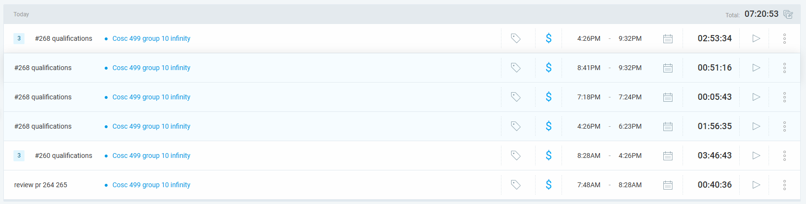

### Current Tasks (Provide sufficient detail)
  * #1: Qualifications page
  * #2: [UBCO-COSC499-S2025/team-10-capstone-infinity#260](https://github.com/UBCO-COSC499-S2025/team-10-capstone-infinity/issues/260)
  * #3: [UBCO-COSC499-S2025/team-10-capstone-infinity#268](https://github.com/UBCO-COSC499-S2025/team-10-capstone-infinity/issues/268)

### Progress Update (since 5/21/2025) 
<table>
    <tr>
        <td><strong>TASK/ISSUE # 1</strong>
        </td>
        <td><strong>STATUS</strong>
        </td>
    </tr>
    <tr>
        <!-- Task/Issue # -->
        <td>Task 1
        </td>
        <!-- Status -->
        <td>In progress
        </td>
    </tr>
    <tr>
        <!-- Task/Issue # -->
        <td>Task 2
        </td>
        <!-- Status -->
        <td>In Review
        </td>
    </tr>
    <tr>
        <!-- Task/Issue # -->
        <td>Task 3
        </td>
        <!-- Status -->
        <td>In Review
        </td>
    </tr>

</table>

### Cycle Goal Review (Reflection: what went well, what was done, what didn't; Retrospective: how is the process going and why?)
Today I completed the instructor perspective of the qualifications page. The integration still has to wait, as Allen is still working on it. 
I discussed with Allen about it and I expect the integration to happen soon.
I started on the frontend for the student's perspective as well, and I might say that I'm done. But it can't go into review until the first branch #260, first gets merged.
So tommorrow, I will try working on integratin some other parts of the project like the ta-profile. I will have to try creating the backend registers for students, and retrieving the data.
I may also try integrating the allocation history. if there is a mapping for courses taken, I will try doing that too.
I may make a backend work for instructor details as well.

### Next Cycle Goals (What are you going to accomplish during the next cycle)
  * Next Cycle, I wiil continue to work on the list I wrote below.
- User management : search, delete, update, etc.
- qualifications page (instructor's and student's skill labs) integration

## Tuesday 6/24 (6/21~6/24)

### Timesheet
Clockify report
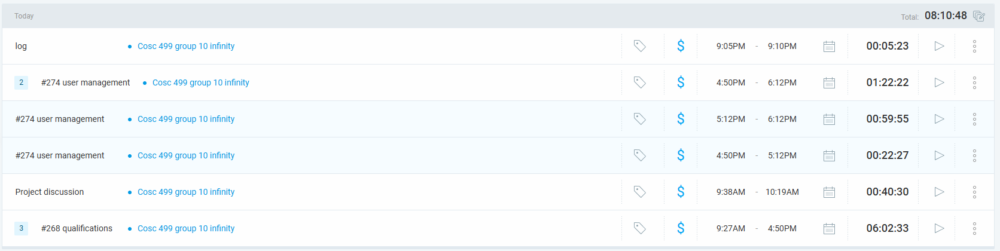

### Current Tasks (Provide sufficient detail)
  * #1: User Management
  * #2: [UBCO-COSC499-S2025/team-10-capstone-infinity#260](https://github.com/UBCO-COSC499-S2025/team-10-capstone-infinity/issues/260)
  * #3: [UBCO-COSC499-S2025/team-10-capstone-infinity#268](https://github.com/UBCO-COSC499-S2025/team-10-capstone-infinity/issues/268)
  * #4: [UBCO-COSC499-S2025/team-10-capstone-infinity#271](https://github.com/UBCO-COSC499-S2025/team-10-capstone-infinity/issues/271)
  * #5: [UBCO-COSC499-S2025/team-10-capstone-infinity#274](https://github.com/UBCO-COSC499-S2025/team-10-capstone-infinity/issues/274)

### Progress Update (since 5/21/2025) 
<table>
    <tr>
        <td><strong>TASK/ISSUE # 1</strong>
        </td>
        <td><strong>STATUS</strong>
        </td>
    </tr>
    <tr>
        <!-- Task/Issue # -->
        <td>Task 1
        </td>
        <!-- Status -->
        <td>In progress
        </td>
    </tr>
    <tr>
        <!-- Task/Issue # -->
        <td>Task 2
        </td>
        <!-- Status -->
        <td>In Review
        </td>
    </tr>
    <tr>
        <!-- Task/Issue # -->
        <td>Task 3
        </td>
        <!-- Status -->
        <td>In Review
        </td>
    </tr>
    <tr>
        <!-- Task/Issue # -->
        <td>Task 4
        </td>
        <!-- Status -->
        <td>In Review
        </td>
    </tr>
    <tr>
        <!-- Task/Issue # -->
        <td>Task 5
        </td>
        <!-- Status -->
        <td>In Progress
        </td>
    </tr>
</table>

### Cycle Goal Review (Reflection: what went well, what was done, what didn't; Retrospective: how is the process going and why?)
Today I completed integration the profile details with the backend. Now you can update your profile details if you are a student or instructor or coordinator. The design is not complete, but it was more important that the functionality is done to meet deadlines.
Today I also started on the user management page where you can browse all the users. I plan to complete the frontend part in this branch and do the backend for it in another branch tommorrow.
The process is going well, but I feel like too much of the work is on me. While I am doing the frontend and the backend integration. The backend working people are creating CRUD operations some of which the frontend will probably never even use. The backend creating people never once touch the frontend to help integrate stuff. So the frontend people have most of the work to do because they are doing essential two tasks. There are some teammates that contribute less as well, leaving me worried about how good our project will be. I think we will meet the deadlines, but unfortunately, because of the lack of contribution and cooperation from everyone, I have a feeling this project might not end as best as it could have.
There are only 1 or 2 other people (at most 3) in this team that faithfully does the PR reviews. The other 2 people essentially never do reviews. They only did reviews for those that I specifically asked them to do. They never picked it up themselves so far.

### Next Cycle Goals (What are you going to accomplish during the next cycle)
  * Next Cycle, I wiil work on some of the tasks in the list I wrote below.
- User management : search, delete, update, etc.
- qualifications page (instructor's and student's skill labs) integration
- integration for comparers
- visual assignments shown in profile.

## Wednesday 6/25 (6/24~6/26)

### Timesheet
Clockify report
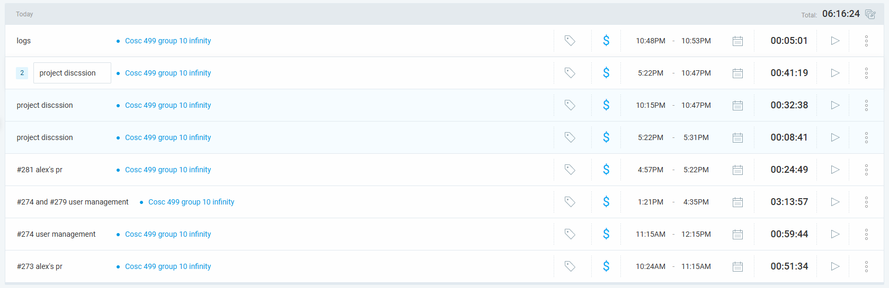

### Current Tasks (Provide sufficient detail)
  * #1: User Management
  * #2: [UBCO-COSC499-S2025/team-10-capstone-infinity#274](https://github.com/UBCO-COSC499-S2025/team-10-capstone-infinity/issues/274)
  * #3: [UBCO-COSC499-S2025/team-10-capstone-infinity#279](https://github.com/UBCO-COSC499-S2025/team-10-capstone-infinity/issues/279)

### Progress Update (since 5/21/2025) 
<table>
    <tr>
        <td><strong>TASK/ISSUE # 1</strong>
        </td>
        <td><strong>STATUS</strong>
        </td>
    </tr>
    <tr>
        <!-- Task/Issue # -->
        <td>Task 1
        </td>
        <!-- Status -->
        <td>In progress
        </td>
    </tr>
    <tr>
        <!-- Task/Issue # -->
        <td>Task 2
        </td>
        <!-- Status -->
        <td>In Review
        </td>
    </tr>
    <tr>
        <!-- Task/Issue # -->
        <td>Task 3
        </td>
        <!-- Status -->
        <td>In Progress
        </td>
    </tr>
</table>

### Cycle Goal Review (Reflection: what went well, what was done, what didn't; Retrospective: how is the process going and why?)
Today I got the User Management working with backend. You can now search for a user by their name, role, university number. 
You can now manually create a new user if you are an admin. You can delete. One of the Comparers is partially integrated.
I had to refactor SignUp page by extracting a component out of it and reusing it in SignUp and ManualCreateUserPage.
Tommorrow, I'll finish the tests for the searching user mapping and the tests for the usermanagmenet as well.
Then I will work on the visual assignments for the profiles using Full Calendar.
I may also consider brushing up on the design.

### Next Cycle Goals (What are you going to accomplish during the next cycle)
  * Next Cycle, I wiil work on some of the tasks in the list I wrote below.
- qualifications page (instructor's and student's skill labs) integration
- integration for comparers
- visual assignments shown in profile.

## Thursday 6/26 (6/24~6/26)

### Timesheet
Clockify report
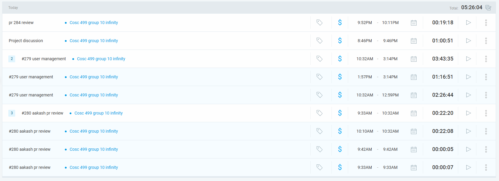

### Current Tasks (Provide sufficient detail)
  * #1: User Management
  * #2: [UBCO-COSC499-S2025/team-10-capstone-infinity#279](https://github.com/UBCO-COSC499-S2025/team-10-capstone-infinity/issues/279)

### Progress Update (since 5/21/2025) 
<table>
    <tr>
        <td><strong>TASK/ISSUE # 1</strong>
        </td>
        <td><strong>STATUS</strong>
        </td>
    </tr>
    <tr>
        <!-- Task/Issue # -->
        <td>Task 1
        </td>
        <!-- Status -->
        <td>In progress
        </td>
    </tr>
    <tr>
        <!-- Task/Issue # -->
        <td>Task 2
        </td>
        <!-- Status -->
        <td>In Review
        </td>
    </tr>
</table>

### Cycle Goal Review (Reflection: what went well, what was done, what didn't; Retrospective: how is the process going and why?)
I worked on the basic aesthetics of the whole application today. I completed writing the tests for the user search backend.
I reviewed other peoples PRs and did some project discussion. I reviewed #280 and #284 PRs.
I will probably work on the instructor updating needs and adding them. for the frontend.
If the backend for the needs get merged, I will integrate as well.

### Next Cycle Goals (What are you going to accomplish during the next cycle)
  * Next Cycle, I wiil work on some of the tasks in the list I wrote below.
- qualifications page (instructor's and student's skill labs) integration
- integration for comparers
- Instructor updating needs frontend

## Friday 6/27 (6/27~6/30)

### Timesheet
Clockify report
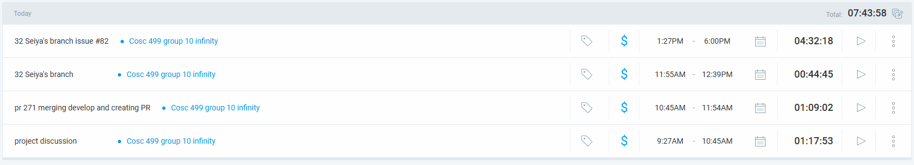

### Current Tasks (Provide sufficient detail)
  * #1: Course Management
  * #2: [UBCO-COSC499-S2025/team-10-capstone-infinity#82](https://github.com/UBCO-COSC499-S2025/team-10-capstone-infinity/issues/82)

### Progress Update (since 5/21/2025) 
<table>
    <tr>
        <td><strong>TASK/ISSUE # 1</strong>
        </td>
        <td><strong>STATUS</strong>
        </td>
    </tr>
    <tr>
        <!-- Task/Issue # -->
        <td>Task 1
        </td>
        <!-- Status -->
        <td>In progress
        </td>
    </tr>
    <tr>
        <!-- Task/Issue # -->
        <td>Task 2
        </td>
        <!-- Status -->
        <td>In Review
        </td>
    </tr>
</table>

### Cycle Goal Review (Reflection: what went well, what was done, what didn't; Retrospective: how is the process going and why?)
In the morning we discussed with our teammates.
We decided that I would take on Seiya's branch. Seiya has not been communicating and has not delivered anything for the past 3 weeks.
Therefore, I finished the task we was supposed to get done about 3 weeks ago.
Tommorrow, I will work on the integration of the sections with the backend.
If I can, I will also work on a course managment page. right now it's just the sections.
Then maybe on Monday, I will work on the Needs of the instructor page and the allocation history.
I need to create the updating of the needs and the allocation history.

### Next Cycle Goals (What are you going to accomplish during the next cycle)
  * Next Cycle, I wiil work on some of the tasks in the list I wrote below.
- qualifications page (instructor's and student's skill labs) integration
- integration for comparers
- Instructor updating needs frontend
- course/section management

## Saturday 6/28 (6/27~6/30)

### Timesheet
Clockify report
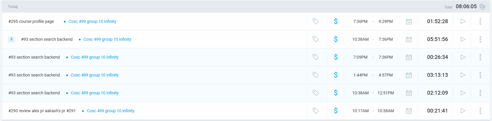

### Current Tasks (Provide sufficient detail)
  * #1: Course Profile
  * #2: [UBCO-COSC499-S2025/team-10-capstone-infinity#82](https://github.com/UBCO-COSC499-S2025/team-10-capstone-infinity/issues/82)
  * #3: [UBCO-COSC499-S2025/team-10-capstone-infinity#93](https://github.com/UBCO-COSC499-S2025/team-10-capstone-infinity/issues/93)
  * #4: [UBCO-COSC499-S2025/team-10-capstone-infinity#295](https://github.com/UBCO-COSC499-S2025/team-10-capstone-infinity/issues/295)

### Progress Update (since 5/21/2025) 
<table>
    <tr>
        <td><strong>TASK/ISSUE # 1</strong>
        </td>
        <td><strong>STATUS</strong>
        </td>
    </tr>
    <tr>
        <!-- Task/Issue # -->
        <td>Task 1
        </td>
        <!-- Status -->
        <td>In progress
        </td>
    </tr>
    <tr>
        <!-- Task/Issue # -->
        <td>Task 2
        </td>
        <!-- Status -->
        <td>In Review
        </td>
    </tr>
    <tr>
        <!-- Task/Issue # -->
        <td>Task 3
        </td>
        <!-- Status -->
        <td>In Review
        </td>
    </tr>
    <tr>
        <!-- Task/Issue # -->
        <td>Task 4
        </td>
        <!-- Status -->
        <td>In Progress
        </td>
    </tr>
</table>

### Cycle Goal Review (Reflection: what went well, what was done, what didn't; Retrospective: how is the process going and why?)
I completed the course/section creation and filtering (searching) pages it works with the backend. Now, in order to make updating work, I'm creating a courseProfile page. This is part of UR 2.2 and 1.3. 
I still have to wait for the Deletion of courses/sections to work in backend. That is not integrated.
I got done in 2 days a feature we waited to be completed for 3 weeks.
Moreover, the design has been delayed because I felt like I needed to get the functionality done first.

### Next Cycle Goals (What are you going to accomplish during the next cycle)
  * Next Cycle, I wiil work on some of the tasks in the list I wrote below.
- qualifications page (instructor's and student's skill labs) integration
- integration for comparers
- Instructor updating needs frontend
- course/section management

## Monday 6/30 (6/27~6/30)

### Timesheet
Clockify report
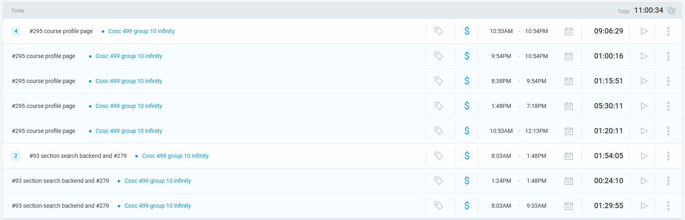

### Current Tasks (Provide sufficient detail)
  * #1: Course Profile
  * #2: [UBCO-COSC499-S2025/team-10-capstone-infinity#93](https://github.com/UBCO-COSC499-S2025/team-10-capstone-infinity/issues/93)
  * #3: [UBCO-COSC499-S2025/team-10-capstone-infinity#295](https://github.com/UBCO-COSC499-S2025/team-10-capstone-infinity/issues/295)

### Progress Update (since 5/21/2025) 
<table>
    <tr>
        <td><strong>TASK/ISSUE # 1</strong>
        </td>
        <td><strong>STATUS</strong>
        </td>
    </tr>
    <tr>
        <!-- Task/Issue # -->
        <td>Task 1
        </td>
        <!-- Status -->
        <td>In progress
        </td>
    </tr>
    <tr>
        <!-- Task/Issue # -->
        <td>Task 2
        </td>
        <!-- Status -->
        <td>In Review
        </td>
    </tr>
    <tr>
        <!-- Task/Issue # -->
        <td>Task 3
        </td>
        <!-- Status -->
        <td>In Review
        </td>
    </tr>
</table>

### Cycle Goal Review (Reflection: what went well, what was done, what didn't; Retrospective: how is the process going and why?)
I completed the functionality and tests for the course profiles and section profiles. you can now edit them and view them and update them and delete them. you can now search an instructor and assign them to a section using a searchbar.
I spent time today merging and creating pull requests, which also took some time.
Tommorrow, I hope I will get the qualifications done and review Allen's and Aakash's PRs.

### Next Cycle Goals (What are you going to accomplish during the next cycle)
  * Next Cycle, I wiil work on some of the tasks in the list I wrote below.
- qualifications page (instructor's and student's skill labs) integration
- integration for comparers
- Instructor updating needs frontend

## Tuesday 7/01 (7/01~7/04)

### Timesheet
Clockify report
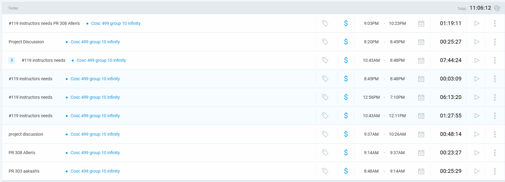

### Current Tasks (Provide sufficient detail)
  * #1: Instructor Needs profile
  * #2: [UBCO-COSC499-S2025/team-10-capstone-infinity#119](https://github.com/UBCO-COSC499-S2025/team-10-capstone-infinity/issues/119)
  

### Progress Update (since 5/21/2025) 
<table>
    <tr>
        <td><strong>TASK/ISSUE # 1</strong>
        </td>
        <td><strong>STATUS</strong>
        </td>
    </tr>
    <tr>
        <!-- Task/Issue # -->
        <td>Task 1
        </td>
        <!-- Status -->
        <td>In progress
        </td>
    </tr>
    <tr>
        <!-- Task/Issue # -->
        <td>Task 2
        </td>
        <!-- Status -->
        <td>In Review
        </td>
    </tr>
</table>

### Cycle Goal Review (Reflection: what went well, what was done, what didn't; Retrospective: how is the process going and why?)
I made the instructor needs profile work, somewhat with the backend. I'm missing some mappings so it doesn't not completely work yet.
I'm afraid of seeing some bugs and problems in the future, because I've been creating things in a hurry.
I started a new branch [UBCO-COSC499-S2025/team-10-capstone-infinity#315](https://github.com/UBCO-COSC499-S2025/team-10-capstone-infinity/issues/315), which I will work on tommorrow and hopefully finish tommorrow after using the backend Aakash created.
The qualifications will still have to be deferred, but I hope it's no later than tommorrw midday.
This cycle, I still have to work on:
- qualifications (integration with backend),
- allocation history
- CSV export
- design improvements
- and some other miscelleneous integration I may have forgotten.

### Next Cycle Goals (What are you going to accomplish during the next cycle)
  * Next Cycle, I wiil work on some of the tasks in the list I wrote below.
- qualifications page (instructor's and student's skill labs) integration
- integration for comparers
- Instructor updating needs frontend

## Wednesday 7/02 (7/01~7/04)

### Timesheet
Clockify report
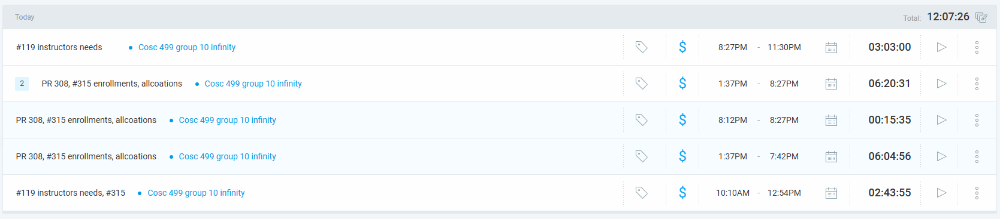

### Current Tasks (Provide sufficient detail)
  * #1: Instructor Needs profile, Qualifications, Allopcation History
  * #2: [UBCO-COSC499-S2025/team-10-capstone-infinity#119](https://github.com/UBCO-COSC499-S2025/team-10-capstone-infinity/issues/119)
  * #3: [UBCO-COSC499-S2025/team-10-capstone-infinity#315](https://github.com/UBCO-COSC499-S2025/team-10-capstone-infinity/issues/315)
  

### Progress Update (since 5/21/2025) 
<table>
    <tr>
        <td><strong>TASK/ISSUE # 1</strong>
        </td>
        <td><strong>STATUS</strong>
        </td>
    </tr>
    <tr>
        <!-- Task/Issue # -->
        <td>Task 1
        </td>
        <!-- Status -->
        <td>Completed
        </td>
    </tr>
    <tr>
        <!-- Task/Issue # -->
        <td>Task 2
        </td>
        <!-- Status -->
        <td>In Review
        </td>
    </tr>
    <tr>
        <!-- Task/Issue # -->
        <td>Task 2
        </td>
        <!-- Status -->
        <td>In Review
        </td>
    </tr>
</table>

### Cycle Goal Review (Reflection: what went well, what was done, what didn't; Retrospective: how is the process going and why?)
So I did get everything I wanted to get done today except for design improvements.
I integrated the qualifications. I made the allocation history work. I made a very basic CSV export work.
It was very tough going through all the errors that would happen. I feel like the frontend is more prone to discovering unexpected errors since we are testing in a more practical manner.
It was very tough integrating everything and making sure everything works well. The data can get messed up and that seems to be oftentimes the source of unexpected errors.

### Next Cycle Goals (What are you going to accomplish during the next cycle)
  * Next Cycle, I wiil work on some of the tasks in the list I wrote below.
- presentation for MVP
- refactoring and checking for errors and fixing them.

## Thursday 7/03 (7/01~7/04)

### Timesheet
Clockify report
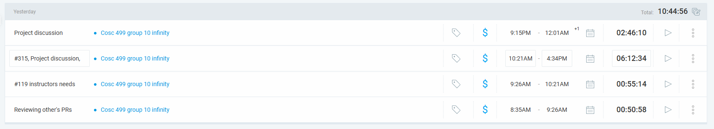

### Current Tasks (Provide sufficient detail)
  * #1: Instructor Needs profile, Qualifications, Allopcation History
  * #2: [UBCO-COSC499-S2025/team-10-capstone-infinity#119](https://github.com/UBCO-COSC499-S2025/team-10-capstone-infinity/issues/119)
  * #3: [UBCO-COSC499-S2025/team-10-capstone-infinity#315](https://github.com/UBCO-COSC499-S2025/team-10-capstone-infinity/issues/315)
  

### Progress Update (since 5/21/2025) 
<table>
    <tr>
        <td><strong>TASK/ISSUE # 1</strong>
        </td>
        <td><strong>STATUS</strong>
        </td>
    </tr>
    <tr>
        <!-- Task/Issue # -->
        <td>Task 1
        </td>
        <!-- Status -->
        <td>Completed
        </td>
    </tr>
    <tr>
        <!-- Task/Issue # -->
        <td>Task 2
        </td>
        <!-- Status -->
        <td>Completed
        </td>
    </tr>
    <tr>
        <!-- Task/Issue # -->
        <td>Task 3
        </td>
        <!-- Status -->
        <td>Completed
        </td>
    </tr>
</table>

### Cycle Goal Review (Reflection: what went well, what was done, what didn't; Retrospective: how is the process going and why?)
Today I completed the design improvements for all the work I did so far. Of course, it's far from done.
- basic CSV export function is done
- Did presentation preparation and project discussion.
- did merging into dev with teammates.
Presentation preparation wasn't the best, but it was good we got some discussion. 

### Next Cycle Goals (What are you going to accomplish during the next cycle)
  * Next Cycle, I wiil work on some of the tasks in the list I wrote below.
- refactoring and checking for errors and fixing them.

## Friday 7/04 (7/01~7/04)

### Timesheet
Clockify report
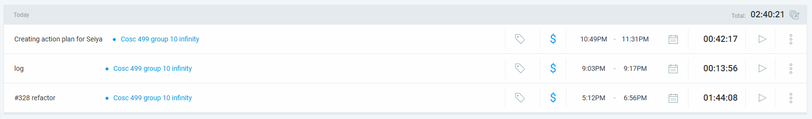

### Current Tasks (Provide sufficient detail)
  * #1: MVP Presentation
  * #2: [UBCO-COSC499-S2025/team-10-capstone-infinity#328](https://github.com/UBCO-COSC499-S2025/team-10-capstone-infinity/issues/328)

  

### Progress Update (since 5/21/2025) 
<table>
    <tr>
        <td><strong>TASK/ISSUE # 1</strong>
        </td>
        <td><strong>STATUS</strong>
        </td>
    </tr>
    <tr>
        <!-- Task/Issue # -->
        <td>Task 1
        </td>
        <!-- Status -->
        <td>Completed
        </td>
    </tr>
    <tr>
        <!-- Task/Issue # -->
        <td>Task 2
        </td>
        <!-- Status -->
        <td>In progress
        </td>
    </tr>
</table>

### Cycle Goal Review (Reflection: what went well, what was done, what didn't; Retrospective: how is the process going and why?)
Today we did the MVP presentation. It went okay. Was satisfied that we got the most done functionality wise out of all the groups.
Our project still has some features to be desired and improved.
- Talked with Seiya about his lack of communication. He told us that he is willing to do more in the future and also explained his unfortunate circumstances of losing his family member and friend within the span of just a few weeks.
- Told Allen he also should have done more.
- Started on the refactoring. It isn't as hard as I expected. Might be done sooner than I expected.

### Next Cycle Goals (What are you going to accomplish during the next cycle)
  * Next Cycle, I wiil work on some of the tasks in the list I wrote below.
- refactoring and checking for errors and fixing them.
- make the Comparers work with the backend.
- error checking 

## Saturday 7/05 (7/04~7/08)

### Timesheet
Clockify report
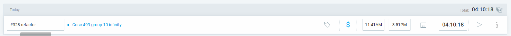

### Current Tasks (Provide sufficient detail)
  * #1: Refactoring
  * #2: [UBCO-COSC499-S2025/team-10-capstone-infinity#328](https://github.com/UBCO-COSC499-S2025/team-10-capstone-infinity/issues/328)

  

### Progress Update (since 5/21/2025) 
<table>
    <tr>
        <td><strong>TASK/ISSUE # 1</strong>
        </td>
        <td><strong>STATUS</strong>
        </td>
    </tr>
    <tr>
        <!-- Task/Issue # -->
        <td>Task 1
        </td>
        <!-- Status -->
        <td>Completed
        </td>
    </tr>
    <tr>
        <!-- Task/Issue # -->
        <td>Task 2
        </td>
        <!-- Status -->
        <td>In Review
        </td>
    </tr>
</table>

### Cycle Goal Review (Reflection: what went well, what was done, what didn't; Retrospective: how is the process going and why?)
I changed the Section interface in the frontend to look exactly like the SectionDTO in the backend.
This was because the discrepency between the response and the interfaces in the frontend was making coding very difficult and confusing.
Moreover, my teammates recommended changing the scaffolding to make them role-based. So I made the Pages folder and api folders more organized and role-based.
I encountered lots of errors and had to fix lots of tests due to the moving files, but I managed to catch them all and make the project work.
- next time I will work on UR 1.4 and 1.5

### Next Cycle Goals (What are you going to accomplish during the next cycle)
  * Next Cycle, I wiil work on some of the tasks in the list I wrote below.
- make the Comparers work with the backend.
- UR 1.4 and UR 1.5
- error checking 

## Monday 7/07 (7/04~7/08)

### Timesheet
Clockify report
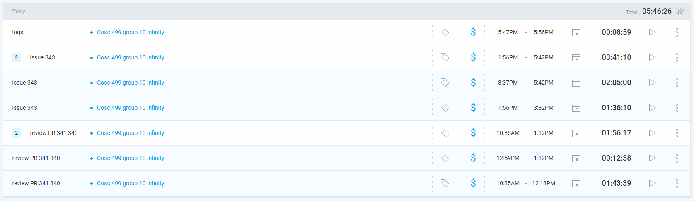

### Current Tasks (Provide sufficient detail)
  * #1: [UBCO-COSC499-S2025/team-10-capstone-infinity#343](https://github.com/UBCO-COSC499-S2025/team-10-capstone-infinity/issues/343)

  

### Progress Update (since 5/21/2025) 
<table>
    <tr>
        <td><strong>TASK/ISSUE # 1</strong>
        </td>
        <td><strong>STATUS</strong>
        </td>
    </tr>
    <tr>
        <!-- Task/Issue # -->
        <td>Task 1
        </td>
        <!-- Status -->
        <td>In Progress
        </td>
    </tr>
</table>

### Cycle Goal Review (Reflection: what went well, what was done, what didn't; Retrospective: how is the process going and why?)
I reviewed other's PRs. Spent about 2 hours on that.
I improved the user-accessability. I made confirmation of user stronger for DELETE and UPDATE operations in some parts of the project.
I also added a SQL injection checks in frontend, though it's not really necessary, as Spring Boot already has something embedded in it to prvent it. There were other checks I added such as the size and regex patterns of inputs in course, section, user registration and creation.
Things to note for tommorrow:
- assignInstructor in SectionController has to make sure the logged in instructor is assigning only for himself.
- student Allocation history needs to make sure the student is creating entries only for himself.
- need to assure the deletion of sections implies there are no orphaned foreign key constraints in other tables. Like StudentCoursea and Allocation.
- handle other possible orphaned foreign key constraints
- make Section Filter work with only Year and Semester

### Next Cycle Goals (What are you going to accomplish during the next cycle)
  * Next Cycle, I wiil work on some of the tasks in the list I wrote below.
- make the Comparers work with the backend.
- UR 1.5
- error checking 

## Tuesday 7/08 (7/04~7/08)

### Timesheet
Clockify report
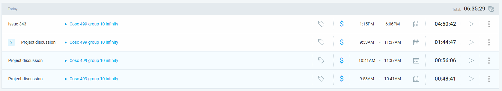

### Current Tasks (Provide sufficient detail)
  * #1: [UBCO-COSC499-S2025/team-10-capstone-infinity#343](https://github.com/UBCO-COSC499-S2025/team-10-capstone-infinity/issues/343)

  

### Progress Update (since 5/21/2025) 
<table>
    <tr>
        <td><strong>TASK/ISSUE # 1</strong>
        </td>
        <td><strong>STATUS</strong>
        </td>
    </tr>
    <tr>
        <!-- Task/Issue # -->
        <td>Task 1
        </td>
        <!-- Status -->
        <td>In Review
        </td>
    </tr>
</table>

### Cycle Goal Review (Reflection: what went well, what was done, what didn't; Retrospective: how is the process going and why?)
I completed the orphaned key problems in Sections. I fixed bugs in Qualifications and Needs pages. I added the validation to user edit profile as well.
We did a project discussion today face to face. It was productive, and we decided what we are going to do over the next few days.
I will primarily focus on UR 1.5 after today. After that I will work on the other goals.
The process is going smoothly now and is less stressful now, as I am finding myself looking for work to do rather than the work hunting me down.  

### Next Cycle Goals (What are you going to accomplish during the next cycle)
  * Next Cycle, I wiil work on some of the tasks in the list I wrote below.
- UR 1.5
- assignInstructor in SectionController has to make sure the logged in instructor is assigning only for himself.
- student Allocation history needs to make sure the student is creating entries only for himself.
- enrollment for student works
- section profile shows needs
