## 19 May, Monday 10:00AM–12:30PM  
### Timesheet

**Clockify:** 
### Current Tasks  
- **#1:** Team Charter (Completed in the team meeting and reviewed with team simultaneously)  
- **#2:** Clockify Setup (Completed during meeting)  

### Progress Update  
| TASK/ISSUE # | STATUS     |  
|--------------|------------|  
| Task A       | Completed  |  
| Task B       | Completed  |  

### Cycle Goal Review  

**Reflection**  
During this cycle, we successfully completed Task A (Team Charter), which helped define the scenarios clearly. Also completed setup on Clockify.  

**Retrospective**  
The overall process is progressing steadily. We allocated more time for team discussions for Wednesday, 21 May from 10:00AM–12:00PM.  

### Next Cycle Goals  
- **Task A:** Project Planning  

----------------------------------------------------------------------------------------------------------------------------------------------------------------------------------------------------------------------------------------------------

## 21 May, Wednesday 10:00AM–12:30PM  
### Timesheet
**Clockify:** 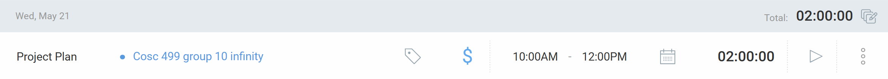

### Current Tasks  
- **#1:** FR, User, and NFR requirements (Completed in team meeting and reviewed)  
- **#2:** High Risk (Wrote in document)  
- **#3:** Assumptions and Constraints (Wrote in document)  

### Progress Update  
| TASK/ISSUE # | STATUS     |  
|--------------|------------|  
| Task A       | Completed  |  
| Task B       | Pending (Team discussion needed) |  
| Task C       | Pending (Team discussion needed) |  

### Cycle Goal Review  

**Reflection**  
Successfully completed Task A (Functional, User, and Non-Functional Requirements), which helped define the system’s expected behavior. Task B (High Risk) and Task C (Assumptions and Constraints) remain pending due to the need for further team input.  

**Retrospective**  
The overall process is steady. More time was allocated for team discussions on Thursday, 22 May from 12:00PM–2:00PM.  

### Next Cycle Goals  
- **Task 1:** Teamwork Planning and Anticipated Hurdles  
- **Task 2:** High-level project description and boundaries  
- **Task 3:** Users, Usage Scenarios and High-Level Requirements  

----------------------------------------------------------------------------------------------------------------------------------------------------------------------------------------------------------------------------------------------------

## 22 May, Thursday 12:00PM–2:00PM  
### Timesheet

**Clockify:** 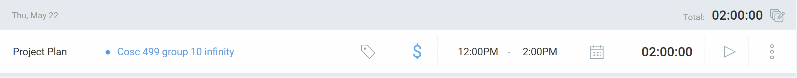

### Current Tasks  
- **#1:** User Scenarios  
- **#2:** MVP  
- **#3:** High-Level Project Description and Boundaries  

### Progress Update  
| TASK/ISSUE # | STATUS     |  
|--------------|------------|  
| Task 1       | Completed  |  
| Task 2       | Completed  |  
| Task 3       | Completed  |  

### Cycle Goal Review  

**Reflection**  
Completed all tasks as planned, contributing to a clear definition of the system's behavior and structure.  

**Retrospective**  
Progress continues steadily. More time was allocated for team discussions on Friday after class.  

### Next Cycle Goals  
- **Task 1:** Review of Project Plan  

----------------------------------------------------------------------------------------------------------------------------------------------------------------------------------------------------------------------------------------------------

## 26 May, Monday 12:00PM–2:00PM  
### Timesheet

**Clockify:** 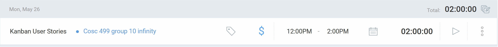

### Current Tasks  
- **#1:** Converted user stories into KANBAN  
  - Added descriptions and followed team’s user story format  

### Progress Update  
| TASK/ISSUE # | STATUS     |  
|--------------|------------|  
| Task 1       | Completed  |  

### Cycle Goal Review  

**Reflection**  
Successfully completed Task A, which helped define the system’s expected behavior more precisely.  

**Retrospective**  
Progress is steady. Additional discussion time was scheduled for Tuesday after class.  

### Next Cycle Goals  
- **Task 1:** Towards next milestone and submission of project plan  

----------------------------------------------------------------------------------------------------------------------------------------------------------------------------------------------------------------------------------------------------

## 27 May, Tuesday 1:30PM–4:30PM  
### Timesheet

**Clockify:** 

### Current Tasks  
- **#1:** Reviewed PR related to backend setup  
- **#2:** Watched Spring Boot tutorials on YouTube  
- **#3:** Setup Docker with frontend and backend containers  

### Progress Update  
| TASK/ISSUE # | STATUS     |  
|--------------|------------|  
| Task 1       | Completed  |  
| Task 2       | Completed  |  
| Task 3       | Completed  |  

### Cycle Goal Review  

**Reflection**  
Completed all setup-related tasks. These initial steps are crucial for the development workflow and backend integration.  

**Retrospective**  
Process is progressing well. More discussion time was scheduled for Friday after class.  

### Next Cycle Goals  
- **Task 1:** Towards next milestone (wireframes, diagrams such as DFD, ER, etc.)

----------------------------------------------------------------------------------------------------------------------------------------------------------------------------------------------------------------------------------------------------

## 28 May, Wednesday 11:15AM–3:51PM  
### Timesheet

**Clockify:** 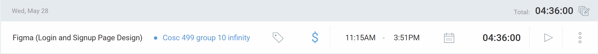

### Current Tasks  
- **#1:** Designed the Login Page UI in Figma  
- **#2:** Designed the Signup Page UI in Figma  

### Progress Update  
| TASK/ISSUE # | STATUS     |  
|--------------|------------|  
| Task 1       | Completed  |  
| Task 2       | Completed  |  

### Cycle Goal Review  

**Reflection**  
During this cycle, I completed the initial design for both the login and signup pages in Figma. These screens follow the planned layout and visual hierarchy and are aligned with the user stories for account management.  

**Retrospective**  
The design process went smoothly, and working within Figma helped visualize user interaction early. Future iterations may include usability testing or applying consistent color themes with the rest of the system.  

### Next Cycle Goals  
- **Task 1:** Finalize homepage wireframe and instructor dashboard UI.

----------------------------------------------------------------------------------------------------------------------------------------------------------------------------------------------------------------------------------------------------

## 29 May, Thursday 12:30PM–4:00PM  
### Timesheet

**Clockify:** 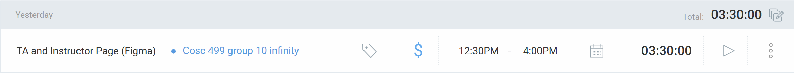

### Current Tasks  
- **#1:** Designed the TA Dashboard Page in Figma  
- **#2:** Designed the Instructor Dashboard Page in Figma  

### Progress Update  
| TASK/ISSUE # | STATUS     |  
|--------------|------------|  
| Task 1       | Completed  |  
| Task 2       | Completed  |  

### Cycle Goal Review  

**Reflection**  
This cycle focused on designing the TA and Instructor dashboard pages in Figma. Both pages were structured based on user roles and their respective functionalities, including visual access to schedules, applications, and course needs.  

**Retrospective**  
The design decisions were guided by the feedback from team discussions. Designing from the perspective of different user roles helped clarify layout priorities. Additional input from teammates will be gathered before finalizing the layout and interactions.

### Next Cycle Goals  
- **Task 1:** Begin Student dashboard design with emphasis on their tasks.

-------------------------------------------------------------------------------------------------------------------------------------------------------------------------------------

## 31 May, Saturday 1.05PM–2:52PM  
### Timesheet

**Clockify:** 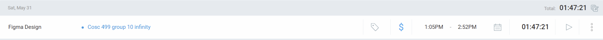

### Current Tasks  
- **#1:** Designed Instructor pages (Home, Profile) in Figma  

### Progress Update  
| TASK/ISSUE # | STATUS     |  
|--------------|------------|  
| Task 1       | Completed  |  

### Cycle Goal Review  

**Reflection**  
This cycle focused on designing the Instructor pages (Home and Profile) in Figma. Both pages were structured around core functionalities relevant to instructors, such as managing course needs and viewing current teaching assignments.

**Retrospective**  
The design decisions were guided by feedback from team discussions. Creating layout designs from the instructor’s perspective helped prioritize features effectively. Final refinements will be based on additional team feedback before implementation.

### Next Cycle Goals  
- **Task 1:** Design TA Allocations page  
- **Task 2:** Design Course Requirement page  

-------------------------------------------------------------------------------------------------------------------------------------------------------------------------------------

## 1 June, Sunday 3:06PM–7:03PM  
### Timesheet

**Clockify:** 

### Current Tasks  
- **#1:** Designed TA Allocations page  
- **#2:** Designed Course Requirement page  

### Progress Update  
| TASK/ISSUE # | STATUS     |  
|--------------|------------|  
| Task 1       | Completed  |  
| Task 2       | Completed  |  

### Cycle Goal Review  

**Reflection**  
This cycle focused on designing the TA Allocations and Course Requirement pages. These designs were centered around the coordinator and instructor workflows, ensuring functionality like assigning TAs and defining course-specific needs was intuitive and clearly displayed.

**Retrospective**  
Team feedback played a key role in shaping these pages. Aligning design elements with user stories made it easier to structure the interface logically. Further peer feedback will help polish these layouts.

### Next Cycle Goals  
- **Task 1:** Design TA Application page  
- **Task 2:** Design TA Coordinator homepage  

-------------------------------------------------------------------------------------------------------------------------------------------------------------------------------------
## 2 June, Monday 10:26AM–2:58PM  
### Timesheet

**Clockify:** 

### Current Tasks  
- **#1:** Designed TA Application page  
- **#2:** Designed TA Coordinator homepage  

### Progress Update  
| TASK/ISSUE # | STATUS     |  
|--------------|------------|  
| Task 1       | Completed  |  
| Task 2       | Completed  |  

### Cycle Goal Review  

**Reflection**  
This cycle focused on designing the TA Application and TA Coordinator homepage. These pages were structured to support coordinator workflows, allowing effective browsing of TA applicants and administrative access to platform functionalities.

**Retrospective**  
Designs were shaped by user stories and refined with input from teammates. Building from the coordinator's perspective helped clarify key layout and interaction needs. Additional feedback will guide final iterations.

### Next Cycle Goals  
- **Task 1:** Design Course Management page  
- **Task 2:** Design TA Allocations page  

-------------------------------------------------------------------------------------------------------------------------------------------------------------------------------------
## 2 June, Monday 11:01PM–12:37AM  
### Timesheet

**Clockify:** 

## Current Tasks  
- **#1:** Design and implement TA Allocation page

## Progress Update  
| TASK/ISSUE # | DESCRIPTION                          | STATUS     |  
|--------------|--------------------------------------|------------|  
| Task 1       | Created a detailed UI for the TA Allocation page, including course/applicant filters, results section, and availability calendar | Completed  |

## Cycle Goal Review  

### Reflection  
This sprint focused on designing the TA Allocation page to support the core responsibilities of the TA Coordinator. The page was designed to allow easy filtering and comparison of course requirements and TA applications. Key functionalities include:

- **Course Filter**: Search courses by name, department code, section, and term.
- **Applicant Filter**: Filter TA applicants based on their top course preferences, term, and requested hours.
- **Results Section**: Displays matching courses and applicants. Selection of a course and applicant reveals relevant information including prerequisites, grading hours, and schedule.
- **Weekly Calendar**: A dynamic visual showing the overlap between course schedules and TA availability using colored time slots. Conflicts can be highlighted for clarity.

The goal was to simplify TA allocation decisions by presenting all necessary data on a single page in a clear and interactive format.

### Retrospective  
The design was based on user stories defined earlier in the project. Input from peers was integrated to ensure the layout matched coordinator workflows. Visual hierarchy and intuitive filters were emphasized. 

### Next Cycle Goals  
- **Task 1:**  Student dashboard pages 

-------------------------------------------------------------------------------------------------------------------------------------------------------------------------------------
## 2 June, Monday 11:01PM–12:37AM  
### Timesheet

**Clockify:** 

## Current Tasks  
- **#1:** Design and implement TA Allocation page

## Progress Update  
| TASK/ISSUE # | DESCRIPTION                          | STATUS     |  
|--------------|--------------------------------------|------------|  
| Task 1       | Created a detailed UI for the TA Allocation page, including course/applicant filters, results section, and availability calendar | Completed  |

## Cycle Goal Review  

### Reflection  
This sprint focused on designing the TA Allocation page to support the core responsibilities of the TA Coordinator. The page was designed to allow easy filtering and comparison of course requirements and TA applications. Key functionalities include:

- **Course Filter**: Search courses by name, department code, section, and term.
- **Applicant Filter**: Filter TA applicants based on their top course preferences, term, and requested hours.
- **Results Section**: Displays matching courses and applicants. Selection of a course and applicant reveals relevant information including prerequisites, grading hours, and schedule.
- **Weekly Calendar**: A dynamic visual showing the overlap between course schedules and TA availability using colored time slots. Conflicts can be highlighted for clarity.

The goal was to simplify TA allocation decisions by presenting all necessary data on a single page in a clear and interactive format.

### Retrospective  
The design was based on user stories defined earlier in the project. Input from peers was integrated to ensure the layout matched coordinator workflows. Visual hierarchy and intuitive filters were emphasized. 

### Next Cycle Goals  
- **Task 1:**  Student dashboard pages 

-------------------------------------------------------------------------------------------------------------------------------------------------------------------------------------

## 3 June, Tuesday 10.10AM–12:15PM   & 2:16PM - 6:10PM  & 10:15PM-11:03PM
### Timesheet

**Clockify:** 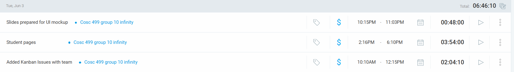

## Current Tasks  
- **#1:** Expanded user stories into sub-issues with the team  
- **#2:** Designed TA Homepage, My Courses, and Application Submission pages in Figma  
-**#3:** Prepared slides for the UI mockups
---

## Progress Update  
| TASK/ISSUE # | DESCRIPTION                                                                                       | STATUS     |  
|--------------|---------------------------------------------------------------------------------------------------|------------|  
| Task 1       | Collaborated with the team to break down the TA allocation feature into specific sub-issues       | Completed  |  
| Task 2       | Designed TA-side pages in Figma: TA Homepage, My Courses, and Application Submission UI screens   | Completed  |  

---

## Cycle Goal Review  

### Reflection  
This cycle focused on refining the TA experience in the portal by designing user-facing pages. These included a dashboard for TAs, a course overview, and an intuitive application form. The designs are clean, UBC-branded, and maintain consistency with coordinator views.

- **TA Homepage**: Summarizes all applied and accepted courses with clear status indicators and links to details.
- **My Courses Page**: Displays all assigned courses per term with schedule, instructor, grading hours, and TA status.
- **Application Submission**: Allows TAs to input course preferences, availability, hours requested, upload transcripts, and specify completed courses.

Together, these pages streamline the TA workflow from application to course assignment.

### Retrospective  
This sprint improved visual consistency across user roles and clarified the TA’s interaction model. Peer feedback guided the layout refinement and ensured feature coverage. Coordination with the team helped ensure that backend requirements aligned with frontend expectations.

---

## Next Cycle Goals  
- **Future Task:** Record a video walkthrough/mockup demonstration of all pages designed so far

-------------------------------------------------------------------------------------------------------------------------------------------------------------------------------------

## 4 June, Wednesday 9.00AM–10:03PM   &  10:03PM-10:33PM
### Timesheet

**Clockify:** 

## Current Tasks  
- **#1:** Recorded video walkthrough of UI mockups  
- **#2:** Team meeting to finalize and discuss UI mockups for submission  

---

## Progress Update  
| TASK/ISSUE # | DESCRIPTION                                                                  | STATUS     |  
|--------------|-------------------------------------------------------------------------------|------------|  
| Task 1       | Recorded a complete video walkthrough of the TA UI pages using snippet      | Completed  |  
| Task 2       | Collaborated with team to finalize mockup slides and discuss next steps       | Completed  |  

---

## Cycle Goal Review  

### Reflection  
This cycle focused on wrapping up the design by producing paper nd team meeting to finalize the submission package. 

### Retrospective  
The walkthrough added clarity and value by visually conveying the user experience. The team meeting helped gather final feedback and allowed alignment on the UI narrative and submission flow. All deliverables were reviewed and finalized collaboratively.

## Next Cycle Goals  
- **#1:** Frontend routing and backend setup

-------------------------------------------------------------------------------------------------------------------------------------------------------------------------------------

## 5 June, Thursday 12.41PM–3:12PM  
### Timesheet

**Clockify:** 

## Current Tasks  
- **#1:** Merged PR for frontend routing and backend setup
 
## Progress Update  
| TASK/ISSUE # | DESCRIPTION                                                                  | STATUS     |  
|--------------|-------------------------------------------------------------------------------|------------|  
| Task 1       | Setup done by merging PR for frontend and backend, got on call with Alex     | Completed  |  
 

## Cycle Goal Review  

### Reflection  
This cycle focused on the setup of frontend and backend as its little learning cuurve for the new frame, got some help from tutorials and alex to finish this setup

### Retrospective  
This cycle was primarily focused on the technical setup of the frontend and backend environments. There was a learning curve due to the new frameworks and tools, but collaboration with teammates (especially Alex) and the use of online tutorials helped overcome setup challenges. Getting the routing and build processes to work correctly across Docker, Spring Boot, and Vite was an essential milestone. The merged PR ensured all services were aligned and ready for further development. The support and pair programming session added clarity and made the process much smoother.

## Next Cycle Goals  
- **#1:** Login frontend part

-------------------------------------------------------------------------------------------------------------------------------------------------------------------------------------

## 5 June, Thursday 3.13PM–3:55PM   & 10:38PM-11:45PM

### Timesheet

**Clockify:**  
## Current Tasks  
- **#1:** Weekly Team logs
 
## Progress Update  
| TASK/ISSUE # | DESCRIPTION                                                                  | STATUS     |  
|--------------|-------------------------------------------------------------------------------|------------|  
| Task 1       |Weekly log completed for team, prepared presentation for meeting on firday    | Completed  |  
 

## Cycle Goal Review  

### Reflection  
I finalized the team log and prepared a presentation for Friday’s meeting. These tasks helped align our work, clarified progress, and ensured we’re ready to present confidently.

### Retrospective  
The log and presentation were completed on schedule. While effective, we could enhance preparation by involving more team members earlier and updating logs more frequently to reduce last-minute effort.

## Next Cycle Goals  
- **#1:** Login frontend part

-------------------------------------------------------------------------------------------------------------------------------------------------------------------------------------
## 6 June, Friday 10.10AM–1:17PM 

**Clockify:** 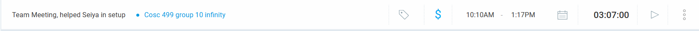
## Current Tasks  
- **#1:** Team meeting and helped seiya in setup backend and frontend 
## Progress Update  
| TASK/ISSUE # | DESCRIPTION                                                                  | STATUS     |  
|--------------|-------------------------------------------------------------------------------|------------|  
| Task 1       | Team meeting and helped seiya in setup backend and frontend                 | Completed  |  
 

## Cycle Goal Review  

### Reflection  
Supported Seiya with backend and frontend setup, ensuring Spring Boot and React were correctly configured. The collaboration improved team productivity and deepened understanding of full-stack project structure and integration.

### Retrospective  
The setup went smoothly and teamwork was effective. Future setups can be faster with clearer step-by-step guides and pre-documented environment requirements to help team members avoid common configuration issues.

## Next Cycle Goals  
- **#1:** Header and Footer Components

-------------------------------------------------------------------------------------------------------------------------------------------------------------------------------------
## 8 June, Sunday 10.10AM–1:17PM 

**Clockify:** 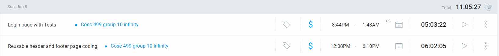
## Current Tasks  
- **#1:** Coded header and footer as reusable components in react with testing 
## Progress Update  
| TASK/ISSUE # | DESCRIPTION                                                                  | STATUS     |  
|--------------|-------------------------------------------------------------------------------|------------|  
| Task 1       |     Coded header and footer as reusable components in react with testing          | Completed  |  
 

## Cycle Goal Review  

### Reflection  
I developed the header and footer as reusable components in React to maintain a consistent layout throughout the application. I structured them using functional components and styled them with Tailwind CSS. To ensure these components worked reliably, I also wrote unit tests to verify their rendering and behavior. Creating these reusable elements not only streamlined future development but also helped establish a cleaner codebase. This task enhanced my understanding of component reusability, modular design, and test-driven development in a React environment.

### Retrospective  
While coding the header and footer components, I ensured they were modular and reusable, which will save time during future UI development. Writing tests early gave me confidence in their stability. However, I could have involved teammates earlier for feedback on design consistency and accessibility. In future UI work, I plan to create shared style guidelines and documentation to support consistent design patterns. Overall, this task was productive and contributed significantly to the maintainability of our frontend codebase.

## Next Cycle Goals  
- **#1:** Login frontend page

-------------------------------------------------------------------------------------------------------------------------------------------------------------------------------------
## 8 June, Sunday 10.10AM–1:17PM 

**Clockify:** 
## Current Tasks  
- **#1:** Login page in react with testing 
## Progress Update  
| TASK/ISSUE # | DESCRIPTION                                                                  | STATUS     |  
|--------------|-------------------------------------------------------------------------------|------------|  
| Task 1       |        Login page in react with testing                                     | Completed  |  
 

## Cycle Goal Review  

### Reflection  
I built the login page using React, focusing on a responsive layout and intuitive user experience. The form includes controlled components for managing user input, and I implemented basic frontend validation for required fields. To ensure stability, I also wrote unit tests verifying correct rendering and input behavior. This task helped reinforce best practices in form handling, state management, and test-driven development, and it contributes to a more reliable and user-friendly authentication process within the application.

### Retrospective  
The login page was successfully implemented with a clean design and working tests. I ensured the form structure was modular and easily extendable. However, in future iterations, I could improve by adding real-time validation feedback, handling error states more gracefully, and integrating with backend authentication for a complete flow. Involving teammates early for UI/UX feedback and conducting user testing would also help catch design or usability issues early, ensuring the login page meets both functional and accessibility standards.

## Next Cycle Goals  
- **#1:** Signup Page

-------------------------------------------------------------------------------------------------------------------------------------------------------------------------------------
## 9 June, Monday 10.10AM–1:17PM 

**Clockify:** 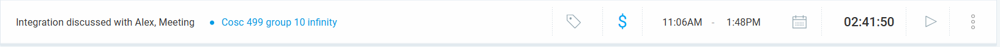
## Current Tasks  
- **#1:** Integration of frontend and backend discussed with Alex, Meeting
## Progress Update  
| TASK/ISSUE # | DESCRIPTION                                                                  | STATUS     |  
|--------------|-------------------------------------------------------------------------------|------------|  
| Task 1       |         Integration of frontend and backend discussed with Alex, Meeting      | Completed  |  
 

## Cycle Goal Review  

### Reflection  
I participated in a discussion with Alex to plan the integration of the frontend and backend for our project. We focused on aligning the API endpoints between the React frontend and Spring Boot backend. This meeting clarified how data would flow between components and services, helping us avoid future mismatches. It also gave me a clearer picture of where each part fits into the system, strengthening my understanding of full-stack communication and project structure.

### Retrospective  
During the meeting with Alex, we discussed the technical steps needed to integrate the React frontend with the Spring Boot backend. The session was informative, but we could have documented the integration plan more clearly for future reference. Creating a shared API contract earlier would help prevent discrepancies. In future meetings, I’ll propose documenting action items and diagrams.

## Next Cycle Goals  
- **#1:** Signup Page

-------------------------------------------------------------------------------------------------------------------------------------------------------------------------------------
## 9 June, Monday 1.49PM–3:17PM 

**Clockify:** 
## Current Tasks  
- **#1:** Nav bar component with tests
## Progress Update  
| TASK/ISSUE # | DESCRIPTION                                                                  | STATUS     |  
|--------------|-------------------------------------------------------------------------------|------------|  
| Task 1       |        Nav bar component with tests                                           | Completed  |  
 

## Cycle Goal Review  

### Reflection  
I developed a responsive and reusable Nav Bar component in React to enhance site navigation and user experience. Using Tailwind CSS, I ensured it fit seamlessly with the existing UI. I also wrote unit tests to verify its structure, links, and behavior across different screen sizes. This work improved my skills in building modular UI components and reinforced the importance of testing in maintaining consistent, error-free functionality as the application evolves.

### Retrospective  
While building the Nav Bar component, I focused on reusability, responsiveness, and test coverage. The implementation went well, but in hindsight, I could have gathered early feedback from the team to align design preferences and navigation structure. In future component development, I plan to involve peers earlier and document key decisions. 

## Next Cycle Goals  
- **#1:** Signup Page

-------------------------------------------------------------------------------------------------------------------------------------------------------------------------------------
## 10 June,Tuesday 10.30AM–1:10PM 

**Clockify:** 
## Current Tasks  
- **#1:** Team Meeting 
## Progress Update  
| TASK/ISSUE # | DESCRIPTION                                                                  | STATUS     |  
|--------------|-------------------------------------------------------------------------------|------------|  
| Task 1       |        Team meeting to discuss further plan and helped Seiya in setup         | N/A |  
 

## Cycle Goal Review  

### Reflection  
This cycle centered on collaboration and onboarding support. I participated in a productive team meeting where we discussed upcoming plans, clarified responsibilities, and aligned on priorities. Additionally, I assisted Seiya with environment setup issues, which deepened my understanding of the development stack and improved my troubleshooting skills

### Retrospective  
Helping Seiya set up their environment revealed several configuration issues, mainly due to attempting the setup on a personal home PC rather than their main development machine. This led to unnecessary delays and compatibility problems that could have been avoided.

## Next Cycle Goals  
- **#1:** Signup Page

-------------------------------------------------------------------------------------------------------------------------------------------------------------------------------------
## 10 June,Tuesday 4:47PM–8:41PM

**Clockify:** 
## Current Tasks  
- **#1:** Signup Page
## Progress Update  
| TASK/ISSUE # | DESCRIPTION                                                                  | STATUS     |  
|--------------|-------------------------------------------------------------------------------|------------|  
| Task 1       |        Designed frontend of the Signup page with testing                        | Completed  |  
 

## Cycle Goal Review  

### Reflection  
This cycle focused on developing the Signup page frontend. I implemented a clean and responsive design using React and Tailwind CSS, ensuring usability across devices. I also wrote unit tests to validate input handling and form submission behavior.

### Retrospective  
The Signup page development went smoothly overall. One area for improvement would be earlier peer feedback to refine the UI design and validation logic. Additionally, I noticed that having clearer form validation rules from the start could have reduced rework.

## Next Cycle Goals  
- **#1:** Integration of frontend and backend Signup

-------------------------------------------------------------------------------------------------------------------------------------------------------------------------------------
## 10 June,Tuesday 8:41PM–10:41PM

**Clockify:** 
## Current Tasks  
- **#1:** Integrated the Signup page with backend, including frontend retesting   
## Progress Update  
| TASK/ISSUE # | DESCRIPTION                                                                  | STATUS     |  
|--------------|-------------------------------------------------------------------------------|------------|  
| Task 1       | Integrated the Signup page with backend, including refrontend testing          | Completed  |  
 

## Cycle Goal Review  

### Reflection  
This cycle centered on integrating the Signup page with the backend API. I implemented the POST request to send user registration data and ensured the payload matched the backend's expected format. I also verified endpoint connectivity using a basic GET request.

### Retrospective  
The integration required careful matching of request structures and field names with the backend. Minor issues like mismatched keys and missing headers were encountered but quickly resolved through testing and debugging.

## Next Cycle Goals  
- **#1:** Integration of frontend and backend Login

-------------------------------------------------------------------------------------------------------------------------------------------------------------------------------------
## 11 June,Wednesday 1:15PM–3:58PM

**Clockify:** 
## Current Tasks  
- **#1:** Integrated Login page frontend with backend using appropriate API calls
## Progress Update  
| TASK/ISSUE # | DESCRIPTION                                                                  | STATUS     |  
|--------------|-------------------------------------------------------------------------------|------------|  
| Task 1       | Integrated Login page frontend with backend using appropriate API calls          | Completed  |  
 

## Cycle Goal Review  

### Reflection  
This cycle was focused on integrating the Login page with the backend authentication API. I implemented a POST request to send login credentials and handled the response by storing the JWT token in local storage for session management.

### Retrospective  
During the integration, attention to detail was required to ensure the request payload and headers matched the backend's expectations. Minor debugging was needed to handle incorrect status codes and token parsing.

## Next Cycle Goals  
- **#1:** JWT authentication

-------------------------------------------------------------------------------------------------------------------------------------------------------------------------------------
## 12 June,Thursday 10:50AM–3:27PM

**Clockify:** 
## Current Tasks  
- **#1:** Implemented JWT authentication
## Progress Update  
| TASK/ISSUE # | DESCRIPTION                                                                  | STATUS     |  
|--------------|-------------------------------------------------------------------------------|------------|  
| Task 1       | 	Implemented JWT authentication between frontend and backend                  | Completed   |  
 

## Cycle Goal Review  

### Reflection  
This cycle was dedicated to implementing JWT-based authentication across the frontend and backend. Upon successful login, the backend issues a JWT token, which is stored in the frontend's local storage. The token is then used to maintain the user’s session and authorize access to protected routes. I also parsed the token to extract user information (like roles and ID) for use in the UI. This task strengthened my understanding of secure authentication flows and token-based session handling.

### Retrospective  
Integrating JWT authentication required careful attention to token structure, expiration handling, and secure storage. Ensuring consistency in the backend response format and correctly decoding the token on the frontend were key steps. In the future, adding token refresh logic and improving error handling for expired or invalid tokens will be the next priorities to enhance security and user experience.

## Next Cycle Goals  
- **#1:** JWT authentication completion

-------------------------------------------------------------------------------------------------------------------------------------------------------------------------------------
## 13 June,Thursday 10:30AM–1:03PM

**Clockify:** 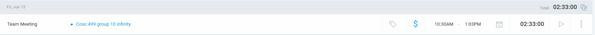
## Current Tasks  
- **#1:** Team meeting 
## Progress Update  
| TASK/ISSUE # | DESCRIPTION                                                                  | STATUS     |  
|--------------|-------------------------------------------------------------------------------|------------|  
| Task 1       | 	Team meeting to discuss feature set and milestone review                  | Completed |  
 

## Cycle Goal Review  

### Reflection  
The team meeting focused on reviewing our current feature set and evaluating progress toward upcoming milestones. We discussed the state of authentication, profile management, and TA application workflows. This session clarified team responsibilities, exposed any blockers, and aligned our next development priorities.

### Retrospective  
During the meeting, we identified areas needing improvement in coordination and documentation, particularly when integrating frontend components with evolving backend APIs.

## Next Cycle Goals  
- **#1:** Application and Application status

-------------------------------------------------------------------------------------------------------------------------------------------------------------------------------------
## 15 June,Sunday 1:08PM–3:52PM & 4:28PM-5:58PM & 8.02AM-10:22PM

**Clockify:** 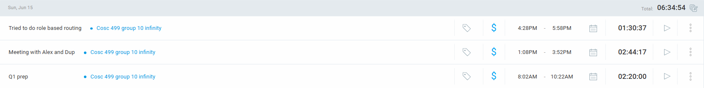
## Current Tasks  
- **#1:** Quiz one prep
- **#2:** Meeting with Alex and Dup
- **#3:** Role based routing learning 

## Progress Update  
| TASK/ISSUE # | DESCRIPTION                                                                  | STATUS     |  
|--------------|-------------------------------------------------------------------------------|-----------|  
| Task 1       | 	       Quiz one prep                                                         | Completed |  
 | Task 2       | 	     Meeting with Alex and Dup                                             | Completed |  
 | Task 3       | 	     Role based routing learning                                           | Completed |  

## Cycle Goal Review  

### Reflection  
This cycle involved preparing for our first quiz, collaborating through a team meeting with Alex and Dup, and diving into role-based routing for our frontend system.

### Retrospective  
During the meeting, we identified areas needing improvement in coordination and documentation, particularly when integrating frontend components with evolving backend APIs.

## Next Cycle Goals  
- **#1:** Application and Application status

-------------------------------------------------------------------------------------------------------------------------------------------------------------------------------------
## 16 June,Monday 10:11PM–12:19AM & 3:35PM-6:09PM

**Clockify:** 
## Current Tasks  
- **#1:** Mini Presentation
- **#2:** Application page

## Progress Update  
| TASK/ISSUE # | DESCRIPTION                                                                  | STATUS     |  
|--------------|-------------------------------------------------------------------------------|-----------|  
| Task 1       | 	    Mini Presentation                                                    | Completed |  
 | Task 2       | 	     Application page frontend                                           | IN Progress |  

## Cycle Goal Review  

### Reflection  
This cycle focused on two main areas: preparing and delivering a mini presentation, and working on the frontend of the TA application page. 
The presentation helped improve communication skills and reinforced our understanding of project components. 

### Retrospective  
The mini presentation was well-received and helped the team articulate progress clearly. For the application page, we encountered some challenges in aligning the frontend design

## Next Cycle Goals  
- **#1:** Application and Application status

-------------------------------------------------------------------------------------------------------------------------------------------------------------------------------------
## 17 June, Tuesday 5:10PM–8:13PM

**Clockify:** 

## Current Tasks  
- **#1:** Application page (frontend completed)

## Progress Update  
| TASK/ISSUE # | DESCRIPTION                                                                  | STATUS     |  
|--------------|-------------------------------------------------------------------------------|-----------|  
| Task 1       | 	    Application page frontend completed                                     | Completed |  

## Cycle Goal Review  

### Reflection  
This cycle focused on finishing the frontend of the application page. The layout and design were successfully implemented.

### Retrospective  
The frontend was completed without significant issues, but there was a focus on ensuring that components worked together seamlessly.

## Next Cycle Goals  
- **#1:** Routing documentation review
- **#2:** Basic routing implementation

----------------------------------------------------------------------------------------------------------------------------------------------------------------------------------------

## 18 June, Wednesday 12:01AM–1:05AM & 1:16PM–2:16PM

**Clockify:** 

## Current Tasks  
- **#1:** Routing documentation read
- **#2:** Basic routing

## Progress Update  
| TASK/ISSUE # | DESCRIPTION                                                                  | STATUS     |  
|--------------|-------------------------------------------------------------------------------|-----------|  
| Task 1       | 	    Routing documentation read                                              | Completed |  
| Task 2       |      Basic routing                                                           | Completed |  

## Cycle Goal Review  

### Reflection  
This cycle was focused on understanding the routing system and implementing the basic routing structure for the application.

### Retrospective  
The routing was successfully implemented, though it took some time to properly align with the application structure.

## Next Cycle Goals  
- **#1:** Routing completion
- **#2:** Test routing functionality

----------------------------------------------------------------------------------------------------------------------------------------------------------------------------------------

## 19 June, Thursday 11:25AM–3:30PM

**Clockify:** 

## Current Tasks  
- **#1:** Routing completed

## Progress Update  
| TASK/ISSUE # | DESCRIPTION                                                                  | STATUS     |  
|--------------|-------------------------------------------------------------------------------|-----------|  
| Task 1       | 	    Routing completed                                                       | Completed |  

## Cycle Goal Review  

### Reflection  
This cycle focused on finalizing the routing and ensuring everything was linked correctly.  

### Retrospective  
The routing was completed without issues, but further testing will be needed to ensure it works as expected across all pages.

## Next Cycle Goals  
- **#1:** Implement and test side navigation bar
- **#2:** Start with backend integration for routing

-------------------------------------------------------------------------------------------------------------------------------------------------------------------------------------------

## 20 June, Friday 12:06AM–1:54AM & 12:46PM–1:38PM

**Clockify:** 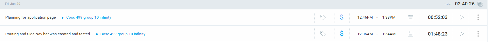

## Current Tasks  
- **#1:** Application page planning
- **#2:** Routing and Side Nav bar creation

## Progress Update  
| TASK/ISSUE # | DESCRIPTION                                                                  | STATUS     |  
|--------------|-------------------------------------------------------------------------------|-----------|  
| Task 1       | 	    Planning for the application page                                       | Completed |  
| Task 2       | 	     Routing and Side Nav bar was created and tested                        | Completed |  

## Cycle Goal Review  

### Reflection  
This cycle was focused on the initial stages of the application page development. The routing setup and navigation components were successfully created and tested.

### Retrospective  
The tasks were completed efficiently, but we encountered some challenges with aligning the layout to ensure it was responsive.

## Next Cycle Goals  
- **#1:** Finalize the routing implementation
- **#2:** Start with the frontend development of the application page

----------------------------------------------------------------------------------------------------------------------------------------------------------------------------------------
## 22 June, Sunday 1:06PM–3:21PM & 4:02PM–6:53PM

**Clockify:** 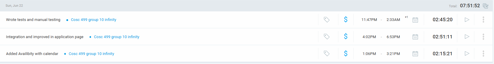

## Current Tasks  
- **#1:** Wrote tests and manual testing
- **#2:** Integration and improvement in application page
- **#3:** Added availability with calendar

## Progress Update  
| TASK/ISSUE # | DESCRIPTION                                                                  | STATUS     |  
|--------------|-------------------------------------------------------------------------------|-----------|  
| Task 1       | 	    Wrote tests and manual testing                                           | Completed |  
| Task 2       |      Integration and improvements in application page                        | Completed |  
| Task 3       |      Added availability with calendar                                         | Completed |  

## Cycle Goal Review  

### Reflection  
This cycle was focused on finalizing the backend testing and improving the application page by adding the availability calendar.

### Retrospective  
The tasks were completed successfully, but further testing is required to ensure smooth integration with the backend.

## Next Cycle Goals  
- **#1:** Debugging and final testing of the allocation page
- **#2:** Further integration with backend APIs

-------------------------------------------------------------------------------------------------------------------------------------------------------------------------------------------

## 24 June, Tuesday 11:02AM–1:07PM

**Clockify:** 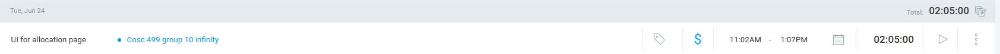

## Current Tasks  
- **#1:** UI for allocation page

## Progress Update  
| TASK/ISSUE # | DESCRIPTION                                                                  | STATUS     |  
|--------------|-------------------------------------------------------------------------------|-----------|  
| Task 1       | 	    UI for allocation page                                                   | Completed |  

## Cycle Goal Review  

### Reflection  
This cycle focused on the UI design and development for the allocation page, ensuring the interface is clean and functional.

### Retrospective  
The UI was completed without major issues, though some fine-tuning may be required for responsiveness.

## Next Cycle Goals  
- **#1:** Integrate backend with allocation page
- **#2:** Test UI functionality

------------------------------------------------------------------------------------------------------------------------------

## 25 June, Wednesday 11:00AM–2:32AM & 8:24PM–2:32AM

**Clockify:** 

## Current Tasks  
- **#1:** TA allocation page

## Progress Update  
| TASK/ISSUE # | DESCRIPTION                                                                  | STATUS     |  
|--------------|-------------------------------------------------------------------------------|-----------|  
| Task 1       | 	    TA allocation page                                                       | Completed |  

## Cycle Goal Review  

### Reflection  
This cycle was focused on working through the features and bugs related to the TA allocation page, with a lot of time spent ensuring the functionality.

### Retrospective  
Although the main functionality was completed, there are still some bugs to be resolved.

## Next Cycle Goals  
- **#1:** Resolve bugs in the allocation page
- **#2:** Test new features

---------------------------------------------------------------------------------------------------------------------------------------------------------------------------------------------

## 26 June, Thursday 2:01PM–5:30PM

**Clockify:** 

## Current Tasks  
- **#1:** Bug in allocation page

## Progress Update  
| TASK/ISSUE # | DESCRIPTION                                                                  | STATUS     |  
|--------------|-------------------------------------------------------------------------------|-----------|  
| Task 1       | 	    Bug in allocation page                                                   | In progress |  

## Cycle Goal Review  

### Reflection  
This cycle was focused on identifying and fixing bugs that were preventing the allocation page from functioning correctly.

### Retrospective  
The bug is not fixed yet , but also testing is still required to verify that the fix works across all scenarios.

## Next Cycle Goals  
- **#1:** Finalize bug fixes
- **#2:** Continue with feature testings

---------------------------------------------------------------------------------------------------------------------------------------------------------------------------------------------
## 26 June, Thursday 
## Time Slots
- **6:32PM–7:44PM:** PR for allocation page and logs
- **9:27PM–10:29PM:** Team meeting about allocation

**Clockify:** 

## Current Tasks
- Finalize and submit PR for the allocation page, along with updating team logs.
- Attend team meeting to discuss allocation logic, upcoming adjustments, and task distribution.

## Progress Update
| TASK/ISSUE # | DESCRIPTION                                               | STATUS    |
|---------------|-----------------------------------------------------------|-----------|
| Task 1        | Created and submitted allocation page PR and updated logs | Completed |
| Task 2        | Team discussion on allocation plan, clarified task ownership, and reviewed logic improvements | Completed |

## Cycle Goal Review

### Reflection
The evening focused on completing the critical pull request to keep the frontend allocation page aligned with backend logic and new requirements. During the team meeting, discussed real-world challenges and finalized how to divide allocation-related tasks.

### Retrospective
The team achieved strong alignment on priorities and cleared any ambiguity regarding upcoming development. The logs are now detailed and ready for future retrospectives.

## Next Cycle Goals
- Incorporate feedback from the allocation PR review.
- Begin implementing improvements to the allocation logic based on the meeting decisions.
- Enhance testing coverage for allocation features.

---------------------------------------------------------------------------------------------------------------------------------------------------------------------------------------------

## 27 June, Friday 2025

## Time Slots
- **9:31AM–10:48AM:** Team meeting for task assignment
- **12:31PM–1:51PM:** Forgot and reset password page implementation
- **11:33PM–12:00AM (+1):** Team logs update

**Clockify:** 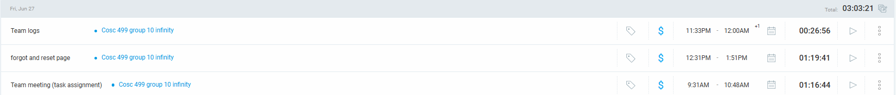

## Current Tasks
- Assign upcoming sprint tasks and clarify individual responsibilities.
- Develop and integrate forgot/reset password page, connect to backend API, and handle error flows.
- Update and finalize detailed team logs for transparent tracking.

## Progress Update
| TASK/ISSUE # | DESCRIPTION                                 | STATUS    |
|---------------|---------------------------------------------|-----------|
| Task 1        | Sprint planning meeting and task breakdown  | Completed |
| Task 2        | Implemented forgot/reset password functionality (frontend + backend integration) | Completed |
| Task 3        | Compiled and finalized team logs            | Completed |

## Cycle Goal Review

### Reflection
Morning started with a productive planning meeting to align on deliverables and assign priorities clearly. Later, focused on security-sensitive work for the forgot/reset flow — including token validation, error feedback, and UI polish. Finished the day updating logs, which helped consolidate learnings and maintain transparency.

### Retrospective
The day significantly improved overall project clarity. The forgot/reset feature is fully functional and nearly ready for staging. Logs are now up-to-date and prepared for team review.

## Next Cycle Goals
- Perform thorough testing on the forgot/reset password feature.
- Merge logs into main documentation and distribute to the team.
- Start next sprint tasks as per the morning assignment breakdown.

---------------------------------------------------------------------------------------------------------------------------------------------------------------------------------------------
## 29 June, Sunday 2025
**Clockify:** 

## Time Slots
- **1:32PM–6:18PM:** Forgot/reset page PR with frontend tests
- **7:49PM–9:57PM:** Application search reusable component

## Current Tasks
- Finalize and push PR for forgot/reset password feature, include comprehensive frontend tests (edge cases, token flows, UI/UX feedback).
- Develop reusable search component for application module to standardize code and improve maintainability.

## Progress Update
| TASK/ISSUE # | DESCRIPTION                                         | STATUS    |
|---------------|-----------------------------------------------------|-----------|
| Task 1        | Forgot/reset password PR and frontend test coverage | Completed |
| Task 2        | Refactored and implemented reusable search component for applications | Completed |

## Cycle Goal Review

### Reflection
Spent the afternoon polishing tests and wrapping up the forgot/reset PR. Validated all possible user scenarios and error handling cases. Later, focused on creating a modular search component — reducing code repetition and improving maintainability across different application views.

### Retrospective
Tests passed successfully, the PR is now in good shape for merging. The reusable search component simplifies future feature updates and promotes consistent UI.

## Next Cycle Goals
- Merge forgot/reset PR after final review.
- Integrate reusable search component into related pages (student view, coordinator view).
- Collect feedback from initial user testing sessions.

---------------------------------------------------------------------------------------------------------------------------------------------------------------------------------------------
## 30 June, Monday 2025

**Clockify:** 

## Time Slots
- **12:00AM–2:13AM:** Send offer integration completion
- **11:41AM–3:37PM:** Allocation module refactoring

## Current Tasks
- Finalize "send offer" feature, integrating frontend success feedback, backend communication, and error handling.
- Refactor allocation module to improve modularity, simplify logic, and enhance maintainability.

## Progress Update
| TASK/ISSUE # | DESCRIPTION                       | STATUS    |
|---------------|-----------------------------------|-----------|
| Task 1        | Integrated send offer functionality fully | Completed |
| Task 2        | Refactored allocation logic and improved structure | Completed |

## Cycle Goal Review

### Reflection
Worked through the night to finalize the offer sending workflow — included detailed user feedback with loading states and error cases. During the day, focused on a deep refactor of allocation logic to prepare for future scalability and cleaner code.

### Retrospective
Both critical backend integrations and frontend user experience have improved. Allocation logic is now easier to test and maintain, setting a strong foundation for upcoming MVP milestones.

## Next Cycle Goals
- Test allocation refactor thoroughly with realistic data.
- Deploy "send offer" feature to staging and verify in real-world flows.
- Start new MVP-related tasks per the updated roadmap.
---------------------------------------------------------------------------------------------------------------------------------------------------------------------------------------------
## 1 July, Tuesday 2025

**Clockify:** 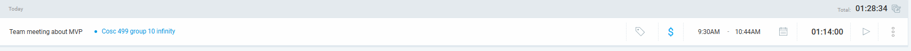

## Time Slot
- **9:30AM–10:44AM:** Team meeting about MVP

## Current Tasks
- Conduct MVP strategy meeting to finalize scope, discuss milestones, assign owners, and define success criteria.

## Progress Update
| TASK/ISSUE # | DESCRIPTION                     | STATUS    |
|---------------|---------------------------------|-----------|
| Task 1        | Planned MVP scope and assigned tasks | Completed |

## Cycle Goal Review

### Reflection
Strategic planning discussion to align on MVP features, set high-level goals, and map concrete next actions. Defined timelines and reviewed risk areas.

### Retrospective
The team is aligned and clear on responsibilities, reducing blockers for the upcoming sprint.

## Next Cycle Goals
- Start implementation of MVP tasks immediately.
- Monitor progress and adjust scope in upcoming sync-ups.

---------------------------------------------------------------------------------------------------------------------------------------------------------------------------------------------