## Thursday (July 15-17)

### Timesheet
Clockify report

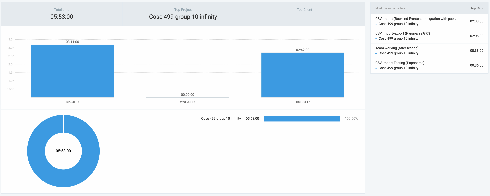

### Current Tasks (Provide sufficient detail)
| # | Task | Key Work Items This Cycle |
|---|------|---------------------------|
| **1** | **CSV Export Refactor** | Align backend export logic with PapaParse JSON and verify round‑trip with sample CSV files. |
| **2** | **CSV Import Refactor** | Unify import pipeline to consume PapaParse JSON and add robust field, type. |
| **3** | **Move CSV Import to Dedicated Page** | Replace modal with a standalone `/import` page and set up routing, layout, and file uploads progress feedback (state management indicator). |
| **4** | **CSV Preview UI Enhancement** | Render data rows (`<tbody>`), improve styling, and add label and id for the file input to improve accessibility. |
| **5** | **Test Suite Strengthening** | Add `SectionServiceTest.java` (normal and edge cases) and update `SectionCsvImport.test.tsx`; target at least 85 percent coverage. |
| **6** | **Error Handling Improvements** | Provide clear, actionable messages for duplicate data, unique‑constraint violations, and format errors. |

### Progress Update (since July 14, 2025) 
| TASK / ISSUE # | STATUS |
|----------------|--------|
| #1: CSV Export Refactor | Complete |
| #2: CSV Import Refactor | Complete |
| #3: Move CSV Import to Dedicated Page | In Progress |
| #4: CSV Preview UI Enhancement | In Progress |
| #5: Test Suite Strengthening | Complete |
| #6: Error Handling Improvements | Complete |

### Cycle Goal Review (Reflection: what went well, what was done, what didn't; Retrospective: how is the process going and why?)
The primary goals for this cycle were to migrate both CSV import and export to Papaparse on the frontend (exchanging JSON with the backend), increase automated‑test coverage, and improve error messaging.

What was done:
* Refactored CSV Export / Import so that both now use Papaparse on the frontend and exchange the same JSON schema with the Spring Boot backend.
* Added SectionServiceTest.java and updated SectionCsvImport.test.tsx, pushing overall test coverage above 85 %.
* Fixed the CSV preview table so it renders all data rows correctly.
* Implemented clear error messages for duplicate records, unique‑key violations, and invalid formats.

What was not done:
* The full migration of the import workflow to a dedicated page.
* Some styling polishment tasks were deferred.

### Next Cycle Goals (What are you going to accomplish during the next cycle)
* Provide a downloadable sample CSV template so users have a clear reference for "import from csv"
* Improve CSV import feedback: replace the current raw output (e.g., “JSON import completed. Success: 1, Errors: 4” followed by long SQL duplicate‑key traces) with concise, user‑friendly success and error summaries  (updating the messages and removing long SQL traces)
* Move the Import workflow to its own page (do this cycle if it can be completed quickly)
* Improve the UX for Create Section / Create Course: either split them into separate pages or clearly separate the two areas on the same page

### Next Cycle Goals (What are you going to accomplish during the next cycle)
* Finish UI polish – Style table, add empty‑state and success banners.
* Make Import feature in another page.
### Next Cycle Goals
1. Finish Import Page: complete component migration, add progress indicators, and remove legacy modal code.  
2. Polish UI and UX: style tables and add empty‑state and success banners across import and export pages.  

------------------------------------------------------------------------------------------------------
## Monday (July 11-14)

### Timesheet
Clockify report

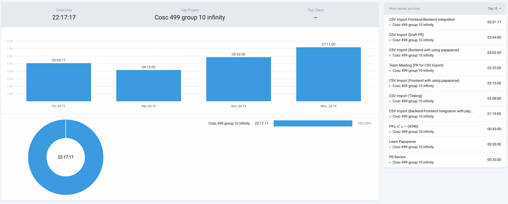

### Current Tasks (Provide sufficient detail)
| # | Task | Key Work Items This Cycle |
|---|------|---------------------------|
| **1** | **CSV Import Backend** | Finish the parser, add field/type/time validation, and return structured error messages. |
| **2** | **CSV Import Frontend** | Build the upload form and preview table, show basic progress, and wire calls to the backend. |
| **3** | **CSV Import Integration** | Complete frontend-backend integration. |
| **4** | **CSV Import Testing** | Write unit + integration test scenarios for CSV import feature. |

### Progress Update (since July 10, 2025) 
| TASK / ISSUE # | STATUS |
|----------------|--------|
| #1: CSV Import Backend | Complete |
| #2: CSV Import Frontend | Complete |
| #3: CSV Import Integration | Complete |
| #4: CSV Import Testing | In Progress |

### Cycle Goal Review (Reflection: what went well, what was done, what didn't; Retrospective: how is the process going and why?)
The primary goals for this cycle were to deliver a fully‑functional CSV import end‑to‑end and to begin comprehensive testing.

What was done:
* Backend parser and validation completed; returns clear error objects.
* Frontend upload flow built with file preview and basic progress indicator.
* Frontend‑backend integration verified with real CSV files; large‑file handling works.

What was not done:
* The test suite has not been created yet. writing tests will begin next cycle.

### Next Cycle Goals (What are you going to accomplish during the next cycle)
* Finish CSV Testing: add unit and edge‑case tests
* Migrate both CSV import and export to Papaparse on the frontend and align the shared JSON schema, as suggested by Alex.

------------------------------------------------------------------------------------------------------
## Monday (July 8-10)

### Timesheet
Clockify report

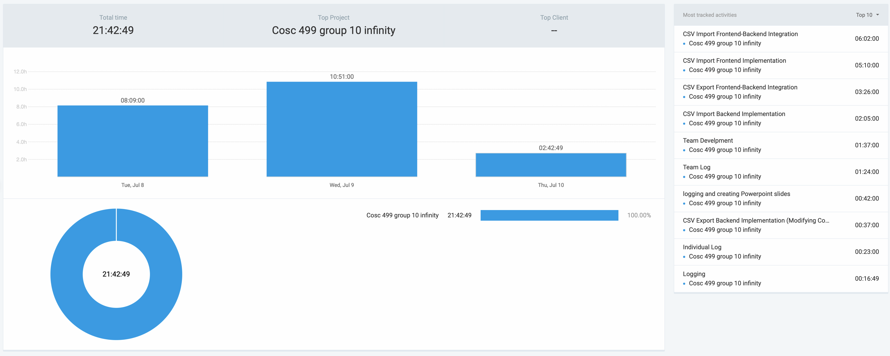

### Current Tasks (Provide sufficient detail)
| # | Task | Key Work Items This Cycle |
|---|------|---------------------------|
| **1** | **CSV Export** | Create backend export endpoint, link it to the UI download button, and verify round‑trip with sample CSVs. |
| **2** | **CSV Import** | Build the backend parser, set validation rules (required fields, data types, timestamps), and sketch the upload flow on the frontend. |

### Progress Update (since July 7, 2025) 
| TASK / ISSUE # | STATUS |
|----------------|--------|
| #1: CSV Export Implementation | Complete |
| #2:  CSV Import Implementation | In Progress |

### Cycle Goal Review (Reflection: what went well, what was done, what didn't; Retrospective: how is the process going and why?)
The primary goals for this cycle were to deliver a working CSV export and to start implementing CSV import.

What was done:
* Completed CSV Export: backend endpoint, UI download flow, and round‑trip tests all pass.
* Drafted CSV Import design: backend parsing started and validation requirements defined.

What was not done:
* Frontend upload form and full validation for CSV Import are still pending.

### Next Cycle Goals (What are you going to accomplish during the next cycle)
* Finish CSV Import: complete backend logic, build the upload form, and add validation + error handling.
* Integrate import/export workflows and expand the test suite to cover import scenarios.

------------------------------------------------------------------------------------------------------

## Monday (July 4-7)

### Timesheet
Clockify report
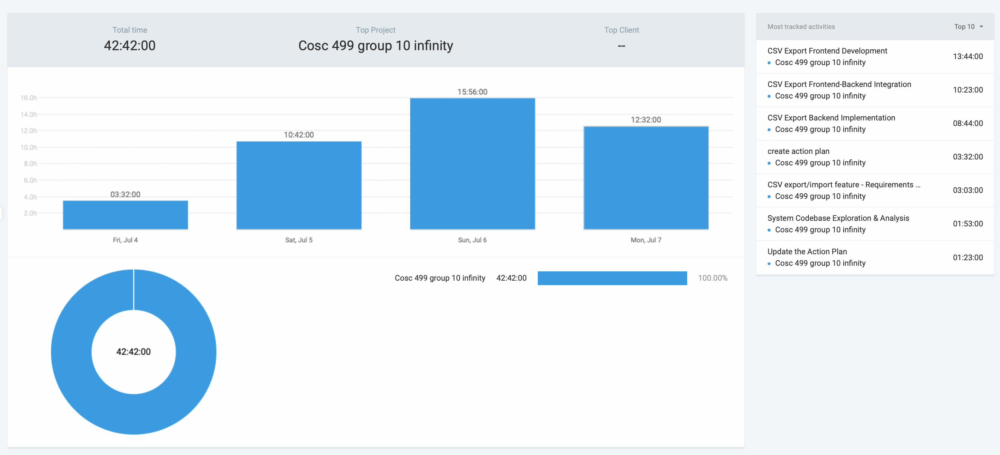

### Current Tasks (Provide sufficient detail)
* #1: Planning - Action plan creation and task breakdown
* #2: CSV export feature - Implement section data export to CSV functionality
* #3: CSV import feature - Implement section data import from CSV functionality
* #4: Improving the design - UI/UX improvements for CSV functionality

### Progress Update (since July 3, 2025) 
<table>
    <tr>
        <td><strong>TASK/ISSUE #</strong>
        </td>
        <td><strong>STATUS</strong>
        </td>
    </tr>
    <tr>
        <td>#1: Planning - Action plan creation and task breakdown
        </td>
        <td>Complete
        </td>
    </tr>
    <tr>
        <td>#2: CSV export feature - Implement section data export to CSV functionality
        </td>
        <td>In Progress
        </td>
    </tr>
    <tr>
        <td>#3: CSV import feature - Implement section data import from CSV functionality
        </td>
        <td>In Progress
        </td>
    </tr>
    <tr>
        <td>#4: Improving the design - UI/UX improvements for CSV functionality
        </td>
        <td>In Progress
        </td>
    </tr>
</table>

### Cycle Goal Review (Reflection: what went well, what was done, what didn't; Retrospective: how is the process going and why?)
My primary goals for this cycle were to implement a complete CSV export/import feature for course sections, focusing on backend API development and frontend integration.

What was done:
* Created a detailed action plan.
* Built the backend API structure, including controllers and initial CSV validation logic.
* Developed the  frontend UI for both export and import pages.

What was not done:
* The core backend logic for database integration is still pending. This includes fetching data from the DB for exports and saving data to the DB for imports.
* End-to-end testing will be conducted after the database logic is implemented, which is the plan for the next cycle.

### Next Cycle Goals (What are you going to accomplish during the next cycle)
* Complete Backend Integration: Collaborate with the team to implement the core database logic for both the CSV export (retrieving data) and import (saving data) features
* Finalize and Test: Conduct end-to-end testing of the full feature, from UI interaction to database changes, to ensure it functions as expected.
* Improve Test Coverage for New Feature: Write comprehensive unit tests for the new backend service logic, covering scenarios like successful imports, validation errors, and new course creation to achieve at least 85% coverage for the new code.

## Thursday (June 17-19)

### Timesheet
Clockify report
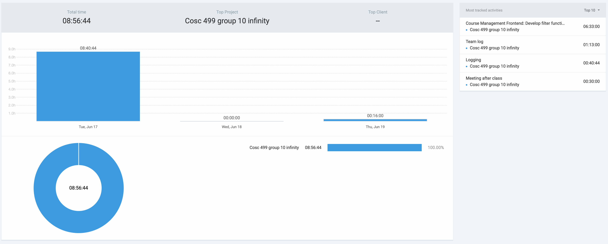

### Current Tasks (Provide sufficient detail)
* #1: Complete frontend–backend integration for the Course Management page and confirm successful data exchange.
* #2: Begin implementing role-based access control so only Coordinator users can access the page.

### Progress Update (since June 16, 2025) 
<table>
    <tr>
        <td><strong>TASK/ISSUE #</strong>
        </td>
        <td><strong>STATUS</strong>
        </td>
    </tr>
    <tr>
        <td>#1: Complete frontend–backend integration for the Course Management page
        </td>
        <td>Complete
        </td>
    </tr>
    <tr>
        <td>#2: Begin implementing role-based access control
        </td>
        <td>Complete
        </td>
    </tr>
</table>

### Cycle Goal Review (Reflection: what went well, what was done, what didn't; Retrospective: how is the process going and why?)
My primary goals for this cycle were to integrate the frontend filter with the backend API and implement role-based access control, both of which were successfully achieved.

What was done:
* Completed the frontend-backend integration, allowing the filter component to communicate with the API.
* Confirmed that filter parameters are correctly passed and the backend returns the expected filtered data.
* Implemented role-based access control, ensuring only users with the 'Coordinator' role can access the Course Management page.

What was not done:
* I was unable to work on June 18th and 19th due to a fever, which delayed progress on other items like testing.

### Next Cycle Goals (What are you going to accomplish during the next cycle)
* Finalize and merge the frontend/backend integration for the course filter feature.
* Refine the UI for the Course Management (Filter) page.
* Implement the frontend for the Course Creation Page.

## Monday (June 13-16)

### Timesheet
Clockify report
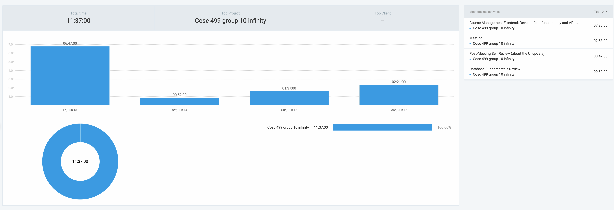

### Current Tasks (Provide sufficient detail)
#1: Implement filter component and pass selected parameters to backend API (frontend side)

### Progress Update (since June 5, 2025) 
<table>
    <tr>
        <td><strong>TASK/ISSUE #</strong>
        </td>
        <td><strong>STATUS</strong>
        </td>
    </tr>
    <tr>
        <td>Implement filter component and pass selected parameters to backend API (frontend side)
        </td>
        <td>In Progress
        </td>
    </tr>
</table>

### Cycle Goal Review (Reflection: what went well, what was done, what didn't; Retrospective: how is the process going and why?)
My primary goal for this cycle was to make the Course Management filters functional on the frontend and ensure the selected parameters reach the backend endpoint.

What was done:
* Completed the filter UI component and made it capture user input and send requests to the API in the correct format.
* Aligned verbally with the backend side on the endpoint URL and request/response schema

What was not done:
* Could not integrate the frontend with the backend because my database setting was still incomplete
* Implementing full role-based access control so only Coordinator users can access the page has been deferred until after integration.
* End-to-end tests and UI bug fixes remain unstarted because they depend on the integration

### Next Cycle Goals (What are you going to accomplish during the next cycle)
* Complete frontend–backend integration for the Course Management page and confirm successful data exchange.
* Begin implementing role-based access control so only Coordinator users can access the page.

## Thursday (June 10-12)

### Timesheet
Clockify report
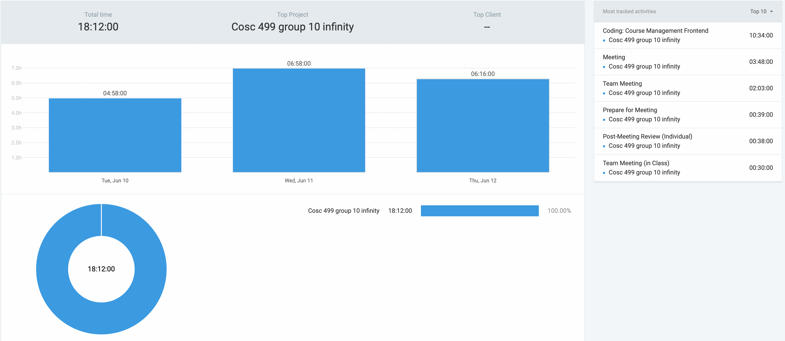

### Current Tasks (Provide sufficient detail)
* #1: Finalize the UI for the Course Management page.
* #2: Connect the Course Management page frontend to the backend API.

### Progress Update (since June 5, 2025) 
<table>
    <tr>
        <td><strong>TASK/ISSUE #</strong>
        </td>
        <td><strong>STATUS</strong>
        </td>
    </tr>
    <tr>
        <td>#1: Update Course Management UI (fix filters, adjust layout, split page)
        </td>
        <td>Complete
        </td>
    </tr>
    <tr>
        <td>#2: Create function to send data to the API
        </td>
        <td>Complete
        </td>
    </tr>
    <tr>
        <td>#3: Integrate Course Management Frontend with Backend
        </td>
        <td>In Progress
        </td>
    </tr>
</table>

### Cycle Goal Review (Reflection: what went well, what was done, what didn't; Retrospective: how is the process going and why?)
My primary goal for this cycle was to complete the planned UI overhaul and establish the foundation for backend integration. While full integration is still In Progress, I successfully delivered the core UI updates and initial backend setup.

What was done:
* Completed the UI overhaul on schedule, improving both appearance and usability.
* Implemented preparatory work for backend connectivity, including API scaffolding.

What was not done:
* Integration between the frontend and backend.
* Restricting page access so that only users logged in as Coordinator can view this page.

### Next Cycle Goals (What are you going to accomplish during the next cycle)
* Complete the full frontend and backend integration for the Course Management page.
* Implement role-based access control so that only users logged in as Coordinator can access this page
* Do testing of the features and functionality.
* Address and fix any bugs or remaining UI issues.

## Monday (June 6-9)

### Timesheet
Clockify report
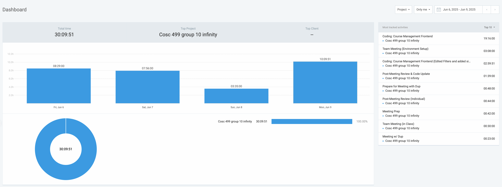

### Current Tasks (Provide sufficient detail)
* #1: Set up and troubleshoot the local development environment.
* #2: Implement frontend for TA Coordinator's "Course Management" page.

### Progress Update (since June 5, 2025) 
<table>
    <tr>
        <td><strong>TASK/ISSUE #</strong>
        </td>
        <td><strong>STATUS</strong>
        </td>
    </tr>
    <tr>
        <td>#1: Local Environment Setup
        </td>
        <td>Complete
        </td>
    </tr>
    <tr>
        <td>#2: Course Management UI Implementation
        </td>
        <td>In Progress
        </td>
    </tr>
</table>

### Cycle Goal Review (Reflection: what went well, what was done, what didn't; Retrospective: how is the process going and why?)
My primary goal for this cycle was the initial implementation of the Course Management frontend. While the overall feature is still **In Progress**, I successfully completed the core functionality. 

**What was done:**
* I created a functional UI for viewing and filtering courses, accessible via a new sidebar link.
* The page displays a list of courses from mock data.
* A robust filtering system is in place, allowing users to filter by Keyword, Term, Department Code, and Course Number.
* The "Add Course" form works visually, appending a new course to the list on the frontend.

**What was not done:**
* The CSV upload functionality has not been implemented yet.
* The current UI styling is functional and will be refined to match the design wireframes after the feature scope is finalized.

### Next Cycle Goals (What are you going to accomplish during the next cycle)
* Finalize the scope of the Course Management feature with the team.
* Implement the required frontend changes based on the team's decisions.
* Refine UI styling to align with the design wireframes in the design document.
* Prepare for backend integration by understanding the required API endpoints once they are defined.

## Thursday (June 2-5)
### Timesheet
Clockify report
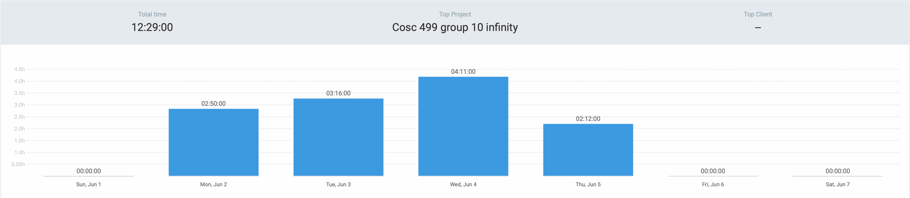

### Current Tasks (Provide sufficient detail)
* #1: Implement “Course viewing, filtering, and creation” feature. (frontend)
* #2: Record transcript & walkthrough video for DFD Lv 1.

### Progress Update (since June 2, 2025)
| TASK/ISSUE # | STATUS | Category | Activity Summary | Date(s) | Time Spent |
| :--- | :--- | :--- | :--- | :--- | :--- |
| #1 | In Progress | Feature Dev. (TA Coordinator) | • Implement “Course viewing, filtering, and creation” feature  • Preparation & short sync meeting | 3 – 5 Jun | **4 h 46 m** |
| #2 | Complete | Video & Docs (DFD Lv 1) | • Record transcript & walkthrough video  • Video preparation and scene planning | 3 – 4 Jun | **1 h 43 m** |
| #3 | Complete | Meetings & Coordination | • General team meetings (DFD status, user‑story sub‑issues) | 3 & 4 Jun | **2 h 49 m** |
| #4 | Complete | Logging / Admin | • Entered detailed time logs in Clockify | 5 Jun | **0 h 21 m** |
| **Total** | | | | | **9 h 39 m** |

### Cycle Goal Review (Reflection: what went well, what was done, what didn't; Retrospective: how is the process going and why?)
This cycle focused on two main areas: developing the course management feature and creating documentation for the DFD. Progress was made on implementing the user interface for course viewing and creation. The walkthrough video and transcript for the Level 1 DFD were completed.

### Next Cycle Goals (What are you going to accomplish during the next cycle)
* Set up the local development environment.
* Implement frontend for TA Coordinator's "Course Management" page.

## Monday (May 31 - June 2)

### Timesheet
Clockify report
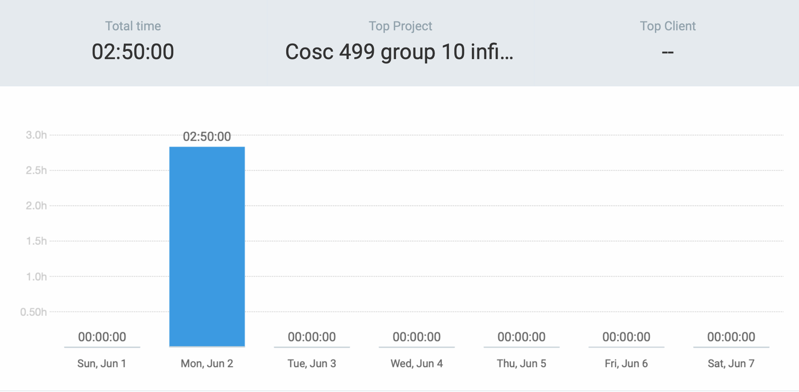

### Current Tasks (Provide sufficient detail)
* #1: Write DFD Level 0 & 1 narrative description for the project document.

### Progress Update (since May 30, 2025)
| TASK/ISSUE # | STATUS | Category | Activity | Date(s) | Time Spent |
| :--- | :--- | :--- | :--- | :--- | :--- |
| #1 | Complete | DFD & ER | Wrote **DFD Description** (Level 0 & 1 narrative for project wiki) | 2 Jun | **2 h 50 m** |
| **Total** | | | | | **2 h 50 m** |

### Cycle Goal Review (Reflection: what went well, what was done, what didn't; Retrospective: how is the process going and why?)
I completed a detailed  description of the Level 0 and Level 1 data-flow diagrams. This work involved clarifying each external entity, data store, and process, preparing the documentation for the upcoming peer review.

### Next Cycle Goals (What are you going to accomplish during the next cycle)
* Record transcript & walkthrough video for DFD Lv 1.
* Implement “Course viewing, filtering, and creation” feature.

## Friday (May 25-30)

### Timesheet
Clockify report
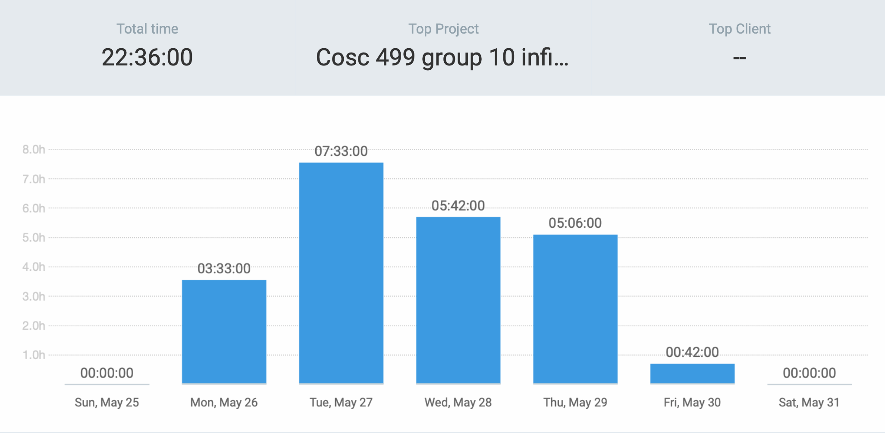

### Current Tasks (Provide sufficient detail)
* #1: Fill *Team Planning* document (Experience / Strengths / Learning Goals sections).
* #2: Self-Study Spring Boot tutorial (DI, REST controller, basic CRUD).
* #3: DFD & ER collaborative work.

### Progress Update
| TASK/ISSUE # | STATUS | Category | Activity | Date(s) | Time Spent |
| :--- | :--- | :--- | :--- | :--- | :--- |
| #1 | Complete | Documentation | Drafted *Team Planning* document – sections **Experience / Strengths / Learning Goals** | 27 May | **3 h 19 m** |
| #2 | Complete | Self‑Study | Spring Boot tutorial (DI, REST controller, basic CRUD) | 28 & 29 May | **6 h 42 m** |
| #3 | Complete | DFD & ER Work | • DFD/ER review (COSC 310 reference)  • DFD meeting preparation  • Individual DFD review  • Team DFD meeting (in‑class)  • Follow‑up DFD meeting / fixes | 26 – 30 May | **12 h 35 m** |
| **Total** | | | | | **22 h 36 m** |

 
### Cycle Goal Review (Reflection: what went well, what was done, what didn't; Retrospective: how is the process going and why?)
Key achievements for this cycle include drafting sections of the team planning document, completing over 6 hours of self-study on Spring Boot, and significantly advancing the DFD/ER diagrams. We consolidated feedback to split the 'User' entity into more specific roles and updated the Level 0 & 1 diagrams accordingly.

### Next Cycle Goals (What are you going to accomplish during the next cycle)
* Write DFD Description (Level 0 & 1 narrative for project wiki).
