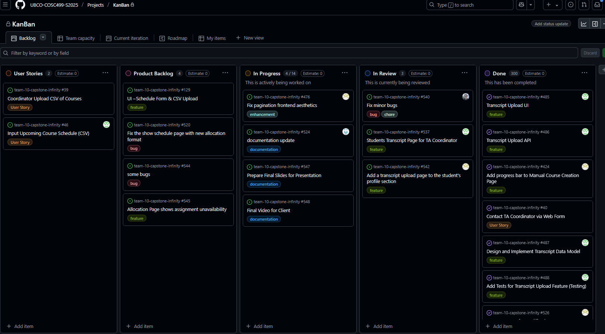
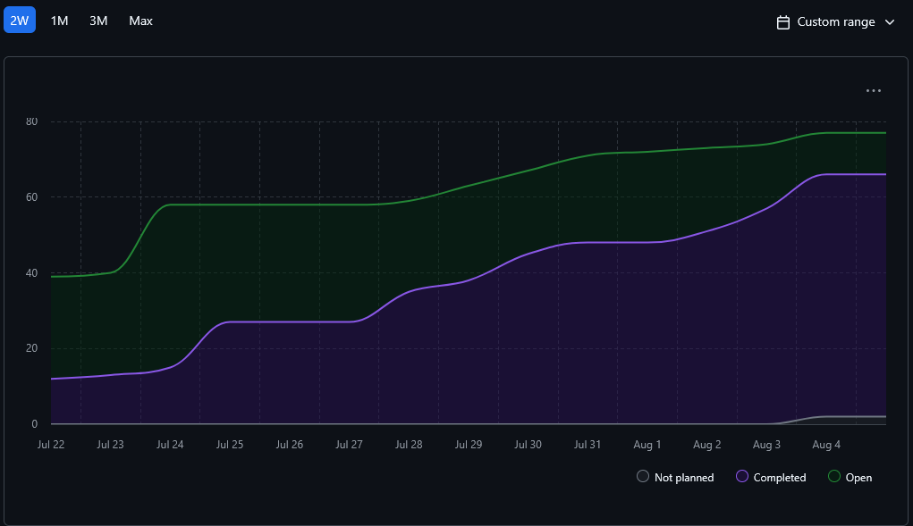

# Weekly Team Log

## Date Range:

* **8/1–8/4**

---

## Features in the Project Plan Cycle:
* Documentation update for final submission
* PDF student upload page
* Aesthetic fixes and validation for the add section page
* Adding transcript upload page to student profile
* Coordinator transcript management page
* Course updates with toastify and application filter fixes
* Updating User Details and glitching for section creation
* Audit logs for the rest of the services

---

## Associated Tasks from Project Board:

| Task ID | Description                                                       | Feature                         | Assigned To       | Status     |
| ------- | ----------------------------------------------------------------- | --------------------------------| ----------------- | ---------- |
| [#516](https://github.com/UBCO-COSC499-S2025/team-10-capstone-infinity/issues/516)|  Improve student filter to assign student to exam. Make the dropdown containing all students and the coordinator can select from that. | Improve student filter   | Aakash       | Complete |
| [#521](https://github.com/UBCO-COSC499-S2025/team-10-capstone-infinity/issues/521) | Add seeded capstone course with a need and some sections                    | Add seeded capstone course with a need and some sections                   | Alex         | Complete |
| [#471](https://github.com/UBCO-COSC499-S2025/team-10-capstone-infinity/issues/471)|Add application , notification, course, and profile service to the audit log cycles.                                                              | add services to audit log | Dup        | Complete |
| [#485](https://github.com/UBCO-COSC499-S2025/team-10-capstone-infinity/issues/485) | **Frontend**: build Transcript CSV upload UI — add upload to student portal, parse/preview, send to backend, show results                            | Transcript Upload UI          | Seiya       | Complete |
| [#486](https://github.com/UBCO-COSC499-S2025/team-10-capstone-infinity/issues/486) | **Backend**: create Transcript CSV import API — endpoint, validation, save, logging, error handling                                                  | Transcript CSV API            | Seiya       | Complete |
| [#487](https://github.com/UBCO-COSC499-S2025/team-10-capstone-infinity/issues/487) | Design & implement Transcript data model — DB schema, migrations, link to student accounts                                                           | Transcript Data Model         | Seiya       | Complete |
| [#488](https://github.com/UBCO-COSC499-S2025/team-10-capstone-infinity/issues/488) | Add tests for Transcript upload feature — unit/integration tests, edge cases                                                                         | Transcript Tests              | Seiya       | Complete |
| [#523](https://github.com/UBCO-COSC499-S2025/team-10-capstone-infinity/issues/523)| make the logo show up in the header and improve security for getUserDetails| small fixes to previous problems                                                                 | Dup     | Complete |
| [#524](https://github.com/UBCO-COSC499-S2025/team-10-capstone-infinity/issues/524)| ER diagrams, use cases, DFDs, feature lists, everything that is part of the 65% in the canvas rubric.                                                                         | documentation update                 | Dup         | In Progress  |
| [#476](https://github.com/UBCO-COSC499-S2025/team-10-capstone-infinity/issues/476)| The bars for pagination stretch out and need a design change         | Fix pagination frontend aesthetics              | Mandeep        | In Progress   |
| [#510](https://github.com/UBCO-COSC499-S2025/team-10-capstone-infinity/issues/510) | Hidden pages improve which are not directly visible          |Improve course related pages including the details one(s)      | Mandeep       | Complete   |
| [#537](https://github.com/UBCO-COSC499-S2025/team-10-capstone-infinity/issues/537) | Make transcripts easily viewable by coordinators                  | Transcript Management UI          | Seiya       | In Review |
| [#540](https://github.com/UBCO-COSC499-S2025/team-10-capstone-infinity/issues/540) | Minor bug and aesthetic fixes              | Sections, transcript, general          | Alex       | In Review |
| [#542](https://github.com/UBCO-COSC499-S2025/team-10-capstone-infinity/issues/542) | Add transcript upload page to student profile             | Transcript UI         | Mandeep       | In Review |
| [#547](https://github.com/UBCO-COSC499-S2025/team-10-capstone-infinity/issues/547)| Prepare Final Slides for Presentation         | Final submission     | Team        |
| [#548](https://github.com/UBCO-COSC499-S2025/team-10-capstone-infinity/issues/548)| Final Video for Client         | Final submission     | Team        | 

### Alternatively, include image of the project board with tasks and status:

## Tasks for Next Cycle:
| Task ID | Description                                                                                   | Estimated Time (hrs) | Assigned To      |
| ------- | --------------------------------------------------------------------------------------------- | -------------------- |  ---------------- |
| [#524](https://github.com/UBCO-COSC499-S2025/team-10-capstone-infinity/issues/524)| ER diagrams, use cases, DFDs, feature lists, everything that is part of the 65% in the canvas rubric.                                                                         | 15                | Dup         | 
| [#476](https://github.com/UBCO-COSC499-S2025/team-10-capstone-infinity/issues/476)| The bars for pagination stretch out and need a design change         | 15      | Mandeep        |
| [#547](https://github.com/UBCO-COSC499-S2025/team-10-capstone-infinity/issues/547)| Prepare Final Slides for Presentation         | 3      | Team        |
| [#548](https://github.com/UBCO-COSC499-S2025/team-10-capstone-infinity/issues/548)| Final Video for Client         | 3      | Team        | 

## Burn-up Chart (Velocity):

## Times for Team/Individual:

| Team Member | Logged Hours |
| ----------- | ------------ |
| Aakash      | 07:23        |
| Alex        | 8:23        |
| Allen       | 00:00        |
| Dup         | 16:03        |
| Eddy        | 00:00        |
| Mandeep     | 15:42        |
| Seiya       | 28:28        |

## Completed Tasks:
| Task ID                                                                            | Description                                                                 | Completed By |
| ---------------------------------------------------------------------------------- | --------------------------------------------------------------------------- | ------------ |
| [#485](https://github.com/UBCO-COSC499-S2025/team-10-capstone-infinity/issues/485) | **Frontend**: build Transcript CSV upload UI — add upload to student portal, parse/preview, send to backend, show results                            | Seiya       | 
| [#486](https://github.com/UBCO-COSC499-S2025/team-10-capstone-infinity/issues/486) | **Backend**: create Transcript CSV import API — endpoint, validation, save, logging, error handling                                                  |  Seiya       | 
| [#487](https://github.com/UBCO-COSC499-S2025/team-10-capstone-infinity/issues/487) | Design & implement Transcript data model — DB schema, migrations, link to student accounts                                                           |Seiya       | 
| [#488](https://github.com/UBCO-COSC499-S2025/team-10-capstone-infinity/issues/488) | Add tests for Transcript upload feature — unit/integration tests, edge cases                                                                         | Seiya       | 
| [#523](https://github.com/UBCO-COSC499-S2025/team-10-capstone-infinity/issues/523)| make the logo show up in the header and improve security for getUserDetails| Dup     | 
| [#510](https://github.com/UBCO-COSC499-S2025/team-10-capstone-infinity/issues/510) | Hidden pages improve which are not directly visible          | Mandeep       | 
| [#521](https://github.com/UBCO-COSC499-S2025/team-10-capstone-infinity/issues/521) | Add seeded capstone course with a need and some sections                                                                                  | Alex       | 
| [#516](https://github.com/UBCO-COSC499-S2025/team-10-capstone-infinity/issues/516)|  Improve student filter to assign student to exam. Make the dropdown containing all students and the coordinator can select from that.| Aakash |

## In Progress Tasks/ To do:
| Task ID | Description                                                                                   | Assigned To      |
| ------- | --------------------------------------------------------------------------------------------- | ---------------- |
| [#524](https://github.com/UBCO-COSC499-S2025/team-10-capstone-infinity/issues/524)| ER diagrams, use cases, DFDs, feature lists, everything that is part of the 65% in the canvas rubric.                                                                              | Dup         | 
| [#476](https://github.com/UBCO-COSC499-S2025/team-10-capstone-infinity/issues/476)| The bars for pagination stretch out and need a design change          | Mandeep        | \
| [#537](https://github.com/UBCO-COSC499-S2025/team-10-capstone-infinity/issues/537) | Make transcripts easily viewable by coordinators                  |  Seiya       |
| [#540](https://github.com/UBCO-COSC499-S2025/team-10-capstone-infinity/issues/540) | Minor bug and aesthetic fixes              | Alex       
| [#542](https://github.com/UBCO-COSC499-S2025/team-10-capstone-infinity/issues/542) | Add transcript upload page to student profile             |Mandeep      
| [#547](https://github.com/UBCO-COSC499-S2025/team-10-capstone-infinity/issues/547)| Prepare Final Slides for Presentation            | Team        |
| [#548](https://github.com/UBCO-COSC499-S2025/team-10-capstone-infinity/issues/548)| Final Video for Client         |  Team        | 

## Overview:

During the period of August 1-4, the team completed:
* Audit logs for all services
* Seeded data for courses, sections, qualifications
* Fixed exam search for students
* Fixed course page and section bugs and aesthetics
* Added transcript PDF upload for students
* Various UI enhancements and bug fixes
