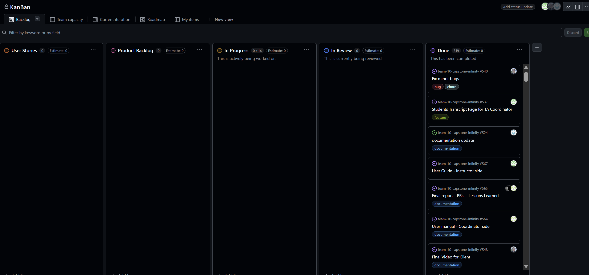
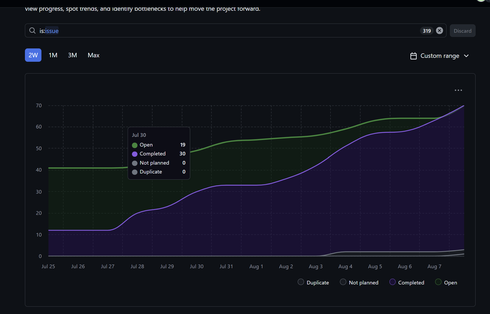
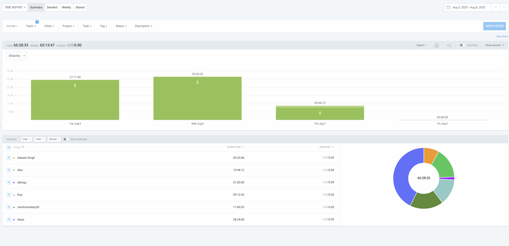

# Weekly Team Log

## Date Range:

* **8/5–8/8**

---

## Features in the Project Plan Cycle:
* Documentation update for final submission
* final presentation
* Test coverage improved for frontend 
* Video demo presentation

---

## Associated Tasks from Project Board:

| Task ID | Description                                                       | Feature                         | Assigned To       | Status     |
| ------- | ----------------------------------------------------------------- | --------------------------------| ----------------- | ---------- |
| [#548](https://github.com/UBCO-COSC499-S2025/team-10-capstone-infinity/issues/548)| Video presentation for client explaining all the system feature  |Client Video presentation   | Alex      | Complete |
| [#524](https://github.com/UBCO-COSC499-S2025/team-10-capstone-infinity/issues/524) | ER diagrams, use cases, DFDs, feature lists, everything that is part of the 65% in the canvas   | final report                 | Dup       | Complete |
| [#547](https://github.com/UBCO-COSC499-S2025/team-10-capstone-infinity/issues/471)| final presentation slides with all the expected components            | final presentation | Mandeep       | Complete |
| [#562](https://github.com/UBCO-COSC499-S2025/team-10-capstone-infinity/issues/562) | Student user manual for the final report                      |final report          | Allen      | Complete |
| [#564](https://github.com/UBCO-COSC499-S2025/team-10-capstone-infinity/issues/564) |  User Manual for Co-ordinator         | final report         | Aakash     | Complete |
| [#559](https://github.com/UBCO-COSC499-S2025/team-10-capstone-infinity/issues/559)| Improve test coverge on frontend | Improve test coverage                          | Seiya    | Complete |
| [#567](https://github.com/UBCO-COSC499-S2025/team-10-capstone-infinity/issues/567) |   User manual for instructor side                                               | final report             | Seiya      | Complete  |
| [#565](https://github.com/UBCO-COSC499-S2025/team-10-capstone-infinity/issues/565) | final report- PR's and lesson learned            | final Report         | Seiya,Mandeep,aakash,Alex,Dup, Allen    | Complete |

### Alternatively, include image of the project board with tasks and status:

## Tasks for Next Cycle:
| Task ID | Description                                                                                   | Estimated Time (hrs) | Assigned To      |
| ------- | --------------------------------------------------------------------------------------------- | -------------------- |  ---------------- |
All Completed, Submission for final report, presentation slides,demo video for client and repo

## Burn-up Chart (Velocity):

## Times for Team/Individual:

| Team Member | Logged Hours |
| ----------- | ------------ |
| Aakash      | 05:23        |
| Alex        | 10:44       |
| Allen       | 01:00        |
| Dup         | 9:12       |
| Eddy        | 00:00        |
| Mandeep     | 11:43        |
| Seiya       | 28:24        |

## Completed Tasks:
| Task ID                                                                            | Description                                                                 | Completed By |
| ---------------------------------------------------------------------------------- | --------------------------------------------------------------------------- | ------------ |
| [#548](https://github.com/UBCO-COSC499-S2025/team-10-capstone-infinity/issues/548)| Video presentation for client explaining all the system feature  |Client Video presentation   | Alex      | Complete |
| [#524](https://github.com/UBCO-COSC499-S2025/team-10-capstone-infinity/issues/524) | ER diagrams, use cases, DFDs, feature lists, everything that is part of the 65% in the canvas   | final report                 | Dup       | Complete |
| [#547](https://github.com/UBCO-COSC499-S2025/team-10-capstone-infinity/issues/471)| final presentation slides with all the expected components            | final presentation | Mandeep       | Complete |
| [#562](https://github.com/UBCO-COSC499-S2025/team-10-capstone-infinity/issues/562) | Student user manual for the final report                      |final report          | Allen      | Complete |
| [#564](https://github.com/UBCO-COSC499-S2025/team-10-capstone-infinity/issues/564) |  User Manual for Co-ordinator         | final report         | Aakash     | Complete |
| [#559](https://github.com/UBCO-COSC499-S2025/team-10-capstone-infinity/issues/559)| Improve test coverge on frontend | Improve test coverage                          | Seiya    | Complete |
| [#567](https://github.com/UBCO-COSC499-S2025/team-10-capstone-infinity/issues/567) |   User manual for instructor side                                               | final report             | Seiya      | Complete  |
| [#565](https://github.com/UBCO-COSC499-S2025/team-10-capstone-infinity/issues/565) | final report- PR's and lesson learned            | final Report         | Seiya,Mandeep,aakash,Alex,Dup, Allen    | Complete |
| [#550](https://github.com/UBCO-COSC499-S2025/team-10-capstone-infinity/issues/550) | schedule view on student side was not showing timing assigned           | bug in schedule viewer         | Mandeep   | Complete |

## In Progress Tasks/ To do:
| Task ID | Description                                                                                   | Assigned To      |
| ------- | --------------------------------------------------------------------------------------------- | ---------------- |
All completed

## Overview:

During the period of August 5-8, the team completed:
* Documentation update for final submission
* final presentation
* Test coverage improved for frontend 
* Video demo presentation

