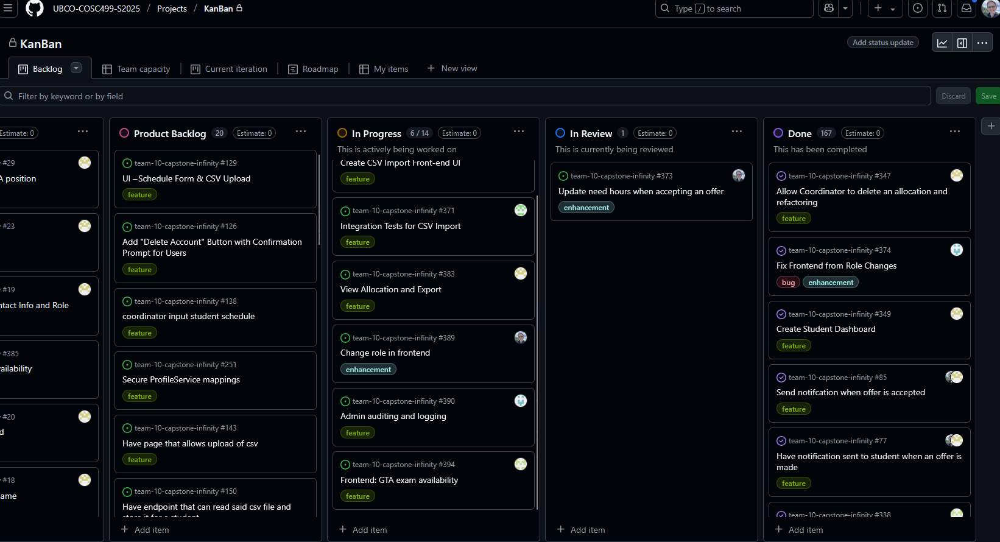
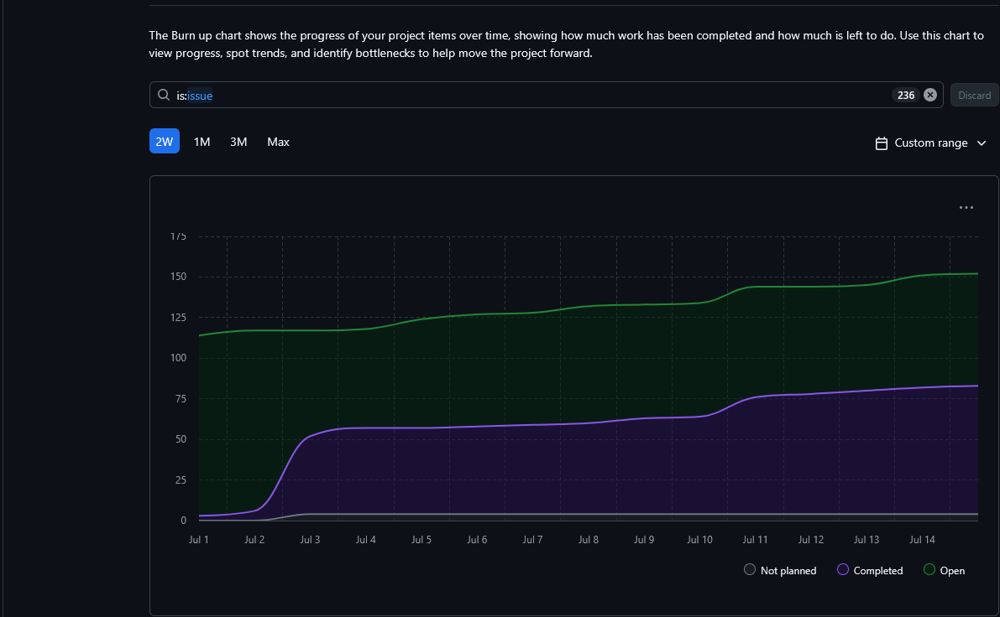
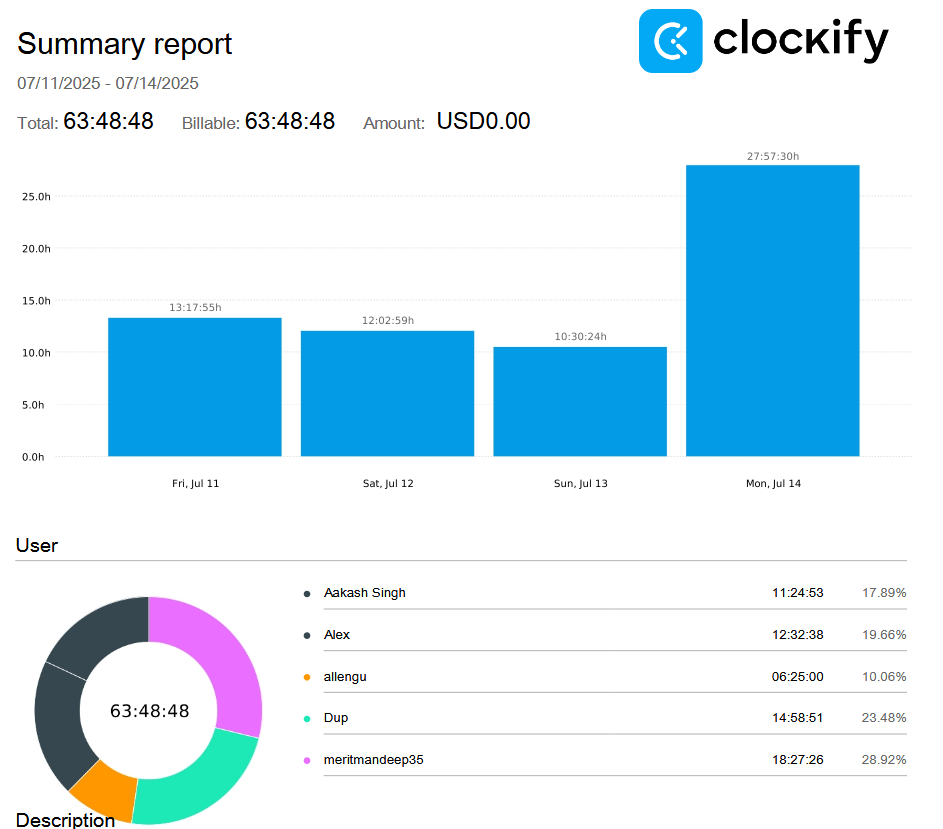

# Weekly Team Log

## Date Range:

* 7/11–7/14

## Features in the Project Plan Cycle:

* Admin Promote/Demote Users feature was completed.
* Creating Deadlines feature to services was completed.
* Improvements import allocation enhancements was completed.
* Frontend role changes was completed.
* Allowing a coordinator to delete an allocation was completed.

## Associated Tasks from Project Board:

| Task ID | Description                                         | Feature                                                     | Assigned To           | Status   |
| ------- | --------------------------------------------------- | ----------------------------------------------------------- | --------------------- | -------- |
| [#?](https://github.com/UBCO-COSC499-S2025/team-10-capstone-infinity/issues/) | Add deadlines to services when doing actions             | Admin config feature | Allen      | Done     |
| [#363](https://github.com/UBCO-COSC499-S2025/team-10-capstone-infinity/issues/363) | Frontend - Import Allocations Enhancements               | Allocation Import             | Aakash   | Done     |
| [#346](https://github.com/UBCO-COSC499-S2025/team-10-capstone-infinity/issues/346) | Admin promote/demote users                                 | User Management             | Alex      | Done     |
| [#374](https://github.com/UBCO-COSC499-S2025/team-10-capstone-infinity/issues/374) | Fix frontend from role changes         | Project Bug and Enhancement            | Dup   | Done |
| [#347](https://github.com/UBCO-COSC499-S2025/team-10-capstone-infinity/issues/347) | Allow Coordinator to delete an allocation and refactoring   | Allocation Management           | Mandeep  | Complete |
| [#334](https://github.com/UBCO-COSC499-S2025/team-10-capstone-infinity/issues/334) | Outline CSV Export Requirements                    | CSV Export Backend              | Seiya    | Complete |
| [#335](https://github.com/UBCO-COSC499-S2025/team-10-capstone-infinity/issues/335) | Implement API Endpoint for CSV Export                      | CSV Export Backend              | Seiya    | Complete |
| [#365](https://github.com/UBCO-COSC499-S2025/team-10-capstone-infinity/issues/365) | Create CSV Export Front-end UI | CSV frontend | Seiya | Complete|
| [#366](https://github.com/UBCO-COSC499-S2025/team-10-capstone-infinity/issues/366) | Integration Tests for CSV Export | CSV API endpoint | Seiya | Complete |
| [#370](https://github.com/UBCO-COSC499-S2025/team-10-capstone-infinity/issues/370) | Create CSV Import Fronte-end UI | CSV API endpoint | Seiya | In Progress |
| [#371](https://github.com/UBCO-COSC499-S2025/team-10-capstone-infinity/issues/371) | Integration Tests for CSV Import | CSV API endpoint | Seiya | In Progress |
| [#373](https://github.com/UBCO-COSC499-S2025/team-10-capstone-infinity/issues/373) | Update need hours when accepting an offer | Need table | Alex | In Review |
| [#383](https://github.com/UBCO-COSC499-S2025/team-10-capstone-infinity/issues/383) | View Allocation and Export   | Allocation Management           | Mandeep  | In Review |
| [#389](https://github.com/UBCO-COSC499-S2025/team-10-capstone-infinity/issues/389) | Change role in frontend | User Management | Alex | In Progress |
| [#390](https://github.com/UBCO-COSC499-S2025/team-10-capstone-infinity/issues/390) | Admin auditing and logging         | Admin logging           | Dup   | In Progress |
| [#394](https://github.com/UBCO-COSC499-S2025/team-10-capstone-infinity/issues/394) | Frontend: GTA exam availability               | Exam Availability             | Aakash   | In Review     |
| [#386](https://github.com/UBCO-COSC499-S2025/team-10-capstone-infinity/issues/386) | exam assignment backend             | Exam Availability | Allen      | In Review     |

### Alternatively, include image of the project board with tasks and status:

## Tasks for Next Cycle:
- Once these tasks are completed, additional tasks may be assigned as needed based on the situation.

| Task ID | Description                                       | Estimated Time (hrs) | Assigned To |
| ------- | ------------------------------------------------- | -------------------- | ----------- |
| [#370](https://github.com/UBCO-COSC499-S2025/team-10-capstone-infinity/issues/370) | Create CSV Import Fronte-end UI | 15 | Seiya
| [#371](https://github.com/UBCO-COSC499-S2025/team-10-capstone-infinity/issues/371) | More Integration Tests for CSV Import | 15 | Seiya |
| [#402](https://github.com/UBCO-COSC499-S2025/team-10-capstone-infinity/issues/402) | Backend Frontend Integration - GTA exam availability | 15            | Aakash
| [#390](https://github.com/UBCO-COSC499-S2025/team-10-capstone-infinity/issues/390) | Admin auditing and logging         | 15           | Dup 
| [#389](https://github.com/UBCO-COSC499-S2025/team-10-capstone-infinity/issues/389) | Change role in frontend | 15 | Alex 

## Burn-up Chart (Velocity):

## Times for Team/Individual:

| Team Member | Logged Hours |
| ----------- | ------------ |
| Aakash      | 11:24           |
| Alex        | 12:32            |
| Allen       | 06:25           |
| Dup         | 14:58          |
| Eddy        | 00:00        |
| Mandeep     | 18:27          |
| Seiya       | 00:00            |

## Completed Tasks:

| Task ID | Description                                        | Completed By       |
| ------- | -------------------------------------------------- | ------------------ |
| [#?](https://github.com/UBCO-COSC499-S2025/team-10-capstone-infinity/issues/) | Add deadlines to services when doing actions             |  Allen  
| [#363](https://github.com/UBCO-COSC499-S2025/team-10-capstone-infinity/issues/363) | Frontend - Import Allocations Enhancements               | Aakash 
| [#346](https://github.com/UBCO-COSC499-S2025/team-10-capstone-infinity/issues/346) | Admin promote/demote users                                 | Alex
| [#374](https://github.com/UBCO-COSC499-S2025/team-10-capstone-infinity/issues/374) | Fix frontend from role changes         | Dup 
| [#347](https://github.com/UBCO-COSC499-S2025/team-10-capstone-infinity/issues/347) | Allow Coordinator to delete an allocation and refactoring   | Mandeep 
| [#334](https://github.com/UBCO-COSC499-S2025/team-10-capstone-infinity/issues/334) | Outline CSV Export Requirements                    |Seiya   
| [#335](https://github.com/UBCO-COSC499-S2025/team-10-capstone-infinity/issues/335) | Implement API Endpoint for CSV Export                      |Seiya 
| [#365](https://github.com/UBCO-COSC499-S2025/team-10-capstone-infinity/issues/365) | Create CSV Export Front-end UI |  Seiya
| [#366](https://github.com/UBCO-COSC499-S2025/team-10-capstone-infinity/issues/366) | Integration Tests for CSV Export | Seiya

## In Progress Tasks/ To do:

| Task ID | Description                                                | Assigned To       |
| ------- | ---------------------------------------------------------- | ----------------- |
| [#370](https://github.com/UBCO-COSC499-S2025/team-10-capstone-infinity/issues/370) | Create CSV Import Fronte-end UI | Seiya 
| [#371](https://github.com/UBCO-COSC499-S2025/team-10-capstone-infinity/issues/371) | Integration Tests for CSV Import | Seiya 
| [#373](https://github.com/UBCO-COSC499-S2025/team-10-capstone-infinity/issues/373) | Update need hours when accepting an offer | Alex 
| [#383](https://github.com/UBCO-COSC499-S2025/team-10-capstone-infinity/issues/383) | View Allocation and Export   |Mandeep|
| [#389](https://github.com/UBCO-COSC499-S2025/team-10-capstone-infinity/issues/389) | Change role in frontend | Alex
| [#390](https://github.com/UBCO-COSC499-S2025/team-10-capstone-infinity/issues/390) | Admin auditing and logging         | Dup 
| [#402](https://github.com/UBCO-COSC499-S2025/team-10-capstone-infinity/issues/402) | Backend Frontend Integration - GTA exam availability | Aakash
| [#386](https://github.com/UBCO-COSC499-S2025/team-10-capstone-infinity/issues/386) | exam assignment backend             | Allen  

## Overview:

During the period of July 11-14, the team completed:
* Enhancements for importing allocations
* Beginning of import CSV
* Promoting/demoting users
* Enhancing the frontend and changing for roles
* Revoking applications
* A number of "to do" tasks are completed but not reviewed and merged yet.
