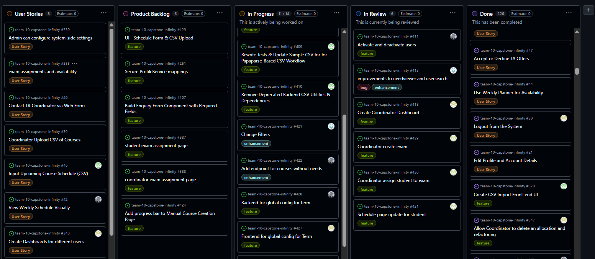
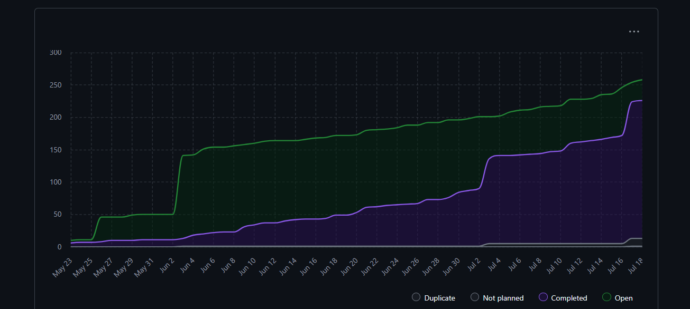
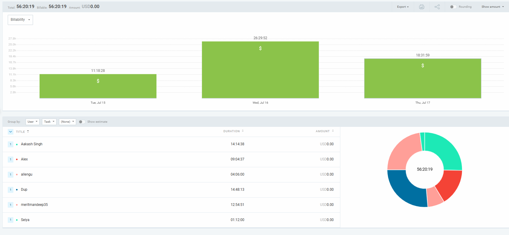

# Weekly Team Log

## Date Range:

* 7/15–7/17

## Features in the Project Plan Cycle:

* Implement CSV export feature (backend, frontend, tests)
* Some bugs fixed in change in role in frontend and allocation
* Update need hours when accepting an offer
* view allocation and export
* Backend Frontend Integration - GTA exam availability was completed
* Change role in frontend
* Completed Student and Co-ordinator Dashboard 

## Associated Tasks from Project Board:

| Task ID | Description                                         | Feature                                                     | Assigned To           | Status   |
| ------- | --------------------------------------------------- | ----------------------------------------------------------- | --------------------- | -------- |
| [#429](https://github.com/UBCO-COSC499-S2025/team-10-capstone-infinity/issues/429) | Exams      | 429 coordinator create exam| Aakash      | In Review    |
| [#430](https://github.com/UBCO-COSC499-S2025/team-10-capstone-infinity/issues/430) | Exams      | 430 coordinator assign student to exam| Aakash      | In Review    |
| [#431](https://github.com/UBCO-COSC499-S2025/team-10-capstone-infinity/issues/431) | Exams      | 431 Schedule page update for student to see exam assignment | Aakash      | In Review    |
| [#418](https://github.com/UBCO-COSC499-S2025/team-10-capstone-infinity/issues/418) |     Dashboard to show main tasks    |   418 create coordinator dashboard    | Mandeep   | In  review    |
| [#417](https://github.com/UBCO-COSC499-S2025/team-10-capstone-infinity/issues/417) | Resolved some bugs that we encountered during feedback event | 413 polish and bug sweep| Mandeep   | Done  |
| [#374](https://github.com/UBCO-COSC499-S2025/team-10-capstone-infinity/issues/374) | activate and deactivate users on coordinator page    | activate and deactivate users   | Alex  | In review |
| [#381](https://github.com/UBCO-COSC499-S2025/team-10-capstone-infinity/issues/381) | 368 implement api endpoint for csv import              | CSV Import Backend       | Seiya    |In Progress |
| [#370](https://github.com/UBCO-COSC499-S2025/team-10-capstone-infinity/issues/370) | Create CSV Import Fronte-end UI | CSV API endpoint | Seiya | In Progress |
| [#371](https://github.com/UBCO-COSC499-S2025/team-10-capstone-infinity/issues/371) | Integration Tests for CSV Import | CSV API endpoint | Seiya | In Progress |
| [#373](https://github.com/UBCO-COSC499-S2025/team-10-capstone-infinity/issues/373) | Update need hours when accepting an offer | Need table | Alex | Completed |
| [#383](https://github.com/UBCO-COSC499-S2025/team-10-capstone-infinity/issues/383) | View Allocation and Export   | Allocation Management           | Mandeep  | Completed |
| [#389](https://github.com/UBCO-COSC499-S2025/team-10-capstone-infinity/issues/389) | Change role in frontend | User Management | Alex | Completed |
| [#390](https://github.com/UBCO-COSC499-S2025/team-10-capstone-infinity/issues/390) | Admin auditing and logging         | Admin logging           | Dup   | Completed |
| [#394](https://github.com/UBCO-COSC499-S2025/team-10-capstone-infinity/issues/394) | Frontend: GTA exam availability               | Exam Availability             | Aakash   | Completed     |
| [#402](https://github.com/UBCO-COSC499-S2025/team-10-capstone-infinity/issues/402) | Backend Frontend Integration: GTA exam availability               | Exam Availability       | Aakash   | Completed     |
| [#391](https://github.com/UBCO-COSC499-S2025/team-10-capstone-infinity/issues/391) | exam assignment backend             | Exam Availability | Allen      | Completed     |
| [#415](https://github.com/UBCO-COSC499-S2025/team-10-capstone-infinity/issues/415) |  improvements to needviewer and usersearch          | NeedViewer and userserch  | Dup    | In review    |

### Alternatively, include image of the project board with tasks and status:

## Tasks for Next Cycle:
- Once these tasks are completed, additional tasks may be assigned as needed based on the situation.

| Task ID | Description                                       | Estimated Time (hrs) | Assigned To |
| ------- | ------------------------------------------------- | -------------------- | ----------- |
| [#427](https://github.com/UBCO-COSC499-S2025/team-10-capstone-infinity/issues/427) | Frontend for global config for Term | 15 | Mandeep|
| [#434](https://github.com/UBCO-COSC499-S2025/team-10-capstone-infinity/issues/434) | Create Instructor Dashboard | 15 | Mandeep|
| [#428](https://github.com/UBCO-COSC499-S2025/team-10-capstone-infinity/issues/428) | Backend for global config for term | 15 | Alex |
| [#423](https://github.com/UBCO-COSC499-S2025/team-10-capstone-infinity/issues/423) | Have audit logs show name instead of id | 10 | Alex |
| [#422](https://github.com/UBCO-COSC499-S2025/team-10-capstone-infinity/issues/422) | Add endpoint for courses without needs | 10 | Alex |
| [#421](https://github.com/UBCO-COSC499-S2025/team-10-capstone-infinity/issues/421) | Change Filters | 10 | Alex |
| [#407](https://github.com/UBCO-COSC499-S2025/team-10-capstone-infinity/issues/407) |  Refactor: Parse CSV on Frontend via Papaparse and POST JSON (Sections Import)        | 15           | Seiya
| [#406](https://github.com/UBCO-COSC499-S2025/team-10-capstone-infinity/issues/406) |   Refactor: Generate CSV on Frontend via Papaparse (Sections Export)       | 15      | Seiya
| [#371](https://github.com/UBCO-COSC499-S2025/team-10-capstone-infinity/issues/371) |  Integration Tests for CSV Import |  15           | Seiya |
| [#436](https://github.com/UBCO-COSC499-S2025/team-10-capstone-infinity/issues/436) | Coordinator assign student to exam update | 15 | Aakash |

## Burn-up Chart (Velocity):

## Times for Team/Individual:

| Team Member | Logged Hours |
| ----------- | ------------ |
| Aakash      | 14:14           |
| Alex        | 09:04           |
| Allen       | 04:06           |
| Dup         | 14:48          |
| Eddy        | 00:00        |
| Mandeep     | 12:54        |
| Seiya       | 05:53           |

## Completed Tasks:

| Task ID | Description                                        | Completed By       |
| ------- | -------------------------------------------------- | ------------------ |
| [#373](https://github.com/UBCO-COSC499-S2025/team-10-capstone-infinity/issues/373) | Update need hours when accepting an offer | Alex | Completed |
| [#383](https://github.com/UBCO-COSC499-S2025/team-10-capstone-infinity/issues/383) | View Allocation and Export   |  Mandeep  | Completed |
| [#389](https://github.com/UBCO-COSC499-S2025/team-10-capstone-infinity/issues/389) | Change role in frontend | Alex | Completed |
| [#390](https://github.com/UBCO-COSC499-S2025/team-10-capstone-infinity/issues/390) | Admin auditing and logging         |  Dup   | Completed |
| [#394](https://github.com/UBCO-COSC499-S2025/team-10-capstone-infinity/issues/394) | Frontend: GTA exam availability               |  Aakash   | Completed     |
| [#402](https://github.com/UBCO-COSC499-S2025/team-10-capstone-infinity/issues/402) | Backend Frontend Integration: GTA exam availability | Aakash   | Completed     |
| [#391](https://github.com/UBCO-COSC499-S2025/team-10-capstone-infinity/issues/391) | exam assignment backend             | Allen      | Completed     |
| [#417](https://github.com/UBCO-COSC499-S2025/team-10-capstone-infinity/issues/417) | Resolved some bugs that we encountered during feedback event | Mandeep   | Done  |
## In Progress Tasks/ To do:

| Task ID | Description                                                | Assigned To       |
| ------- | ---------------------------------------------------------- | ----------------- |
| [#381](https://github.com/UBCO-COSC499-S2025/team-10-capstone-infinity/issues/381) | CSV Import Backend       | Seiya    |In Progress |
| [#370](https://github.com/UBCO-COSC499-S2025/team-10-capstone-infinity/issues/370) | Create CSV Import Fronte-end UI | Seiya | In Progress |
| [#371](https://github.com/UBCO-COSC499-S2025/team-10-capstone-infinity/issues/371) | Integration Tests for CSV Import | Seiya | In Progress |
| [#427](https://github.com/UBCO-COSC499-S2025/team-10-capstone-infinity/issues/427) | Frontend for global config for Term |  Mandeep|
| [#434](https://github.com/UBCO-COSC499-S2025/team-10-capstone-infinity/issues/427) | Create Instructor Dashboard | Mandeep|
| [#428](https://github.com/UBCO-COSC499-S2025/team-10-capstone-infinity/issues/428) | Backend for global config for term | Alex |
| [#423](https://github.com/UBCO-COSC499-S2025/team-10-capstone-infinity/issues/423) | Have audit logs show name instead of id | Alex |
| [#422](https://github.com/UBCO-COSC499-S2025/team-10-capstone-infinity/issues/422) | Add endpoint for courses without needs | Alex |
| [#421](https://github.com/UBCO-COSC499-S2025/team-10-capstone-infinity/issues/421) | Change Filters | Alex |
| [#407](https://github.com/UBCO-COSC499-S2025/team-10-capstone-infinity/issues/407) |  Refactor: Parse CSV on Frontend via Papaparse and POST JSON (Sections Import)        | Seiya |
| [#406](https://github.com/UBCO-COSC499-S2025/team-10-capstone-infinity/issues/406) |   Refactor: Generate CSV on Frontend via Papaparse (Sections Export)       | Seiya|
| [#436](https://github.com/UBCO-COSC499-S2025/team-10-capstone-infinity/issues/436) | Coordinator assign student to exam update | Aakash |

## Overview:

During the period of July 15-17, the team completed:
* Implement CSV export feature (backend, frontend, tests)
* Completed Student and Co-ordinator Dashboard 
* Some bugs fixed in change in role in frontend and allocation
* Update need hours when accepting an offer
* view allocation and export
* Backend Frontend Integration - GTA exam availability was completed
* Change role in frontend
