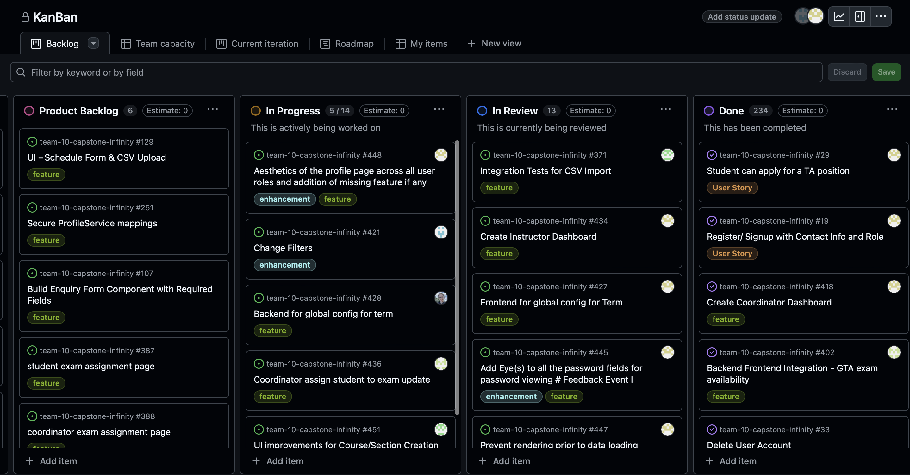
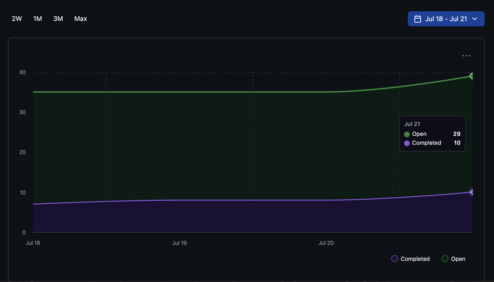
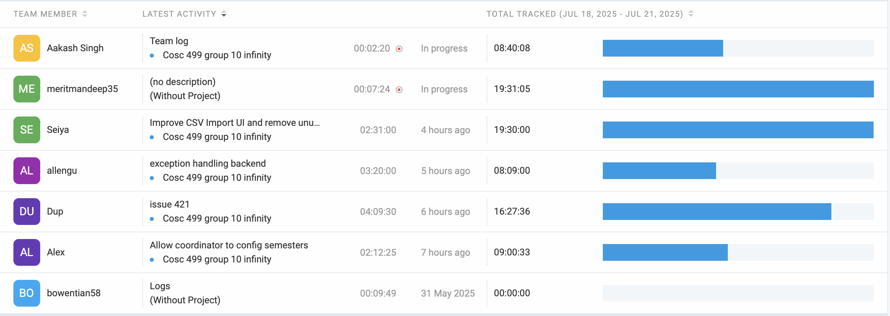

# Weekly Team Log

## Date Range:

* 7/18–7/21

## Features in the Project Plan Cycle:

* Activate and deactivate users
* Exams page for coordinator (included validation checks + improved workflow)
* GTA exam assignment (calendar view)
* Improvements to needviewer and usersearch
* Update audit to show names of actors and entities
* Completed instructor dashboard
* Configuration service updates
* CSV Import enhancements
* Change filters

## Associated Tasks from Project Board:

| Task ID | Description                                         | Feature                                                     | Assigned To           | Status   |
| ------- | --------------------------------------------------- | ----------------------------------------------------------- | --------------------- | -------- |
| [#429](https://github.com/UBCO-COSC499-S2025/team-10-capstone-infinity/issues/429) | Exams      | 429 coordinator create exam| Aakash      | Completed    |
| [#430](https://github.com/UBCO-COSC499-S2025/team-10-capstone-infinity/issues/430) | Exams      | 430 coordinator assign student to exam| Aakash      | Completed    |
| [#431](https://github.com/UBCO-COSC499-S2025/team-10-capstone-infinity/issues/431) | Exams      | 431 Schedule page update for student to see exam assignment | Aakash      | Completed    |
| [#436](https://github.com/UBCO-COSC499-S2025/team-10-capstone-infinity/issues/436) | Exams      | 436 Coordinator assign student to exam update | Aakash      | In review    |
| [#371](https://github.com/UBCO-COSC499-S2025/team-10-capstone-infinity/issues/371) |  CSV Import | 371 Integration tests for csv import  | Seiya   | In review    |
| [#409](https://github.com/UBCO-COSC499-S2025/team-10-capstone-infinity/issues/409) | 409 Rewrite tests and update sample csv for papaparse| CSV Import      | Seiya    |In review |
| [#410](https://github.com/UBCO-COSC499-S2025/team-10-capstone-infinity/issues/410) | 410 Remove deprecated backend csv utilities and dependencies| CSV Import | Seiya | In review |
| [#406](https://github.com/UBCO-COSC499-S2025/team-10-capstone-infinity/issues/406) | 406 Refactor: generate csv on frontend via papaparse(sections export)| CSV Import | Seiya | In review |
| [#408](https://github.com/UBCO-COSC499-S2025/team-10-capstone-infinity/issues/408) | 408 Update API to Accept/Return JSON Only for Section Import/Export| CSV Import | Seiya | In review |
| [#407](https://github.com/UBCO-COSC499-S2025/team-10-capstone-infinity/issues/407) | 407 Refactor: Parse CSV on Frontend via Papaparse and POST JSON (Sections Import)| CSV Import | Seiya | In review |
| [#451](https://github.com/UBCO-COSC499-S2025/team-10-capstone-infinity/issues/451) | UI improvements for Course/Section creation| Courses  | Seiya   | In progress   |
| [#434](https://github.com/UBCO-COSC499-S2025/team-10-capstone-infinity/issues/434) |  Instructor Dashboard | 434 Create instructor dashboard  | Mandeep   | In review    |
| [#427](https://github.com/UBCO-COSC499-S2025/team-10-capstone-infinity/issues/427) | Config | 427 Frontend for global config for term | Mandeep   | In review    |
| [#445](https://github.com/UBCO-COSC499-S2025/team-10-capstone-infinity/issues/445) | Enhancement | 445 Add eyes to all password fields| Mandeep   | In review    |
| [#443](https://github.com/UBCO-COSC499-S2025/team-10-capstone-infinity/issues/443) | Deadline | 443 Improve deadline page| Mandeep   | In review    |
| [#444](https://github.com/UBCO-COSC499-S2025/team-10-capstone-infinity/issues/444) | Bug | 444 Minor bug in public layout loading| Mandeep   | In review    |
| [#448](https://github.com/UBCO-COSC499-S2025/team-10-capstone-infinity/issues/448) | 448 Aesthetics of profile page across all user roles and addition of missing features if any | Profile   | Mandeep   | In progress   |
| [#415](https://github.com/UBCO-COSC499-S2025/team-10-capstone-infinity/issues/415) |  improvements to needviewer and usersearch          | NeedViewer and userserch  | Dup    | Completed    |
| [#421](https://github.com/UBCO-COSC499-S2025/team-10-capstone-infinity/issues/421) | 421 change filters| Filters  | Dup   | In progress   |
| [#428](https://github.com/UBCO-COSC499-S2025/team-10-capstone-infinity/issues/428) | 428 backend for global config for term| Config  | Alex   | In progress   |
| [#440](https://github.com/UBCO-COSC499-S2025/team-10-capstone-infinity/issues/440) | 440 add endpoint for courses without needs| Courses  | Alex   | Completed  |
| [#441](https://github.com/UBCO-COSC499-S2025/team-10-capstone-infinity/issues/441) | 441 have audit logs show name instead of id| Audit | Alex   | Completed  |

### Alternatively, include image of the project board with tasks and status:

## Tasks for Next Cycle:
- Once these tasks are completed, additional tasks may be assigned as needed based on the situation.

| Task ID | Description                                       | Estimated Time (hrs) | Assigned To |
| ------- | ------------------------------------------------- | -------------------- | ----------- |
| [#448](https://github.com/UBCO-COSC499-S2025/team-10-capstone-infinity/issues/448) | Aesthetics of profile page across all user roles | 15 | Mandeep|
| [#421](https://github.com/UBCO-COSC499-S2025/team-10-capstone-infinity/issues/421) | Change filters | 15 | Dup|
| [#428](https://github.com/UBCO-COSC499-S2025/team-10-capstone-infinity/issues/428) | Backend for global config for term | 15 | Alex|
| [#451](https://github.com/UBCO-COSC499-S2025/team-10-capstone-infinity/issues/451) | UI enhancements for courses/sections creation | 15 | Seiya|

## Burn-up Chart (Velocity):

## Times for Team/Individual:

| Team Member | Logged Hours |
| ----------- | ------------ |
| Aakash      | 08:40           |
| Alex        | 09:00           |
| Allen       | 08:09           |
| Dup         | 16:27          |
| Eddy        | 00:00        |
| Mandeep     | 19:31        |
| Seiya       | 19:30           |

## Completed Tasks:

| Task ID | Description                                        | Completed By       |
| ------- | -------------------------------------------------- | ------------------ |
| [#429](https://github.com/UBCO-COSC499-S2025/team-10-capstone-infinity/issues/429) | Exams      | 429 coordinator create exam| Aakash      | Completed    |
| [#430](https://github.com/UBCO-COSC499-S2025/team-10-capstone-infinity/issues/430) | Exams      | 430 coordinator assign student to exam| Aakash      | Completed    |
| [#431](https://github.com/UBCO-COSC499-S2025/team-10-capstone-infinity/issues/431) | Exams      | 431 Schedule page update for student to see exam assignment | Aakash      | Completed    |
| [#415](https://github.com/UBCO-COSC499-S2025/team-10-capstone-infinity/issues/415) |  improvements to needviewer and usersearch          | NeedViewer and userserch  | Dup    | Completed    |
| [#440](https://github.com/UBCO-COSC499-S2025/team-10-capstone-infinity/issues/440) | 440 add endpoint for courses without needs| Courses  | Alex   | Completed  |
| [#441](https://github.com/UBCO-COSC499-S2025/team-10-capstone-infinity/issues/441) | 441 have audit logs show name instead of id| Audit | Alex   | Completed  |

## In Progress Tasks/ To do:

| Task ID | Description                                                | Assigned To       |
| ------- | ---------------------------------------------------------- | ----------------- |
| [#448](https://github.com/UBCO-COSC499-S2025/team-10-capstone-infinity/issues/448) | Aesthetics of profile page across all user roles | 15 | Mandeep|
| [#421](https://github.com/UBCO-COSC499-S2025/team-10-capstone-infinity/issues/421) | Change filters | 15 | Dup|
| [#428](https://github.com/UBCO-COSC499-S2025/team-10-capstone-infinity/issues/428) | Backend for global config for term | 15 | Alex|
| [#451](https://github.com/UBCO-COSC499-S2025/team-10-capstone-infinity/issues/451) | UI enhancements for courses/sections creation | 15 | Seiya|

## Overview:

During the period of July 18-21, the team completed:
* Exams page for coordinator(validation checks + improved workflow)
* Improvements to needviewer and usersearch
* Endpoint for courses without needs
* Have audit logs show names instead of id
* Csv import enhancements
* Instructor dashboard
* Frontend for global config for term
* Added eyes to all password fields
* Improved deadline page