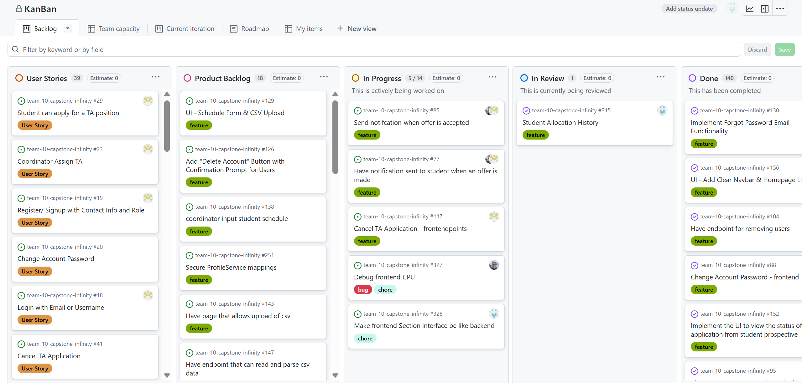
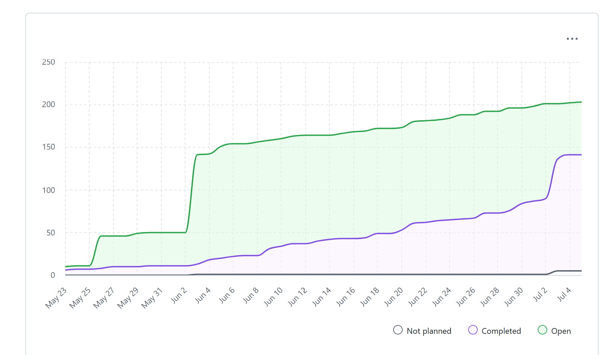

# Weekly Team Log

## Date Range:

* 7/02–7/04

## Features in the Project Plan Cycle:

* TA allocation page (frontend and backend)
* Student taught course mappings
* Course profile page
* Notification service
* Prerequisite courses backend
* Debug and UI alignment

## Associated Tasks from Project Board:

| Task ID | Description                                         | Feature                                                     | Assigned To           | Status   |
| ------- | --------------------------------------------------- | ----------------------------------------------------------- | --------------------- | -------- |
| [#318](https://github.com/UBCO-COSC499-S2025/team-10-capstone-infinity/issues/318)    | Co-ordinator views TA applications and their status                   |  TA Applications| Mandeep             | Completed|
| [#315](https://github.com/UBCO-COSC499-S2025/team-10-capstone-infinity/issues/315)    | Student Allocation History          | Allocation     | Dup              | Completed |
| [#314](https://github.com/UBCO-COSC499-S2025/team-10-capstone-infinity/issues/314)    | Prerequisite courses             |      Course Management       | Alex        | Completed |
| [#311](https://github.com/UBCO-COSC499-S2025/team-10-capstone-infinity/issues/311)    | Update application backend for undergraduate/graduate       | Backend Enhancement          | Alex                | Completed |
| [#304](https://github.com/UBCO-COSC499-S2025/team-10-capstone-infinity/issues/304)    | Allocation Filter Mappings  |  Allocation Filtering   | Aakash       |Completed|
| [#299](https://github.com/UBCO-COSC499-S2025/team-10-capstone-infinity/issues/299)    | Integrate frontend and backend for TA allocation page  | Allocation UI Integration   | Mandeep      |Completed|
| [#297](https://github.com/UBCO-COSC499-S2025/team-10-capstone-infinity/issues/297)    | Create mappings for student taught course    | StudentTaughtCourse Mappings    | Aakash      |Completed|
| [#296](https://github.com/UBCO-COSC499-S2025/team-10-capstone-infinity/issues/296)    | StudentTaughtCourse Table  | StudentTaughtCourse Table  | Aakash      |Completed|
| [#295](https://github.com/UBCO-COSC499-S2025/team-10-capstone-infinity/issues/295)    | Course Profile page  | Course Profile    | Dup      |Completed|
| [#289](https://github.com/UBCO-COSC499-S2025/team-10-capstone-infinity/issues/289)    | Create notification service    | Notification Service    | Alex      |Completed|

### Alternatively, include image of the project board with tasks and status:

## Tasks for Next Cycle:

| Task ID | Description                                       | Estimated Time (hrs) | Assigned To |
| ------- | ------------------------------------------------- | -------------------- | ----------- |
| [#328](https://github.com/UBCO-COSC499-S2025/team-10-capstone-infinity/issues/328)          | Make frontend Section interface be like backend  | 10+              | Dup    |
| [#327](https://github.com/UBCO-COSC499-S2025/team-10-capstone-infinity/issues/327)          | Debug frontend CPU   | 15+              | Alex      |
| [#272](https://github.com/UBCO-COSC499-S2025/team-10-capstone-infinity/issues/272)       | Get instructorById backend | 10+                   | Dup    |
| [#337](https://github.com/UBCO-COSC499-S2025/team-10-capstone-infinity/issues/337)       | Implement csv import for previous year allocations | 10+  | Aakash|
| [#338](https://github.com/UBCO-COSC499-S2025/team-10-capstone-infinity/issues/338)       | Create backend endpoints to handle csv uploads | 10+  | Aakash|
| [#339](https://github.com/UBCO-COSC499-S2025/team-10-capstone-infinity/issues/339)       | Frontend - import previous year allocations | 10+  | Aakash|

## Burn-up Chart (Velocity):

## Times for Team/Individual:

| Team Member | Logged Hours |
| ----------- | ------------ |
| Aakash      | 9:02            |
| Alex        | 13:54            |
| Allen       | 3:40           |
| Dup         | 24:50          |
| Eddy        | 00:00        |
| Mandeep     | 25:37          |
| Seiya       | 00:00            |

## In Progress Tasks / To Do:

| Task ID | Description                                      | Assigned To |
| ------- | ------------------------------------------------ | ----------- |
| [#77](https://github.com/UBCO-COSC499-S2025/team-10-capstone-infinity/issues/77)        | Frontend and backend : Have notification sent to student when an offer is made      | Mandeep   & Alex      | 
| [#85](https://github.com/UBCO-COSC499-S2025/team-10-capstone-infinity/issues/85)        | Frontend and backend : Send notifcation when offer is accepted       | Mandeep & Alex          | 
| [#117](https://github.com/UBCO-COSC499-S2025/team-10-capstone-infinity/issues/117)        |    Cancel TA Application - frontendpoints   | Mandeep          | 

| [#328](https://github.com/UBCO-COSC499-S2025/team-10-capstone-infinity/issues/328)        | Make frontend Section interface be like backend         | Easuper                  | 
| [#327](https://github.com/UBCO-COSC499-S2025/team-10-capstone-infinity/issues/327)                      | Debug frontend CPU                   | XelArga        | 
| [#272](https://github.com/UBCO-COSC499-S2025/team-10-capstone-infinity/issues/272)  | Get instructorById backend       | Easuper       |
| [#337](https://github.com/UBCO-COSC499-S2025/team-10-capstone-infinity/issues/337)       | Implement csv import for previous year allocations | 10+  | Aakash|
| [#338](https://github.com/UBCO-COSC499-S2025/team-10-capstone-infinity/issues/338)       | Create backend endpoints to handle csv uploads | 10+  | Aakash|
| [#339](https://github.com/UBCO-COSC499-S2025/team-10-capstone-infinity/issues/339)       | Frontend - import previous year allocations | 10+  | Aakash|

## Overview:

During the period of July 1–4, the team completed numerous backend and frontend tasks:
* Co-ordinator views TA applications and their status
* Student Allocation History and Filtering
* Prerequisite courses backend completed
* Backend update for undergraduate/graduate application workflows
* Integration of frontend and backend for TA allocation page
* Creation of StudentTaughtCourse mappings and tables
* Course Profile Page implemented
* Notification service created

