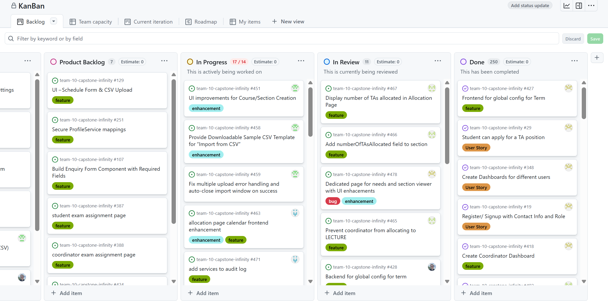
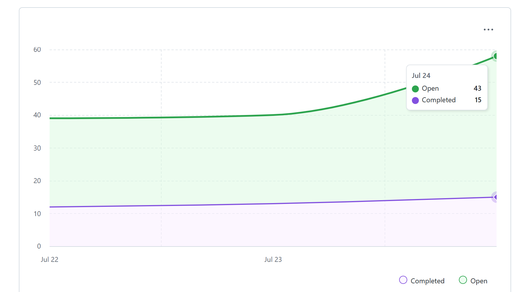
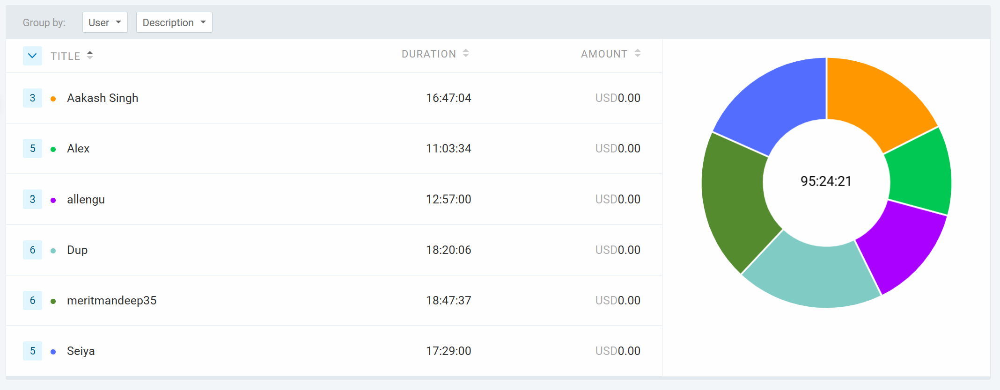

# Weekly Team Log

## Date Range:

* **7/22–7/24**

---

## Features in the Project Plan Cycle:

* Transcript Upload
* Application Form Enhancements
* Global Configuration Integration (Frontend and Backend)
* Allocation Page Enhancements
* Allocation service refactor
* CSV/PDF Export of Confirmed Allocations
* UI/UX Improvements and Bug Fixes
* Qualification Page Bug Fixes and Improvements
* Coordinator Exam Page Updates
* Add Services to Audit Log
* CSV Sample Template and Import Enhancements

---

## Associated Tasks from Project Board:

| Task ID | Description                                                       | Feature                         | Assigned To       | Status     |
| ------- | ----------------------------------------------------------------- | --------------------------------| ----------------- | ---------- |
| [#490](https://github.com/UBCO-COSC499-S2025/team-10-capstone-infinity/issues/490) | Add term fields to application form & impacted flow | Application Form         | mandeep | In Progress |
| [#489](https://github.com/UBCO-COSC499-S2025/team-10-capstone-infinity/issues/489) | Integration backend and frontend Global Config       | Config                   | mandeep | In Progress  |
| [#488](https://github.com/UBCO-COSC499-S2025/team-10-capstone-infinity/issues/488) | Add Tests for Transcript Upload Feature              | Transcript Upload        | Seiya    | Open |
| [#487](https://github.com/UBCO-COSC499-S2025/team-10-capstone-infinity/issues/487) | Design Transcript Data Model                         | Transcript Upload        | Seiya    | Open |
| [#486](https://github.com/UBCO-COSC499-S2025/team-10-capstone-infinity/issues/486) | Build Transcript CSV Upload UI (Frontend)            | Transcript Upload        | Seiya    | Open |
| [#485](https://github.com/UBCO-COSC499-S2025/team-10-capstone-infinity/issues/485) | Create Transcript CSV Import API (Backend)           | Transcript Upload        | Seiya    | Open |
| [#484](https://github.com/UBCO-COSC499-S2025/team-10-capstone-infinity/issues/484) | Dashboard issues                                     | Dashboard Bug            | mandeep | In review |
| [#483](https://github.com/UBCO-COSC499-S2025/team-10-capstone-infinity/issues/483) | Issue with allocated number of hours                 | Allocation               | mandeep | In review  |
| [#482](https://github.com/UBCO-COSC499-S2025/team-10-capstone-infinity/issues/482) | Enhancement in Qualification page                    | Qualification            | mandeep | In review  |
| [#480](https://github.com/UBCO-COSC499-S2025/team-10-capstone-infinity/issues/480) | Export PDF/CSV of confirmed section allocations      | Allocation Export        | mandeep |In review  |
| [#479](https://github.com/UBCO-COSC499-S2025/team-10-capstone-infinity/issues/479) | Create page to see allocated students                | Allocation UI            | mandeep | In review  |
| [#478](https://github.com/UBCO-COSC499-S2025/team-10-capstone-infinity/issues/478) | Needs and section viewer UI enhancements             | Needs UI                 | mandeep | In review |
| [#477](https://github.com/UBCO-COSC499-S2025/team-10-capstone-infinity/issues/477) | Backend: semester-specific applications              | Allocation Backend       | Alex     | Open |
| [#476](https://github.com/UBCO-COSC499-S2025/team-10-capstone-infinity/issues/476) | Fix pagination frontend aesthetics                   | UI                       | Alex     | Open |
| [#475](https://github.com/UBCO-COSC499-S2025/team-10-capstone-infinity/issues/475) | Coordinator exam page: integration                   | Exams                    | Aakash | Open |
| [#474](https://github.com/UBCO-COSC499-S2025/team-10-capstone-infinity/issues/474) | Modify exams and unassign students                   | Exams                    | Aakash | Open |
| [#473](https://github.com/UBCO-COSC499-S2025/team-10-capstone-infinity/issues/473) | Show all exams and students assigned                 | Exams                    | Aakash | Open |
| [#472](https://github.com/UBCO-COSC499-S2025/team-10-capstone-infinity/issues/472) | Add services to audit log                            | Audit                    | Dup     | Open |
| [#469](https://github.com/UBCO-COSC499-S2025/team-10-capstone-infinity/issues/469) | Instructor view improvements                         | UI                       | mandeep | In review  |
| [#467](https://github.com/UBCO-COSC499-S2025/team-10-capstone-infinity/issues/467) | Display TA count in allocation page                  | Allocation Page          | Aakash | Open |
| [#466](https://github.com/UBCO-COSC499-S2025/team-10-capstone-infinity/issues/466) | Add numberOfTAsAllocated field                       | Allocation Page          | Aakash | Open |
| [#465](https://github.com/UBCO-COSC499-S2025/team-10-capstone-infinity/issues/465) | Prevent allocation to LECTURE                        | Allocation Rules         | Aakash | Open |
| [#464](https://github.com/UBCO-COSC499-S2025/team-10-capstone-infinity/issues/464) | Modify allocation and availability table             | Allocation UI            | Allen    | Open |
| [#463](https://github.com/UBCO-COSC499-S2025/team-10-capstone-infinity/issues/463) | Allocation page calendar frontend enhancement        | Allocation UI            | Dup | Open |
| [#462](https://github.com/UBCO-COSC499-S2025/team-10-capstone-infinity/issues/462) | Improve CSV import feedback messages                 | CSV Import UX            | Seiya    | Open |
| [#460](https://github.com/UBCO-COSC499-S2025/team-10-capstone-infinity/issues/460) | Fix upload error handling & auto-close window        | CSV Import UX            | Seiya    | Open |
| [#459](https://github.com/UBCO-COSC499-S2025/team-10-capstone-infinity/issues/459) | Provide downloadable sample CSV                      | CSV Import UX            | Seiya    | Open |

### Alternatively, include image of the project board with tasks and status:

## Tasks for Next Cycle:

| Task ID | Description                                       | Estimated Time (hrs) | Assigned To     |
| ------- | ------------------------------------------------- | -------------------- | --------------- |
| [#486](https://github.com/UBCO-COSC499-S2025/team-10-capstone-infinity/issues/486) | Build Transcript CSV Upload UI              | 12                   | Seiya          |
| [#485](https://github.com/UBCO-COSC499-S2025/team-10-capstone-infinity/issues/485) | Implement Transcript Import API (Backend)   | 12                   | Seiya          |
| [#490](https://github.com/UBCO-COSC499-S2025/team-10-capstone-infinity/issues/490) | Add term fields to application form & impacted flow | Application Form         | mandeep | 15 |
| [#489](https://github.com/UBCO-COSC499-S2025/team-10-capstone-infinity/issues/489) | Integration backend and frontend Global Config       | Config                   | mandeep |15  |
| [#466](https://github.com/UBCO-COSC499-S2025/team-10-capstone-infinity/issues/466) | Add TA Count to Sections                    | 8                    | Aakash     |

## Burn-up Chart (Velocity):

## Times for Team/Individual:

| Team Member | Logged Hours |
| ----------- | ------------ |
| Aakash      | 16:47           |
| Alex        | 11:03           |
| Allen       | 12:57           |
| Dup         | 18:20          |
| Eddy        | 00:00        |
| Mandeep     | 18:47        |
| Seiya       | 17:29           |

## Completed Tasks:

| Task ID | Description                                        | Completed By       |
| ------- | -------------------------------------------------- | ------------------ |
| [#448](https://github.com/UBCO-COSC499-S2025/team-10-capstone-infinity/issues/448) | Aesthetics of profile page across all user roles | 15 | Mandeep|
| [#484](https://github.com/UBCO-COSC499-S2025/team-10-capstone-infinity/issues/484) | Dashboard issues                      |15 | Mandeep |
| [#429](https://github.com/UBCO-COSC499-S2025/team-10-capstone-infinity/issues/429) | 429 coordinator create exam| Aakash | 
| [#430](https://github.com/UBCO-COSC499-S2025/team-10-capstone-infinity/issues/430) | 430 coordinator assign student to exam| Aakash      |
| [#431](https://github.com/UBCO-COSC499-S2025/team-10-capstone-infinity/issues/431) | 431 Schedule page update for student to see exam assignment | Aakash |
| [#415](https://github.com/UBCO-COSC499-S2025/team-10-capstone-infinity/issues/415) | 415 improvements to needviewer and usersearch          | Dup    | 
| [#440](https://github.com/UBCO-COSC499-S2025/team-10-capstone-infinity/issues/440) | 440 add endpoint for courses without needs| Alex   | 
| [#441](https://github.com/UBCO-COSC499-S2025/team-10-capstone-infinity/issues/441) | 441 have audit logs show name instead of id| Alex   |

## In Progress Tasks/ To do:

| Task ID | Description                                                | Assigned To       |
| ------- | ---------------------------------------------------------- | ----------------- |
| [#490](https://github.com/UBCO-COSC499-S2025/team-10-capstone-infinity/issues/490) | Add term fields to application form & impacted flow | Application Form  | Mandeep | 
| [#489](https://github.com/UBCO-COSC499-S2025/team-10-capstone-infinity/issues/489) | Integration backend and frontend Global Config       | Config          | Mandeep | 
| [#421](https://github.com/UBCO-COSC499-S2025/team-10-capstone-infinity/issues/421) | Change filters | Dup|
| [#428](https://github.com/UBCO-COSC499-S2025/team-10-capstone-infinity/issues/428) | Backend for global config for term | Alex |
| [#451](https://github.com/UBCO-COSC499-S2025/team-10-capstone-infinity/issues/451) | UI enhancements for courses/sections creation | Seiya|
| [#466](https://github.com/UBCO-COSC499-S2025/team-10-capstone-infinity/issues/466) | Add numberOfTAsAllocated field to section | Aakash|
| [#465](https://github.com/UBCO-COSC499-S2025/team-10-capstone-infinity/issues/465) | Prevent coordinator from allocating to LECTURE| Aakash|
| [#467](https://github.com/UBCO-COSC499-S2025/team-10-capstone-infinity/issues/467) | Display number of TAs allocated in Allocation Page |Aakash|

## Overview:

During the period of July 22-24, the team completed:
* Exams page for coordinator(validation checks + improved workflow)
* Improvements to needviewer and usersearch
* Endpoint for courses without needs
* Have audit logs show names instead of id
* Csv import enhancements
* Instructor dashboard
* Frontend for global config for term
* Added eyes to all password fields
* Improved deadline page
