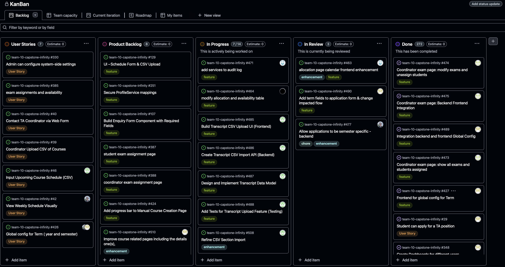
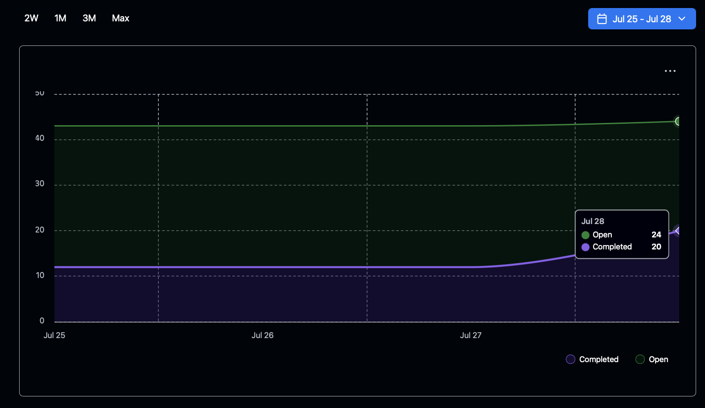

# Weekly Team Log

## Date Range:

* **7/25–7/28**

---

## Features in the Project Plan Cycle:
* Transcript CSV Upload (student portal)
* Allocation calendar UI improvements
* Unavailability model and schema update
* Expanded audit log to multiple services
* Term aware application form
* Semester specific application endpoints

---

## Associated Tasks from Project Board:

| Task ID | Description                                                       | Feature                         | Assigned To       | Status     |
| ------- | ----------------------------------------------------------------- | --------------------------------| ----------------- | ---------- |
| [#463](https://github.com/UBCO-COSC499-S2025/team-10-capstone-infinity/issues/463) | Allocation page calendar frontend enhancement: allow coordinator to assign students by clicking on section slots, UX for hour totals, prevent offer with 0 hours, add delete for section schedule, and fix application filter | Allocation Calendar UI        | Dup         | In Progress |
| [#464](https://github.com/UBCO-COSC499-S2025/team-10-capstone-infinity/issues/464) | Modify allocation & availability tables: change model to **Unavailability**, update allocation fields/relationships, adjust frontend restrictions    | Allocation / Unavailability   | Allen       | In Progress |
| [#471](https://github.com/UBCO-COSC499-S2025/team-10-capstone-infinity/issues/471) | Add application, notification, course & profile services to the audit‑log cycles (only user‑service is audited now)                                  | Audit Log                     | Dup         | In Progress |
| [#477](https://github.com/UBCO-COSC499-S2025/team-10-capstone-infinity/issues/477) | Allow applications to be semester‑specific (backend support & future‑term endpoints)                                                                 | Semester Applications Backend | Alex        | In Progress |
| [#485](https://github.com/UBCO-COSC499-S2025/team-10-capstone-infinity/issues/485) | **Frontend**: build Transcript CSV upload UI — add upload to student portal, parse/preview, send to backend, show results                            | Transcript Upload UI          | Seiya       | In Progress |
| [#486](https://github.com/UBCO-COSC499-S2025/team-10-capstone-infinity/issues/486) | **Backend**: create Transcript CSV import API — endpoint, validation, save, logging, error handling                                                  | Transcript CSV API            | Seiya       | In Progress |
| [#487](https://github.com/UBCO-COSC499-S2025/team-10-capstone-infinity/issues/487) | Design & implement Transcript data model — DB schema, migrations, link to student accounts                                                           | Transcript Data Model         | Seiya       | In Progress |
| [#488](https://github.com/UBCO-COSC499-S2025/team-10-capstone-infinity/issues/488) | Add tests for Transcript upload feature — unit/integration tests, edge cases                                                                         | Transcript Tests              | Seiya       | In Progress |
| [#490](https://github.com/UBCO-COSC499-S2025/team-10-capstone-infinity/issues/490) | Add term fields to application form & change impacted flow                                                                                           | Application Form              | Mandeep     | In Progress |
| [#421](https://github.com/UBCO-COSC499-S2025/team-10-capstone-infinity/issues/421) | Change filters to have button say “search” and hide extra fields by default                                                                          | Filters UI                    | Dup         | Completed   |
| [#428](https://github.com/UBCO-COSC499-S2025/team-10-capstone-infinity/issues/428) | Backend for global config for term                                                                                                                   | Global Config                 | Alex        | Completed   |
| [#451](https://github.com/UBCO-COSC499-S2025/team-10-capstone-infinity/issues/451) | UI improvements for Course/Section creation based on user feedback                                                                                   | Course/Section Creation       | Seiya       | Completed   |
| [#458](https://github.com/UBCO-COSC499-S2025/team-10-capstone-infinity/issues/458) | Provide downloadable sample CSV template for “Import from CSV”                                                                                       | CSV Import                    | Seiya       | Completed   |
| [#459](https://github.com/UBCO-COSC499-S2025/team-10-capstone-infinity/issues/459) | Fix multiple‑upload error handling and auto‑close import window on success                                                                           | CSV Import                    | Seiya       | Completed   |
| [#460](https://github.com/UBCO-COSC499-S2025/team-10-capstone-infinity/issues/460) | Improve CSV import feedback messages                                                                                                                 | CSV Import                    | Seiya       | Completed   |
| [#465](https://github.com/UBCO-COSC499-S2025/team-10-capstone-infinity/issues/465) | Prevent coordinator from allocating to **LECTURE**                                                                                                   | Allocation Rules              | Aakash      | Completed   |
| [#466](https://github.com/UBCO-COSC499-S2025/team-10-capstone-infinity/issues/466) | Add `numberOfTAsAllocated` field to section                                                                                                          | Allocation Page               | Aakash      | Completed   |
| [#467](https://github.com/UBCO-COSC499-S2025/team-10-capstone-infinity/issues/467) | Display number of TAs allocated in Allocation page                                                                                                   | Allocation Page               | Aakash      | Completed   |
| [#469](https://github.com/UBCO-COSC499-S2025/team-10-capstone-infinity/issues/469) | Instructor view UI/UX improvements and add missing features                                                                                          | Instructor View               | Mandeep     | Completed   |
| [#473](https://github.com/UBCO-COSC499-S2025/team-10-capstone-infinity/issues/473) | Coordinator exam page: show all exams and students assigned                                                                                          | Coordinator Exam Page         | Aakash      | Completed   |
| [#474](https://github.com/UBCO-COSC499-S2025/team-10-capstone-infinity/issues/474) | Coordinator exam page: modify exams and unassign students                                                                                            | Coordinator Exam Page         | Aakash      | Completed   |
| [#475](https://github.com/UBCO-COSC499-S2025/team-10-capstone-infinity/issues/475) | Coordinator exam page: backend–frontend integration                                                                                                  | Coordinator Exam Page         | Aakash      | Completed   |
| [#478](https://github.com/UBCO-COSC499-S2025/team-10-capstone-infinity/issues/478) | Dedicated page for needs & section viewer with UI enhancements                                                                                       | Needs / Section Viewer        | Mandeep     | Completed   |
| [#479](https://github.com/UBCO-COSC499-S2025/team-10-capstone-infinity/issues/479) | Create a separate page to see allocated students                                                                                                     | Allocated Students Page       | Mandeep     | Completed   |
| [#480](https://github.com/UBCO-COSC499-S2025/team-10-capstone-infinity/issues/480) | Export PDF & CSV of the confirmed allocation for sections                                                                                            | Export Allocations            | Mandeep     | Completed   |
| [#481](https://github.com/UBCO-COSC499-S2025/team-10-capstone-infinity/issues/481) | Qualification page UI enhancements & bug fixes                                                                                                       | Qualification Page            | Mandeep     | Completed   |
| [#482](https://github.com/UBCO-COSC499-S2025/team-10-capstone-infinity/issues/482) | Issue with allocated number of hours — fixed with another endpoint                                                                                   | Allocated Hours Endpoint      | Mandeep     | Completed   |
| [#483](https://github.com/UBCO-COSC499-S2025/team-10-capstone-infinity/issues/483) | Dashboard issues: section count & allocation‑status mismatch                                                                                         | Dashboard                     | Mandeep     | Completed   |
| [#500](https://github.com/UBCO-COSC499-S2025/team-10-capstone-infinity/issues/500) | Backend search that queries all parameters for course from text                                                                                      | Course Search Backend         | Alex        | Completed   |

### Alternatively, include image of the project board with tasks and status:

## Tasks for Next Cycle:
| Task ID | Description                                                                                   | Estimated Time (hrs) | Assigned To      |
| ------- | --------------------------------------------------------------------------------------------- | -------------------- |  ---------------- |
| [#471](https://github.com/UBCO-COSC499-S2025/team-10-capstone-infinity/issues/471) | Add application, notification, course, and profile service to the audit log cycles. Currently only user-service is audited. | 10 | Dup         |
| [#464](https://github.com/UBCO-COSC499-S2025/team-10-capstone-infinity/issues/464) | Modify allocation and availability table: change model to Unavailability, update allocation model fields and relationships, adjust frontend restrictions. | 10 | Allen        |
| [#485](https://github.com/UBCO-COSC499-S2025/team-10-capstone-infinity/issues/485) | Build Transcript CSV Upload UI (Frontend): Add CSV upload to student portal, parse/preview, send to backend, show results. | 10 | Seiya        |
| [#486](https://github.com/UBCO-COSC499-S2025/team-10-capstone-infinity/issues/486) | Create Transcript CSV Import API (Backend): Add endpoint for CSV import, validation, save, logging, error handling. | 8 | Seiya        |
| [#487](https://github.com/UBCO-COSC499-S2025/team-10-capstone-infinity/issues/487) | Design and Implement Transcript Data Model: Update DB schema, add migrations, link to student accounts. | 12 | Seiya        |
| [#488](https://github.com/UBCO-COSC499-S2025/team-10-capstone-infinity/issues/488) | Add Tests for Transcript Upload Feature (Testing): Unit/integration tests for backend, frontend, error/edge cases. | 10 | Seiya        |
| [#463](https://github.com/UBCO-COSC499-S2025/team-10-capstone-infinity/issues/463) | Allocation page calendar frontend enhancement: Allow coordinator to assign students by clicking on section slots, UX for hour totals, prevent offer with 0 hours, add delete for section schedule, and fix application filter. | 10 | Dup         |
| [#490](https://github.com/UBCO-COSC499-S2025/team-10-capstone-infinity/issues/490) | Add term fields to application form & change impacted flow.                                         | 10 | Mandeep      |
| [#477](https://github.com/UBCO-COSC499-S2025/team-10-capstone-infinity/issues/477) | Allow applications to be semester specific - backend: handle semester in application endpoints, add endpoints for future terms. | 10 | Alex          |

## Burn-up Chart (Velocity):

## Times for Team/Individual:

| Team Member | Logged Hours |
| ----------- | ------------ |
| Aakash      | 15:25        |
| Alex        | 11:02        |
| Allen       | 00:00        |
| Dup         | 20:53        |
| Eddy        | 00:00        |
| Mandeep     | 23:16        |
| Seiya       | 23:14        |

## Completed Tasks:
| Task ID                                                                            | Description                                                                 | Completed By |
| ---------------------------------------------------------------------------------- | --------------------------------------------------------------------------- | ------------ |
| [#474](https://github.com/UBCO-COSC499-S2025/team-10-capstone-infinity/issues/474) | Coordinator exam page: modify exams and unassign students                   | Aakash       |
| [#475](https://github.com/UBCO-COSC499-S2025/team-10-capstone-infinity/issues/475) | Coordinator exam page: Backend Frontend Integration                         | Aakash       |
| [#473](https://github.com/UBCO-COSC499-S2025/team-10-capstone-infinity/issues/473) | Coordinator exam page: show all exams and students assigned                 | Aakash       |
| [#421](https://github.com/UBCO-COSC499-S2025/team-10-capstone-infinity/issues/421) | Change filters to have button say "search" and hide extra fields by default | Dup          |
| [#467](https://github.com/UBCO-COSC499-S2025/team-10-capstone-infinity/issues/467) | Display number of TAs allocated in Allocation Page                          | Aakash       |
| [#466](https://github.com/UBCO-COSC499-S2025/team-10-capstone-infinity/issues/466) | Add numberOfTAsAllocated field to section                                   | Aakash       |
| [#478](https://github.com/UBCO-COSC499-S2025/team-10-capstone-infinity/issues/478) | Dedicated page for needs and section viewer with UI enhancements            | Mandeep      |
| [#465](https://github.com/UBCO-COSC499-S2025/team-10-capstone-infinity/issues/465) | Prevent coordinator from allocating to LECTURE                              | Aakash       |
| [#428](https://github.com/UBCO-COSC499-S2025/team-10-capstone-infinity/issues/428) | Backend for global config for term                                          | Alex         |
| [#469](https://github.com/UBCO-COSC499-S2025/team-10-capstone-infinity/issues/469) | Instructor view improvements in UI/UX and add missing feature(s)            | Mandeep      |
| [#483](https://github.com/UBCO-COSC499-S2025/team-10-capstone-infinity/issues/483) | Dashboard issues: section count and allocation status field mismatch        | Mandeep      |
| [#482](https://github.com/UBCO-COSC499-S2025/team-10-capstone-infinity/issues/482) | Issue with allocated number of hours; fixed with another endpoint           | Mandeep      |
| [#481](https://github.com/UBCO-COSC499-S2025/team-10-capstone-infinity/issues/481) | Enhancement in Qualification page UI and bug fixes                          | Mandeep      |
| [#480](https://github.com/UBCO-COSC499-S2025/team-10-capstone-infinity/issues/480) | Export PDF and CSV of the confirmed allocation for sections                 | Mandeep      |
| [#479](https://github.com/UBCO-COSC499-S2025/team-10-capstone-infinity/issues/479) | Create a separate page to see allocated students                            | Mandeep      |
| [#451](https://github.com/UBCO-COSC499-S2025/team-10-capstone-infinity/issues/451) | UI improvements for Course/Section Creation based on user feedback          | Seiya        |
| [#458](https://github.com/UBCO-COSC499-S2025/team-10-capstone-infinity/issues/458) | Provide downloadable sample CSV template for “Import from CSV”              | Seiya        |
| [#459](https://github.com/UBCO-COSC499-S2025/team-10-capstone-infinity/issues/459) | Fix multiple upload error handling and auto-close import window on success  | Seiya        |
| [#460](https://github.com/UBCO-COSC499-S2025/team-10-capstone-infinity/issues/460) | Improve CSV import feedback messages                                        | Seiya        |
| [#500](https://github.com/UBCO-COSC499-S2025/team-10-capstone-infinity/issues/500) | Have backend search that searches all parameters for course from text       | Alex         |

## In Progress Tasks/ To do:
| Task ID | Description                                                                                   | Assigned To      |
| ------- | --------------------------------------------------------------------------------------------- | ---------------- |
| [#471](https://github.com/UBCO-COSC499-S2025/team-10-capstone-infinity/issues/471) | Add application, notification, course, and profile service to the audit log cycles. Currently only user-service is audited. | Dup         |
| [#464](https://github.com/UBCO-COSC499-S2025/team-10-capstone-infinity/issues/464) | Modify allocation and availability table: change model to Unavailability, update allocation model fields and relationships, adjust frontend restrictions. | Allen        |
| [#485](https://github.com/UBCO-COSC499-S2025/team-10-capstone-infinity/issues/485) | Build Transcript CSV Upload UI (Frontend): Add CSV upload to student portal, parse/preview, send to backend, show results. | Seiya        |
| [#486](https://github.com/UBCO-COSC499-S2025/team-10-capstone-infinity/issues/486) | Create Transcript CSV Import API (Backend): Add endpoint for CSV import, validation, save, logging, error handling. | Seiya        |
| [#487](https://github.com/UBCO-COSC499-S2025/team-10-capstone-infinity/issues/487) | Design and Implement Transcript Data Model: Update DB schema, add migrations, link to student accounts. | Seiya        |
| [#488](https://github.com/UBCO-COSC499-S2025/team-10-capstone-infinity/issues/488) | Add Tests for Transcript Upload Feature (Testing): Unit/integration tests for backend, frontend, error/edge cases. | Seiya        |
| [#463](https://github.com/UBCO-COSC499-S2025/team-10-capstone-infinity/issues/463) | Allocation page calendar frontend enhancement: Allow coordinator to assign students by clicking on section slots, UX for hour totals, prevent offer with 0 hours, add delete for section schedule, and fix application filter. | Dup         |
| [#490](https://github.com/UBCO-COSC499-S2025/team-10-capstone-infinity/issues/490) | Add term fields to application form & change impacted flow.                                         | Mandeep      |
| [#477](https://github.com/UBCO-COSC499-S2025/team-10-capstone-infinity/issues/477) | Allow applications to be semester specific - backend: handle semester in application endpoints, add endpoints for future terms. | Alex          |

## Overview:

During the period of July 25-28, the team completed:
* Coordinator exam workflow finished, covering show modify unassign and backend frontend integration
* Allocation improvements delivered, adding TA count display, numberOfTAsAllocated field, and prevention of lecture allocations
* Major UI upgrades released for instructor dashboard, needs and section viewer, allocated students page, and course section creation
* CSV import enhancements provided, including a downloadable template, stronger error handling, and clearer feedback messages
* Global term configuration and new course search backend made available together with a simplified filters interface