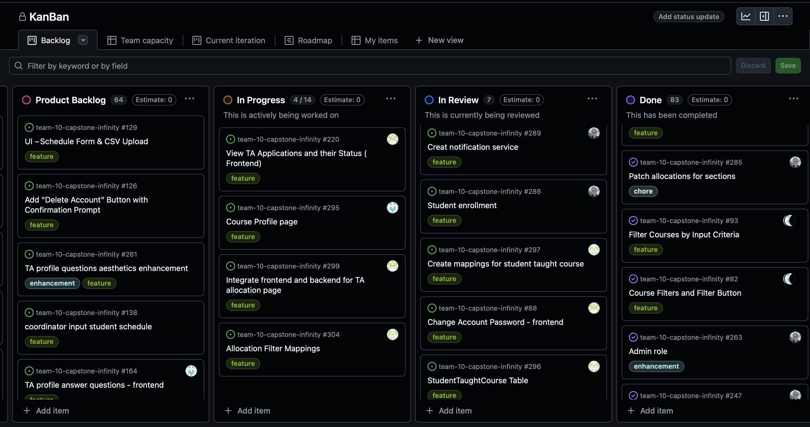
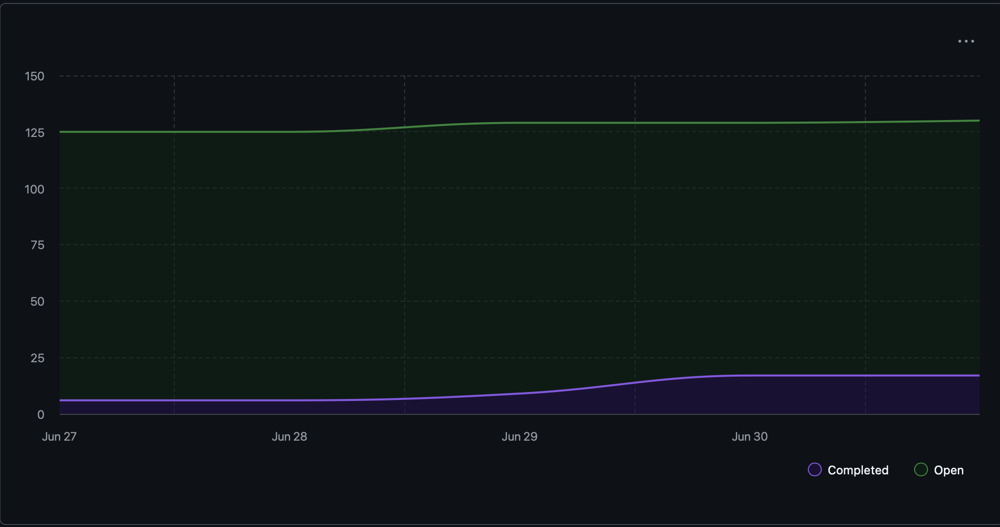
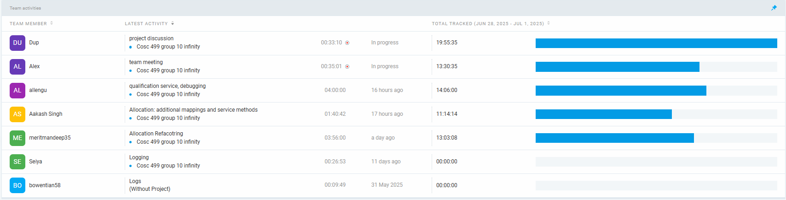
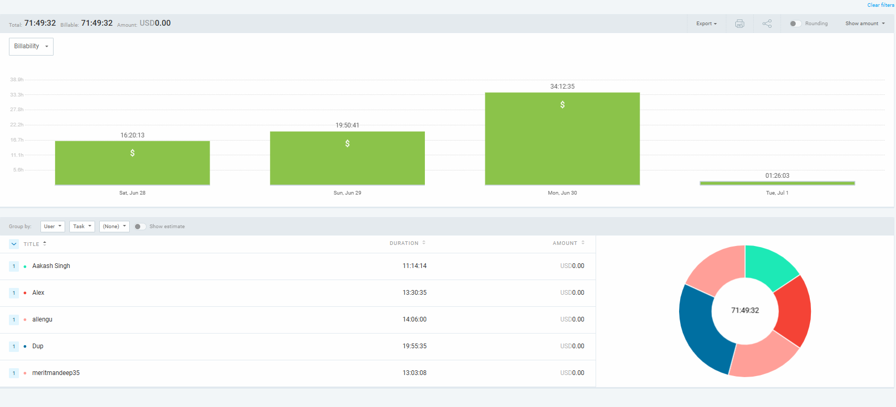

# Weekly Team Log

## Date Range:

* 6/28-7/01

## Features in the Project Plan Cycle:

* Instructor needs 
* TA allocation page (frontend and backend)
* lab skills frontend 
* Profile integration with backend 

## Associated Tasks from Project Board:

| Task ID | Description                                         | Feature                                                     | Assigned To           | Status   |
| ------- | --------------------------------------------------- | ----------------------------------------------------------- | --------------------- | -------- |
|[#291](https://github.com/UBCO-COSC499-S2025/team-10-capstone-infinity/issues/291)    | Allocation                   |  Allocation Offer Refactor|            Aakash             | Completed|
|[#290](https://github.com/UBCO-COSC499-S2025/team-10-capstone-infinity/issues/290)    | Allocation          | Patched teacher allocations     | Alex              | Completed |
|[#292](https://github.com/UBCO-COSC499-S2025/team-10-capstone-infinity/issues/292)    | Course management             |      section management frontend       | Dup        | Completed |
| [#271](https://github.com/UBCO-COSC499-S2025/team-10-capstone-infinity/issues/271)    | Profile       |  271 profiles integrated with backend          | Dup                | Completed |
| [#283](https://github.com/UBCO-COSC499-S2025/team-10-capstone-infinity/issues/283)    |  Allocation | create ta allocation page for coordinator frontend       | Mandeep      | Completed |
| [#281](https://github.com/UBCO-COSC499-S2025/team-10-capstone-infinity/issues/281)    | Instructor needs  |  91 put instructor needs in db    | Alex       |Completed|
| [#289](https://github.com/UBCO-COSC499-S2025/team-10-capstone-infinity/issues/289)    | Notifications  |  Create notification service    | Alex       |In review|
| [#286](https://github.com/UBCO-COSC499-S2025/team-10-capstone-infinity/issues/286)    | Enrollment  |  add functionality for students to take courses  | Alex       |In review|
| [#297](https://github.com/UBCO-COSC499-S2025/team-10-capstone-infinity/issues/297)    | StudentTaughtCourse  |  create mappings for student taught course    | Aakash      |In review|
| [#296](https://github.com/UBCO-COSC499-S2025/team-10-capstone-infinity/issues/296)    | StudentTaughtCourse  |  create student taught course table  | Aakash      |In review|
| [#88](https://github.com/UBCO-COSC499-S2025/team-10-capstone-infinity/issues/88)    | Profile Management  |  Change account password : frontend    | Mandeep      | In review|
| [#274](https://github.com/UBCO-COSC499-S2025/team-10-capstone-infinity/issues/274)    | User Management  |  View/Update all registered users in system    |    Dup |    In review|
| [#98](https://github.com/UBCO-COSC499-S2025/team-10-capstone-infinity/issues/98)    | Course Filtering  |  Integrate react frontend with spring boot backend for course filtering   | Dup     |   In review|

 ### Alternatively, include image of the project board with tasks and status:

## Tasks for Next Cycle:

| Task ID | Description                                       | Estimated Time (hrs) | Assigned To |
| ------- | ------------------------------------------------- | -------------------- | ----------- |
| [#220](https://github.com/UBCO-COSC499-S2025/team-10-capstone-infinity/issues/220)          |  View Ta applications and their status  | 25 +              | Mandeep    |
| [#295](https://github.com/UBCO-COSC499-S2025/team-10-capstone-infinity/issues/295)          | Course Profile Page   | 25+              | Dup      |
| [#299](https://github.com/UBCO-COSC499-S2025/team-10-capstone-infinity/issues/299)       | Integrate frontend and backend for allocation page | 25+                   | Mandeep    |
| [#304](https://github.com/UBCO-COSC499-S2025/team-10-capstone-infinity/issues/304)       | Allocation filter mappings  | 25 +                 | Aakash |
| [#130](https://github.com/UBCO-COSC499-S2025/team-10-capstone-infinity/issues/130)       | Forgot password backend  | 25 +                 | Alex |

## Burn-up Chart (Velocity):

## Times for Team/Individual:

| Team Member | Logged Hours |
| ----------- | ------------ |
| Aakash      | 11:14            |
| Alex        | 12:53            |
| Allen       | 14:06             |
| Dup         | 19:06           |
| Eddy        | 00:00         |
| Mandeep     | 13:03          |
| Seiya       | 00:00            |

| Task ID | Description                           | Completed By |
| ------- | ------------------------------------- | ------------ |     
| [#277](https://github.com/UBCO-COSC499-S2025/team-10-capstone-infinity/issues/277)    |  Allocation     | allocate TA based on offer acceptance   | Aakash   | Completed |
| [#101](https://github.com/UBCO-COSC499-S2025/team-10-capstone-infinity/issues/101)    | Application   | UI- apply for ta position button |  mandeep | Completed |
| [#91](https://github.com/UBCO-COSC499-S2025/team-10-capstone-infinity/issues/91)    | Instructor needs  |  put instructor needs in db   | Alex       |Completed|
| [#140](https://github.com/UBCO-COSC499-S2025/team-10-capstone-infinity/issues/140)    | Profile   |  implement user profile update UI   | Dup       |Completed|

## In Progress Tasks / To Do:

| Task ID | Description                                      | Assigned To |
| ------- | ------------------------------------------------ | ----------- |
| [#220](https://github.com/UBCO-COSC499-S2025/team-10-capstone-infinity/issues/220)        |  View TA applications and their status- frontend         | Mandeep                  | 
| [#295](https://github.com/UBCO-COSC499-S2025/team-10-capstone-infinity/issues/295)                      | course profile page                   | Dup        | 
| [#299](https://github.com/UBCO-COSC499-S2025/team-10-capstone-infinity/issues/299)  | Integrate Frontend with Backend for TA allocation       | Mandeep       |
| [#304](https://github.com/UBCO-COSC499-S2025/team-10-capstone-infinity/issues/304)                  | Additional allocation filter mappings         | Aakash         | 
| [#130](https://github.com/UBCO-COSC499-S2025/team-10-capstone-infinity/issues/130)      |       Forgot password - backend            |Alex        |

## Overview:

During the period of June 28 - July 1, the team made progress in several areas:
* allocate TA based on offer acceptance
* UI- apply for ta position butto
* put instructor needs in db
* implement user profile update UI

