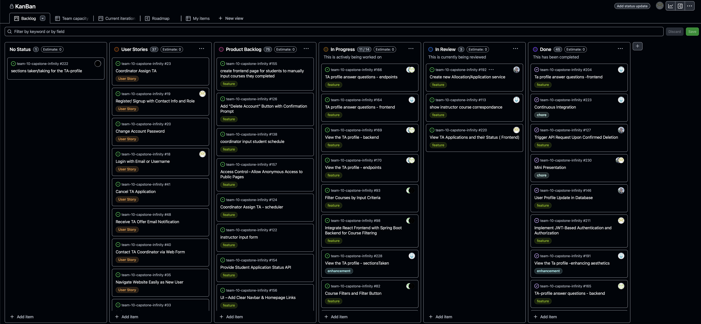
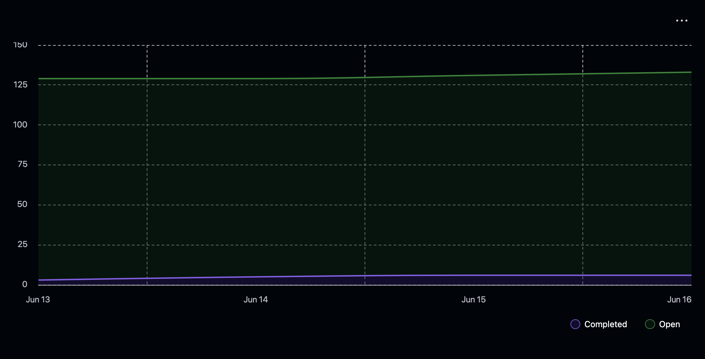
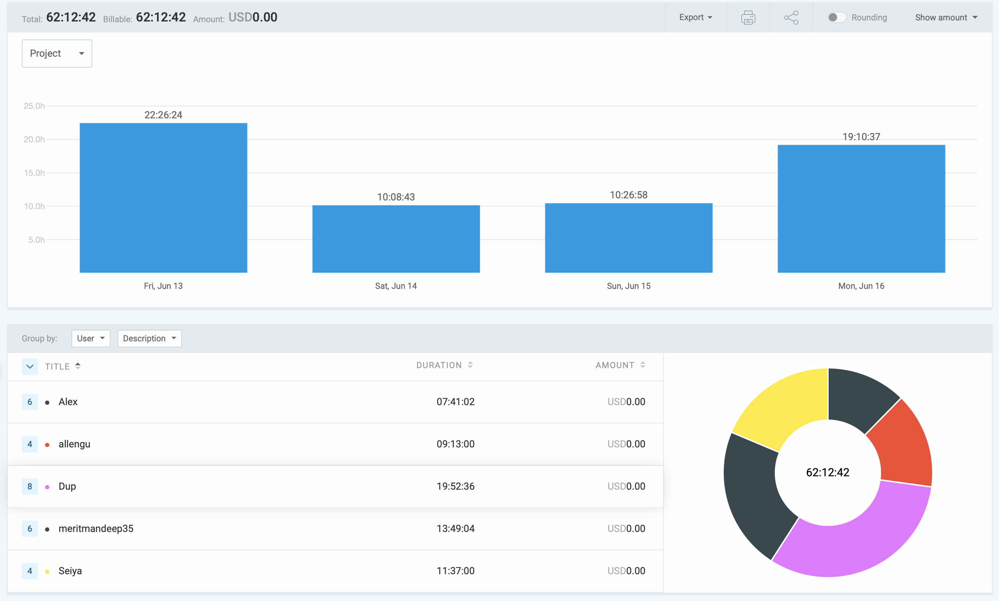

# Weekly Team Log

## Date Range:

* 6/13-6/16

## Features in the Project Plan Cycle:

* 

## Associated Tasks from Project Board:

| Task ID | Description                                         | Feature                    | Assigned To           | Status   |
| ------- | --------------------------------------------------- | -------------------------- | --------------------- | -------- |

### Alternatively, include image of the project board with tasks and status:

## Tasks for Next Cycle:

| Task ID | Description                                       | Estimated Time (hrs) | Assigned To |
| ------- | ------------------------------------------------- | -------------------- | ----------- |

## Burn-up Chart (Velocity):

## Times for Team/Individual:

| Team Member | Logged Hours |
| ----------- | ------------ |
| Aakash      |  ‏            |
| Alex        | 07:41:02             |
| Allen       | 09:13:00             |
| Dup         | 19:52:36             |
| Eddy        | 00:00:00             |
| Mandeep     | 13:49:04             |
| Seiya       | 11:37:00             |

## Completed Tasks:

| Task ID | Description                           | Completed By |
| ------- | ------------------------------------- | ------------ |
| #204    | Ta profile answer questions -frontend                  |  Dup            |
| #223    |  Continuous Integration                                |  Dup            |
| #127    | Trigger API Request Upon Confirmed Deletion            |  Alex            |
| #230    | Mini Presentation                                      |  Mandeep & Alex            |
| #211    | Implement JWT-Based Authentication and Authorization   |  Mandeep            |
| #191    | View the Ta profile -enhancing aesthetics              |  Dup            |
| #165    | TA-profile answer questions - backend                  |  Aakash            |
| #206    | Ta profile backend getStudent                          |  Dup            |
| #200    | Integration of frontend and Backend/ login             |  Dup            |

## In Progress Tasks / To Do:

| Task ID | Description                                      | Assigned To |
| ------- | ------------------------------------------------ | ----------- |
| #166    | TA profile answer questions - endpoints                        | Aakash & Dup           |
| #164    | TA profile answer questions - frontend                         | Aakash & Dup           |
| #169    | View the TA profile - backend                                  | Aakash & Dup           |
| #170    | View the TA profile - endpoints                                | Aakash & Dup           |
| #93     |  Filter Courses by Input Criteria                              | Seiya&Allen            |
| #98     |  Integrate React Frontend with Spring Boot Backend for Course Filtering         | Seiya&Allen            |
| #82     | Course Filters and Filter Button                               | Seiya&Allen            |
| #105    | API – Create TA Application                                    | Alex            |
| #118    | Cancel TA Application - backend                                | Alex            |
| #144    | Modify Application Submission Endpoint to Accept Subject Preferences   | Alex            |

## Test Report / Testing Status:
N/A

## Overview:

During the period of June 13-16, the team made progress in several areas:

* 
* 
