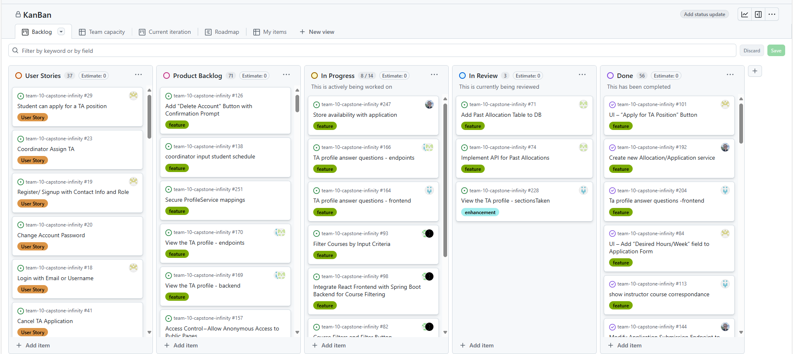
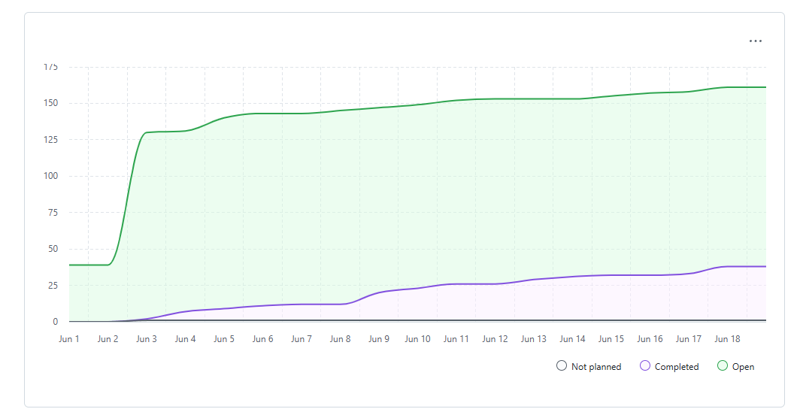
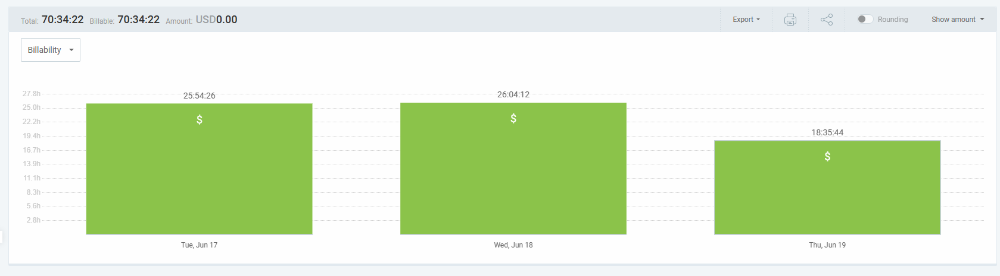
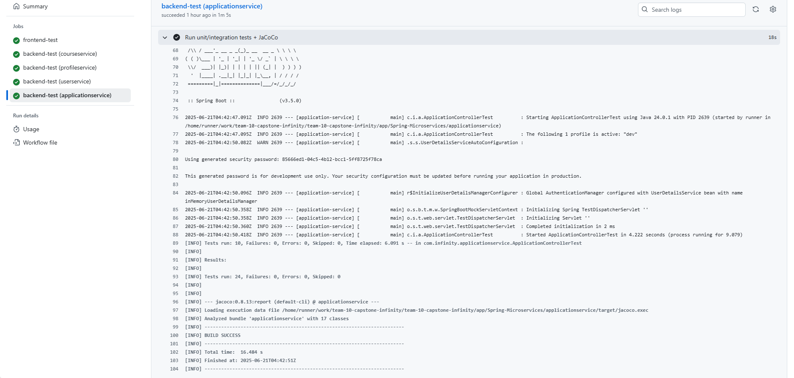

# Weekly Team Log

## Date Range:

* 6/17-6/19

## Features in the Project Plan Cycle:

* Instructor Profile viewing
* Allocation History backend
* Course Filtering
* TA application frontend
* Authentication in frontend
* ProfileQuestions (for the students)

## Associated Tasks from Project Board:

| Task ID | Description                                         | Feature                                                     | Assigned To           | Status   |
| ------- | --------------------------------------------------- | ----------------------------------------------------------- | --------------------- | -------- |
| [#192](https://github.com/UBCO-COSC499-S2025/team-10-capstone-infinity/issues/192)   | new services              | Create new Allocation/Application service                     | Alex                   | Completed |
| [#84](https://github.com/UBCO-COSC499-S2025/team-10-capstone-infinity/issues/84)    | Application form UI                              | UI – Add “Desired Hours/Week” field to Application Form                              | Mnadeep                   | Completed |
| [#101](https://github.com/UBCO-COSC499-S2025/team-10-capstone-infinity/issues/101)    |UI         | UI – “Apply for TA Position” Button                                         | Mandeep                  | Completed |
| [#141](https://github.com/UBCO-COSC499-S2025/team-10-capstone-infinity/issues/141)    | TA application                                   | Add subject preference field to TA application form                            | Mandeep        | Completed |
| [#105](https://github.com/UBCO-COSC499-S2025/team-10-capstone-infinity/issues/105)    | TA application| API – Create TA Application                  | Alex               | Completed |
| [#118](https://github.com/UBCO-COSC499-S2025/team-10-capstone-infinity/issues/118)    | TA application           | Cancel TA Application - backend                     | Alex                   | Completed |
| [#144](https://github.com/UBCO-COSC499-S2025/team-10-capstone-infinity/issues/144)    | TA application               | Modify Application Submission Endpoint to Accept Subject Preferences                     | Alex                | Completed |
| [#237](https://github.com/UBCO-COSC499-S2025/team-10-capstone-infinity/issues/237)    | Authentication                       |Implement Role-Based Routing for Protected Views                      | Mandeep                   | Completed |
| [#247](https://github.com/UBCO-COSC499-S2025/team-10-capstone-infinity/issues/247)    | Student availability        | Store availability with application                  | Alex                   | In progress |
| [#166](https://github.com/UBCO-COSC499-S2025/team-10-capstone-infinity/issues/166)    |   Profile Questions           | TA profile answer questions - endpoints                     | Aakash & Dup          | In Progress |
| [#164](https://github.com/UBCO-COSC499-S2025/team-10-capstone-infinity/issues/164)    |    Profile Questions     | TA profile answer questions - frontend                          | Aakash & Dup          | In Progress |
| [#93](https://github.com/UBCO-COSC499-S2025/team-10-capstone-infinity/issues/93)    | Filter Courses                      | Filter Courses by Input Criteria                   | Allen and Seiya         | In Progress |
| [#98](https://github.com/UBCO-COSC499-S2025/team-10-capstone-infinity/issues/98)    | Filter Courses                    | Integrate React Frontend with Spring Boot Backend for Course Filtering               | Allen and Seiya        | In Progress |
| [#82](https://github.com/UBCO-COSC499-S2025/team-10-capstone-infinity/issues/82)     | Filter Courses                 | Course Filters and Filter Button         | Seiya & Allen         | In Progress |
| [#240](https://github.com/UBCO-COSC499-S2025/team-10-capstone-infinity/issues/240)    | Profile Questions | TA profile answer questions create/answer  | Dup        | In Progress |

 ### Alternatively, include image of the project board with tasks and status:

## Tasks for Next Cycle:

| Task ID | Description                                       | Estimated Time (hrs) | Assigned To |
| ------- | ------------------------------------------------- | -------------------- | ----------- |
| [#254](https://github.com/UBCO-COSC499-S2025/team-10-capstone-infinity/issues/254), [#255](https://github.com/UBCO-COSC499-S2025/team-10-capstone-infinity/issues/255) | Qualifications for labs (skills)                | 50     +             | Allen and Dup       |
| [#44](https://github.com/UBCO-COSC499-S2025/team-10-capstone-infinity/issues/44)          | Use Weekly Planner for Availability   | 50     +              | Alex       |
| [#24](https://github.com/UBCO-COSC499-S2025/team-10-capstone-infinity/issues/23)       | Allocation | 50+                   | Mandeep and Aakash       |
| [#22](https://github.com/UBCO-COSC499-S2025/team-10-capstone-infinity/issues/22)       | Instructor can post grading hours  | 25 +                 | Seiya       |

## Burn-up Chart (Velocity):

## Times for Team/Individual:

| Team Member | Logged Hours |
| ----------- | ------------ |
| Aakash      | 15:40            |
| Alex        | 07:38             |
| Allen       | 04:56             |
| Dup         | 24:11            |
| Eddy        | 00:00          |
| Mandeep     | 09:11             |
| Seiya       | 08:56             |

## Completed Tasks:

| Task ID | Description                           | Completed By |
| ------- | ------------------------------------- | ------------ |
| [#192](https://github.com/UBCO-COSC499-S2025/team-10-capstone-infinity/issues/192)    | Create new Allocation/Application service                     | Alex                   | 
| [#84](https://github.com/UBCO-COSC499-S2025/team-10-capstone-infinity/issues/84)                               | UI – Add “Desired Hours/Week” field to Application Form                              | Mandeep                
| [#101](https://github.com/UBCO-COSC499-S2025/team-10-capstone-infinity/issues/101)        | UI – “Apply for TA Position” Button                                         | Mandeep                   |
| [#141](https://github.com/UBCO-COSC499-S2025/team-10-capstone-infinity/issues/141)                               | Add subject preference field to TA application form                            | Mandeep        
| [#105](https://github.com/UBCO-COSC499-S2025/team-10-capstone-infinity/issues/105)   | API – Create TA Application                  | Alex               | 
| [#118](https://github.com/UBCO-COSC499-S2025/team-10-capstone-infinity/issues/118)            | Cancel TA Application - backend                     | Alex                   
| [#144](https://github.com/UBCO-COSC499-S2025/team-10-capstone-infinity/issues/144)              | Modify Application Submission Endpoint to Accept Subject Preferences                     | Alex                
| [#237](https://github.com/UBCO-COSC499-S2025/team-10-capstone-infinity/issues/237)                       |Implement Role-Based Routing for Protected Views                      | Mandeep                  

## In Progress Tasks / To Do:

| Task ID | Description                                      | Assigned To |
| ------- | ------------------------------------------------ | ----------- |
| [#247](https://github.com/UBCO-COSC499-S2025/team-10-capstone-infinity/issues/247)        | Store availability with application                  | Alex                   | 
| [#166](https://github.com/UBCO-COSC499-S2025/team-10-capstone-infinity/issues/166)          | TA profile answer questions - endpoints                     | Aakash & Dup          | 
| [#164](https://github.com/UBCO-COSC499-S2025/team-10-capstone-infinity/issues/164)      | TA profile answer questions - frontend                          | Aakash & Dup          | 
| [#93](https://github.com/UBCO-COSC499-S2025/team-10-capstone-infinity/issues/93)                      | Filter Courses by Input Criteria                   | Allen and Seiya         | 
| [#98](https://github.com/UBCO-COSC499-S2025/team-10-capstone-infinity/issues/98)                       | Integrate React Frontend with Spring Boot Backend for Course Filtering               | Allen and Seiya        |
| [#82](https://github.com/UBCO-COSC499-S2025/team-10-capstone-infinity/issues/82)                  | Course Filters and Filter Button         | Seiya & Allen         | 
| [#240](https://github.com/UBCO-COSC499-S2025/team-10-capstone-infinity/issues/240)    | TA profile answer questions create/answer  | Dup       

## Test Report / Testing Status:

## Overview:

During the period of June 17-19, the team made progress in several areas:
* Development in the ProfileQuestions and frontend instructor profile page. While the PR is being reviewed right now, the ProfileQuestions integration between frontend and backend is pretty much complete.
* Course Filtering. While the PR is being reviewed right now, it is supposedly done.
* TA Application. The frontend for the application is done. The backend is done.
* Allocation History. The PR is being reviewed but the backend for is is supposedly done.
* Authentication in frontend.

