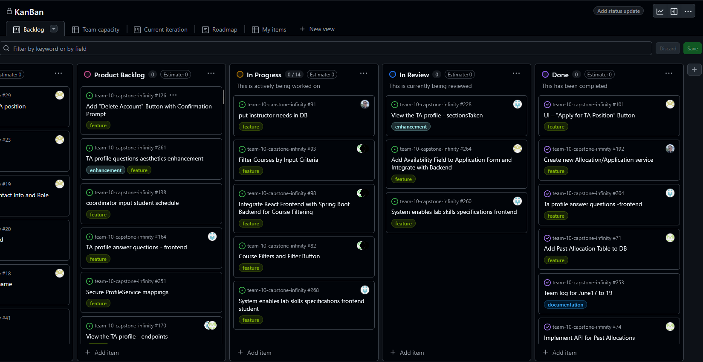
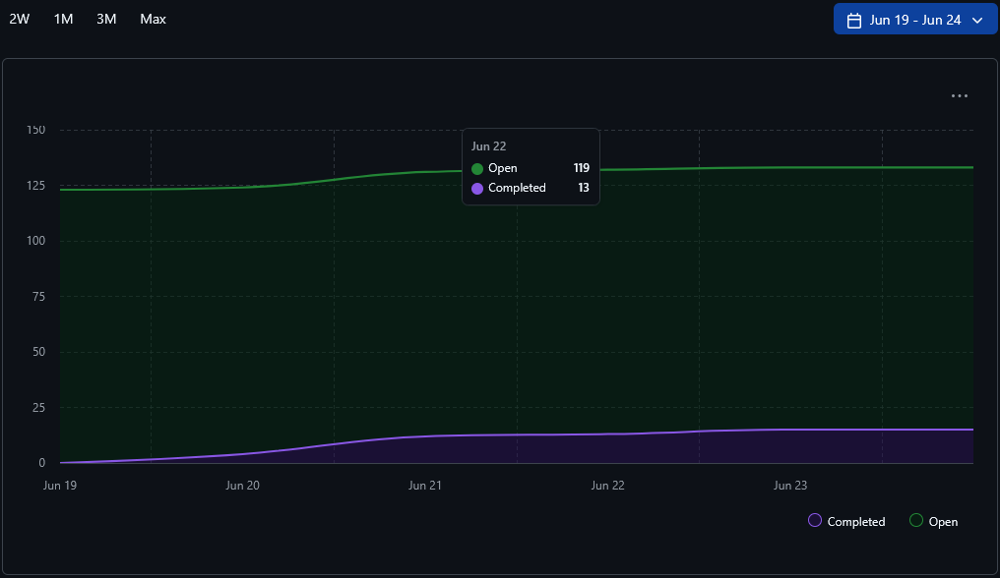
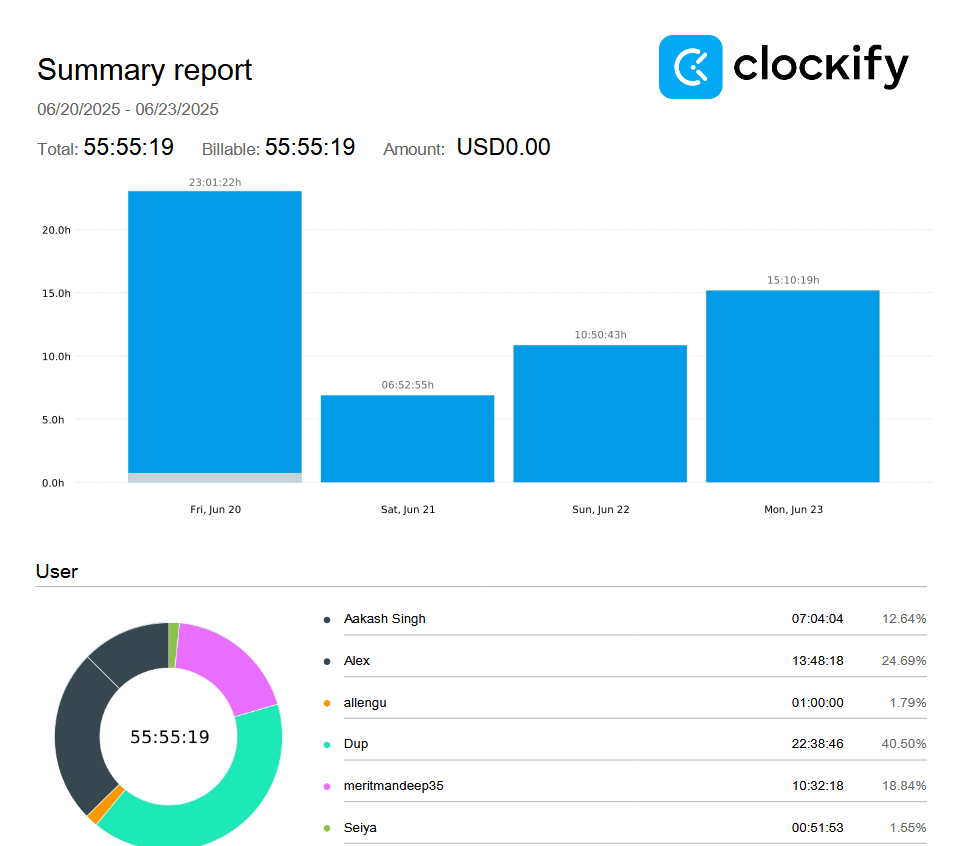
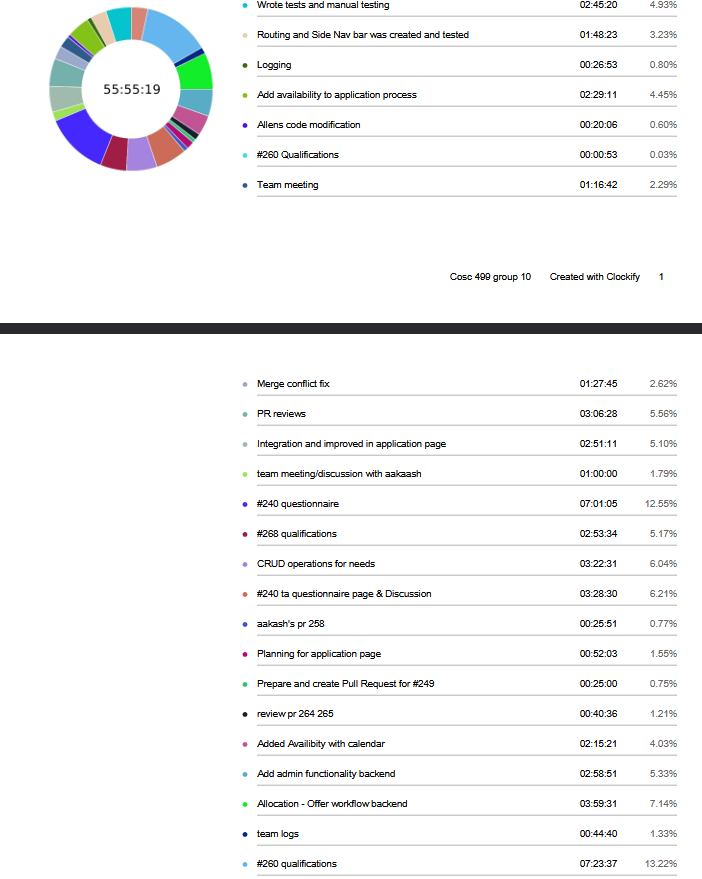
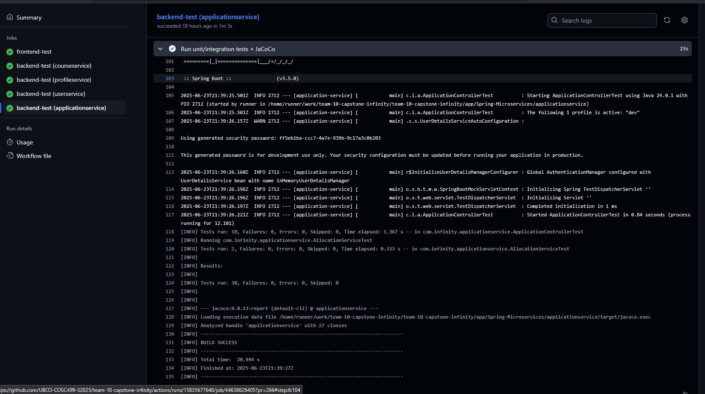

# Weekly Team Log

## Date Range:

* 6/20-6/23

## Features in the Project Plan Cycle:

* Admin role backend
* Application availability
* ProfileQuestions
* Qualifications for courses

## Associated Tasks from Project Board:

| Task ID | Description                                         | Feature                                                     | Assigned To           | Status   |
| ------- | --------------------------------------------------- | ----------------------------------------------------------- | --------------------- | -------- |
|[#267](https://github.com/UBCO-COSC499-S2025/team-10-capstone-infinity/issues/267)    | Qualifications                            | system enables lab skills specifications frontend                                | Dup                   | In Review |
|[#266](https://github.com/UBCO-COSC499-S2025/team-10-capstone-infinity/issues/266)    | Application                            | add availability field to application form and integrate with backend                                | Mandeep                   | In Review |
|[#263](https://github.com/UBCO-COSC499-S2025/team-10-capstone-infinity/issues/263)    | Authentication                       |Add admin role functionality backend                      | Alex                   | Completed |
| [#247](https://github.com/UBCO-COSC499-S2025/team-10-capstone-infinity/issues/247)    | Student availability        | Store availability with application                  | Alex                   | Completed |
| [#166](https://github.com/UBCO-COSC499-S2025/team-10-capstone-infinity/issues/166)    |   Profile Questions           | TA profile answer questions - endpoints                     | Aakash & Dup          | Completed |
| [#164](https://github.com/UBCO-COSC499-S2025/team-10-capstone-infinity/issues/164)    |    Profile Questions     | TA profile answer questions - frontend                          | Aakash & Dup          | Completed |
| [#93](https://github.com/UBCO-COSC499-S2025/team-10-capstone-infinity/issues/93)    | Filter Courses                      | Filter Courses by Input Criteria                   | Allen and Seiya         | In Progress |
| [#98](https://github.com/UBCO-COSC499-S2025/team-10-capstone-infinity/issues/98)    | Filter Courses                    | Integrate React Frontend with Spring Boot Backend for Course Filtering               | Allen and Seiya        | In Progress |
| [#82](https://github.com/UBCO-COSC499-S2025/team-10-capstone-infinity/issues/82)     | Filter Courses                 | Course Filters and Filter Button         | Seiya & Allen         | In Progress |
| [#240](https://github.com/UBCO-COSC499-S2025/team-10-capstone-infinity/issues/240)    | Profile Questions | TA profile answer questions create/answer  | Dup        | Complete |

 ### Alternatively, include image of the project board with tasks and status:

## Tasks for Next Cycle:

| Task ID | Description                                       | Estimated Time (hrs) | Assigned To |
| ------- | ------------------------------------------------- | -------------------- | ----------- |
| [#44](https://github.com/UBCO-COSC499-S2025/team-10-capstone-infinity/issues/44)          | put instructor needs in db   | 25     +              | Alex       |
| [#268](https://github.com/UBCO-COSC499-S2025/team-10-capstone-infinity/issues/268)       | Qualifications | 50+                   | Dup and Allen       |
| [#98](https://github.com/UBCO-COSC499-S2025/team-10-capstone-infinity/issues/22)       | Course filtering  | 25 +                 | Seiya 
| #?       | Sending offers to students  | 25 +                 | Aakash      |
| [#69](https://github.com/UBCO-COSC499-S2025/team-10-capstone-infinity/issues/69)      | Create TA allocation page for coordinator - frontend         |25 +             |Mandeep          |
| [#123](https://github.com/UBCO-COSC499-S2025/team-10-capstone-infinity/issues/123)      | Forgot password page           | 25+          |Mandeep          |

## Burn-up Chart (Velocity):

## Times for Team/Individual:

| Team Member | Logged Hours |
| ----------- | ------------ |
| Aakash      | 07:04            |
| Alex        | 13:48             |
| Allen       | 01:00             |
| Dup         | 22:38            |
| Eddy        | 00:00          |
| Mandeep     | 10:32            |
| Seiya       | 00:51             |

## Completed Tasks:

| Task ID | Description                           | Completed By |
| ------- | ------------------------------------- | ------------ |     
| [#166](https://github.com/UBCO-COSC499-S2025/team-10-capstone-infinity/issues/166)          | TA profile answer questions - endpoints                     | Aakash & Dup          | 
| [#164](https://github.com/UBCO-COSC499-S2025/team-10-capstone-infinity/issues/164)      | TA profile answer questions - frontend                          | Aakash & Dup          |
| [#260](https://github.com/UBCO-COSC499-S2025/team-10-capstone-infinity/issues/260)      | System enables lab skills specifications frontend                       |Dup          |
| [#264](https://github.com/UBCO-COSC499-S2025/team-10-capstone-infinity/issues/264)      | Add Availability Field to Application Form and Integrate with Backend                       |Mandeep          |
| [#263](https://github.com/UBCO-COSC499-S2025/team-10-capstone-infinity/issues/264)      | Admin role                       |Alex          |
| [#247](https://github.com/UBCO-COSC499-S2025/team-10-capstone-infinity/issues/247)      | Store availability with application                      |Alex          |

## In Progress Tasks / To Do:

| Task ID | Description                                      | Assigned To |
| ------- | ------------------------------------------------ | ----------- |
| [#91](https://github.com/UBCO-COSC499-S2025/team-10-capstone-infinity/issues/91)        |put instructor needs in db                 | Alex                   | 
| [#93](https://github.com/UBCO-COSC499-S2025/team-10-capstone-infinity/issues/93)                      | Filter Courses by Input Criteria                   | Allen and Seiya         | 
| [#98](https://github.com/UBCO-COSC499-S2025/team-10-capstone-infinity/issues/98)                       | Integrate React Frontend with Spring Boot Backend for Course Filtering               | Allen and Seiya        |
| [#82](https://github.com/UBCO-COSC499-S2025/team-10-capstone-infinity/issues/82)                  | Course Filters and Filter Button         | Seiya & Allen         | 
| [#268](https://github.com/UBCO-COSC499-S2025/team-10-capstone-infinity/issues/268)    | TA profile answer questions create/answer  | Dup   
| [#69](https://github.com/UBCO-COSC499-S2025/team-10-capstone-infinity/issues/69)      | Create TA allocation page for coordinator - frontend                      |Mandeep          |
| [#123](https://github.com/UBCO-COSC499-S2025/team-10-capstone-infinity/issues/123)      | Forgot password page                     |Mandeep          |    

## Test Report / Testing Status:

## Overview:

During the period of June 20-23, the team made progress in several areas:
* Development in the ProfileQuestions and frontend instructor profile page. The PR has now been merged
* Course Filtering. The backend works, but still waiting on frontend integration
* TA Application availability. The frontend for the application is done. The backend is done.
* Allocation History. The PR is merged.
* Admin role in backend for increased role management is done.

