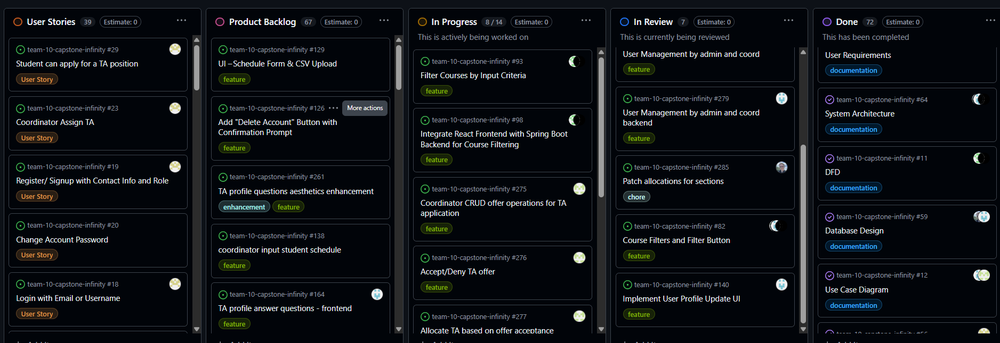
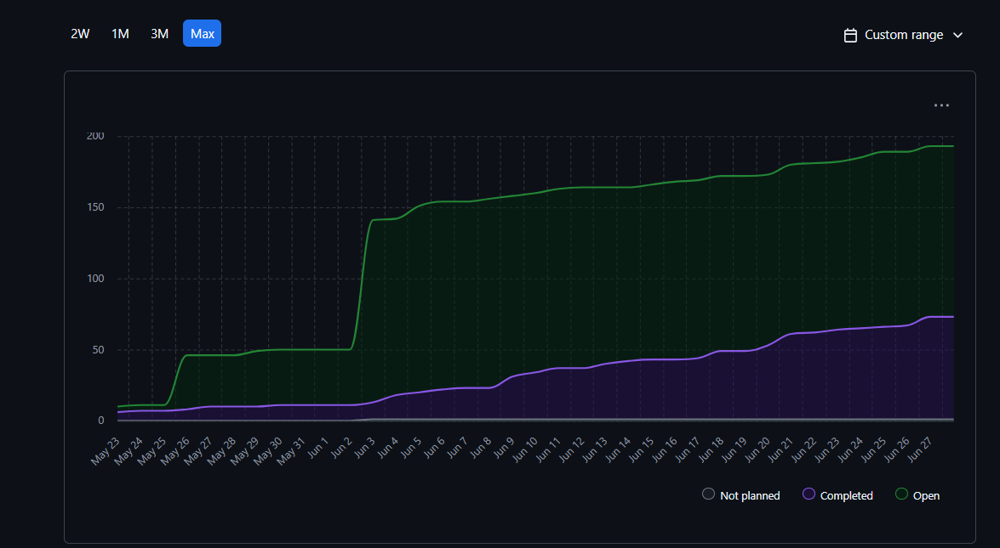
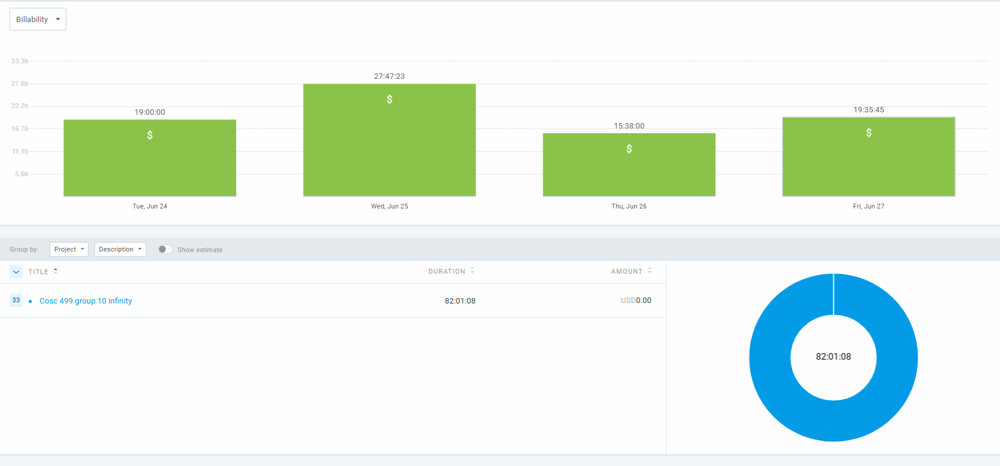
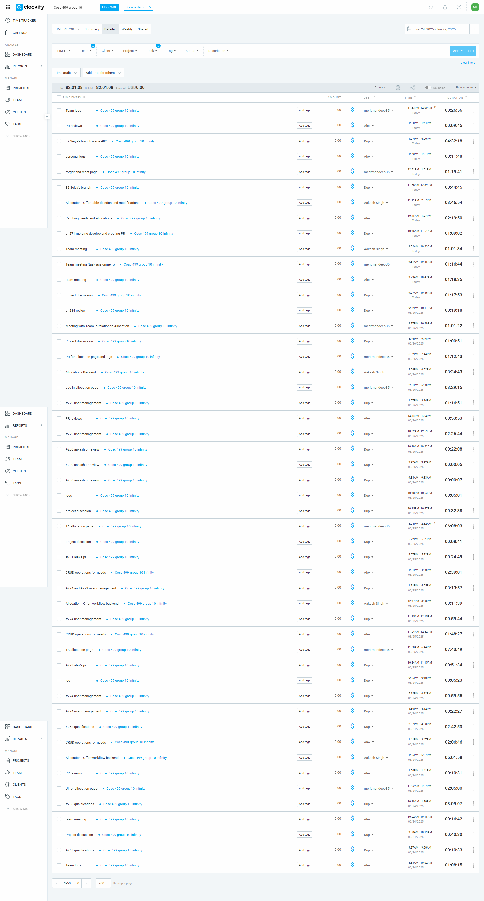

# Weekly Team Log

## Date Range:

* 6/24-6/27

## Features in the Project Plan Cycle:

* Instructor needs 
* TA allocation page (frontend and backend)
* lab skills frontend 
* Profile integration with backend 

## Associated Tasks from Project Board:

| Task ID | Description                                         | Feature                                                     | Assigned To           | Status   |
| ------- | --------------------------------------------------- | ----------------------------------------------------------- | --------------------- | -------- |
|[#291](https://github.com/UBCO-COSC499-S2025/team-10-capstone-infinity/issues/291)    | Allocation                   |  Allocation Offer Refactor|            Aakash             | In review|
|[#290](https://github.com/UBCO-COSC499-S2025/team-10-capstone-infinity/issues/290)    | Allocation          | Patched teacher allocations     | Alex              | In review |
|[#292](https://github.com/UBCO-COSC499-S2025/team-10-capstone-infinity/issues/292)    | Course management             |      section management frontend       | Dup        | In review |
| [#271](https://github.com/UBCO-COSC499-S2025/team-10-capstone-infinity/issues/271)    | Profile       |  271 profiles integrated with backend          | Dup                | In review |
| [#283](https://github.com/UBCO-COSC499-S2025/team-10-capstone-infinity/issues/283)    |  Allocation | create ta allocation page for coordinator frontend       | Mandeep      | Completed |
| [#283](https://github.com/UBCO-COSC499-S2025/team-10-capstone-infinity/issues/283)    |  Allocation     | allocation page for coordinator  Integration   | Mandeep    | Completed |
| [#282](https://github.com/UBCO-COSC499-S2025/team-10-capstone-infinity/issues/282)    | Qualification   | 268 system enables lab skills specifications frontend student  |  Dup   | Completed |
| [#281](https://github.com/UBCO-COSC499-S2025/team-10-capstone-infinity/issues/281)    | Instructor needs  |  91 put instructor needs in db    | Alex       |Completed|

 ### Alternatively, include image of the project board with tasks and status:

## Tasks for Next Cycle:

| Task ID | Description                                       | Estimated Time (hrs) | Assigned To |
| ------- | ------------------------------------------------- | -------------------- | ----------- |
| [#287](https://github.com/UBCO-COSC499-S2025/team-10-capstone-infinity/issues/287)          |  Endpoints  | 25 +              | Alex       |
| [#286](https://github.com/UBCO-COSC499-S2025/team-10-capstone-infinity/issues/286)          | Enrollment backend   | 25+              | Alex       |
| [#](https://github.com/UBCO-COSC499-S2025/team-10-capstone-infinity/issues/268)       | Instructor need profile | 25+                   | Dup     |
| [#98](https://github.com/UBCO-COSC499-S2025/team-10-capstone-infinity/issues/98)       | Course and section  | 25 +                 | Dup 
| [#277](https://github.com/UBCO-COSC499-S2025/team-10-capstone-infinity/issues/277)    | Accept/ deny offer | 25 +                 | Aakash      |
| [#276](https://github.com/UBCO-COSC499-S2025/team-10-capstone-infinity/issues/276)    | Allocate TA based on acceptance offer | 25 +                 | Aakash      |
| [#123](https://github.com/UBCO-COSC499-S2025/team-10-capstone-infinity/issues/123)      | Forgot password page, Allocation backend integration and application page  | 25+  |Mandeep    |
| [#88](https://github.com/UBCO-COSC499-S2025/team-10-capstone-infinity/issues/88)      | Change account password   |25+                 |Mandeep          |

## Burn-up Chart (Velocity):

## Times for Team/Individual:

| Team Member | Logged Hours |
| ----------- | ------------ |
| Aakash      | 16:36            |
| Alex        | 13:03             |
| Allen       | 00:00             |
| Dup         | 27:37           |
| Eddy        | 00:00          |
| Mandeep     | 24:43          |
| Seiya       | 00:00             |

## Completed Tasks:

| Task ID | Description                           | Completed By |
| ------- | ------------------------------------- | ------------ |     
| [#283](https://github.com/UBCO-COSC499-S2025/team-10-capstone-infinity/issues/283)    |  Allocation | create ta allocation page for coordinator frontend       | Mandeep      | Completed |
| [#283](https://github.com/UBCO-COSC499-S2025/team-10-capstone-infinity/issues/283)    |  Allocation     | allocation page for coordinator  Integration   | Mandeep    | Completed |
| [#282](https://github.com/UBCO-COSC499-S2025/team-10-capstone-infinity/issues/282)    | Qualification   | 268 system enables lab skills specifications frontend student |  Dup   | Completed |
| [#281](https://github.com/UBCO-COSC499-S2025/team-10-capstone-infinity/issues/281)    | Instructor needs  |  91 put instructor needs in db    | Alex       |Completed|

## In Progress Tasks / To Do:

| Task ID | Description                                      | Assigned To |
| ------- | ------------------------------------------------ | ----------- |
| [#287](https://github.com/UBCO-COSC499-S2025/team-10-capstone-infinity/issues/287)        |  Add missing endpoints for applications and courses            | Alex                   | 
| [#93](https://github.com/UBCO-COSC499-S2025/team-10-capstone-infinity/issues/93)                      | Filter Courses by Input Criteria                   | Dup        | 
| [#98](https://github.com/UBCO-COSC499-S2025/team-10-capstone-infinity/issues/98)  | Integrate React Frontend with Spring Boot Backend for Course Filtering       | Allen and Seiya        |
| [#82](https://github.com/UBCO-COSC499-S2025/team-10-capstone-infinity/issues/82)                  | Course Filters and Filter Button         | Seiya & Allen         | 
| [#268](https://github.com/UBCO-COSC499-S2025/team-10-capstone-infinity/issues/268)    | TA profile answer questions create/answer  | Dup   
| [#275](https://github.com/UBCO-COSC499-S2025/team-10-capstone-infinity/issues/275)      | Coordinator CRUD offer operations for TA application         | Aakash     |
| [#123](https://github.com/UBCO-COSC499-S2025/team-10-capstone-infinity/issues/123)      | Forgot password page                     |Mandeep          |
| [#88](https://github.com/UBCO-COSC499-S2025/team-10-capstone-infinity/issues/88)      | Chnage account password                    |Mandeep          |
| [#289](https://github.com/UBCO-COSC499-S2025/team-10-capstone-infinity/issues/289)      | Create notification service                    |Alex        |
| [#286](https://github.com/UBCO-COSC499-S2025/team-10-capstone-infinity/issues/286)      |       Student enrollment            |Alex        |
| [#277](https://github.com/UBCO-COSC499-S2025/team-10-capstone-infinity/issues/277)      |     Allocate TA based on offer acceptance             | Aakash        |
| [#276](https://github.com/UBCO-COSC499-S2025/team-10-capstone-infinity/issues/276)      | Accept/Deny TA offer           | Aakash        |

## Test Report / Testing Status:

## Overview:

During the period of June 24-27, the team made progress in several areas:
* TA allocation page frontend and backend complete 
* User management frontend and backend 
* Implemented user profile UI

