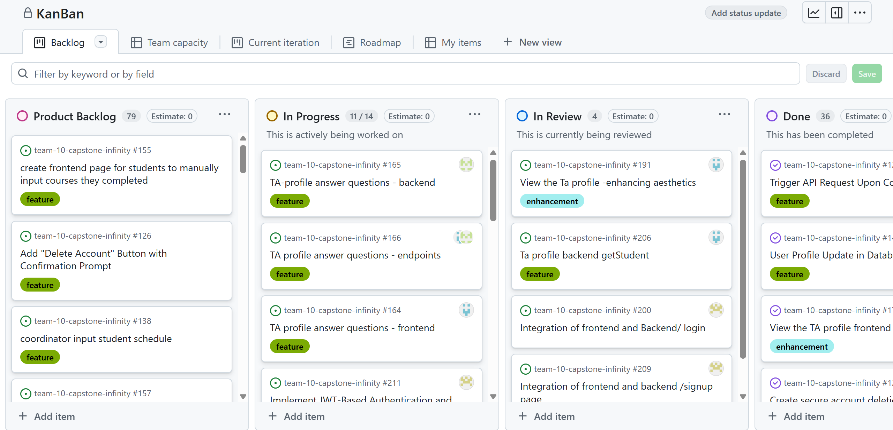
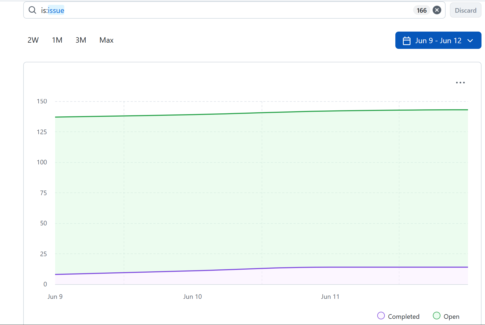
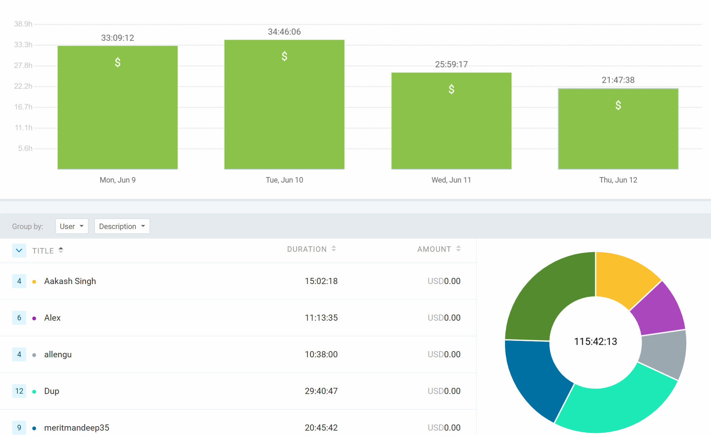

# Weekly Team Log

## Date Range:

* 6/9-6/12

## Features in the Project Plan Cycle:

* TA Profile Backend Enhancements
* Application Service Development
* Profile Service Implementation
* Frontend/Backend Integration

## Associated Tasks from Project Board:

| Task ID | Description                                         | Feature               | Assigned To | Status      |
| ------- | --------------------------------------------------- | --------------------- | ----------- | ----------- |
| [#200](https://github.com/UBCO-COSC499-S2025/team-10-capstone-infinity/issues/200)    | Integration of frontend and backend login/Signup    | LoginFeature          | Mandeep     | Completed   |
| [#192](https://github.com/UBCO-COSC499-S2025/team-10-capstone-infinity/issues/192)    | Create new application service                      | ApplicationService    | Alex        | In Progress |
| [#206](https://github.com/UBCO-COSC499-S2025/team-10-capstone-infinity/issues/206)    | TA Profile backend getStudents                      | TAprofile             | Dup         | In Review |
| [#175](https://github.com/UBCO-COSC499-S2025/team-10-capstone-infinity/issues/175)    | View the TA profile enhancing aesthetics            | TAprofile             | Dup         | Closed |
| [#165](https://github.com/UBCO-COSC499-S2025/team-10-capstone-infinity/issues/165)    | Added Fully Functional ProfileService               | ProfileService        | Aakash      | Completed   |
| [#80](https://github.com/UBCO-COSC499-S2025/team-10-capstone-infinity/issues/80)    | 80 registering frontend (merged)                    | Frontend Registration | Mandeep     | Completed   |
| [#82](https://github.com/UBCO-COSC499-S2025/team-10-capstone-infinity/issues/82)    | 80 registering frontend (closed - not merged)       | Frontend Registration | Mandeep     | Closed      |
| [#--]    | 32 browse available courses | Course service     | Seiya&Allen      | In PProgress       |
| [#191](https://github.com/UBCO-COSC499-S2025/team-10-capstone-infinity/issues/191)   | View the TA profile enhancing aesthetics   | TAprofile             | Dup         | Review      |
| [#211](https://github.com/UBCO-COSC499-S2025/team-10-capstone-infinity/issues/211)    |JWT Authentication                                   | LoginFeature          | Mandeep     | In Progress   |
### Alternatively, include image of the project board with tasks and status:

## Tasks for Next Cycle:

| Task ID | Description                                       | Estimated Time (hrs) | Assigned To |
| ------- | ------------------------------------------------- | -------------------- | ----------- |
| Multiple Task IDs     | Finalize integration and perform end-to-end tests | 30 hrs               | Group       |
| Multiple Task IDs     | Continue TA applications            | 20 hrs               | Group         |
| Multiple Task IDs     | Testing application service                       | 20 hrs                | Group        |
| Multiple Task IDs     | Learning other parts of the project to switch between frontend/backend      | 20 hrs    | Group

## Burn-up Chart (Velocity):

## Times for Team/Individual:

| Team Member | Logged Hours |
| ----------- | ------------ |
| Aakash      | 15:02:18          |
| Alex        | 11:13:35          |
| Allen       | 10:38:00          |
| Dup         | 29:40:47          |
| Eddy        | 0          |
| Mandeep     | 20:45:42          |
| Seiya       | 28:21:51          |

## Completed Tasks:

| Task ID | Description                           | Completed By |
| ------- | ------------------------------------- | ------------ |
| #188    | Added Fully Functional ProfileService | Aakash       |
| #201    | 80 registering frontend (merged)      | Mandeep      |

## In Progress Tasks/ To do:

| Task ID | Description                                      | Assigned To |
| ------- | ------------------------------------------------ | ----------- |
| #210    | Integration of frontend and backend login/Signup | Mandeep     |
| #208    | Create new application service                   | Alex        |
| #207    | TA Profile backend getStudents                   | Dup         |
| #203    | View the TA profile enhancing aesthetics         | Dup         |
| #194    | browse available courses                         | Seiya&Allen |

## Test Report / Testing Status:

N/A

## Overview:

During the period of June 9-12, the team made progress in multiple areas:

* Mandeep is actively working on frontend and backend login/signup integration.
* Alex is implementing the new application service.
* Allen and Seiya continuted on browse and filter courses.
* Dup continued TA profile backend work and UI/UX refinement.
* Aakash completed the full ProfileService implementation.
* The team is preparing to finalize integration and proceed with end-to-end system testing.
