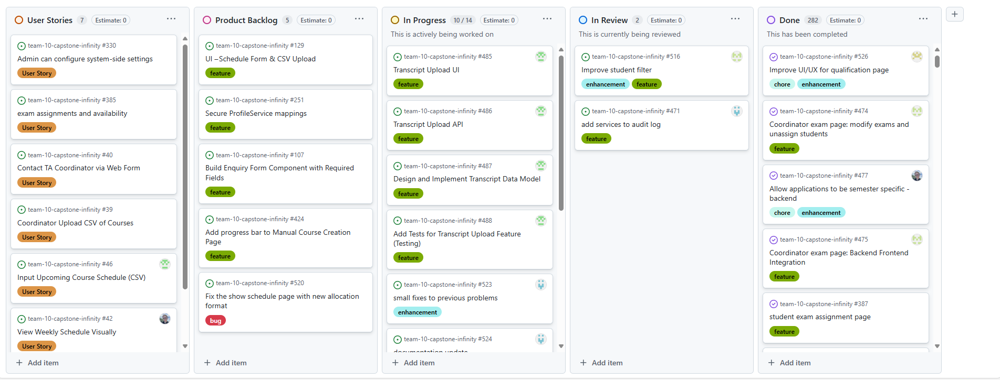
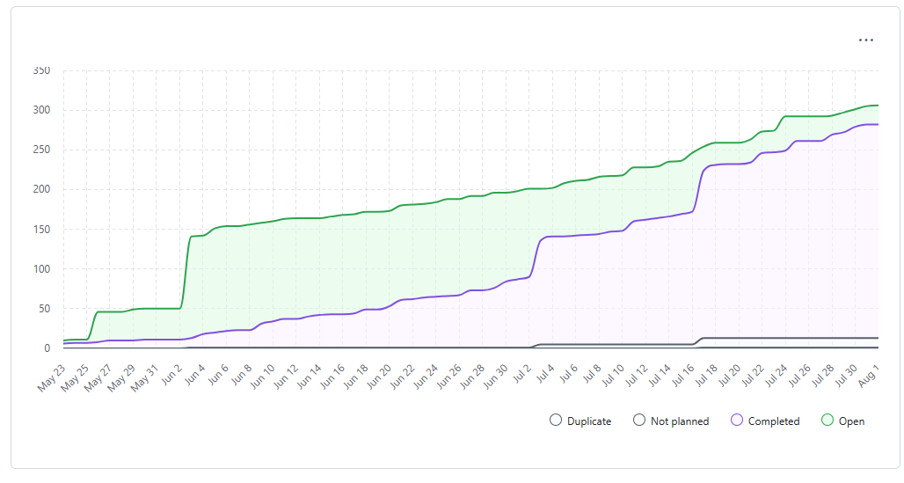
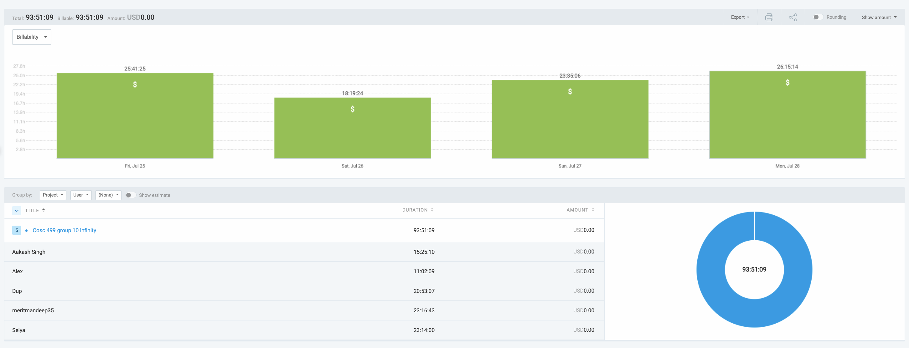

# Weekly Team Log

## Date Range:

* **7/29–7/31**

---

## Features in the Project Plan Cycle:
* Improve lab skills page
* Refine CSV import page
* Remodel Application page
* Modified Allocation table
* Allocation Page frontend integrated with new changes
* Improve Profile Question pages
* Global configs integrated with both backend and frontend

---

## Associated Tasks from Project Board:

| Task ID | Description                                                       | Feature                         | Assigned To       | Status     |
| ------- | ----------------------------------------------------------------- | --------------------------------| ----------------- | ---------- |
|
| [#516](https://github.com/UBCO-COSC499-S2025/team-10-capstone-infinity/issues/516)|  Improve student filter to assign student to exam. Make the dropdown containing all students and the coordinator can select from that. | Improve student filter   | Aakash       | In Progress |
| [#521](https://github.com/UBCO-COSC499-S2025/team-10-capstone-infinity/issues/521) | Add seeded capstone course with a need and some sections                    | Add seeded capstone course with a need and some sections                   | Alex         | In Progress |
| [#471](https://github.com/UBCO-COSC499-S2025/team-10-capstone-infinity/issues/471)|Add application , notification, course, and profile service to the audit log cycles.                                                              | add services to audit log | Dup        | In Progress |
| [#485](https://github.com/UBCO-COSC499-S2025/team-10-capstone-infinity/issues/485) | **Frontend**: build Transcript CSV upload UI — add upload to student portal, parse/preview, send to backend, show results                            | Transcript Upload UI          | Seiya       | In Progress |
| [#486](https://github.com/UBCO-COSC499-S2025/team-10-capstone-infinity/issues/486) | **Backend**: create Transcript CSV import API — endpoint, validation, save, logging, error handling                                                  | Transcript CSV API            | Seiya       | In Progress |
| [#487](https://github.com/UBCO-COSC499-S2025/team-10-capstone-infinity/issues/487) | Design & implement Transcript data model — DB schema, migrations, link to student accounts                                                           | Transcript Data Model         | Seiya       | In Progress |
| [#488](https://github.com/UBCO-COSC499-S2025/team-10-capstone-infinity/issues/488) | Add tests for Transcript upload feature — unit/integration tests, edge cases                                                                         | Transcript Tests              | Seiya       | In Progress |
| [#523](https://github.com/UBCO-COSC499-S2025/team-10-capstone-infinity/issues/523)| make the logo show up in the header and improve security for getUserDetails| small fixes to previous problems                                                                 | Dup     | In Progress |
| [#524](https://github.com/UBCO-COSC499-S2025/team-10-capstone-infinity/issues/524)| ER diagrams, use cases, DFDs, feature lists, everything that is part of the 65% in the canvas rubric.                                                                         | documentation update                 | Dup         | In Progress  |
| [#476](https://github.com/UBCO-COSC499-S2025/team-10-capstone-infinity/issues/476)| The bars for pagination stretch out and need a design change         | Fix pagination frontend aesthetics              | Mandeep        | In Progress   |
| [#510](https://github.com/UBCO-COSC499-S2025/team-10-capstone-infinity/issues/510) | Hidden pages improve which are not directly visible          |Improve course related pages including the details one(s)      | Mandeep       | In Progress   |
| [#521](https://github.com/UBCO-COSC499-S2025/team-10-capstone-infinity/issues/521) | Add seeded capstone course with a need and some sections                                                                                  | Add seeded capstone course with a need and some sections                | Alex       | In Progress   |
| [#509](https://github.com/UBCO-COSC499-S2025/team-10-capstone-infinity/issues/509) | Improve profile Question page for both student and coordinator side                                                                | ProfileQuestion page improvement                 | Mandeep       | Completed   |
| [#505](https://github.com/UBCO-COSC499-S2025/team-10-capstone-infinity/issues/505) | prevent exam creation for past days by blocking previous dates in calendar displayed. Do simillarly for update buttons of exam and assignments.                      | Exam page - prevent exam creation for past days             | Aakash       | Completed   |
| [#464](https://github.com/UBCO-COSC499-S2025/team-10-capstone-infinity/issues/464) | change Model to Unavailability. Allocation model should have a many to many relationship with Section.    | modify allocation and availability table         | Allen      | Completed   |
| [#463](https://github.com/UBCO-COSC499-S2025/team-10-capstone-infinity/issues/463) | When allocating a student, below the calendar, create three numeric inputs:labPrepping hours grading hours section hours   | allocation page calendar frontend enhancement         | Dup      | Completed   |
| [#490](https://github.com/UBCO-COSC499-S2025/team-10-capstone-infinity/issues/490) |Add term fields to application form & change impacted flow       | Add term fields to application form & change impacted flow         | Mandeep & Alex   | Completed   |
| [#508](https://github.com/UBCO-COSC499-S2025/team-10-capstone-infinity/issues/508) | UX improvement of CSV section import  | Refine CSV Section Import            | Seiya     | Completed   |
| [#527](https://github.com/UBCO-COSC499-S2025/team-10-capstone-infinity/issues/527) | improve UI/UX for final exam Availability page           | improve UI/UX for final exam Availability page         | Mandeep      | Completed   |
| [#526](https://github.com/UBCO-COSC499-S2025/team-10-capstone-infinity/issues/526)| Improve UI/UX for qualification page   |improve the ui both on student and co-ordinator side        | Mandeep      | Completed   |
| [#522](https://github.com/UBCO-COSC499-S2025/team-10-capstone-infinity/issues/522) | This page is qualification and skills page from student prospective/view  | Improve the lab skills page   | Mandeep      | Completed   |
| [#489](https://github.com/UBCO-COSC499-S2025/team-10-capstone-infinity/issues/489) | Integration backend and frontend Global Config | Integration frontend and backend for global config       | Mandeep         | Completed |

### Alternatively, include image of the project board with tasks and status:

## Tasks for Next Cycle:
| Task ID | Description                                                                                   | Estimated Time (hrs) | Assigned To      |
| ------- | --------------------------------------------------------------------------------------------- | -------------------- |  ---------------- |
| [#485](https://github.com/UBCO-COSC499-S2025/team-10-capstone-infinity/issues/485) | **Frontend**: build Transcript CSV upload UI — add upload to student portal, parse/preview, send to backend, show results                            | 15     | Seiya       | 
| [#486](https://github.com/UBCO-COSC499-S2025/team-10-capstone-infinity/issues/486) | **Backend**: create Transcript CSV import API — endpoint, validation, save, logging, error handling                                                  | 15       | Seiya       | 
| [#487](https://github.com/UBCO-COSC499-S2025/team-10-capstone-infinity/issues/487) | Design & implement Transcript data model — DB schema, migrations, link to student accounts                                                           |15       | Seiya       | 
| [#488](https://github.com/UBCO-COSC499-S2025/team-10-capstone-infinity/issues/488) | Add tests for Transcript upload feature — unit/integration tests, edge cases                                                                         | 15            | Seiya       | 
| [#523](https://github.com/UBCO-COSC499-S2025/team-10-capstone-infinity/issues/523)| make the logo show up in the header and improve security for getUserDetails| 15  | Dup     | 
| [#524](https://github.com/UBCO-COSC499-S2025/team-10-capstone-infinity/issues/524)| ER diagrams, use cases, DFDs, feature lists, everything that is part of the 65% in the canvas rubric.                                                                         | 15                | Dup         | 
| [#476](https://github.com/UBCO-COSC499-S2025/team-10-capstone-infinity/issues/476)| The bars for pagination stretch out and need a design change         | 15      | Mandeep        | 
| [#510](https://github.com/UBCO-COSC499-S2025/team-10-capstone-infinity/issues/510) | Hidden pages improve which are not directly visible          |15   | Mandeep       | 
| [#521](https://github.com/UBCO-COSC499-S2025/team-10-capstone-infinity/issues/521) | Add seeded capstone course with a need and some sections                                                                                  | 15   | Alex       | 
| [#516](https://github.com/UBCO-COSC499-S2025/team-10-capstone-infinity/issues/516)|  Improve student filter to assign student to exam. Make the dropdown containing all students and the coordinator can select from that.| 15     | Aakash |

## Burn-up Chart (Velocity):

## Times for Team/Individual:

| Team Member | Logged Hours |
| ----------- | ------------ |
| Aakash      | 08:30        |
| Alex        | 11:54        |
| Allen       | 00:00        |
| Dup         | 15:38        |
| Eddy        | 00:00        |
| Mandeep     | 17:06        |
| Seiya       | 12:58        |

## Completed Tasks:
| Task ID                                                                            | Description                                                                 | Completed By |
| ---------------------------------------------------------------------------------- | --------------------------------------------------------------------------- | ------------ |
| [#509](https://github.com/UBCO-COSC499-S2025/team-10-capstone-infinity/issues/509) | Improve profile Question page for both student and coordinator side                                                                               | Mandeep       | 
| [#505](https://github.com/UBCO-COSC499-S2025/team-10-capstone-infinity/issues/505) | prevent exam creation for past days by blocking previous dates in calendar displayed. Do simillarly for update buttons of exam and assignments.                       | Aakash       | 
| [#464](https://github.com/UBCO-COSC499-S2025/team-10-capstone-infinity/issues/464) | change Model to Unavailability. Allocation model should have a many to many relationship with Section.     | Allen      | 
| [#463](https://github.com/UBCO-COSC499-S2025/team-10-capstone-infinity/issues/463) | When allocating a student, below the calendar, create three numeric inputs:labPrepping hours grading hours section hours      | Dup      | 
| [#490](https://github.com/UBCO-COSC499-S2025/team-10-capstone-infinity/issues/490) |Add term fields to application form & change impacted flow           | Mandeep      | 
| [#508](https://github.com/UBCO-COSC499-S2025/team-10-capstone-infinity/issues/508) | UX improvement of CSV section import         | Seiya     | 
| [#527](https://github.com/UBCO-COSC499-S2025/team-10-capstone-infinity/issues/527) | improve UI/UX for final exam Availability page              | Mandeep      | 
| [#526](https://github.com/UBCO-COSC499-S2025/team-10-capstone-infinity/issues/526)| Improve UI/UX for qualification page      | Mandeep      | 
| [#522](https://github.com/UBCO-COSC499-S2025/team-10-capstone-infinity/issues/522) | This page is qualification and skills page from student prospective/view   | Mandeep      | 
| [#489](https://github.com/UBCO-COSC499-S2025/team-10-capstone-infinity/issues/489) | Integration backend and frontend Global Config   | Mandeep         | 

## In Progress Tasks/ To do:
| Task ID | Description                                                                                   | Assigned To      |
| ------- | --------------------------------------------------------------------------------------------- | ---------------- |
| [#485](https://github.com/UBCO-COSC499-S2025/team-10-capstone-infinity/issues/485) | **Frontend**: build Transcript CSV upload UI — add upload to student portal, parse/preview, send to backend, show results                           | Seiya       | 
| [#486](https://github.com/UBCO-COSC499-S2025/team-10-capstone-infinity/issues/486) | **Backend**: create Transcript CSV import API — endpoint, validation, save, logging, error handling                                                 | Seiya       | 
| [#487](https://github.com/UBCO-COSC499-S2025/team-10-capstone-infinity/issues/487) | Design & implement Transcript data model — DB schema, migrations, link to student accounts                                             | Seiya       | 
| [#488](https://github.com/UBCO-COSC499-S2025/team-10-capstone-infinity/issues/488) | Add tests for Transcript upload feature — unit/integration tests, edge cases                                                                               | Seiya       | 
| [#523](https://github.com/UBCO-COSC499-S2025/team-10-capstone-infinity/issues/523)| make the logo show up in the header and improve security for getUserDetails | Dup     | 
| [#524](https://github.com/UBCO-COSC499-S2025/team-10-capstone-infinity/issues/524)| ER diagrams, use cases, DFDs, feature lists, everything that is part of the 65% in the canvas rubric.                                                                              | Dup         | 
| [#476](https://github.com/UBCO-COSC499-S2025/team-10-capstone-infinity/issues/476)| The bars for pagination stretch out and need a design change          | Mandeep        | 
| [#510](https://github.com/UBCO-COSC499-S2025/team-10-capstone-infinity/issues/510) | Hidden pages improve which are not directly visible         | Mandeep       | 
| [#521](https://github.com/UBCO-COSC499-S2025/team-10-capstone-infinity/issues/521) | Add seeded capstone course with a need and some sections                                                                                 | Alex       | 
| [#516](https://github.com/UBCO-COSC499-S2025/team-10-capstone-infinity/issues/516)|  Improve student filter to assign student to exam. Make the dropdown containing all students and the coordinator can select from that. | Aakash  |

## Overview:

During the period of July 29-31, the team completed:
* Improve lab skills page. Aesthetics was greatly improved.
* Refine CSV import page. A minimal CSV import exists at the bottom of "Course and Section Creation" page. Elevate it to the same UX as the implementation on "Search for a Section or Course" page. Having validation, adding a preview with inline errors, handling duplicates cleanly, surfacing clear success or failure messages.
* Remodelled the application page to enable it accept mutiple applications at the same time.
* added table AllocatedSection to allocation service, now one application can only have one allocation, and each allocation can have multiple AllocatedSections, each has a sectionId(will be null if task is grading) and a String task, hour is not included in AllocatedSection, it will be included in the request body and will be incremented into labPrepHours, gradingHours, and sectionHours in Allocation.
* Allocation Page is now integrated with the backend that Allen has made. Revoke buttons work. Can send offers for the three different types of hours. The application details on the right side of the page (Application Filter Details) show the Allocation History correctly. Integrated with NeedViewer, Instructor Pages, ApplicationViewPage and more.
* Improve Profile Question pages. Improved UI / UX for proflle question(s) pages on both side (student and co-ordinator). Changes include validation and endpoints to keep the data in the form after submission
* Global configs integrated with both backend and frontend. Term configuration is now fully integrated with the backend. Users can add terms, delete terms, and edit term dates, with proper validations in place to prevent invalid inputs.
