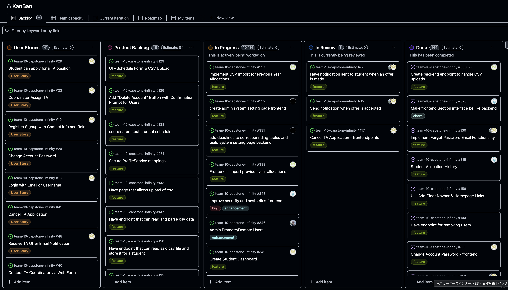
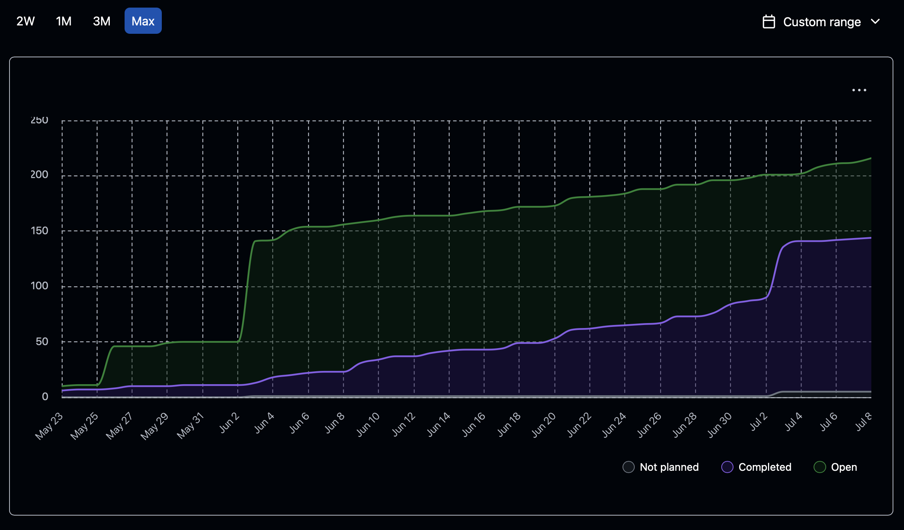
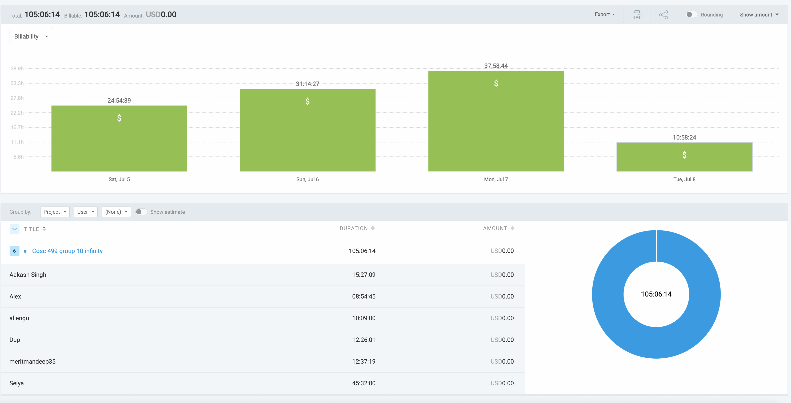

# Weekly Team Log

## Date Range:

* 7/05–7/08

## Features in the Project Plan Cycle:

* CSV upload and import/export (backend/frontend)
* Student dashboard creation
* Admin system settings and user management
* Security and UI/UX improvements
* TA application/offer notification flows

## Associated Tasks from Project Board:

| Task ID | Description                                         | Feature                                                     | Assigned To           | Status   |
| ------- | --------------------------------------------------- | ----------------------------------------------------------- | --------------------- | -------- |
| [#328](https://github.com/UBCO-COSC499-S2025/team-10-capstone-infinity/issues/328) | Make frontend Section interface be like backend             | Section Interface Consistency | Dup      | Done     |
| [#338](https://github.com/UBCO-COSC499-S2025/team-10-capstone-infinity/issues/338) | Create backend endpoint to handle CSV uploads               | CSV Import Backend             | Aakash   | Done     |
| [#130](https://github.com/UBCO-COSC499-S2025/team-10-capstone-infinity/issues/130) | Implement Forgot Password Email Functionality               | Auth/Password Reset            | Alex, Mandeep   | Done     |
| [#315](https://github.com/UBCO-COSC499-S2025/team-10-capstone-infinity/issues/315) | Student Allocation History                                 | Allocation/History             | Dup      | Done     |
| [#77](https://github.com/UBCO-COSC499-S2025/team-10-capstone-infinity/issues/77)   | Have notification sent to student when an offer is made     | Offer Notification             | Alex, Mandeep   | In progress |
| [#85](https://github.com/UBCO-COSC499-S2025/team-10-capstone-infinity/issues/85)   | Send notification when offer is accepted                    | Offer Notification             | Alex, Mandeep   | In progress |
| [#117](https://github.com/UBCO-COSC499-S2025/team-10-capstone-infinity/issues/117) | Cancel TA Application - frontendpoints                      | TA Application Management      | Mandeep  | In progress |
| [#337](https://github.com/UBCO-COSC499-S2025/team-10-capstone-infinity/issues/337) | Implement CSV Import for Previous Year Allocations          | CSV Import Frontend            | Aakash   | In progress |
| [#332](https://github.com/UBCO-COSC499-S2025/team-10-capstone-infinity/issues/332) | create admin system setting page frontend                   | Admin UI/UX                     | Beichen  | In progress |
| [#331](https://github.com/UBCO-COSC499-S2025/team-10-capstone-infinity/issues/331) | add deadlines to tables, build system setting page backend  | Admin Settings Backend          | Beichen  | In progress |
| [#339](https://github.com/UBCO-COSC499-S2025/team-10-capstone-infinity/issues/339) | Frontend - Import previous year allocations                 | CSV Import Frontend             | Aakash   | In progress |
| [#343](https://github.com/UBCO-COSC499-S2025/team-10-capstone-infinity/issues/343) | Improve security and aesthetics frontend                    | Security & UI/UX                | Dup      | In progress |
| [#346](https://github.com/UBCO-COSC499-S2025/team-10-capstone-infinity/issues/346) | Admin Promote/Demote Users                                 | Admin User Management           | Alex     | In progress |
| [#349](https://github.com/UBCO-COSC499-S2025/team-10-capstone-infinity/issues/349) | Create Student Dashboard                                   | Dashboard/Student Experience    | Mandeep  | In progress |
| [#347](https://github.com/UBCO-COSC499-S2025/team-10-capstone-infinity/issues/347) | Allow Coordinator to delete an allocation and refactoring   | Allocation Management           | Mandeep  | In progress |
| [#335](https://github.com/UBCO-COSC499-S2025/team-10-capstone-infinity/issues/335) | Implement API Endpoint for CSV Export                      | CSV Export Backend              | Seiya    | In progress |
| [#334](https://github.com/UBCO-COSC499-S2025/team-10-capstone-infinity/issues/334) | Outline CSV Export Requirements                            | CSV Export Planning             | Seiya    | In progress |

### Alternatively, include image of the project board with tasks and status:

## Tasks for Next Cycle:
- Once these tasks are completed, additional tasks may be assigned as needed based on the situation.

| Task ID | Description                                       | Estimated Time (hrs) | Assigned To |
| ------- | ------------------------------------------------- | -------------------- | ----------- |
| [#349](https://github.com/UBCO-COSC499-S2025/team-10-capstone-infinity/issues/349) | Create Student Dashboard | 10+ | Mandeep |
| [#346](https://github.com/UBCO-COSC499-S2025/team-10-capstone-infinity/issues/346) | Admin Promote/Demote Users | 8 | Alex |
| [#343](https://github.com/UBCO-COSC499-S2025/team-10-capstone-infinity/issues/343) | Improve security and aesthetics frontend | 8 | Dup |
| [#339](https://github.com/UBCO-COSC499-S2025/team-10-capstone-infinity/issues/339) | Frontend - Import previous year allocations | 8 | Aakash |
| [#332](https://github.com/UBCO-COSC499-S2025/team-10-capstone-infinity/issues/332) | create admin system setting page frontend | 8 | Beichen |
| [#335](https://github.com/UBCO-COSC499-S2025/team-10-capstone-infinity/issues/335) | Implement API Endpoint for CSV Export | 6 | Seiya |

## Burn-up Chart (Velocity):

## Times for Team/Individual:

| Team Member | Logged Hours |
| ----------- | ------------ |
| Aakash      | 15:27            |
| Alex        | 8:54            |
| Allen       | 10:09           |
| Dup         | 12:26          |
| Eddy        | 00:00        |
| Mandeep     | 12:37          |
| Seiya       | 45:32            |

## Completed Tasks:

| Task ID | Description                                        | Completed By       |
| ------- | -------------------------------------------------- | ------------------ |
| #328    | Make frontend Section interface be like backend    | Dup               |
| #338    | Create backend endpoint to handle CSV uploads      | Aakash            |
| #130    | Implement Forgot Password Email Functionality      | Alex, Mandeep     |
| #315    | Student Allocation History                         | Dup               |

## In Progress Tasks/ To do:

| Task ID | Description                                                | Assigned To       |
| ------- | ---------------------------------------------------------- | ----------------- |
| #77     | Have notification sent to student when an offer is made    | Alex, Mandeep     |
| #85     | Send notification when offer is accepted                   | Alex, Mandeep     |
| #117    | Cancel TA Application - frontendpoints                     | Mandeep      |
| #337    | Implement CSV Import for Previous Year Allocations         | Aakash            |
| #332    | create admin system setting page frontend                  | Beichen           |
| #331    | add deadlines to tables, build system setting page backend | Beichen           |
| #339    | Frontend - Import previous year allocations                | Aakash            |
| #343    | Improve security and aesthetics frontend                   | Dup               |
| #346    | Admin Promote/Demote Users                                 | Alex              |
| #349    | Create Student Dashboard                                   | Mandeep           |
| #347    | Allow Coordinator to delete an allocation and refactoring  | Mandeep           |
| #335    | Implement API Endpoint for CSV Export                      | Seiya             |
| #334    | Outline CSV Export Requirements                            | Seiya             |

## Overview:

During the period of July 5–8, the team completed:
* Frontend Section interface was aligned with backend for consistency.
* Backend endpoint for CSV upload was implemented.
* Forgot Password email functionality was completed.
* Student allocation history is now available in the system.
* Multiple admin, dashboard, and notification features are in progress, with emphasis on CSV workflow and system usability.
* Focus for next cycle includes CSV export, dashboard development, admin/user management, and improved UI/UX.
