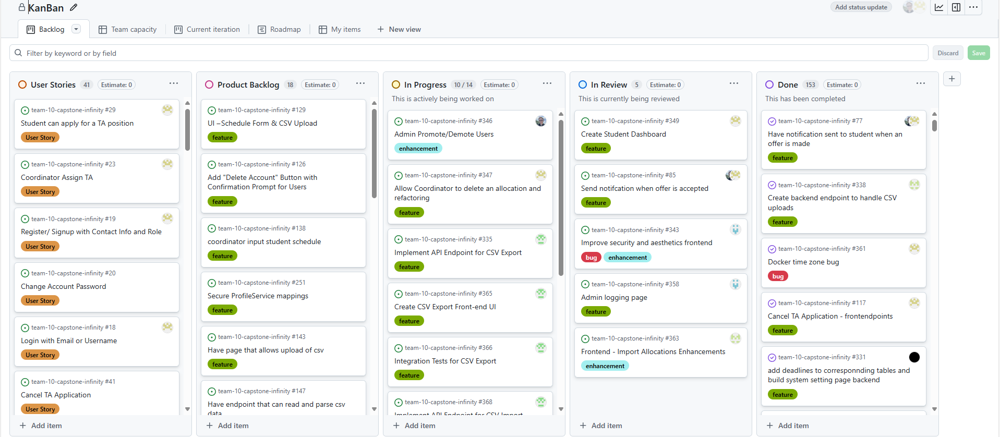
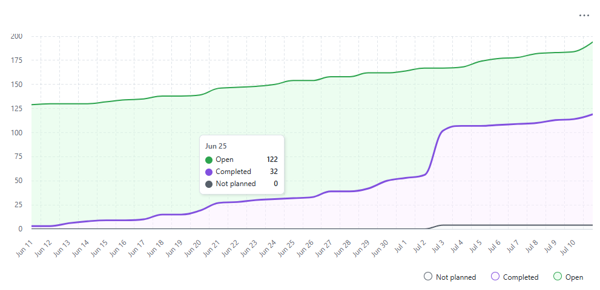
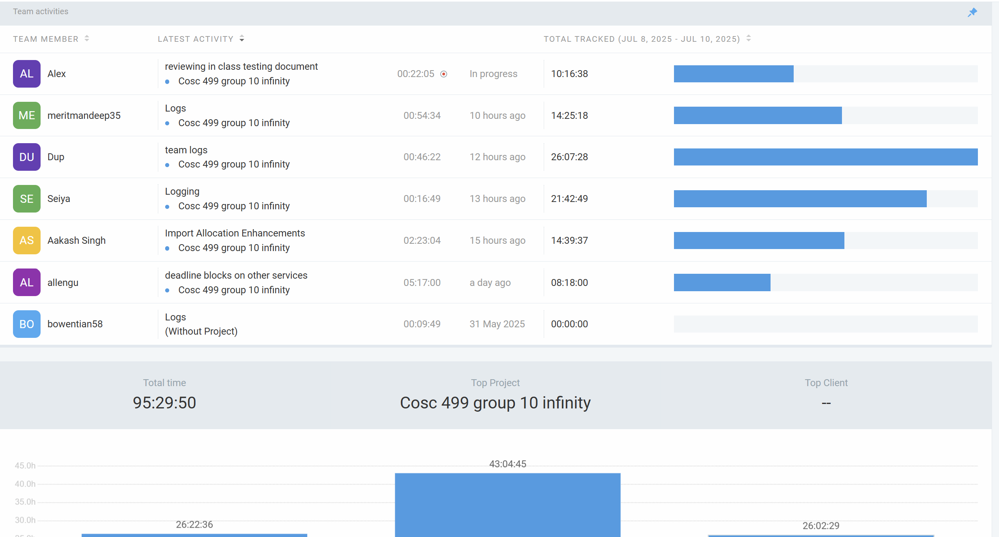
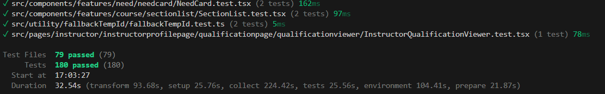
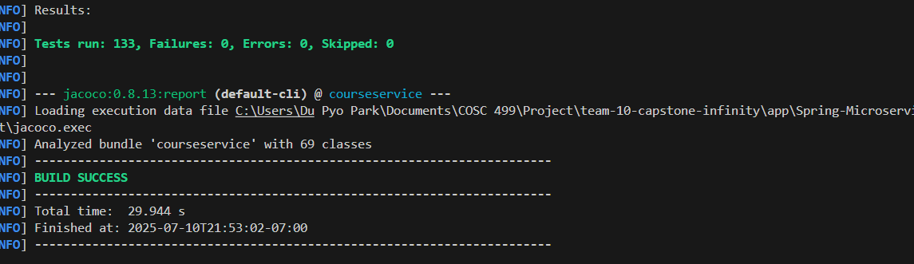

# Weekly Team Log

## Date Range:

* 7/08–7/10

## Features in the Project Plan Cycle:

* Importing Allocations feature was completed.
* Creating Deadlines feature was completed.
* Admin dashboard feature was completed.
* Improvements on notifications when offer happens
* Cancelling the TA-application, view application tab.

## Associated Tasks from Project Board:

| Task ID | Description                                         | Feature                                                     | Assigned To           | Status   |
| ------- | --------------------------------------------------- | ----------------------------------------------------------- | --------------------- | -------- |
| [#331](https://github.com/UBCO-COSC499-S2025/team-10-capstone-infinity/issues/331) | add deadlines to corresponnding tables and build system setting page backend             | Admin config feature | Allen      | Done     |
| [#339](https://github.com/UBCO-COSC499-S2025/team-10-capstone-infinity/issues/339) | Frontend - Import previous year allocationss               | Allocation Import             | Aakash   | Done     |
| [#337](https://github.com/UBCO-COSC499-S2025/team-10-capstone-infinity/issues/337) | Implement CSV Import for Previous Year Allocations               |Allocation Import            | Aakash   | Done     |
| [#77](https://github.com/UBCO-COSC499-S2025/team-10-capstone-infinity/issues/77) | Have notification sent to student when an offer is made                                 | Allocation Notification             | Alex      | Done     |
| [#332](https://github.com/UBCO-COSC499-S2025/team-10-capstone-infinity/issues/332)   | create admin system setting page frontend     | Admin Config             | Allen   | Done |
| [#117](https://github.com/UBCO-COSC499-S2025/team-10-capstone-infinity/issues/117)   | Cancel TA Application - frontendpoints                    | TA application cancel             |  Mandeep   | Done |
| [#334](https://github.com/UBCO-COSC499-S2025/team-10-capstone-infinity/issues/334) | Outline CSV Export Requirements                            | CSV Export Planning             | Seiya    | Done |
| [#367](https://github.com/UBCO-COSC499-S2025/team-10-capstone-infinity/issues/367) | Outline CSV Import Requirements | CSV import | Seiya | Done |
| [#343](https://github.com/UBCO-COSC499-S2025/team-10-capstone-infinity/issues/343) | Improve security and aesthetics frontend          | Project Bug and Enhancement            | Dup   | Done |
| [#349](https://github.com/UBCO-COSC499-S2025/team-10-capstone-infinity/issues/349) | Create Student Dashboard                   | Student Dashboard                    | Mandeep  | Done |
| [#361](https://github.com/UBCO-COSC499-S2025/team-10-capstone-infinity/issues/361)| Docker time zone bug  | Bug fix          | Mandeep  | Done |
| [#358](https://github.com/UBCO-COSC499-S2025/team-10-capstone-infinity/issues/358)| Admin audit page                 | UR 1.5             | Dup   | Done |
| [#363](https://github.com/UBCO-COSC499-S2025/team-10-capstone-infinity/issues/363) | Frontend - Import Allocations Enhancements                    | Allocation Import                | Aakash      | Done |
| [#346](https://github.com/UBCO-COSC499-S2025/team-10-capstone-infinity/issues/346) | Admin Promote/Demote Users                                 | Admin User Management           | Alex     | In progress |
| [#349](https://github.com/UBCO-COSC499-S2025/team-10-capstone-infinity/issues/349) | Create Student Dashboard                                   | Dashboard/Student Experience    | Mandeep  | In progress |
| [#347](https://github.com/UBCO-COSC499-S2025/team-10-capstone-infinity/issues/347) | Allow Coordinator to delete an allocation and refactoring   | Allocation Management           | Mandeep  | In progress |
| [#335](https://github.com/UBCO-COSC499-S2025/team-10-capstone-infinity/issues/335) | Implement API Endpoint for CSV Export                      | CSV Export Backend              | Seiya    | In progress |
| [#365](https://github.com/UBCO-COSC499-S2025/team-10-capstone-infinity/issues/365) | Create CSV Export Front-end UI | CSV frontend | Seiya | In Progress|
| [#368](https://github.com/UBCO-COSC499-S2025/team-10-capstone-infinity/issues/368) | Implement API Endpoint for CSV Import | CSV API endpoint | Seiya | In Progress |
| [#370](https://github.com/UBCO-COSC499-S2025/team-10-capstone-infinity/issues/370) | Create CSV Import Front-end UI | CSV frontend UI | Seiya | In progress |
| [#373](https://github.com/UBCO-COSC499-S2025/team-10-capstone-infinity/issues/373) | Update need hours when accepting an offer | Need table | Alex | In progress|
| #155 | create frontend page for students to manually csv pdf input courses they completed | frontend csv courses | Mandeep | In progress |

### Alternatively, include image of the project board with tasks and status:

## Tasks for Next Cycle:
- Once these tasks are completed, additional tasks may be assigned as needed based on the situation.

| Task ID | Description                                       | Estimated Time (hrs) | Assigned To |
| ------- | ------------------------------------------------- | -------------------- | ----------- |
| [#366](https://github.com/UBCO-COSC499-S2025/team-10-capstone-infinity/issues/366) | Integration Tests for CSV Export | 15 | Seiya |
| [#371](https://github.com/UBCO-COSC499-S2025/team-10-capstone-infinity/issues/371) | More Integration Tests for CSV Import | 15 | Seiya |
| [#374](https://github.com/UBCO-COSC499-S2025/team-10-capstone-infinity/issues/374) | Fix Frontend from Role Changes | 15 | Dup |
| [#373](https://github.com/UBCO-COSC499-S2025/team-10-capstone-infinity/issues/373) | Update need hours when accepting an offer | 15 | Alex | 
| [#347](https://github.com/UBCO-COSC499-S2025/team-10-capstone-infinity/issues/347) | Allow Coordinator to delete an allocation and refactoring   | 15           | Mandeep  | 

## Burn-up Chart (Velocity):

## Times for Team/Individual:

| Team Member | Logged Hours |
| ----------- | ------------ |
| Aakash      | 14:39            |
| Alex        | 10:16            |
| Allen       | 08:18           |
| Dup         | 26:07          |
| Eddy        | 00:00        |
| Mandeep     | 14:25          |
| Seiya       | 21:42            |

## Completed Tasks:

| Task ID | Description                                        | Completed By       |
| ------- | -------------------------------------------------- | ------------------ |
| [#331](https://github.com/UBCO-COSC499-S2025/team-10-capstone-infinity/issues/331) | add deadlines to corresponnding tables and build system setting page backend           | Allen      | 
| [#339](https://github.com/UBCO-COSC499-S2025/team-10-capstone-infinity/issues/339) | Frontend - Import previous year allocationss                  | Aakash       |
| [#337](https://github.com/UBCO-COSC499-S2025/team-10-capstone-infinity/issues/337) | Implement CSV Import for Previous Year Allocations                 | Aakash       |
| [#77](https://github.com/UBCO-COSC499-S2025/team-10-capstone-infinity/issues/77) | Have notification sent to student when an offer is made            | Alex         |
| [#332](https://github.com/UBCO-COSC499-S2025/team-10-capstone-infinity/issues/332)   | create admin system setting page frontend           | Allen   |
| [#117](https://github.com/UBCO-COSC499-S2025/team-10-capstone-infinity/issues/117)   | Cancel TA Application - frontendpoints                         |  Mandeep    |
| [#334](https://github.com/UBCO-COSC499-S2025/team-10-capstone-infinity/issues/334) | Outline CSV Export Requirements                         | Seiya    |
| [#367](https://github.com/UBCO-COSC499-S2025/team-10-capstone-infinity/issues/367) | Outline CSV Import Requirements  | Seiya  |
| [#343](https://github.com/UBCO-COSC499-S2025/team-10-capstone-infinity/issues/343) | Improve security and aesthetics frontend               | Dup    |
| [#349](https://github.com/UBCO-COSC499-S2025/team-10-capstone-infinity/issues/349) | Create Student Dashboard                      | Mandeep  |
| [#361](https://github.com/UBCO-COSC499-S2025/team-10-capstone-infinity/issues/361)| Docker time zone bug    | Mandeep   |
| [#358](https://github.com/UBCO-COSC499-S2025/team-10-capstone-infinity/issues/358)| Admin audit page                        | Dup    |
| [#363](https://github.com/UBCO-COSC499-S2025/team-10-capstone-infinity/issues/363) | Frontend - Import Allocations Enhancements                         | Aakash      | 

## In Progress Tasks/ To do:

| Task ID | Description                                                | Assigned To       |
| ------- | ---------------------------------------------------------- | ----------------- |
| [#346](https://github.com/UBCO-COSC499-S2025/team-10-capstone-infinity/issues/346) | Admin Promote/Demote Users                                  | Alex      |
| [#349](https://github.com/UBCO-COSC499-S2025/team-10-capstone-infinity/issues/349) | Create Student Dashboard                                    | Mandeep   |
| [#347](https://github.com/UBCO-COSC499-S2025/team-10-capstone-infinity/issues/347) | Allow Coordinator to delete an allocation and refactoring      | Mandeep   |
| [#335](https://github.com/UBCO-COSC499-S2025/team-10-capstone-infinity/issues/335) | Implement API Endpoint for CSV Export                      | Seiya     |
| [#365](https://github.com/UBCO-COSC499-S2025/team-10-capstone-infinity/issues/365) | Create CSV Export Front-end UI  | Seiya|
| [#368](https://github.com/UBCO-COSC499-S2025/team-10-capstone-infinity/issues/368) | Implement API Endpoint for CSV Import | Seiya |
| [#370](https://github.com/UBCO-COSC499-S2025/team-10-capstone-infinity/issues/370) | Create CSV Import Front-end UI  | Seiya  |
| [#373](https://github.com/UBCO-COSC499-S2025/team-10-capstone-infinity/issues/373) | Update need hours when accepting an offer  | Alex |
| #155 | create frontend page for students to manually csv pdf input courses they completed  | Mandeep  |

## Test Report / Testing Status:

## Overview:

During the period of July 5–8, the team completed:
* Importing Allocations feature was completed.
* Creating Deadlines feature was completed.
* Admin dashboard feature was completed.
* Improvements on notifications when offer happens
* Cancelling the TA-application, view application tab.
